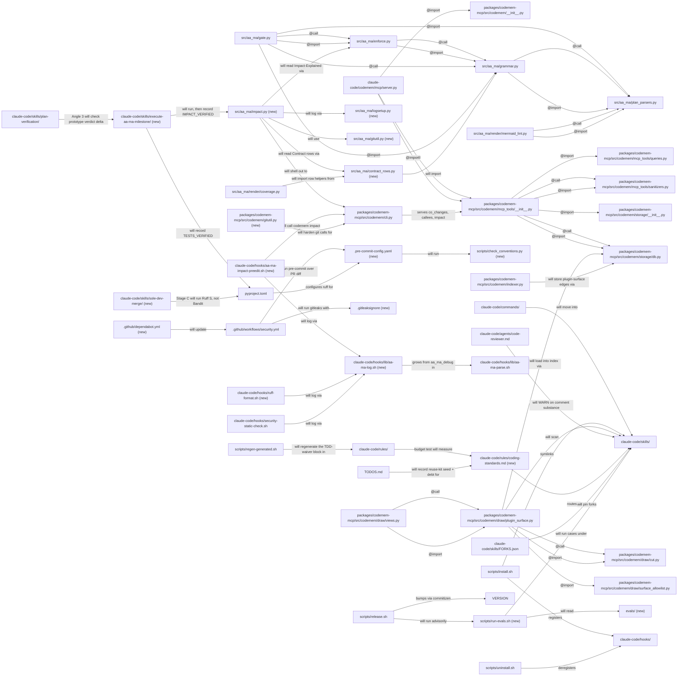
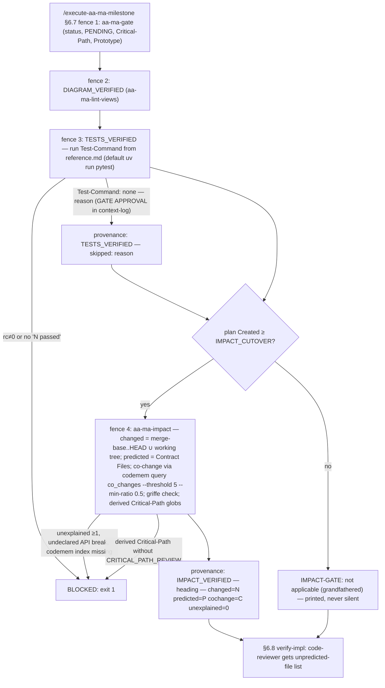

# code-conventions-impact Plan

**Objective:** Make the forge's coding conventions (comments, docstrings, logging, SecOps, design principles, testing, prompt-as-code) stated once and mechanically enforced on touched code, and wire impact analysis into authoring (pre-edit hook) and the milestone gate (gate-computed `IMPACT_VERIFIED`, `TESTS_VERIFIED`).
**Owner:** Stephen J Newhouse + AI
**Created:** 2026-10-08
**Last Updated:** 2026-10-08
**Source map:** `code-conventions-impact-map.md` (15/15 tickets RESOLVED, fog empty, guard clear). Folded-in input: `.claude/dev/charting/writing-for-agents-eval/writing-for-agents-eval-map.md` (4/4 RESOLVED; executed by M4).
**Diagram-Waiver:** none
**Companion plan (later):** `reuse-kit` — private Carmen kit repo, public copier template repo, forge reuse-router skill, graduation CI (map Tickets 13–14). Seeded from this plan's imported map. Not in scope here.

---

## 0. Repository and Setup

- Repo `~/projects/github_private/aa-ma-forge` — **PUBLIC** (`snewhouse/aa-ma-forge`). No client-derived code, names or paths enter it.
- Plan authored on `feature/engineering-standards` @ `14ae44c`. One branch + PR per milestone, cut from fresh `main` (L-032: check `git status -sb` on `main` first), merged via `/sole-dev-merge` (rebase-merge).
- **Each milestone executes in its own worktree** `.worktrees/<branch>` (`superpowers:using-git-worktrees`, L-066; Ste D7 2026-10-08). `install.sh` symlinks `~/.claude` into the MAIN checkout, so branch edits must never go live mid-session. The main checkout changes only by `git pull` after a merge, followed by `scripts/install.sh`. As a result, a new gate fence is first exercised by the milestone **after** the one that ships it. Caveats (Verification v1): (a) the `_cand` lookup prefers `$(git rev-parse --show-toplevel)/claude-code/hooks/lib/…`, so inside a worktree the fence TEXT comes from main but the launcher and gate Python come from the branch. That is accepted, because the gate runs after the branch's own tests pass. (b) Each worktree's first action is `uv sync && uv run codemem build`: `.venv` and `.codemem/index.db` are gitignored and per-checkout, and without the index DIAGRAM_VERIFIED and fence 4 fail closed. (c) A live `scripts/install.sh` runs ONLY from the main checkout after merge, because install.sh derives REPO_ROOT from its own location and would otherwise point `~/.claude` into a worktree. In-milestone install proofs use a fake `CLAUDE_HOME`.
- Executor: `/execute-aa-ma-milestone`. From M3 on it is a skill at `claude-code/skills/execute-aa-ma-milestone/SKILL.md` (same `/name`).
- Baseline at plan time: `uv run pytest -q` → **2429 passed, 5 skipped, 7 deselected in 112.5 s** (2026-10-08; sizes the TESTS_VERIFIED timeout); ruff 0.15.9 (uv.lock); uv 0.12.3; gitleaks 8.18.0, shellcheck 0.11.0, pre-commit 4.5.1 (conda, not in the venv); bandit 1.9.4 resolves to **conda**, not the venv; griffe and osv-scanner absent.
- **Security hardening (Verification v2, Security specialist; binding across milestones):**
  - Hook JSON is built ONLY with `jq -n --arg`, never string interpolation. bats: injected `"` in payload data leaves `jq 'paths'` with only the expected keys, and every hook's stdout passes `jq empty`.
  - **Gate inputs are read from the merge-base copy** (`git show $base:<file>`): `Test-Command:`, `Cochange-Threshold:` and the plan's Contract rows. `Created:` comes from the plan file's first commit. So a run cannot self-pass by editing its own inputs.
  - TEST_CMD is printed before running and executed as a shlex argv (no `bash -c`). `;|&$`<>` are rejected.
  - `Test-Command: none` and any threshold override need a context-log GATE APPROVAL. Thresholds are bounded (n ≤ 20, ratio ≤ 0.9).
  - Suppressions cannot be widened silently:
    - `.gitleaksignore` fingerprints (commit:file:rule:line) replace path or regex allowlists;
    - a test asserts the only Ruff S ignore is `tests/**` S101;
    - the full-repo S job uses `ruff check --isolated --select S`;
    - the canary exclusion names one file.
  - CI supply chain:
    - `astral-sh/setup-uv@<sha>` with `version: 0.12.3` replaces `pip install uv` in every job;
    - all jobs use `uv sync --locked`;
    - `actions/checkout` has `persist-credentials: false`;
    - `github.base_ref` is passed via `env:`;
    - gitleaks comes from the v8.18.4 tarball with its sha256 verified;
    - pre-commit `rev:`s are frozen to SHAs;
    - Dependabot uses `cooldown: 7` days.
  - pip-audit is locked in the dev group: `uv export --frozen --no-emit-workspace --no-emit-project` (hashed), then `uv run pip-audit --disable-pip --require-hashes -r`. A test fails any ignore past its expiry date.
  - Eval sandbox:
    - `env -i` with an explicit allowlist (PATH plus Claude auth); SSH_AUTH_SOCK, GH_TOKEN and GITHUB_TOKEN are unset;
    - `--allowedTools` allowlist plus sandbox network limited to the API;
    - a test asserts run-evals.sh never uses `bypassPermissions` or `--dangerously-skip-permissions`.
  - Redaction:
    - happens in a handler-level `Formatter.format()` (covers child loggers, `exc_text` and stack traces);
    - input is capped at 8 KB before matching;
    - each pattern has a 100 KB adversarial timing test;
    - the bash and Python pattern sets are generated from one source file, with a parity test;
    - `log_*` always masks and strips CR/LF.
  - Forks:
    - each fork dir carries the upstream MIT `LICENSE` (wshobson, mattpocock), and a test requires it;
    - forks are fetched via `gh api …?ref=<40-hex>` with sha256 recorded;
    - the frontmatter schema rejects unscoped `Bash`, `Write` or `Edit` in `allowed-tools` unless an allowlist entry gives a why (assess-codebase:13 goes on that list or is narrowed), and rejects `` !` `` dynamic-exec lines in forked bodies.
  - Pre-edit hook:
    - validates `session_id` against `^[A-Za-z0-9_-]{1,64}$`;
    - checks out-of-repo paths with `realpath -m` plus a trailing-slash prefix;
    - wraps codemem in `timeout -k`;
    - opens the index.db with `mode=ro`, `trusted_schema=OFF`, and ignores a git-tracked `.codemem/index.db`;
    - cleans the runtime markers at SessionEnd.
  - Git refs (`PRE_COMMIT_*_REF`, `--base`) are verified with `git rev-parse --verify --end-of-options <ref>^{commit}`. Paths go after `--` and output is parsed with `-z` (gitutil + check_conventions).
  - install.sh:
    - writes timestamped `settings.json` backups into BACKUP_DIR, not a single `.bak`;
    - `--force` still backs up real directories before `rm -rf`.
- Session rules: `/rigor` (`~/.claude/skills/rigor/SKILL.md`), ≤5 concurrent sub-agents, `Skill(double-check)` before any COMPLETE.

## 1. Executive Summary

Fourteen milestones, one release (v0.18.0, M14). M1–M5 restructure the prompt surface: migrate 5 global skills and the ruff hook in, convert 13 commands to skills, add frontmatter, size and eval checks, and split the six oversized files. M6–M9 land the conventions on a touched-files lint harness: comments/docstrings/KISS, logging, the SecOps CI baseline, and a gate that runs tests. M10–M13 add impact analysis (codemem `callees`, a pre-edit hook, gate-computed `IMPACT_VERIFIED`) plus the thin auto-loaded `coding-standards.md` rule and its budget ratchet; M14 releases.

## 2. Engineering Standards Declaration (element #12)

Ste selected **all six themes** (2026-10-08).

| Theme | Applies because |
|---|---|
| 1. Verification & Truth | Gate, hooks and CI change. Every new check is proven by a canary that must fail (Ruff S, gitleaks, `TESTS_VERIFIED`, `IMPACT_VERIFIED`), and hooks are tested with real captured payloads (L-1319). |
| 2. Development Principles | TDD for every Python/bash change. KISS: shell out to the `codemem` CLI rather than break the `aa-ma-never-imports-codemem` contract. Knowledge-DRY: Expected-Blast-Radius **is** the Contract `Files:` block, parsed by the existing coverage parser. |
| 3. Reasoning & Planning | Eight ADRs (next free number 0018), three prototypes, and ≥80% steps (M3, M11) get deep review. |
| 4. Safety & Continuity | Outside-repo moves need full-directory backups (L-1300, L-1317). `install.sh` currently deletes foreign symlinks with no backup — fixed in M3. Touched-code-only is never a backfill. |
| 5. Execution Checklist | `Critical-Path: hook-modification` on 11 milestones (M1–M3, M5–M12) and `version-pipeline` on M4 and M14. `Prototype-Required: YES` on M3, M10, M11. |
| 6. Sync & Commit Discipline | 14 milestones across many sessions. Result Log per sub-step (L-080–L-082), with the plan footer on every commit. |

Lessons applied: L-1319 (no silent fail-open; hook stderr on exit 0 is invisible; real payloads), L-1300/L-1317 (whole-dir backups, count-verified), L-1322 (`claude -p "<prompt>"` first + `</dev/null`), L-1315 (live-load in an isolated session; `plugin validate` is not evidence), L-1314 (newly-live frontmatter fields re-audited), L-1210 (never delete config on a partial existence check), L-036 (background checks print rc; empty ≠ pass), L-031 (inspect auto-fix commits), L-034 (each new measured rule pins severity on shipped vs fixture paths).

## 2a. Gate Field Transcription — MANDATORY

`aa-ma-gate` reads `tasks.md` only. Every field below MUST appear on the matching milestone in `code-conventions-impact-tasks.md`. Never write an empty value (exit 2).

| Milestone | Gate | `Audit-Profile` | `Critical-Path` | `Prototype-Required` | `TDD-Waiver` |
|---|---|---|---|---|---|
| M1 | HARD | full | hook-modification | — | — |
| M2 | HARD | full | hook-modification | — | — |
| M3 | HARD | full | hook-modification | YES | — |
| M4 | SOFT | full | version-pipeline | — | — |
| M5 | HARD | code-only | hook-modification | — | refactor |
| M6 | HARD | full | hook-modification | — | — |
| M7 | HARD | full | hook-modification | — | — |
| M8 | HARD | full | hook-modification | — | — |
| M9 | HARD | full | hook-modification | — | — |
| M10 | HARD | full | hook-modification | YES | — |
| M11 | HARD | full | hook-modification | YES | — |
| M12 | HARD | full | hook-modification | — | — |
| M13 | SOFT | docs-only | — | — | docs-only |
| M14 | HARD | code-only | version-pipeline | — | — |

## 3. Dependencies and Assumptions (element #8)

**Decisions taken in this planning session (Ste, 2026-10-08), beyond the map:**
- D1 **Two plans.** This plan covers map groups 1–12, the forge only. Reuse (T13/T14: kit repo, template repo, router skill, graduation CI) moves to a later `reuse-kit` plan. T10's "rollout via template" goes with it. T13's in-repo git-HEAD helper stays here (M10).
- D2 **deslop-shared-libs → declared-external** (gstack-owned: `.gstack-owned`, byte-identical to `~/.claude/skills/gstack/deslop-shared-libs/SKILL.md`). Migration is 5 skills, not 7.
- D3 **senior-secops → new forge skill `secops`** (thin router). The global copy is a byte-identical fork of davila7/claude-code-templates and is disabled (`settings.json:295 "off"`). It is backed up and removed, which deletes the stub scanner (carried defect 2). The `"off"` override is left alone (L-1210).
- D4 **Retire forge `/grill-me`.** The forge ships `grilling` + `grill-with-docs`, and an external `~/.claude/skills/grill-me → ~/.agents/skills/grill-me` exists. So 13 commands convert.
- D5 **Milestone order approved** with commands→skills early (M3).
- D6 **Prototypes:** M3 install path, M10 hook UX, M11 co-change threshold.
- D7 **Worktree per milestone** (CEO review F17): the live symlinks point at the main checkout.
- D8 **Touched files comply in full** (Verification v1): file-level, not line-level; measured debt is ≤11 findings per planned file.
- D9 (superseded by "D9 revised" below): originally no `disable-model-invocation` on any converted skill.
- D9 **revised (Wave 2, Ste):** `disable-model-invocation: true` on `sole-dev-merge` and `aa-ma-share` ONLY (they merge, push or publish, and nothing delegates to them); the other 11 stay model-invocable.
- D11 **One release, own milestone** (Ste): interim releases are dropped. M14 releases v0.18.0 on main after M13 merges and sets `IMPACT_CUTOVER`.
- D12 **Commit scan keeps blocking** (Ste; reopens T10/T15's "advisory"): `security-static-check.sh` runs the forge-pinned `ruff check --isolated --select S602,S604,S307,S608,S301` on staged .py plus the secret-literal and path-traversal regexes, and exits 2 on findings in ANY repo. Regex classes Ruff covers are retired.
- D10 **`Test-Command: none — <reason>` opt-out** for TESTS_VERIFIED (Verification v1): visible as `skipped: <reason>` in provenance.

**Planner decisions (pinned in the Contracts; Ste approves with the plan):**
- P1 **Touched-files harness = pre-commit.** It passes staged files natively. In CI, `pre-commit run --from-ref origin/main --to-ref HEAD` passes the files changed in the PR. A file that is touched must comply in full; untouched files are never checked against new rules. The current full-repo `ruff check src/` CI job is replaced by the touched-files job plus a full-repo **Ruff S** job (T10).
- P2 **Expected-Blast-Radius = the milestone's Contract `Files:` rows** (`Create`/`Modify`/`Test`), parsed by the existing `src/aa_ma/render/coverage.py` path grammar (knowledge-DRY; no new field). `Impact-Explained:` lives in tasks.md (read via `aa_ma.enforce`).
- P3 **`IMPACT_VERIFIED` runs in a new `aa-ma-impact` CLI** (`src/aa_ma/impact.py`), called from a §6.7 fence (the DIAGRAM_VERIFIED pattern). It shells out to `codemem query co_changes … --min-ratio` because `.importlinter:80-86` forbids `aa_ma` from importing `codemem`.
- P4 **`TESTS_VERIFIED` applies to every plan** (no grandfathering; running tests is never wrong). **`IMPACT_VERIFIED` applies only to plans `Created:` on or after the v0.18.0 release date**, written as a literal (`IMPACT_CUTOVER`, the `COVERAGE_CUTOVER` precedent).
- P5 **pyproject's unbacked claims are deleted, not implemented**: the "≥90% coverage gate" (`:49`) and the "CI perf job" (`:121`). `TESTS_VERIFIED` supersedes the first, and the second is YAGNI. `tool.uv.dev-dependencies` (deprecated) moves to `[dependency-groups] dev`.
- P6 **API diff = griffe for `aa_ma` and `codemem` only.** API Extractor (TS) is YAGNI; the forge has no TS package.
- P7 **Dependabot ecosystems = github-actions + uv.** osv-scanner, npm release-age and eslint-plugin-security are YAGNI here (no JS/R lockfiles; `git ls-files` shows none) and go to the reuse-kit template.
- P8 **Split-on-touch is its own milestone (M5).** All six oversized files are edited later in this plan, so M5 splits them once, behaviour-preserving, before M7–M11 edit them. Gate fences stay in SKILL.md bodies because the bats `_gate_fence` extracts them by heading.
- P9 **Eval schedule** = `scripts/run-evals.sh`, run advisorily by `scripts/release.sh` plus a weekly local schedule. A GitHub-hosted schedule would need an API-key secret on a public repo, so it is not used.

**Assumptions (each verified at execution, by the step named):**
- A1 PreToolUse hooks can return `hookSpecificOutput.additionalContext`, and PostToolUse hooks can too. If PreToolUse cannot, the hook falls back to `systemMessage`. Verified in M10.1 against code.claude.com hook docs + a live probe.
- A2 `claude plugin eval` can target `claude-code/skills/` without a `plugin.json`. If not, use a `claude -p` harness. Verified in M4.3.
- A3 **Verified 2026-10-08 (Eng review):** `codemem query` already prints JSON (`cli.py` `_cmd_query`: `print(json.dumps(result, indent=2, default=str))`, exit 1 on `error`). But `co_changes` is passed only `path` and `budget` (`cli.py:246`), so M10 adds `--threshold`, `--min-ratio` and multiple paths.
- A4 Ruff S at 0.15.9 covers every Bandit test that fires on this repo, or the fallback applies. Verified in M8.1 (with Bandit pinned first).
- A5 gitleaks over full history finds no live secret. Historical false positives go into a reviewed `.gitleaksignore` allowlist. Verified in M8.3.
- A6 **Contradicted 2026-10-08 (Verification v1):** uv 0.12.3 prints "`uv audit` is experimental" and exits 1 with 13 vulnerable packages (12 with `--no-dev`: pyjwt, starlette, urllib3, mcp, fastmcp, cryptography…). The T10 fallback `pip-audit` applies, and M8 gains a triage sub-step 8.4a.

**External / outside-repo actions (HITL, confirmed by Ste at execution):** moving 5 skill dirs out of `~/.claude/skills/` and `~/.claude/hooks/lib/ruff-format.sh` (M2); removing global `senior-secops` (M8); editing `~/.claude/CLAUDE.md` (M12, backup + diff + OK); `~/.claude/settings.json` hook registration via `install.sh` (M2, M7, M10; `install.sh` keeps timestamped settings backups, §0 v2).

## 4. Stepwise Implementation Plan (elements #2 and #4)

Milestones run in order M1 → M14; the dependency graph is in §13. Each sub-step's acceptance criteria are in §5 and are copied into tasks.md.

## 13. Architecture View

### Component view

Seeded by `codemem draw --level L2 --hops 1 --direction both` over the existing Python files this plan modifies. The sigil edges are that seed, verbatim; `(new)` nodes and prose edges are intended work.



### Flow view

Critical paths: `hook-modification` (M1–M3, M5–M12) and `version-pipeline` (M4, M14). This is the milestone gate after M9 and M11:



### Milestone graph

```mermaid
flowchart LR
  M1("Milestone 1: Touched-files lint harness + baseline")
  M2("Milestone 2: Migrate 5 skills + ruff hook into the forge")
  M3("Milestone 3: Commands → skills (13), install hygiene")
  M4("Milestone 4: Prompt-as-code checks + writing-for-agents fork")
  M5("Milestone 5: Split the six oversized prompt files (behaviour-preserving)")
  M6("Milestone 6: Comments, docstrings, KISS lint (T8, T11 §3)")
  M7("Milestone 7: Logging standard (T9) + hook contracts (T15 §7)")
  M8("Milestone 8: SecOps CI baseline (T10)")
  M9("Milestone 9: Testing gate `TESTS_VERIFIED` (T11 §5)")
  M10("Milestone 10: Impact tooling: codemem `callees`, pre-edit hook, wiring (T6, T13 git helper)")
  M11("Milestone 11: Gate-computed `IMPACT_VERIFIED` (T7)")
  M12("Milestone 12: Doctrine packaging: `coding-standards.md`, `language-conventions`, dedupe, budget (T11 §4, T12)")
  M13("Milestone 13: Docs, counts, TODOS (pre-release)")
  M14("Milestone 14: Release v0.18.0 + IMPACT_CUTOVER (on main)")
  M1 --> M2
  M2 --> M3
  M3 --> M4
  M4 --> M5
  M5 --> M6
  M6 --> M7
  M7 --> M8
  M8 --> M9
  M9 --> M10
  M10 --> M11
  M11 --> M12
  M12 --> M13
  M13 --> M14
```



_Derived from tasks.md by `aa_ma_deps graph`; never hand-edited._

## 5. Milestones

**Precedence (Verification v3):** §0 Security hardening (v2) > §8 Standing rules (v2) > a milestone's Verification amendments > its Contract text > step prose. Where texts disagree, the higher one governs, and the executor fixes the lower text in the same commit.

### Milestone 1 — Touched-files lint harness + baseline

#### Contract
```
Audit-Profile: full
Critical-Path: hook-modification
Complexity: 45%
Effort: 1 day
Files:
  Create  .pre-commit-config.yaml
  Create  scripts/check_conventions.py          # stdlib-only; copyable into the reuse-kit template
  Modify  pyproject.toml                         # [dependency-groups] dev ← tool.uv.dev-dependencies; + pre-commit, bandit==1.9.4 (pin for M8.1)
  Modify  uv.lock
  Modify  .github/workflows/security.yml         # new job `touched`; job `ruff` (src/ only) removed
  Create  docs/adr/NNNN-touched-code-lint-gate.md
  Test    tests/scripts/test_check_conventions.py (new)
  Test    tests/test_precommit_config.py (new)
CLI:
  scripts/check_conventions.py [--from-ref REF --to-ref REF] [FILE...]
    checks ADDED lines only (git diff -U0; staged when no refs)
    exit 0 clean | 1 findings (one line each: path:line: CODE message) | 2 usage/git error
    M1 ships the harness with ZERO checks enabled (prints "check_conventions: 0 checks enabled");
    M6 adds WHY001 / TODO001.
CI job `touched` (pull_request only):
  uv sync --locked && uv run pre-commit run --from-ref origin/${{ github.base_ref }} --to-ref HEAD --show-diff-on-failure
pre-commit hooks (M1 set): ruff (check, pyproject config), ruff-format --check, shellcheck (v0.11.0 pinned rev), local check-conventions.
```
Steps:
- **1.1 Baseline (AFK).** Record into provenance: pytest collect count, `uv run ruff check src packages --statistics`, `uv run ruff check --isolated --select S src packages scripts --statistics` (34 at plan time), shellcheck count, auto-loaded rule-file char count (`claude-code/rules/*.md` + this repo's CLAUDE.md). AC: provenance has a `BASELINE` line with all five numbers.
- **1.2 Dependency hygiene (AFK, TDD).** Move dev deps to `[dependency-groups] dev`; add `pre-commit` and `bandit==1.9.4`. AC: `uv sync --locked` exit 0; `uv run bandit --version` resolves under `.venv/` (`which` shows `.venv/bin/bandit`); no "dev-dependencies is deprecated" warning on `uv run true`.
- **1.3 Harness (AFK, TDD).** Write `check_conventions.py` with the diff-line extractor and no rules yet, plus `.pre-commit-config.yaml`. Tests: the extractor returns only added line numbers for a fixture repo (add/modify/rename/delete cases); `--from-ref/--to-ref` matches the staged mode on the same change. AC: tests pass; `uv run pre-commit run --all-files` exit 0 on a clean tree.
- **1.4 CI (AFK).** Add job `touched`; remove job `ruff`. AC: a throwaway PR that adds a file with an F401 fails `touched` (canary, logged with run URL); the clean PR passes.
- **1.5 ADR (HITL review).** "Touched-code lint gate": pre-commit as the one harness; file-level compliance on touch; no backfill.

Risks: (1) pre-commit from conda vs the venv. Mitigation: invoke only `uv run pre-commit`. (2) A large file touched later carries its whole debt. Measured at plan time: ≤11 strict findings per planned file. (3) `--from-ref` misses a merge-base edge case. Mitigation: use `origin/<base>` after `fetch-depth: 0`.

#### Verification amendments (v1, binding)
- check_conventions.py reads `PRE_COMMIT_FROM_REF` / `PRE_COMMIT_TO_REF` from the environment, because pre-commit cannot template refs into args. It uses the three-dot diff `from...to`. With no refs and nothing staged it exits 2 ("no diff source") and never passes silently with 0 lines.
- The CI `touched` job uses `actions/checkout` with `fetch-depth: 0`. Ruff runs through a pre-commit `local` hook `uv run ruff` so uv.lock's 0.15.9 is the single version (PATH ruff is conda 0.15.4).
- 1.2 merges into the existing `[dependency-groups] dev` (pyproject.toml:129); it is not a move. `uv run pre-commit install` runs once, from the MAIN checkout only (worktrees share `.git/hooks`).
- 1.1 records a separate rules-only char count of `claude-code/rules/*.md` for the like-for-like M12 budget.
- Touched-file scope is confirmed **file-level** (Ste D8, 2026-10-08): a touched file complies in full.
- If `scripts/check_conventions.py` changes `docs/architecture/`, run `scripts/regen-generated.sh` (the CI `codemem draw --check` gate).
- ADR AC (every ADR step in this plan): `docs/adr/NNNN-*.md` exists with `Status: Accepted`, plus a context-log approval line.
- **Scope per check (Verification v1, Angle 5).**
  - `check_conventions.py` rules (WHY001, TODO001) check ADDED/MODIFIED lines only (T8 §3).
  - ruff check, ruff format and shellcheck check touched FILES in full (D8). This adds no new churn: the edit-time `ruff-format.sh` hook already reformats the whole file on every Edit.
- **CLI precedence.**
  - `--from-ref/--to-ref` flags override the `PRE_COMMIT_FROM_REF/TO_REF` env vars, which override staged mode.
  - Diffs are three-dot (`from...to`).
  - `FILE...` arguments FILTER the diff to those paths (pre-commit passes the filenames).
- **Pre-commit hooks** (all `repo: local`; this supersedes the Contract's ruff/shellcheck wording):
  - `ruff-check`: `uv run ruff check`, `types: [python]`;
  - `ruff-format`: `uv run ruff format --check`;
  - `shellcheck`: `language: system`, `shellcheck`, `types: [shell]`;
  - `check-conventions`: `uv run python scripts/check_conventions.py`.
  - The system shellcheck is 0.11.0 locally; CI installs it.
- **1.1 BASELINE line** (one provenance line):
  - format: `[ts] BASELINE — pytest=<passed>/<skipped>/<deselected> ruff_src_packages=<N> ruff_S=<N> shellcheck=<N> rules_chars=<N>`;
  - commands: `uv run pytest -q`, `uv run ruff check src packages --statistics`, `uv run ruff check --isolated --select S src packages scripts`, `find . -name '*.sh' -not -path './.worktrees/*' -exec shellcheck {} +`, `cat claude-code/rules/*.md | wc -c`.
  - CLAUDE.md is excluded (gitignored, not reproducible).
- **1.2 failing-first test** `tests/test_precommit_config.py` asserts:
  - the 4 hook ids above exist, each `repo: local`;
  - pyproject has no `tool.uv.dev-dependencies`;
  - `pre-commit` and `bandit==1.9.4` are in `[dependency-groups] dev`.
- **1.3 AC (replaces `--all-files`, which would be a backfill):**
  - `uv run pre-commit run --files <the M1 files>` exits 0;
  - with nothing staged and no refs, `check_conventions.py` exits 2 with "no diff source".
- **1.4 canary:**
  - branch `canary/cci-m1-touched`, opened as a DRAFT PR adding an F401;
  - log the failing run URL, then close the PR and delete the branch;
  - the "clean PR" is the M1 PR itself.
  - The `touched` job uses SHA-pinned actions and `astral-sh/setup-uv@<sha>` (version 0.12.3), per §0 v2.
- **`pre-commit install` is step 2.0** (post-merge; standing rule): from the main checkout after M1 merges. AC: `.git/hooks/pre-commit` exists and references the main `.venv`.
- **Files and ADR:**
  - also modify `docs/adr/INDEX.md` (every ADR step) and the `pyproject.toml:68` comment ("CI runs `ruff check src/`").
  - The ADR states the accepted gap: untouched files are no longer linted in CI, and full-repo Ruff S returns in M8.

### Milestone 2 — Migrate 5 skills + ruff hook into the forge

#### Contract
```
Audit-Profile: full
Critical-Path: hook-modification
Complexity: 60%
Effort: 1.5 days
Files:
  Create  claude-code/skills/logging-and-comments/{SKILL.md,references/bash.md,references/python.md,references/ruff-baseline.toml}   # Adoption
  Create  claude-code/skills/python-quality-gates/SKILL.md      # Adoption; fix :42 absolute path → relative ../logging-and-comments/references/ruff-baseline.toml
  Create  claude-code/skills/llm-output-safety/SKILL.md         # Adoption
  Create  claude-code/skills/secrets-management/SKILL.md        # Fork, wshobson/agents (MIT) — copied byte-exact from upstream; state current
  Create  claude-code/skills/bash-defensive-patterns/{SKILL.md,references/advanced-patterns.md}   # Fork, wshobson/agents (MIT); state derived
  Create  claude-code/hooks/ruff-format.sh                      # verbatim from ~/.claude/hooks/lib/ruff-format.sh
  Modify  claude-code/skills/FORKS.json                         # +2 rows: secrets-management, bash-defensive-patterns
  Modify  scripts/install.sh                                    # AA_MA_HOOKS row: PostToolUse Edit|Write → ruff-format.sh (same command string as settings.json:561, so jq dedupe holds)
  Modify  scripts/uninstall.sh
  Modify  packages/codemem-mcp/src/codemem/draw/surface_allowlist.py   # EXTERNAL skill: − secrets-management; + deslop-shared-libs, ponytail
  Modify  claude-code/skills/understand-codebase/references/PLAYBOOK-CONTRIBUTE.md   # :46 dangling rules/python-quality-gates.md → Skill(python-quality-gates)
  Modify  tests/golden/plugin-surface.json, docs/architecture/   # regenerated via scripts/regen-generated.sh
  Create  docs/adr/NNNN-coding-doctrine-skill-migration.md      # adoption/fork per skill; deslop + ponytail declared-external; secops plan
  Test    tests/skills/test_fork_manifest.py (extends automatically), tests/hooks/ruff-format.bats (new; real captured PostToolUse payload)
Backup (before any outside-repo change):
  tar czf ~/.claude/backups/cci-m2-<ts>.tgz -C ~/.claude skills/{logging-and-comments,python-quality-gates,llm-output-safety,secrets-management,bash-defensive-patterns} hooks/lib/ruff-format.sh settings.json
  verify: tar tzf | grep -v '/$' | wc -l  ==  find <those paths> -type f | wc -l   (L-1300)
```
Steps:
- **2.1 Origin evidence (AFK).** Re-verify each origin and record it in the ADR draft: upstream path, md5, `diff -wB`, licence, upstream SHA (`git -C <marketplace> rev-parse HEAD`). AC: 5 rows, each Fork or Adoption with evidence. A Fork row carries a licence string.
- **2.2 Backup (HITL).** Run the backup above and the count check. AC: the counts are equal and both are logged in provenance.
- **2.3 Copy in + provenance (AFK, TDD).** Copy the files. Add the fork provenance inside frontmatter (the existing pattern, commit `4049b43`) and the FORKS.json rows. Test: `test_fork_manifest` passes; the frontmatter test covers the 5 new dirs. **L-1314:** list every frontmatter field that becomes live and review each one (none has `allowed-tools` today; recheck). AC: `uv run pytest tests/skills tests/test_frontmatter_at_top.py` exit 0.
- **2.4 Hook + install (HITL, TDD).** bats with a real captured PostToolUse(Edit) payload: the hook formats a `.py` and exits 0; a non-`.py` is a no-op; a ruff failure writes one `hooks.log` line. `install.sh --dry-run` shows 5 skill links + the hook link, with the backups listed. Then a real `install.sh` (Ste confirms). AC: `readlink -f ~/.claude/skills/<5>` resolves into the repo; settings.json has **exactly one** ruff-format.sh entry (`jq '[..|.command?|select(.!=null and test("ruff-format"))]|length'` = 1).
- **2.5 Allowlist + regen (AFK).** Update the allowlist, run `scripts/regen-generated.sh`, fix PLAYBOOK-CONTRIBUTE:46. AC: `test_plugin_surface` passes; `skill:secrets-management` is ON_DISK in the golden.
- **2.6 Live-load proof (AFK).** L-1315 isolated probe for each of the 5 skills. AC: each name appears in the probe listing.

Risks: (1) install.sh deletes a real dir. Mitigation: 2.2 backup + install.sh's own backup. (2) Duplicate hook registration. Mitigation: 2.4 asserts the count is 1. (3) An upstream licence is incompatible. Mitigation: both are MIT (verified 2026-10-08); recheck in 2.1.

#### Verification amendments (v1, binding)
- install.sh gains `collect_backup_target hooks/lib/ruff-format.sh`. Today only pre-compact is backed up (`install.sh:149`) and `create_symlink` runs `rm -rf` on real files.
- Fork tooling: `src/aa_ma/forks.py` ForkEntry gets `upstream_repo` and `licence` fields, and `scripts/fork-drift.sh` reads the repo per row; it currently hard-codes `repos/mattpocock/skills` (:4, :39). Tests cover both forks.
- Allowlist: remove `secrets-management` only. `deslop-shared-libs` and `ponytail` are added in M12, and only if `coding-standards.md` references them (`test_every_allowlisted_external_is_still_referenced`).
- Counts: skills 22→27 and top-level hooks 8→9 in README, SECURITY.md and docs/spec/claude-code-foundations.md, plus `regen-generated.sh`. `test_doc_counts` passes.
- 2.1 AC: each row has a non-empty md5, a 40-hex upstream SHA and a licence. 2.4 runs the live `install.sh` from the MAIN checkout after merge (D7); the in-milestone proof uses a fake `CLAUDE_HOME`.
- ADR/CHANGELOG note: after M2, `uninstall.sh` removes the 5 migrated skills and the ruff hook registration, and `--restore` cannot recreate them. Restore from the cci-m2 tarball.

### Milestone 3 — Commands → skills (13), install hygiene — `Prototype-Required: YES`

#### Contract
```
Audit-Profile: full
Critical-Path: hook-modification
Prototype-Required: YES
Complexity: 85% ⚠️ HIGH COMPLEXITY
Effort: 2.5 days
Files:
  Move    claude-code/commands/{aa-ma-chart,aa-ma-plan,aa-ma-search,aa-ma-share,archive-aa-ma,execute-aa-ma-full,execute-aa-ma-milestone,execute-aa-ma-step,ops-mode,sole-dev-merge,verify-plan}.md → claude-code/skills/<name>/SKILL.md   (git mv)
  Merge   claude-code/commands/{assess-codebase,understand-codebase}.md → existing skills (argument-hint + unique text), then delete
  Delete  claude-code/commands/grill-me.md      # D4
  Delete  claude-code/commands/                 # empty after the move
  Modify  claude-code/skills/{ops-mode,sole-dev-merge}/SKILL.md   # add name:
  Modify  claude-code/skills/{aa-ma-plan,aa-ma-share}/SKILL.md    # readlink path: /../.. → /../../.. (aa-ma-plan.md:579, aa-ma-share.md:30)
  Modify  scripts/install.sh    # (a) remove stale ~/.claude/commands/<x>.md symlinks that resolve into this repo and whose source is gone; (b) back up a foreign symlink's target path into the backup manifest before replacing it
  Modify  scripts/uninstall.sh  # deregister all AA_MA_HOOKS rows (adds security-static-check, plan-skip-warn); deregister also under --restore
  Modify  packages/codemem-mcp/src/codemem/draw/plugin_surface.py   # _DIRS/_resolve: /x resolves to skills/x; /x-* globs expand over skills
  Modify  tests/** (31 files referencing commands/ paths — list in reference.md)
  Modify  tests/test_frontmatter_at_top.py   # test_surfaces_are_not_empty no longer requires commands/
  Modify  README.md, SECURITY.md, docs/spec/claude-code-foundations.md   # README ### All commands table → /name list; SECURITY.md:11-12; foundations :73,:92. CLAUDE.md:51-52 is gitignored → local edit, not a Contract row
  Modify  tests/golden/plugin-surface.json, docs/architecture/   # regen
  Create  docs/adr/NNNN-commands-become-skills.md
  Test    tests/skills/test_no_command_skill_collision.py (new): no stem in both commands/ and skills/; commands/ absent or empty
  Test    tests/hooks/install_dry_run.bats (+ stale-link and foreign-symlink cases)
Invocation (Ste D9 revised): `disable-model-invocation: true` on sole-dev-merge and aa-ma-share ONLY; the other 11 stay model-invocable
  (execute-aa-ma-full delegates to execute-aa-ma-milestone; aa-ma-execution routes to it). Descriptions are scoped to explicit requests.
  Test    tests/skills/test_model_invocation_list.py (new): exactly {sole-dev-merge, aa-ma-share} carry disable-model-invocation
```
Steps:
- **3.1 PROTOTYPE (HITL).** On branch `prototype/cmd-to-skill`, convert `aa-ma-search` only, then install, uninstall and reinstall in a fake `CLAUDE_HOME` and in an L-1315 isolated probe. Check that `/aa-ma-search` resolves, that the stale command link is removed, and that a foreign symlink is recorded before replacement. AC: `PROTOTYPE — Milestone 3 … — <verdict>` in provenance, plus a list of verdict deltas.
- **3.2 install/uninstall (AFK, TDD).** bats first: a stale link is removed; a foreign symlink (`grill-me` shape) gets its target recorded in the manifest, and with `--force` is replaced only after it is recorded; uninstall deregisters every `AA_MA_HOOKS` row (derived, not a fixed count), including under `--restore`. AC: bats pass.
- **3.3 Move 11 + fix paths (AFK).** `git mv` each file, add `name:` and the readlink fixes. Update the 31 test files and `plugin_surface`. AC: `uv run pytest` count ≥ the baseline minus the deleted command-only tests, which are listed by name in the Result Log; all bats green.
- **3.4 Merge the 2 collisions (AFK, TDD).** Move `argument-hint` and the routing text into the skills. Keep assess-codebase SKILL.md ≤250 lines (`test_assess_codebase.py:73`) with the routing text in the SKILL.md body (superseded by the binding amendment below; was `references/`). Update the tests that pin wrapper text. AC: the wrappers are deleted; tests are green.
- **3.5 Retire grill-me + counts + regen (AFK).** AC: `test_doc_counts` passes with the new counts; `test_only_the_fork_route_command_dangles` passes; the golden is regenerated.
- **3.6 Install proof (AFK).** `install.sh` into a fake `CLAUDE_HOME`: 13 skill links present, 14 command links absent, foreign `grill-me` link recorded. The live install and probes move to **4.0** (standing rule): real `install.sh` from main (Ste confirms), then for each of the 13 `/names` an isolated `claude -p "/<name> --help-like no-op"` probe (L-1322 prompt-first). AC: 13/13 resolve; `ls ~/.claude/commands/ | wc -l` drops by 14 (13 moved + grill-me); `~/.claude/skills/grill-me` still points to `~/.agents/…`.

Risks: (1) The executor converts itself mid-plan. Mitigation: the 3.1 prototype + D7 worktree (the live command links point at the main checkout until merge + `install.sh`). The CHANGELOG/ADR carry an **upgrade note**: existing installs must re-run `scripts/install.sh` (CEO F16). (2) Hidden references to `commands/`. Mitigation: `git grep -n 'commands/'` must show only history/docs, logged in the Result Log. (3) A model-invocable `aa-ma-plan` triggers unprompted. Mitigation: its description is scoped to "when the user asks to plan"; re-evaluate after 2 weeks of use.

#### Verification amendments (v1, binding)
- `disable-model-invocation`: only sole-dev-merge and aa-ma-share (Ste D9 revised).
- The readlink fix changes the TARGET as well as the depth: `readlink -f ~/.claude/skills/<x>/SKILL.md` then `/../../..` (aa-ma-plan.md:579, aa-ma-share.md:30).
- 3.4 routing text goes into SKILL.md bodies, not `references/`. `test_inventory_is_exactly_skill_md_and_two_references` pins assess-codebase's two references, and SKILL.md stays ≤250 lines (220 now).
- Also update:
  - `claude-code/rules/engineering-standards.md:66`: the hook-modification scope drops `claude-code/commands/**`.
  - `scripts/install.sh` REQUIRED_DIRS:80 (`~/.claude/commands`).
  - `uninstall.sh` derives its deregistration list from install's `AA_MA_HOOKS`, not a fixed count.
  - `tests/fixtures/draw-node-ids.json` (`command:*` → `skill:*`).
  - `tests/test_doc_counts.py`: the commands-count line is removed.
  - docs/spec/aa-ma-specification.md:183, :911; foundations :34; `examples/**/aa-ma-team-guide-reference.md:69`; comments in `aa-ma-footer.sh:5` and `aa-ma-chart-guard.sh:18`.
- 3.6 AC:
  - each probe's stdout contains no `Unknown skill`/`Unknown command`;
  - provenance logs `COMMANDS pre=N post=N-14`;
  - the live install is run from main after merge.

### Milestone 4 — Prompt-as-code checks + writing-for-agents fork

#### Contract
```
Audit-Profile: full
Critical-Path: version-pipeline   # M4 modifies scripts/release.sh (runs evals) — Verification v3
Complexity: 60%
Effort: 2 days
Files:
  Modify  tests/test_frontmatter_at_top.py   # schema: allowed keys = documented skill keys + metadata; name ≤64 [a-z0-9-]; description ≤1024, no '<', third person = no second-person `\b(you|your)\b` outside quoted trigger phrases ("Use when…" allowed; quoted user phrases like "how do I contribute" allowed). Known fixes: grill-with-docs ("your plan"; derived fork → update its FORKS.json md5); description+when_to_use ≤1536; unknown key → fail
  Create  tests/test_prompt_size.py          # body ≤500 lines; ALLOWLIST = ceilings at current size (6 files, may only fall). TOC rule touched-only: a references/*.md >100 lines that is NEW or MODIFIED vs merge-base needs a TOC; the 23 existing >100-line references without one are listed in TOC_ALLOWLIST (Verification v1)
  Modify  claude-code/skills/*/SKILL.md      # fixes: triggers→when_to_use (operational-constraints, system-mapping), version→metadata.version, dispatching-parallel-agents:6 `languages:` → metadata, :7 drop context:, plus the imperative description T2 identified (docs/research/code-conventions-impact-best-practice.md)
  Create  claude-code/skills/writing-for-agents/  # verbatim fork of mattpocock/skills @ c55ee46, fetched with `gh api repos/mattpocock/skills/contents/…?ref=c55ee46` — NEVER from the plugin cache, which lags upstream (gstack learning plugin-cache-lags-upstream-head) + `## In this repo` block (T15 conventions + surviving write-a-skill sections)
  Delete  claude-code/skills/write-a-skill/
  Modify  claude-code/skills/FORKS.json       # + writing-for-agents; − write-a-skill
  Create  docs/adr/NNNN-writing-for-agents-fork.md   # supersedes ADR-0004
  Modify  docs/adr/0004-write-a-skill-adoption.md    # Status: Superseded by NNNN
  Create  evals/<skill>/<case>/case.yaml       # 3 cases each: execute-aa-ma-milestone, execute-aa-ma-step, execute-aa-ma-full, aa-ma-plan, plan-verification, impact-analysis, logging-and-comments, writing-for-agents (24)
  Create  scripts/run-evals.sh                 # plugin eval if 4.3 proves it; else claude -p harness; prints pass/fail per case; exit 0 always (advisory) and rc in the last line
            SANDBOX (CEO F7): every case runs in a throwaway fixture repo (mktemp -d, git init, NO remote); `git push`, `gh`, network tools denied via --disallowedTools; HOME-scoped writes refused
            results → .claude/evals/<YYYY-MM-DD>.jsonl (gitignored) + one summary line (CEO F15)
  Test    tests/scripts/test_run_evals_sandbox.bats (new): a case that tries `git push` fails inside the sandbox; the fixture repo has no remote
  Modify  scripts/release.sh                   # runs run-evals.sh advisorily, prints the summary
```
Steps:
- **4.1 Frontmatter schema (AFK, TDD).** Write the failing tests first: they must fail on the current `triggers`/`version`/`context:` sites. Then fix those sites. **L-1314:** any field made live gets reviewed. AC: the schema test passes; a negative-control fixture with an unknown key fails.
- **4.2 Size ratchet (AFK, TDD).** AC: the test passes at the current sizes; a fixture that adds 1 line to an allowlisted file fails.
- **4.3 Eval harness proof (HITL).** Prove that `claude plugin eval` targets `claude-code/skills/<x>` with no `plugin.json`. Run 1 case and get a baseline arm. If that fails, fall back to `claude -p "<prompt>" … </dev/null` (L-1322). AC: one case runs end to end and the chosen mechanism is recorded in the ADR/context-log.
- **4.4 writing-for-agents fork (AFK).** Copy verbatim and add the `## In this repo` block. Retire write-a-skill. Check that it is not invoked by Phase 5 writers (writing-for-agents-eval T4). AC: `test_fork_manifest` passes; `git grep write-a-skill` hits only ADRs/history; L-1315 probe lists `writing-for-agents`.
- **4.5 Eval cases (AFK).** 24 cases (3 per listed skill), written to the shapes in the harness. AC: `scripts/run-evals.sh` runs all 24 and reports pass/fail; the results are logged, not gated.

Risks: (1) The `plugin eval` path is unproven. Mitigation: the 4.3 fallback. (2) Eval cost. Mitigation: cases are advisory, and the release runs them once. (3) The schema test rejects a key that Claude Code documents. Mitigation: build the key list from the code.claude.com skills docs, fetched in 4.1 and cited in the test docstring.

#### Verification amendments (v1, binding)
- TOC rule is touched-only, with `TOC_ALLOWLIST` covering the 23 existing references files. Third-person rule = no second-person `you`/`your` outside quoted trigger phrases (v3 narrowing; first person inside quoted user phrases such as "how do I contribute" is allowed).
- write-a-skill removal also updates README:255, SECURITY.md:12, foundations:113, the orphan set in `test_plugin_surface.py:113-119`, and the golden (`regen-generated.sh`).
- `claude plugin eval` is ALWAYS run with `--no-publish`, because the default publishes the report to claude.ai and this repo is public. Defaults are `--runs 1` and no ablation arm. 4.3 settles the eval-dir placement ("below the plugin" per `--help`) and logs the cost of one case.
- 4.3 AC: one JSONL result line with `rc` and `verdict` fields. Sandbox bats add a case writing `$HOME/.probe`; assert it is absent after the run.

### Milestone 5 — Split the six oversized prompt files (behaviour-preserving)

#### Contract
```
Audit-Profile: code-only
Critical-Path: hook-modification
TDD-Waiver: refactor
Complexity: 70%
Effort: 1.5 days
Files (each split to SKILL.md ≤500 lines + references/*.md one level deep, TOC on >100-line refs):
  Modify  claude-code/skills/aa-ma-execution/SKILL.md   # (1295 lines) + references/
  Modify  claude-code/skills/execute-aa-ma-milestone/SKILL.md   # (1244 lines) + references/   # §6.7 fences STAY in SKILL.md (bats _gate_fence extracts by heading)
  Modify  claude-code/skills/aa-ma-plan/SKILL.md   # (1154 lines) + references/
  Modify  claude-code/skills/sole-dev-merge/SKILL.md   # (1054 lines) + references/            # stage fences referenced by tests/commands/sole-dev-merge/*.bats stay in place or the tests follow
  Modify  claude-code/skills/execute-aa-ma-full/SKILL.md   # (757 lines) + references/
  Modify  claude-code/skills/plan-verification/SKILL.md   # (608 lines) + references/
  Modify  tests/test_prompt_size.py   # ALLOWLIST emptied
  Test    tests/test_split_preserves_content.py (new): for each split file, multiset(non-blank lines of pre-split file @ base SHA) ⊆ multiset(lines of SKILL.md ∪ references/*.md); only added lines are link/TOC lines
```
Steps: one sub-step per file (5.1–5.6, AFK). Each file is split, then `uv run pytest` and all bats run, then it is committed. **5.7** empties the allowlist (AC: `test_prompt_size` passes with an empty allowlist).
Risks: (1) A reference loses the context it needs ("see above"). Mitigation: each reference opens with its one-line purpose. (2) A fence test breaks. Mitigation: fences stay put. (3) The eval baseline shifts. Mitigation: re-run the M4 evals for the 4 affected skills and log the delta.

#### Verification amendments (v1, binding)
- Text pinned by tests either STAYS in SKILL.md or the test moves in the same commit:
  - `execute_aa_ma_milestone_phase_6_8.bats` (10 greps), `aa-ma-deps.bats`, `aa-ma-gate-scans.bats:155`;
  - `test_planning_standard_count` SITES ("ALL 13 elements" in aa-ma-plan);
  - the sole-dev-merge `fixtures/extract_stage.sh`.
- "Link/TOC line" means an added line matching `^\s*[-*] \[.+\]\(.+\)$|^#+ |^>? ?See .*\]\(references/`.
- 5.1–5.6 AC: `test_split_preserves_content` and the full suite pass for that file.

### Milestone 6 — Comments, docstrings, KISS lint (T8, T11 §3)

#### Contract
```
Audit-Profile: full
Critical-Path: hook-modification
Complexity: 55%
Effort: 1.5 days
Files:
  Modify  pyproject.toml   # [tool.ruff.lint]:
            extend-select += D (full), RUF100, PGH003, PGH004, C901, PLR0913 ; keep TD
            pydocstyle convention = "google"   (D417 on via google convention? — verify; enable explicitly if not)
            extend-ignore = ["D107",  # why: class docstring documents __init__ args (T8)
                             "TD003"] # why: rejects TODO(ADR-NNNN) (T8, measured T2)
            mccabe max-complexity = 10 ; pylint max-args = 6
            delete D101–D104 parked list + its TODO(logging-std) (:81-83)
            PLR2004 not selected (T8: constants are review-only)
  Modify  scripts/check_conventions.py   # rules:
            WHY001  added line has a suppression (Python: '# noqa', '# type: ignore' — from tokenize COMMENT tokens only;
                    Bash: '|| true', '2>/dev/null' outside comments and heredocs) without '# why:' on the same line or the line above
            TODO001 added TODO/FIXME without (#\d+|ADR-\d{4}) reference
            Markdown, strings and docstrings are never scanned.
  Modify  .pre-commit-config.yaml   # shellcheck args: --enable=check-extra-masked-returns,check-set-e-suppressed
  Modify  claude-code/agents/code-reviewer.md   # WARN (never CRITICAL): what-comments restating code; missing why on non-obvious logic; docstring claims the code lacks; unjustified suppression; unnamed magic constant (any count); MUST/NEVER/ALWAYS in touched markdown with no why-or-pointer (T15 §6). Keeps the :91 style-nit ban.
  Test    tests/scripts/test_check_conventions.py   # WHY001/TODO001 positive + negative (noqa inside a string, a heredoc, a markdown file → no finding)
```
Steps: **6.1** ruff config (AFK, TDD). AC: a fixture with an undocumented public function fails D103; one with complexity 11 fails C901; a `# noqa: E501` on a clean line fails RUF100. **6.2** WHY001/TODO001 (AFK, TDD). AC: the tests listed above pass, and `TODO(ADR-0021): x` passes TODO001. **6.3** code-reviewer rules (AFK). AC: an eval case was added for code-reviewer WARN on a what-comment (runs advisory). **6.4** Canary PR (AFK). AC: a PR adding an undocumented function + a bare `|| true` fails `touched` with D103 + WHY001 (run URL logged).
Risks: (1) The Bash WHY001 heuristic misfires. Mitigation: the false-positive fixture set, plus a per-line `# why:` is always a valid escape. (2) Docstring-convention churn. Mitigation: touched files only. (3) D417 is not in google by default. Mitigation: 6.1 checks and enables it explicitly.

#### Verification amendments (v1, binding)
- D417 is verified enabled under the google convention (`ruff --show-settings`); 6.1 adds a fixture with an undocumented argument that fails D417.
- Ruff rules apply file-level (Ste D8); WHY001/TODO001 stay added-lines-only (M1 amendment). Run `regen-generated.sh` if docs/architecture changes.

### Milestone 7 — Logging standard (T9) + hook contracts (T15 §7)

#### Contract
```
Audit-Profile: full
Critical-Path: hook-modification
Complexity: 65%
Effort: 2 days
Files:
  Create  claude-code/hooks/lib/aa-ma-log.sh   # prefixed: ~/.claude/hooks/lib is shared with non-forge hooks (Verification v1)
            log_info|log_warn|log_error|log_debug <hook-name> <msg>   → appends "<date -Is> LEVEL <hook-name>: <msg>" to ${AA_MA_HOOK_LOG:-~/.claude/logs/hooks.log}; log_debug only when HOOK_DEBUG=1 (also stderr)
            fail_open_notice <hook-name> <msg>  → stdout {"systemMessage": "..."} + log_warn line (L-1319)
            mask_secrets <text>                 → masks the same patterns as logsetup.SECRET_PATTERNS
  Modify  claude-code/hooks/lib/aa-ma-parse.sh   # aa_ma_debug → thin wrapper over log_debug
  Modify  claude-code/hooks/aa-ma-plan-skip-warn.sh   # HOOK_DEBUG; AA_MA_PLAN_MARKER_DEBUG kept one release as an alias that prints a deprecation notice
  Modify  claude-code/hooks/pre-compact-aa-ma.sh      # warn_append → log.sh; compaction.log folds into hooks.log
  Modify  claude-code/hooks/ruff-format.sh            # PostToolUse: ruff check findings for the edited file → hookSpecificOutput.additionalContext (≤10 lines); own failures → log_error; never blocks; ruff NOT on PATH → one fail_open_notice per session (today it skips silently — CEO F4, L-1319)
  Modify  claude-code/hooks/*.sh   # header contract on all: Event, Blocking|Advisory, exit codes (0 / 2; never 1 for a policy decision), fail-open behaviour
  Create  src/aa_ma/logsetup.py
            configure_logging(verbosity: int = 0, fmt: Literal["text","json"] | None = None) -> None   # LOG_LEVEL / LOG_FORMAT env; -v/-q mapping; stderr handler
            class SecretRedactingFormatter(logging.Formatter)   # (§0 v2: handler-level; covers child loggers, exc_text, stack) masks SECRET_PATTERNS in msg + args; if masking raises, the record's message becomes "[redaction failed]" (fail closed, never leaks, never drops — CEO F5)
            SECRET_PATTERNS: tuple[re.Pattern[str], ...]
  Modify  claude-code/skills/logging-and-comments/   # T8+T9 revisions: NullHandler optional + why; JSON for services, opt-in elsewhere; HOOK_DEBUG/LOG_LEVEL only (VERBOSE/DEBUG removed); strict-mode + BashFAQ/105 caveats; hooks.log format; pino → fd 2 note
  Modify  claude-code/skills/bash-defensive-patterns/SKILL.md   # bracketed log example → hook-log format; strict-mode caveats
  Test    tests/hooks/aa-ma-log.bats (new) — format, stderr/stdout split, systemMessage JSON shape, masking
  Test    tests/hooks/*.bats — every hook fed a real captured payload (fixtures in tests/fixtures/hook-payloads/)
  Test    tests/test_logsetup.py (new)
```
Steps: **7.1** `aa-ma-log.sh` + bats (AFK, TDD). **7.2** `logsetup.py` + tests (AFK, TDD). AC: an API-key-shaped string in a log record is masked. **7.3** Migrate the hooks (AFK). AC: `git grep -n 'AA_MA_PLAN_MARKER_DEBUG\|VERBOSE\|\bDEBUG=' claude-code/` returns only the alias line. **7.4** ruff hook additionalContext: bats with a captured payload asserts the additionalContext JSON. The LIVE transcript check moves to **8.0** (standing rule). AC: a live edit that introduces F401 shows the finding in the next turn's context, with the transcript line logged. **7.5** Captured payload fixtures (AFK). AC: one fixture per registered hook event, captured live (not hand-written). **7.6** Revise the skills (AFK). AC: the M4 evals for logging-and-comments are re-run and the delta logged.
Risks: (1) A hook regresses with a new log path. Mitigation: hooks.log already exists, and the bats cover the path. (2) The additionalContext shape is wrong for PostToolUse. Mitigation: 7.4 live check (A1). (3) Masking false positives. Mitigation: the patterns come from gitleaks rule IDs, and tests cover near-miss strings.

#### Verification amendments (v1, binding)
- install.sh symlinks `hooks/lib/aa-ma-log.sh` (the per-file lib list, :331-346); `uninstall.sh` removes it. `aa-ma-parse.sh` sources it from its own directory.
- `.importlinter` + `tests/render/test_leaf_contract.py`: add `aa_ma.logsetup` to `render-is-leaf`, `analysis-is-leaf` and the forbidden list of `analysis-is-self-contained`.
- Update `docs/spec/plan-marker-grammar.md:207` (alias note) and `pre-compact.bats:110` (the compaction.log path moves into hooks.log).
- **(v2, Security CRITICAL)** `ruff-format.sh` resolves ruff ONLY from the forge root (`readlink -f` on the hook, then `<forge>/.venv/bin/ruff`, the aa_ma_gate pattern) or from PATH, NEVER from the edited repo, which may be hostile and commit `.venv/bin/ruff`. The same rule applies to the M10 hook's codemem binary. bats: a fixture repo with a tracked `.venv/bin/ruff` that writes a sentinel file; assert the sentinel is never created.
- Tests:
  - a bats loop over `claude-code/hooks/*.sh` asserting the `# Event:`, `# Mode: (Blocking|Advisory)` and `# Exit:` headers;
  - ruff stripped from PATH → exactly 1 `systemMessage` per session_id;
  - `SecretRedactingFormatter` with a pattern monkeypatched to raise → `record.getMessage() == "[redaction failed]"`.
- 7.5 AC: each fixture keeps its real `session_id`/`transcript_path`; provenance has a `PAYLOAD_CAPTURED <event>` line per event.

### Milestone 8 — SecOps CI baseline (T10)

#### Contract
```
Audit-Profile: full
Critical-Path: hook-modification
Complexity: 70%
Effort: 2.5 days
Files:
  Create  docs/research/code-conventions-impact-ruff-vs-bandit.md   # coverage comparison at ruff 0.15.9 / bandit 1.9.4: every Bandit test ID → Ruff S code or GAP; run on this repo
  Modify  pyproject.toml   # extend-select += S; the ONLY S ignore is tests/** S101 (§0 v2, tested); S603/S607 sites get per-site `# noqa: S60x  # why:` (34-finding baseline)
  Modify  .github/workflows/security.yml
            job bandit → removed (or, fallback: `uv run bandit -t <GAP ids> -ll -r src packages`, no `|| true`)   # carried defect 3
            job ruff-security: `uv run ruff check --isolated --select S src packages scripts` on push to main + weekly schedule (full repo)
            job gitleaks: pinned gitleaks v8.18.4 (same as pre-commit rev) `gitleaks detect --redact --exit-code 1 --log-opts="--all"` with checkout fetch-depth: 0 and .gitleaksignore allowlist (8.18 has no `git` subcommand — Verification v1)
            job deps: `uv sync --locked` && `uv export --frozen --no-emit-workspace --no-emit-project -o req.txt` (hashed) && `uv run pip-audit --disable-pip --require-hashes --strict -r req.txt` (pip-audit locked in the dev group, §0 v2) (A6 TRIGGERED: `uv audit` is experimental in 0.12.3 and reports 13 vulnerable packages today — triage in 8.4a)
            job shellcheck: unchanged full-repo + optional checks via pre-commit on touched files
  Create  .github/dependabot.yml   # github-actions + uv, weekly
  Create  .gitleaksignore          # fingerprint entries (commit:file:rule:line) for historical false positives, each preceded by a `# why:` line (§0 v2; no path/regex allowlists)
  Modify  .pre-commit-config.yaml  # + gitleaks (staged, pinned rev)
  Modify  claude-code/hooks/security-static-check.sh   # D12: BLOCKING (exit 2) via forge-pinned `ruff check --isolated --select S602,S604,S307,S608,S301` on staged .py + secret-literal/path-traversal regexes; retired regex classes = those Ruff covers; no ruff → fail_open_notice + exit 0, never a silent pass
  Modify  claude-code/skills/sole-dev-merge/SKILL.md (+refs)   # Stage C3: Ruff S replaces Bandit; BANDIT_BIN retired (CLAUDE.md bypass table); a missing scanner still writes [HIGH] … UNKNOWN
  Create  claude-code/skills/secops/SKILL.md     # thin router: Ruff S, gitleaks, pip-audit (uv audit once GA), ShellCheck, osv-scanner (for repos with JS/R lockfiles); cites ASVS 5.0, OWASP Top 10:2025, NIST SSDF (no 1.2 practice IDs); eval-first: 3 cases written before SKILL.md
  Modify  claude-code/skills/secrets-management/SKILL.md   # gitleaks primary; TruffleHog --fail + digest pin as the alternative (FORKS state → derived)
  Modify  claude-code/skills/defense-in-depth/SKILL.md     # validate once at trust boundaries into typed values; cheap asserts deeper; LLM output untrusted (→ Skill(llm-output-safety))
  Create  docs/adr/NNNN-secops-baseline.md
  Test    tests/security/test_canary.py (new): a canary file with shell=True + a fake AWS key under tests/fixtures/canary/ is flagged by ruff S and gitleaks when scanned explicitly (fixtures excluded from normal scans)
  Test    tests/hooks/security-static-check.bats (updated: BLOCKING exit 2 on S602 fixture and secret literal; no-ruff → notice + exit 0 — D12)
Outside repo (HITL): backup + remove ~/.claude/skills/senior-secops (D3)
```
Steps: **8.1** Pinned comparison (AFK; research file). AC: a table listing every Bandit ID that fired on the repo, with its Ruff mapping; decision Ruff-only or the fallback ID list; Ste confirms (HITL). **8.2** Ruff S on: triage the 34 findings (fix or noqa+why). AC: `ruff check --select S src packages scripts` exit 0; the canary test passes. **8.3** gitleaks (AFK→HITL on allowlist). AC: the full-history scan exits 0 with a reviewed allowlist, and a canary commit in a LOCAL `mktemp -d` repo fails `gitleaks detect --source <tmp>`. Never push a canary secret to the public repo (Security v2). **8.4** deps + Dependabot (AFK). AC: the jobs are green; A6 resolved and logged. **8.5** Hook → forge-pinned Ruff S + regexes, still blocking (D12) + Stage C (AFK, TDD). AC: bats pass for an S602 fixture (exit 2) and a secret literal (exit 2), plus a no-ruff case (notice, exit 0); the sole-dev-merge bats are updated. **8.6** Skills: secops (eval-first), secrets-management, defense-in-depth; remove global senior-secops after backup (HITL). AC: L-1315 probe lists `secops`; `ls ~/.claude/skills/senior-secops` → absent; the backup tgz count is verified.
Risks: (1) gitleaks flags old history in a public repo. Mitigation: a real secret means rotate first, then a `.gitleaksignore` fingerprint (never rewrite without Ste, L-1301). (2) S603/S607 noise. Mitigation: per-site `# noqa  # why:` in 8.2 (no central ignore). (3) `uv audit` is preview. Mitigation: the pip-audit fallback.

#### Verification amendments (v1, binding)
- 8.1 also records Ruff `S404` as preview-only at 0.15.9 while Bandit B404 fires 10×; that decides whether the fallback ID list includes B404. AC: context-log `DECISION ruff-only|fallback (<ids>) — approved by Ste`.
- **8.4a (new, AFK→HITL; tasks.md Sub-step 8.5 — tasks.md renumbers M8 steps to N.M):** triage the 13 vulnerable packages. For each: `uv lock --upgrade-package <pkg>`, or an ignore entry with ID, why and expiry date. AC: the deps job exits 0 on the branch; the triage table is in `docs/research/code-conventions-impact-ruff-vs-bandit.md` §deps.
- gitleaks: the 3 current hits are test fixtures (tests/analysis/test_measure.py, tests/hooks/security-static-check.bats) and go into `.gitleaksignore` as fingerprints. A test asserts every entry is preceded by a `# why:` line.
- Bandit also leaves:
  - the security.yml bats job (:103-107);
  - sole-dev-merge Stage D auto-fix, which reads Ruff S JSON instead (:443-531, with `test_stage_d_triage.bats` and `test_smoke_e2e.bats:209` updated).
- Missing scanner: a bats case with `RUFF_BIN=/nonexistent` greps the findings file for `[HIGH].*UNKNOWN`.
- (v2) security-static-check stays BLOCKING (D12). The contract text in `agents/security-auditor.md:3,7`, verify-impl :205/:211, execute-aa-ma-milestone :793/:857, spec :145 and foundations :157 changes only in which classes it names; update it.
- The canary secret is assembled at runtime (string concatenation), never a literal. The live global hook and GitHub push protection would block a literal.
- Counts: skills +1 (secops); regen the golden.

### Milestone 9 — Testing gate `TESTS_VERIFIED` (T11 §5)

#### Contract
```
Audit-Profile: full
Critical-Path: hook-modification
Complexity: 60%
Effort: 1.5 days
Files:
  Modify  claude-code/skills/execute-aa-ma-milestone/SKILL.md   # §6.7: replace comment-only conditions 3 (:604) and 4 (:605) with fence 3 (TESTS_VERIFIED); condition 4 becomes M11's fence
            Fence 3 contract:
              TEST_CMD = value of "Test-Command:" in the MERGE-BASE copy of <task>-reference.md (`git show $base:…`, §0 v2), else "uv run pytest"; printed, then run as shlex argv
              run with timeout ${AA_MA_TEST_TIMEOUT:-540}s; capture rc + last summary line
              PASS iff rc==0 AND pytest's FINAL non-empty line, after stripping the `=` banner (`sed -E 's/^=+ //; s/ =+$//'`), matches /(^|, )([0-9]+) passed/ — default output is `=== 2429 passed, … ===`, -q output has no banner, and earlier lines like "2 snapshots passed." are ignored (Verification v1)  → append
                "[ts] TESTS_VERIFIED — <milestone heading> — passed=N cmd=<TEST_CMD>"
              else: "BLOCKED: tests …" exit 1 (no provenance line)
              §6.7 summary prints the real count of conditions (no fixed "all 5")
  Modify  claude-code/rules/engineering-standards.md   # §2 TDD text → regenerated from plan_parsers.CANONICAL_TDD_WAIVERS (marker-delimited block); "infrastructure-only" → tooling-config; refactor requires existing tests to stay green; hotfix-emergency requires a follow-up test task
  Modify  scripts/regen-generated.sh   # + target regenerating the TDD-waiver block from CANONICAL_TDD_WAIVERS (no new script)
  Modify  pyproject.toml   # delete :49 coverage-gate claim and :121 perf-CI claim (P5)
  Modify  docs/templates/reference-template.md   # Test-Command: line
  Create  docs/adr/NNNN-tests-verified-gate.md
  Test    tests/hooks/test_tests_verified.bats (new): pass → line written; failing suite → exit 1, no line; missing summary → exit 1; custom Test-Command honoured
  Test    tests/test_tdd_waiver_doc_sync.py (new): the rule block equals the regenerated text
```
Steps: **9.1** bats first, then fence 3 (AFK, TDD). **9.2** Waiver regen target in `scripts/regen-generated.sh` + sync test (AFK, TDD). **9.3** Delete the pyproject claims (AFK). **9.4** ADR (HITL). **9.5** Dogfood: this plan's reference.md carries `Test-Command: uv run pytest`. Because of D7, fence 3 goes live after the M9 merge + `install.sh`, so **Milestone 10's** gate is the first to write `TESTS_VERIFIED`. AC (9.5, met within M9): reference.md has the line. The provenance check moves to M10.0. **9.6** Re-run the M4 evals for execute-aa-ma-milestone (advisory) and log the delta (CEO F13).
Risks: (1) A long suite blocks the gate. Mitigation: a timeout with a clear message. (2) A non-pytest summary format. Mitigation: `Test-Command-Pass-Regex:` override, YAGNI until a non-pytest plan appears (documented). (3) A flaky test. Mitigation: rerun once and log both rcs, never auto-pass.

#### Verification amendments (v1, binding)
- Fence 3 is its OWN bash block, placed after the DIAGRAM_VERIFIED block. It is never inside the first §6.7 block, because `_gate_fence` (`aa-ma-gate-python.bats:45`, `test_diagram_verified.bats:127`) runs the first block in fixtures. Both bats files stay green unchanged.
- Timeout default is `${AA_MA_TEST_TIMEOUT:-540}` s, because the Bash tool max is 600 s; the baseline is 112.5 s. Longer suites set the variable and run the fence with `run_in_background`.
- **Opt-out (Ste D10):**
  - `Test-Command: none — <reason>` in reference.md → provenance `TESTS_VERIFIED — <milestone> — skipped: <reason>`;
  - pytest rc 5 without the line → BLOCKED, naming the opt-out.
  - bats cases: the default banner line, the `-q` line, the opt-out, rc 5.
- Also update docs/spec/aa-ma-specification.md:183-188 (§6.7/§6.8 table) and `claude-code/agents/aa-ma-scribe.md` (copies `Test-Command:` into reference.md).
- 9.3 AC: `! grep -nE 'coverage gate|perf job' pyproject.toml`.

### Milestone 10 — Impact tooling: codemem `callees`, pre-edit hook, wiring (T6, T13 git helper) — `Prototype-Required: YES`

#### Contract
```
Audit-Profile: full
Critical-Path: hook-modification
Prototype-Required: YES
Complexity: 75%
Effort: 3 days
Files:
  Modify  packages/codemem-mcp/src/codemem/mcp_tools/__init__.py
            callees(db_path, name, *, max_depth=3, budget=8000) -> dict  {"target","callees":[...],"error","truncated"}
            blast_radius(...) → deprecated alias: returns callees() payload + {"downstream": same list, "deprecated": "use callees; removed after v0.18.x"}
            aa_ma_context: reads "callees" from callees()   # carried defect 1 (:1287)
            co_changes(..., min_ratio: float = 0.0)   # partner changed in ≥ min_ratio of the target file's commits
            file_impact(db_path, file_path, *, budget=2000) -> dict  {"file","external_callers":[{file,name}],"test_callers":[...],"co_changes":[{path,count,ratio}],"error"}
  Modify  claude-code/codemem/mcp/server.py   # register callees; blast_radius alias with deprecation notice
  Modify  packages/codemem-mcp/src/codemem/cli.py   # `codemem query callees`, `codemem query co_changes <path>... --threshold N --min-ratio R` (JSON already; several paths in one process for simplicity — measured `uv run` cost is only 0.06 s, Verification v1), `codemem impact <path> --format brief|json`
  Modify  packages/codemem-mcp/src/codemem/{draw/plugin_surface.py,storage/db.py,indexer.py}   # load Skill()/command/agent/hook edges into the NEW plugin_edges table (M10 amendment; .md is not indexed into files) so who_calls/file_impact answer for markdown
  Create  packages/codemem-mcp/src/codemem/gitutil.py
  Create  src/aa_ma/gitutil.py
            git(args: list[str], repo: Path, timeout: float = 10.0) -> str   # env scrubbed (GIT_*), LC_ALL=C, check=True; one contract test parametrised over both
  Create  claude-code/hooks/aa-ma-impact-preedit.sh
            PreToolUse(Edit|Write) — no MultiEdit tool exists in Claude Code 2.1.294 (Verification v1); NotebookEdit ignored; reads .tool_input.file_path (real payload); once per file per session (~/.claude/runtime/impact-seen-<session_id>)
            no codemem index → ONE systemMessage per session ("no codemem index — run `codemem build`"), never silent
            0 external callers and 0 co-changes → silent; else ≤5 lines via additionalContext (A1); never blocks (exit 0 always)
            injected strings pass a NEW never-raising `sanitize_context_line(text, max_len=200)` added to codemem mcp_tools/sanitizers.py (strip C0/C1 controls, cap) — the existing sanitize_*_arg validators raise and reject spaces, so they are NOT used here (Verification v1); framed as "codemem data (untrusted):" (CEO F8, L-1314)
            file_path: quoted, passed after `--`; paths outside the repo root are ignored (CEO F9)
            once-per-file marker = atomic `mkdir ~/.claude/runtime/impact-seen-<session_id>/<sha1(path)>` (mkdir is test-and-set; touch is not — Verification v1) — safe under ≤5 parallel agents (CEO F10)
  Modify  src/aa_ma/plan_parsers.py   # next to CANONICAL_CRITICAL_PATHS (knowledge-DRY — CEO F11)
            CRITICAL_PATH_GLOBS: dict[str, tuple[str, ...]]   # ONE fnmatch glob per path, no braces (fnmatch does not expand them, Wave 2): hook-modification → claude-code/hooks/**, .github/workflows/**, src/aa_ma/gate.py, src/aa_ma/enforce.py, src/aa_ma/grammar.py, src/aa_ma/plan_parsers.py, src/aa_ma/impact.py, src/aa_ma/gitutil.py, claude-code/skills/execute-aa-ma-*/**, claude-code/skills/sole-dev-merge/**, .gitleaksignore, .pre-commit-config.yaml, scripts/check_conventions.py, scripts/install.sh, scripts/uninstall.sh, .github/dependabot.yml ; version-pipeline → scripts/release.sh, VERSION. Test: every listed real file matches its glob
            derive_critical_paths(paths: Iterable[str]) -> dict[str, list[str]]   # value → triggering files
  Modify  claude-code/skills/execute-aa-ma-milestone/SKILL.md   # §6.3 predicted-vs-actual: (merge-base..HEAD ∪ working tree) vs Contract Files + co_changes misses; one line per unpredicted file; list → §6.8
  Modify  claude-code/skills/verify-impl/SKILL.md
  Modify  claude-code/agents/code-reviewer.md   # input: unpredicted-file list; §6.3 stops self-grading (R6)
  Modify  claude-code/skills/plan-verification/SKILL.md   # Angle 3
  Modify  docs/spec/aa-ma-specification.md, docs/templates/tasks-template.md   # PROTOTYPE entry gains "verdict-changes-plan: YES|NO"; YES → Angle-3 check on the decision delta (R3)
  Modify  claude-code/skills/{execute-aa-ma-step,execute-aa-ma-full,prototype,defense-in-depth,aa-ma-execution}/SKILL.md   # name Skill(impact-analysis) at pre-edit
  Modify  claude-code/hooks/aa-ma-commit-drift.sh   # ad-hoc commits (no active plan): advisory co_changes-at-commit line
  Modify  scripts/install.sh   # AA_MA_HOOKS += impact-preedit
  Modify  scripts/uninstall.sh
  Modify  pyproject.toml   # dev group += griffe (pinned)
  Create  docs/adr/NNNN-impact-preedit-hook-and-callees.md
  Test    tests/codemem/test_callees.py, test_co_changes.py (+min_ratio), test_aa_ma_context.py (asserts the count, not just keys — catches defect 1), test_file_impact.py, test_plugin_surface_index.py
  Test    tests/test_gitutil_contract.py, tests/codemem/test_critical_path_globs.py (globs ⇔ engineering-standards table)
  Test    tests/hooks/aa-ma-impact-preedit.bats   # real captured PreToolUse payloads (Edit, Write; NotebookEdit + out-of-repo path → exit 0, empty stdout; codemem absent from PATH → one notice); once-per-file; no-index notice once; silent at 0; symbol named with an injection string is sanitized; file_path with spaces and `$(touch x)` executes nothing; two concurrent invocations print once
```
Steps: **10.1 PROTOTYPE (HITL).** `prototype/impact-hook`: run the hook on 4 real files (a hub such as `grammar.py`, a leaf, a hook script, a SKILL.md) and show Ste the ≤5-line outputs. Verify A1 live. Measure hook latency over 20 runs. AC: p95 ≤1.5 s; if `uv run` startup breaks that budget, call the FORGE's `.venv/bin/codemem` directly, never the edited repo's (CEO F14; Security v2). AC: a PROTOTYPE line with `verdict-changes-plan:`. **10.2** codemem `callees` + alias + defect-1 fix + `min_ratio` + `file_impact` + CLI `--threshold/--min-ratio`/multi-path (AFK, TDD; output is already JSON, A3). **10.3** Plugin-surface edges into the index (AFK, TDD). AC: `codemem query who_calls impact-analysis` lists skill callers. **10.4** gitutil ×2 + contract test (AFK, TDD). **10.5** `CRITICAL_PATH_GLOBS` + `derive_critical_paths` in `plan_parsers.py` (AFK, TDD). **10.6** Pre-edit hook + install (AFK, TDD → HITL install). **10.7** §6.3/§6.8/Angle-3/writers wiring + the ad-hoc commit advisory (AFK). **10.8** ADR (HITL). **10.9** Re-run the M4 evals for impact-analysis and execute-aa-ma-milestone (advisory) and log the delta (CEO F13).
Risks: (1) Hook latency on every Edit. Mitigation: the once-per-file cache, a `codemem impact` budget, and a 2 s timeout that fails open with a notice. (2) Plugin edges skew codemem output. Mitigation: a separate `plugin_edges` table; `.md` is not indexed into `files`. (3) Alias removal breaks MCP consumers. Mitigation: the deprecation notice in the payload, with removal tracked as `TODO(ADR-NNNN)`.

#### Verification amendments (v1, binding)
- **10.3 redesigned.** Plugin-surface edges go into a NEW table `plugin_edges(src TEXT, dst TEXT, kind TEXT, ref_class TEXT)` (schema v4 migration in storage/db.py), filled at build from `plugin_surface.extract()`. `.md` is NOT indexed into `files`, which avoids three side effects: render/graph.py:83 staleness, the regen-generated untracked-file guard, and changed hot_spots/dead_code/layers/draw output. `who_calls`/`file_impact` consult `plugin_edges` for skill/command/agent/hook names and `.md` paths. AC: `codemem query who_calls impact-analysis` lists skill callers, and `uv run pytest -m perf` stays within budget.
- `callees` makes 14 MCP tools. Update:
  - `tests/codemem/test_mcp_server.py` (`test_thirteen_exact`);
  - counts in SECURITY.md, claude-code/codemem/README.md:63, claude-code/codemem/commands/codemem.md:57, packages/codemem-mcp/README.md, packages/codemem-mcp/pyproject.toml, docs/codemem/install-zero-config.md;
  - `blast_radius` → `callees` wording in skills/impact-analysis/SKILL.md:227-232 and skills/system-mapping/SKILL.md:140.
- Co-change history survives M3/M5 moves: git_mining.py:207-210 adds rename detection (`--name-status -M`, old→new mapping). Partners absent at HEAD are filtered. AC: after the M3 renames, `co_changes claude-code/skills/execute-aa-ma-milestone/SKILL.md` returns its pre-move partners.
- `.importlinter` + test_leaf_contract gain `aa_ma.gitutil`. Hooks count 9→10.
- 10.6 runs the live install from main after merge (fake `CLAUDE_HOME` in the milestone).

### Milestone 11 — Gate-computed `IMPACT_VERIFIED` (T7) — `Prototype-Required: YES`

#### Contract
```
Audit-Profile: full
Critical-Path: hook-modification
Prototype-Required: YES
Complexity: 85% ⚠️ HIGH COMPLEXITY
Effort: 3 days
Files:
  Create  src/aa_ma/impact.py
            IMPACT_CUTOVER: str = "9999-12-31"   # sentinel literal until M14.1 sets the v0.18.0 release date (COVERAGE_CUTOVER precedent); a test asserts it parses as an ISO date
            COCHANGE_MIN_SHARED: int = 5 ; COCHANGE_MIN_RATIO: float = 0.5   # T7; overridable via reference.md "Cochange-Threshold: <n> <ratio>"
            IMPACT_EXCLUDE: tuple[str, ...] = (".claude/dev/**", "docs/architecture/**", "tests/golden/**", "uv.lock", "CHANGELOG.md")
            @dataclass ImpactReport: changed, predicted, unpredicted, predicted_unchanged, cochange_missing, api_breaks_undeclared, derived_critical_paths: dict[str, list[str]], explained: dict[str,str], unexplained: list[str]
            compute(plan_md: Path, tasks_md: Path, milestone: int, base: str, head: str = "HEAD") -> ImpactReport
            runs `codemem refresh-commits` before any co_changes query; refresh failure → exit 3 (stale commit_files would undercount co-change misses = silent pass — CEO F1)
            milestone has no Contract Files rows (post-cutover) → exit 1 "no Contract Files for Milestone N" (CEO F3)
            griffe: no Python package / not importable statically → prints api_diff=skipped(<reason>), never silent (CEO F6)
  Modify  src/aa_ma/enforce.py   # read_text_field_lines(block, field) -> list[str]  (full value, not first token) for "Impact-Explained: <path> — <reason>"
  Create  src/aa_ma/contract_rows.py   # milestone_contract_rows(plan_text, milestone) + shared row helpers — a new module, because grammar.py:49 imports plan_parsers (putting fence scanning in plan_parsers would cycle). It imports aa_ma.grammar only; NOT in render/ because .importlinter `render-is-leaf` (ADR-0010) forbids aa_ma modules importing aa_ma.render; coverage.py imports the shared helpers from plan_parsers (Verification v1)
  Modify  src/aa_ma/render/coverage.py   # imports the row helpers from aa_ma.contract_rows (its --coverage behaviour is unchanged). milestone_contract_rows returns list[tuple[verb, path]]: rows Create|Modify|Test|Move|Merge|Delete, NO exemptions, sliced per `### Milestone N` (Eng P2: today _ROW_RE :36 matches Create|Modify only and contract_paths :70 drops tests/docs, so every test file would read as unpredicted); reuses _split/_expand; --coverage behaviour unchanged
  Modify  pyproject.toml   # [project.scripts] aa-ma-impact = "aa_ma.impact:main"
            CLI: aa-ma-impact <plan.md> <tasks.md> --milestone N --base SHA [--format kv|json]
              exit 0 pass | 1 unexplained/undeclared-break | 2 usage/unreadable | 3 codemem index unavailable (fails closed) | 5 not applicable (grandfathered; prints why)
              kv keys: changed= predicted= cochange= unexplained= api_breaks= derived_cp=<value:file,…>
  Modify  claude-code/hooks/lib/aa-ma-parse.sh   # aa_ma_impact launcher (aa_ma_gate pattern; 127 when uv missing)
            + aa_ma_milestone_base: git merge-base origin/<default> HEAD; empty or == HEAD → exit 2 "no milestone window" (fail closed) — Ste D2/R1 (Eng review)
  Modify  claude-code/skills/verify-impl/SKILL.md   # Step 1 window → aa_ma_milestone_base (fixes :93-96: `git log -1` exits 0 on no match, so the HEAD~10 fallback never fires)
  Modify  claude-code/skills/execute-aa-ma-milestone/SKILL.md §6.7   # fence 4 after TESTS_VERIFIED; base SHA = aa_ma_milestone_base (merge-base; R1); derived Critical-Path values need CRITICAL_PATH_REVIEW naming the triggering files
            on pass: "[ts] IMPACT_VERIFIED — <milestone heading> — changed=N predicted=P cochange=C unexplained=0"
  Modify  claude-code/rules/engineering-standards.md   # §5 Impact row → gate-computed; Tests row → TESTS_VERIFIED; §1 Critical-Path table → derived-globs pointer
  Modify  docs/templates/tasks-template.md, docs/spec/aa-ma-specification.md   # Impact-Explained:, API-Break: in Contract
  Create  docs/adr/NNNN-gate-computed-impact-verified.md   # ADR-0009 scope
  Test    tests/test_impact.py (fixture repos: unpredicted file; predicted-unchanged; co-change miss at 5/50% boundary (4 shared → ignored, 5 → counted; 49% → ignored); explained passes; rename counted as old+new; grandfathered → exit 5; index missing → exit 3)
  Test    tests/hooks/test_impact_verified.bats (fence: pass writes line; fail exits 1; grandfathered prints not-applicable)
  Test    tests/hooks/aa-ma-milestone-base.bats (new; R1): branched milestone → merge-base SHA; branch == main → exit 2; rebased branch → new merge-base; no origin → exit 2 with a named error
  Test    tests/test_gate_parity.py (extended)
  Test    tests/test_impact_codemem_contract.py (new): calls the REAL `codemem query co_changes` (always JSON; there is no --json flag) on a fixture repo and validates the keys aa-ma-impact reads (CEO F2)
```
Steps: **11.1 PROTOTYPE (HITL).** Run the threshold on this repo's history: list the pairs that fire at 5/50%, 3/50% and 5/30% over the last 3 completed plans' milestones, and estimate how many `Impact-Explained:` lines each would have needed. Ste picks the threshold. AC: a PROTOTYPE line with the chosen values. **11.2** `enforce.read_text_field_lines` + `contract_rows.milestone_contract_rows` (AFK, TDD). **11.3** `impact.compute` + CLI (AFK, TDD; fixture repos). **11.4** griffe API diff (AFK, TDD). AC: removing a public function from a fixture package without `API-Break:` → exit 1; with it → pass. **11.5** Fence 4 + launcher + bats (AFK, TDD). **11.6** Rule/spec/template updates + ADR (HITL), plus the runbook `claude-code/skills/execute-aa-ma-milestone/references/impact-gate.md`: how to read a block, write `Impact-Explained:`, declare `API-Break:` (CEO F15). **11.8** Re-run the M4 evals for execute-aa-ma-milestone (advisory) and log the delta (CEO F13). **11.7** Retro-check (AFK): run `aa-ma-impact --format kv` with the cutover forced off against this plan's M10. AC: the output is logged; unexplained files are reviewed (evidence only, not a gate on this grandfathered plan).
Risks: (1) Too noisy, so it gets bypassed. Mitigation: the 11.1 prototype and the overridable threshold. (2) The base SHA heuristic picks the wrong window. Mitigation: shared with verify-impl, plus a fixture test. (3) codemem is missing in a consumer repo. Mitigation: fails closed with exit 3 and the exact `codemem build` instruction, and only for post-cutover plans.

#### Verification amendments (v1, binding)
- **Changed set = merge-base..HEAD ∪ working tree** (staged, unstaged and untracked non-ignored, from `git status --porcelain`). Otherwise milestone files still uncommitted at §6.7 would be invisible, since §8.1 commits after the gate: a silent pass.
- Fence 4 is its own bash block after fence 3.
- `.importlinter` + test_leaf_contract gain `aa_ma.impact` and `aa_ma.contract_rows`; `impact.py` imports only plan_parsers/enforce/grammar/contract_rows/gitutil/logsetup (its CLI entrypoint calls `configure_logging`).
- `refresh-commits` printing "another writer holds … — skipped" while exiting 0 counts as a refresh failure → exit 3.
- Partners linked by import/call edges are excluded by `co_changes` by design (the `linked` CTE); the ADR states that callers are the domain of who_calls/§6.3, not of fence 4.
- Co-change boundary tests: 4 vs 5 shared commits, and 49% vs 50% (≥ semantics).
- RF3: a deleted predicted file counts as changed.
- Derived Critical-Path test: a diff touching `claude-code/hooks/x.sh` with no CRITICAL_PATH_REVIEW → exit 1.
- Order in `aa-ma-impact`: the cutover/grandfather check runs FIRST (exit 5) before `aa_ma_milestone_base`, so grandfathered plans and M14's on-main gate never hit the merge-base == HEAD exit 2.
- CLI adds `--ignore-cutover` (used by 11.7, tested). `version-pipeline` globs are `scripts/release.sh` and `VERSION` (pyproject.toml is excluded on purpose: 6 milestones touch it for non-version reasons; release.sh is the pipeline) (plain fnmatch; test asserts every glob is fnmatch-valid).
- verify-impl: if `aa_ma_milestone_base` fails (on the default branch, or no origin) it prints one WARN and falls back to the old heuristic, fixed so `HEAD~10` really applies when the grep is empty. Phase 6.8 never aborts. The IMPACT fence still fails closed.
- Also update docs/templates/plan-template.md (`API-Break:` in Contract) and aa-ma-scribe (`Impact-Explained:`).
- 11.2 AC: `tests/test_contract_rows.py` passes and `lint-imports` is clean (no cycle). 11.7 AC: each unexplained file is listed in context-log with a one-line disposition.

### Milestone 12 — Doctrine packaging: `coding-standards.md`, `language-conventions`, dedupe, budget (T11 §4, T12)

#### Contract
```
Audit-Profile: full
Critical-Path: hook-modification   # M12 modifies scripts/install.sh (rules) — Verification v3
Complexity: 60%
Effort: 2 days
Files:
  Create  claude-code/rules/coding-standards.md   # ≤ 6,000 chars (~1.5k tokens): non-negotiables; T11 principles table (KISS, DRY, YAGNI, SoC, SOLID — heuristic | automated check (configured only, with scope) | reviewer rule); conflict-resolution policy (Ste's wording, T11 §1); T8 ponytail reconciliation; testing floor; "when X → Skill(Y)" routing table
  Modify  claude-code/rules/engineering-standards.md   # §2 → pointer to coding-standards.md (AA-MA process doctrine stays)
  Create  claude-code/skills/language-conventions/{SKILL.md, references/{python,bash,markdown,typescript,r,sql}.md}   # eval-first (3 cases); TS/R/SQL cards from docs/research/code-conventions-impact-language-cards.md; python/bash/markdown cards point to topic skills
  Modify  claude-code/skills/operational-constraints/SKILL.md   # drop restated KISS/DRY/SOLID/comments → pointer
  Modify  scripts/install.sh   # rules: + coding-standards.md symlink (rules are hardcoded :284-287)
  Create  tests/test_autoload_budget.py   # sum(chars) of claude-code/rules/*.md ≤ RATCHET (= measured after this milestone; may only fall); coding-standards.md ≤ 6,000 chars
  Test    tests/test_rule_references.py   # every Skill(x) in coding-standards.md is on disk or declared-external (no dangling)
Outside repo (HITL): ~/.claude/CLAUDE.md "Coding & Architecture" (:58-69) → pointer; backup + diff shown to Ste + apply only on OK
```
Steps: **12.1** language-conventions, eval-first (AFK). **12.2** Write coding-standards.md and point §2 at it (HITL: Ste reviews the wording; T11 policy text verbatim). **12.3** Dedupe operational-constraints (AFK). **12.4** Budget + references tests (AFK, TDD). AC: the auto-loaded total is ≤ the M1 baseline (logged before/after). **12.5** Global CLAUDE.md (HITL). AC: backup path + diff in context-log; Ste's OK recorded. **12.6** Install + L-1315 probe (AFK). AC: the rule loads at session start (the probe asks for one coding-standards line verbatim).
Risks: (1) The rule outgrows its budget. Mitigation: detail lives in skills, and the test fails over budget. (2) Ponytail-off sessions lose the reconciliation. Mitigation: the rule states it itself (T12). (3) The global CLAUDE.md edit is lost. Mitigation: backup + diff.

#### Verification amendments (v1, binding)
- install.sh: add `coding-standards.md` to the rules backup list (:145-146) and the rules symlink list (:284-287).
- Budget test compares rules-only chars with the M1 rules-only baseline (like-for-like).
- Counts: rules 2→3, skills +1 (language-conventions).
- 12.1 AC: `git log --diff-filter=A` shows the 3 eval cases committed before SKILL.md.
- 12.2 AC: context-log `GATE APPROVAL` naming the `coding-standards.md` blob SHA.
- 12.3 AC: `grep -cE 'KISS|DRY|SOLID' claude-code/skills/operational-constraints/SKILL.md` ≤ 2 (pointer lines only).

### Milestone 13 — Docs, counts, TODOS (pre-release)

#### Contract
```
Audit-Profile: docs-only
TDD-Waiver: docs-only
Complexity: 30%
Effort: 0.5 day
Files:
  Modify  README.md, CHANGELOG.md, SECURITY.md, TODOS.md   # CHANGELOG Unreleased + upgrade note ("re-run scripts/install.sh", CEO F16)
  Modify  docs/spec/claude-code-foundations.md, docs/spec/aa-ma-quick-reference.md, docs/spec/aa-ma-specification.md, docs/adr/INDEX.md   # CLAUDE.md (gitignored) is a local edit, not a Contract row
```
Steps:
- **13.0 Post-merge of M12 (HITL).** Run the live `install.sh` from main (12.6's live part).
- **13.1 Counts and docs (AFK).** AC: `test_doc_counts` passes; `Skill(doc-drift-detection)` is clean.
- **13.2 TODOS (AFK).** Record in TODOS.md:
  - the companion `reuse-kit` plan seed: T13/T14 answers plus the map path, including T14's "reuse-first while coding" rule, which needs the router skill;
  - the debt items: remove the `blast_radius` alias, remove the `AA_MA_PLAN_MARKER_DEBUG` alias, review `IMPACT_CUTOVER`.
  - AC: TODOS.md contains `blast_radius`, `AA_MA_PLAN_MARKER_DEBUG`, `IMPACT_CUTOVER` and `reuse-kit`.

Risks:
1. Counts drift between M13 and M14. Mitigation: M14.1 reruns `test_doc_counts`.
2. The upgrade note is missed by public users. Mitigation: a CHANGELOG headline plus a README line.
3. Doc-drift false negatives. Mitigation: `Skill(doc-drift-detection)` and the pytest count test both run.

### Milestone 14 — Release v0.18.0 + IMPACT_CUTOVER (on main)

#### Contract
```
Audit-Profile: code-only
Critical-Path: version-pipeline
Complexity: 40%
Effort: 0.5 day
Files:
  Modify  src/aa_ma/impact.py   # IMPACT_CUTOVER = "<release date>" literal (replaces the 9999-12-31 sentinel)
  Modify  CHANGELOG.md, README.md, VERSION, pyproject.toml   # via scripts/release.sh (commitizen); never hand-edited
  Test    tests/test_impact.py   # + test_cutover_is_release_date: ISO date, != sentinel, == date of tag v0.18.0 when the tag exists
```
**D7 exception (D11):** M14 runs on the main checkout after M13 merges, because `scripts/release.sh` commits, tags and pushes main. Main pushes need Ste's explicit OK.

Steps:
- **14.0 Post-merge of M13 (HITL).** `git pull` on main; `uv run pytest -q` is green.
- **14.1 Cutover (AFK, TDD).** The failing test is first: `test_cutover_is_release_date`. Then set `IMPACT_CUTOVER` to the release date and commit on main with the plan footer. AC: the test passes; `git status --porcelain` is empty.
- **14.2 Release (HITL).** `scripts/release.sh minor --headline "…" --dry-run`, then `--no-push`; verify `test_cutover_is_release_date` against the local tag; then push main + tag (Ste OK). `release.sh` runs the evals advisorily and asserts a clean tree after them (Security v2). AC: `gh release view v0.18.0` exits 0, and the tag's commit contains the cutover.
- **14.3 Archive readiness (AFK).** CRITICAL_PATH_REVIEW for version-pipeline (evidence: dry-run output plus the release URL). AC: provenance has the entry.

Risks:
1. The cutover date ≠ the tag date. Mitigation: `scripts/release.sh … --no-push` (commit + tag locally), run `test_cutover_is_release_date`, fix and re-tag locally if needed, then push main + tag with Ste's OK (C1 review).
2. `release.sh` fails mid-way. Mitigation: `docs/runbooks/release.md` rollback, with the dry run first.
3. Eval failures block the release mood but not the release. Mitigation: evals are advisory and the summary is logged.

## 5a. Review Focus (writing-plans)

The five input classes the spec implies that are most likely to bite. Each has a pinned test in its owning milestone:
1. **Real hook payload shapes** (Edit, Write; NotebookEdit `notebook_path` and paths outside the repo are ignored; no MultiEdit tool exists in 2.1.294). Hooks act on `.tool_input.file_path` and ignore notebooks or out-of-repo paths with no error. Owners: M7.5, M10.6 (captured fixtures).
2. **No codemem index, or codemem not installed.** The pre-edit hook prints exactly one notice per session; the gate exits 3 with the build instruction. Never silent, never a crash. Owners: M10.6, M11.3.
3. **Renames and deletions in the milestone diff.** A rename counts as both the old and the new path; a deleted predicted file counts as changed. Owner: M11.3 fixture.
4. **Grandfathered and old plans** (no Contract block, `Created:` before the cutover, no `Test-Command:`). The gate prints a "not applicable" reason line and the tests gate uses its default. Owners: M9.1, M11.5.
5. **Machines with prior installs** (stale command symlinks, foreign skill symlinks, settings.json already holding the hook). Install leaves exactly one registration, removes stale links and records foreign targets. Owners: M2.4, M3.2.

## 6. Effort & Complexity Summary (element #9)

| M | Title | Effort | Complexity | Flags |
|---|---|---|---|---|
| 1 | Touched-files harness | 1d | 45% | hook-modification (full) |
| 2 | Skill + hook migration | 1.5d | 60% | hook-modification, HITL outside repo |
| 3 | Commands → skills | 2.5d | **85%** | hook-modification, Prototype |
| 4 | Prompt-as-code checks + fork | 2d | 60% | version-pipeline (modifies scripts/release.sh) |
| 5 | Split six offenders | 1.5d | 70% | hook-modification, TDD-Waiver refactor |
| 6 | Comments/docstrings/KISS lint | 1.5d | 55% | hook-modification |
| 7 | Logging + hook contracts | 2d | 65% | hook-modification |
| 8 | SecOps CI baseline | 2.5d | 70% | hook-modification, HITL outside repo |
| 9 | TESTS_VERIFIED | 1.5d | 60% | hook-modification |
| 10 | Impact tooling + hook | 3d | 75% | hook-modification, Prototype |
| 11 | IMPACT_VERIFIED | 3d | **85%** | hook-modification, Prototype |
| 12 | Doctrine packaging | 2d | 60% | hook-modification, HITL outside repo |
| 13 | Docs, counts, TODOS | 0.5d | 30% | docs-only |
| 14 | Release v0.18.0 + cutover (on main) | 0.5d | 40% | version-pipeline |
| | **Total** | **25 days** | | 2 steps ≥80% → deep review (Skill(complexity-router)) |

## 7. Global Rollback Strategy (element #7)

| Scope | Strategy |
|---|---|
| Any milestone | One PR per milestone, rebase-merged. Rebase rewrites SHAs, so revert the commits **as they landed on main** (`git log --oneline --grep '(#<PR>)' main` or the PR's merge range), not the branch SHAs in provenance. |
| Outside-repo moves (M2, M8, M12) | Restore from `~/.claude/backups/cci-mN-<ts>.tgz` (count-verified) + `install.sh` backups; timestamped `settings.json` backups in BACKUP_DIR (§0 v2). |
| commands → skills (M3) | Revert M3; `uninstall.sh` then `install.sh` restores the command links (the stale-link logic removes skill links whose source is gone). |
| New gate fences (M9, M11) | Revert the fence commit; tokens are additive provenance lines. Emergency: `AA_MA_HOOKS_DISABLE=1`, stated to Ste. |
| CI jobs (M1, M8) | Revert the workflow commit; Bandit returns pinned. |
| Release | `scripts/release.sh --dry-run` gate; `docs/runbooks/release.md` rollback. |

## 8. Next Action (element #11)

**Prerequisite (HITL, Verification v1):** the chart and this plan live on `feature/engineering-standards` (12 commits ahead of main, plus the Phase 5 artifact commit). Merge it into `main` via `/sole-dev-merge` before M1. The main push needs Ste's explicit OK. Then switch the main checkout (the `install.sh` symlink target) to `main`.

**Standing rules (Verification v2, binding):**
- **Post-merge work is step N.0 of the NEXT milestone.** A HARD milestone completes before its PR merges, so a live `install.sh`, `pre-commit install`, a live probe, or a check that needs merged state can never be a sub-step of the milestone that ships it. Step N.0 pulls main and runs `scripts/install.sh` from the main checkout when M(N-1) changed install.sh, hooks, rules or the skill set. It then runs the deferred verification. Mapping:
  - 2.0 ← `pre-commit install` (post-merge of M1)
  - 3.0 ← 2.4 live install + 2.6 probe
  - 4.0 ← 3.6 live probes
  - 8.0 ← M7 hooks install + 7.4 live additionalContext check
  - 9.0 ← M8 hook install
  - 10.0 ← M9 install, plus `TESTS_VERIFIED` must appear for M10 at its own gate
  - 11.0 ← 10.6 live install
  - 12.0 ← M11 install
  - 13.0 ← 12.6 live install
  - 14.0 ← M13 merge
  - The originating steps keep only their fake-`CLAUDE_HOME` proof as AC.
- **A step with no explicit AC passes when the tests its milestone Contract names for it pass,** shown in its Result Log.
- **CRITICAL_PATH_REVIEW:** every milestone with `Critical-Path:` ends with a sub-step that writes `[ts] CRITICAL_PATH_REVIEW — <milestone heading> — <value> — <evidence>` to provenance, naming the evidence (bats/test names, canary run URLs).
- **≥80% complexity (M3, M11):** steps 3.1 and 11.1 run `Skill(complexity-router)` first and log its verdict in context-log.
- **PROTOTYPE entries** gain `verdict-changes-plan: YES|NO`. The §6.7 grep (`PROTOTYPE —` + title) is unaffected.

**Standing rule for every milestone (Verification v1):** when a milestone adds or removes a skill, hook, rule, MCP tool or Python module, update the counts (README, SECURITY.md, docs/spec/claude-code-foundations.md, docs/spec/aa-ma-quick-reference.md) and run `scripts/regen-generated.sh` in the same milestone. `test_doc_counts` and `codemem draw --check` run inside TESTS_VERIFIED/CI.

**Start Milestone 1, sub-step 1.1:** cut `feat/cci-m1-touched-harness` from fresh `main` and record the five baseline numbers in provenance.

**AA-MA files to update first:** `code-conventions-impact-tasks.md` (Milestone 1 → ACTIVE, Sub-step 1.1 → IN_PROGRESS; steps are never ACTIVE, enforce.py:42), then `code-conventions-impact-provenance.log`.

**Before executing any milestone:** `uv run aa-ma-gate .claude/dev/active/code-conventions-impact/code-conventions-impact-tasks.md --milestone N --format kv` must report the §2a fields.

## Plan Review History
- CEO Review: ran 2026-10-08, HOLD SCOPE (Ste chose HOLD over the rule-recommended REDUCTION). 17 findings, 2 CRITICAL GAPS (F1 stale-index silent pass, F7 evals that can push), both fixed in-plan. 1 new decision: D7 worktree per milestone. Outside voice unavailable (codex not installed; no TaskOutput for native fallback).
- Eng Review: ran 2026-10-08, scope accepted as-is (FULL_REVIEW); original arrangement confirmed (D1). 5 issues, 0 critical gaps; R1 merge-base milestone window (D2). Outside voice unavailable.
- Design Review: auto-skipped (no frontend).

## CEO Review Output (2026-10-08)

**Decision ledger**

| ID / owner | Contract + evidence | Current | Proposed | Status | Approval + scope |
|---|---|---|---|---|---|
| MODE / Step 0E | ~150 files; rule recommends REDUCTION | HOLD SCOPE | — | approved | Ste AUQ D1 "HOLD SCOPE" |
| D7 / §9 | install.sh symlinks into the main checkout (`scripts/install.sh:257-269`) | worktree per milestone | — | approved | Ste AUQ D2 "Worktree per milestone" |
| F1–F16 / §1–9 | each remedy cites an existing approval (T6, T7, T9, T10, T11, T15, L-1314, L-1319, rigor "break nothing") | applied in plan | — | approved (prior answers) | map Answers T6–T15 (Decided with Ste 2026-10-08) |

Approval readiness: PASS. Checked MODE (D1), D7 (D2), F1–F16 (prior map answers T6/T7/T9/T10/T11/T15 + lessons L-1314/L-1319).

**NOT in scope:** reuse kit repo, copier template repo, reuse-router skill, graduation CI, T14 "reuse-first" rule (deferred to the `reuse-kit` plan, D1, recorded in TODOS.md at 13.3). osv-scanner, npm release-age, eslint-plugin-security, API Extractor (forge has no JS/R/TS packages, P6/P7; they go to the template). CodeQL and per-release SBOM; SLSA (declined/deferred in T10). Backfill of existing code (map "Out of scope").

**What already exists (reused):** `coverage.py` Contract-path grammar (P2), the DIAGRAM_VERIFIED fence pattern (`execute-aa-ma-milestone.md:671-731`), the `aa_ma_gate` launcher (`aa-ma-parse.sh:261`), the `render/graph.py` read-only sqlite precedent, `forks.py` + FORKS.json, the `AA_MA_HOOKS` table (`install.sh:314-323`), `aa_ma_debug`, codemem `co_changes`/`who_calls`, `plugin_surface.extract`, `mcp_tools/sanitizers`, `scripts/regen-generated.sh`, `scripts/release.sh`.

**Dream state delta:** after v0.18.0, forge conventions are stated once, checked on every touched file, and the gate computes test and impact evidence instead of reading self-reports. Still missing for the 12-month ideal: carrying this baseline into every Carmen/client repo (the `reuse-kit` template) and a reuse library with graduation rules.

**Error & Rescue Registry**

| Codepath | Failure | Rescued? | Action | User sees |
|---|---|---|---|---|
| `aa-ma-impact` | codemem missing / refresh-commits fails | Y | exit 3 | "codemem index unavailable — run `codemem build`" |
| `aa-ma-impact` | bad base SHA / git error | Y | exit 2 | named git error |
| `aa-ma-impact` | no Contract Files (post-cutover) | Y | exit 1 | "no Contract Files for Milestone N" |
| `aa-ma-impact` | no Python package for griffe | Y | skip + line | `api_diff=skipped(<reason>)` |
| fence 3 (tests) | command missing / timeout / no summary | Y | exit 1, no token | BLOCKED + reason |
| `aa-ma-impact-preedit.sh` | no index / codemem timeout | Y | one systemMessage per session | notice; edit proceeds |
| `ruff-format.sh` | ruff not on PATH | Y (was silent) | one systemMessage per session | notice |
| `SecretRedactingFilter` | masking raises | Y | message → `[redaction failed]` | log line without the secret |
| `run-evals.sh` | case tries push/network | Y | denied in sandbox | case FAIL logged |
| `install.sh` | foreign symlink at a target | Y | target recorded in the manifest before replacement | backup manifest entry |

**Failure Modes Registry:** 10 codepaths above. Every row is RESCUED=Y with a test owned by M4/M7/M9/M10/M11, and none is silent. CRITICAL GAPS remaining: 0 (F1 and F7 were fixed in the plan).

**Diagrams:** system architecture (§13 Component view), gate data/error flow (§13 Flow view). State machine: none new (the once-per-file marker is a set, not a state machine). Deployment sequence: merge, then pull to main, then `install.sh` (§0, D7). Rollback: §7. **Stale diagram audit:** `docs/architecture/plugin-surface.md` is regenerated in M2/M3 (`regen-generated.sh`); no ASCII diagrams in touched files.

**Implementation Tasks:** _No new tasks beyond the in-plan amendments._ F1–F17 are folded into M3, M4, M7, M9, M10, M11 and M13 sub-steps.

```
  +====================================================================+
  |            MEGA PLAN REVIEW — COMPLETION SUMMARY                   |
  +====================================================================+
  | Mode selected        | HOLD SCOPE                                  |
  | System Audit         | clean tree @14ae44c; no stashes; no prior reviews |
  | Step 0               | HOLD; no approach decision needed            |
  | Section 1  (Arch)    | 2 issues found (F1 CRITICAL, F2)            |
  | Section 2  (Errors)  | 10 error paths mapped, 4 GAPS (F3-F6) fixed |
  | Section 3  (Security)| 3 issues found, 1 High (F7)                 |
  | Section 4  (Data/UX) | 1 edge case unhandled (F10) fixed           |
  | Section 5  (Quality) | 2 issues found (F11, F12)                   |
  | Section 6  (Tests)   | Diagram in Flow view, 1 gap (F13)           |
  | Section 7  (Perf)    | 1 issue found (F14)                         |
  | Section 8  (Observ)  | 1 gap found (F15)                           |
  | Section 9  (Deploy)  | 2 risks flagged (F16, F17)                  |
  | Section 10 (Future)  | Reversibility: 4/5, debt items: 3           |
  | Section 11 (Design)  | SKIPPED (no UI scope)                       |
  +--------------------------------------------------------------------+
  | NOT in scope         | written (6 items)                           |
  | What already exists  | written                                     |
  | Dream state delta    | written                                     |
  | Error/rescue registry| 10 rows, 0 CRITICAL GAPS                    |
  | Failure modes        | 10 total, 0 CRITICAL GAPS                   |
  | TODOS.md updates     | 0 proposed now (3 debt items at M13.3)      |
  | Scope proposals      | 0 proposed, 0 accepted (HOLD)               |
  | CEO plan             | skipped by mode                             |
  | Outside voice        | codex: unavailable (not installed)          |
  | Lake Score           | 1/1                                         |
  | Diagrams produced    | architecture, flow (in §13)                 |
  | Stale diagrams found | 0                                           |
  | Unresolved decisions | 0                                           |
  +====================================================================+
```

## Eng Review Output (2026-10-08)

**Scope Challenge:** scope accepted as-is. Complexity gate tripped (≈150 files, 7 new modules/scripts); Ste confirmed the original arrangement (D1); no feature cuts proposed (HOLD).

**Decision ledger**

| ID | Finding | State | Actual answer | Accepted scope |
|---|---|---|---|---|
| S1 | complexity structure | approved | D1 "Original arrangement" | keep 7 new files |
| R1 | [P1] (9/10) `verify-impl/SKILL.md:93-96` weak base SHA | approved | D2 "merge-base, shared" | `aa_ma_milestone_base` in aa-ma-parse.sh; IMPACT + verify-impl use it; fail closed; bats |
| E2 | [P2] (9/10) `coverage.py:36,70` grammar drops Test/Move/Delete rows and tests/docs | approved (T7: predicted set = declared files) | prior map answer T7 | `milestone_contract_rows` with full verb set, no exemptions |
| E3 | [P2] (8/10) `cli.py:246` co_changes ignores threshold; one subprocess per file | approved (T7 threshold) | prior map answer T7 | `--threshold`, `--min-ratio`, multi-path in one process; A3 verified |
| E4 | [P3] (8/10) §13 edge logsetup→codemem CLI contradicts import direction (`aa_ma_integration.py:14-20` standalone codemem) | factual correction | — | edge now `impact.py → logsetup.py` |
| E5 | [P3] (8/10) baseline run's tail has "2 snapshots passed." before the pytest summary | factual correction | — | fence parses the FINAL summary line only |

Approval readiness: PASS. Checked S1 (D1), R1 (D2), E2/E3 (map T7), E4/E5 (factual corrections).

**Test coverage diagram (planned codepaths)**
```
CODE PATHS                                              GATE / USER FLOWS
[+] scripts/check_conventions.py                        [+] /execute-aa-ma-milestone §6.7
  ├── [PLANNED ★★★] added-line extractor (add/mod/rename/del)  ├── [PLANNED ★★★] fence 3 pass/fail/no-summary/custom cmd
  ├── [PLANNED ★★★] WHY001 (+ string/heredoc/md negatives)     ├── [PLANNED ★★★] fence 4 pass/fail/grandfathered/index-missing
  └── [PLANNED ★★★] TODO001                                    └── [PLANNED ★★★] milestone base: branched/==main/rebased/no-origin
[+] src/aa_ma/impact.py                                 [+] Pre-edit hook (Edit/Write/MultiEdit payloads)
  ├── [PLANNED ★★★] unpredicted / predicted-unchanged       ├── [PLANNED ★★★] once-per-file, concurrent x2
  ├── [PLANNED ★★★] co-change 4|5 shared, 49|50% boundary   ├── [PLANNED ★★★] no index → one notice
  ├── [PLANNED ★★★] rename old+new, explained passes        └── [PLANNED ★★★] injection-named symbol sanitized; $(…) path inert
  └── [PLANNED ★★ ] griffe undeclared/declared break    [+] install/uninstall
[+] codemem callees / co_changes(min_ratio) / file_impact     ├── [PLANNED ★★★] stale link, foreign symlink, 1 hook registration
  └── [PLANNED ★★★] aa_ma_context count (defect 1 regression)  └── [PLANNED ★★★] uninstall deregisters 8 incl. --restore
[+] hooks/lib/log.sh, logsetup.py                       LLM/prompt: [→EVAL] 24 cases (M4) + re-runs at M5/M7/M9/M10/M11
  └── [PLANNED ★★★] format, stderr/stdout split, masking, fail-closed redaction
COVERAGE: every planned path has a named test in its milestone Contract | GAPS: 0 after E2/R1
```

**Test Plan artifact:** written to the gstack project dir (see the path logged in provenance at Phase 5).

**Failure modes:** inherited from the CEO registry (10 rows) + R1 (empty window → exit 2) + E2 (wrong predicted set → covered by fixture). Critical gaps: 0.

**Worktree parallelization:** Sequential implementation, no parallelization opportunity. Every milestone depends on its predecessor's merged state (D7: one worktree per milestone, cut from main after the previous merge). Inside a milestone, independent sub-steps may use ≤5 sub-agents with non-overlapping files.

**NOT in scope (eng):** API Extractor/TS API diff (P6); a perf CI job (P5 deletes the claim).

**Implementation Tasks:** _No new tasks beyond the in-plan amendments_ (R1, E2–E5 are folded into M10/M11/M9 Contracts).

**Completion summary:** Step 0: scope accepted as-is | Architecture: 3 issues (R1, E2, E4) | Code Quality: 1 (E3) | Test Review: diagram produced, 0 gaps after fixes | Performance: 1 (E5 parse; suite 112.5 s measured) | NOT in scope: written | What already exists: see CEO output | TODOS.md: 0 proposed | Failure modes: 0 critical gaps | Unresolved: 0 | Outside voice: codex unavailable (not installed) | Parallelization: 0 lanes, sequential | Lake Score: 1/1.

## GSTACK REVIEW REPORT

| Review | Trigger | Why | Runs | Status | Findings |
|--------|---------|-----|------|--------|----------|
| CEO Review | `/plan-ceo-review` | Scope & strategy | 1 | CLEAR | mode: HOLD_SCOPE, 0 critical gaps |
| Outside Review | codex (not installed) | Independent 2nd opinion | 2 | unavailable | no completed external review |
| Eng Review | `/plan-eng-review` | Architecture & tests (required) | 1 | ISSUES OPEN | 5 issues, 0 critical gaps (all 5 resolved in plan) |
| Design Review | `/plan-design-review` | UI/UX gaps | 0 | — | — |
| DX Review | `/plan-devex-review` | Developer experience gaps | 0 | — | — |

- **OUTSIDE COVERAGE:** codex, plan-review (CEO + Eng): unavailable, CLI not installed; native fallback unavailable (no TaskOutput). No completed external review.
- **VERDICT:** CEO CLEARED. Eng review issues_open means mapped work: 5 findings, all resolved in the plan, 0 unresolved, 0 critical gaps.

NO UNRESOLVED DECISIONS
