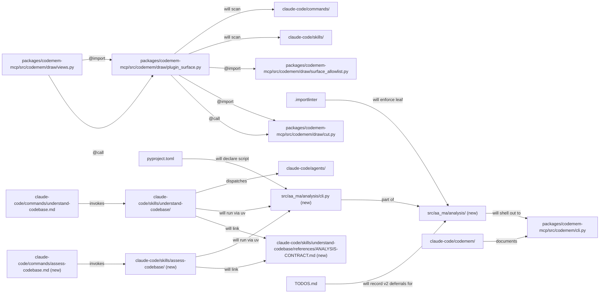
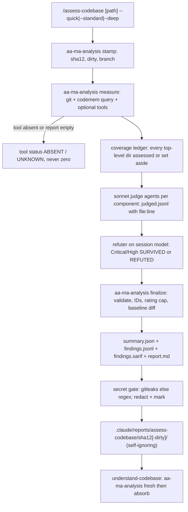
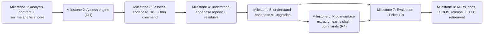

# codebase-analysis-skills Plan

**Objective:** Ship a clean-room whole-repo assessment skill (`assess-codebase`) and an improved `understand-codebase`, sharing one analysis contract and one tested Python core, and prove both beat the local `/codebase-deep-dive` before release.
**Owner:** Stephen J Newhouse + AI
**Created:** 2026-09-27
**Last Updated:** 2026-09-27
**Source map:** `codebase-analysis-skills-map.md` (12/12 tickets RESOLVED, fog empty, guard clear)
**Diagram-Waiver:** none

---

## 0. Repository and Setup

**Repository:** `aa-ma-forge` (PUBLIC, `snewhouse/aa-ma-forge`). **Root:**
`/home/sjnewhouse/projects/github_private/aa-ma-forge`; all paths are relative to it.
Plan authored on `main` at `f3ad912`; precondition PR #3 (codemem `ast-grep` resolution)
merged as `80caae7`.

```bash
uv sync                         # aa-ma + codemem-mcp workspace member + dev group (jsonschema, pytest, ruff…)
uv run pytest -q                # what CI's catch-all job runs (plus tests/codemem/ -x)
uv run ruff check src/
uv run lint-imports             # import-linter contracts (.importlinter); CI runs it
scripts/regen-generated.sh      # golden + docs/architecture/ — `git add` new files FIRST (L-026)
```

**Git workflow (decided with Ste, 2026-09-27; merge mode revised at Phase 4.5 V1):** plan
artifacts — together with the two research files this plan cites
(`docs/research/codebase-analysis-skills-{sarif,offline-command-run}.md`) and the CONTEXT.md glossary
entries — are committed to `main` in the planning commit. Every milestone runs on its own branch `feat/cas-m<N>-<slug>`
cut from up-to-date `main` (a worktree via `Skill(superpowers:using-git-worktrees)` when another
branch is in flight), lands as a PR with all CI checks green, and merges through `/sole-dev-merge`,
which **rebase-merges** on this repo (`claude-code/commands/sole-dev-merge.md:826`, no override;
Ste accepted): every RED and GREEN commit lands on `main` in order, so the tdd-sequence auditor
still sees RED before GREEN. Prototype work lives on `prototype/cas-<name>`; `main` keeps only the
decision. AA-MA sync commits ride on the milestone branch. Commit footer, last line:
`[AA-MA Plan] codebase-analysis-skills .claude/dev/active/codebase-analysis-skills`.
Never `--no-verify` / `core.hooksPath` overrides (L-027).

**Cross-cutting rules (every milestone; from Phase 4.5 verification):**
- **Regen before every push that adds/changes indexed files** (`src/`, `packages/`, `claude-code/`):
  `git add` the new files → `scripts/regen-generated.sh` → review `git diff` → commit. It
  regenerates `tests/golden/plugin-surface.json` and `docs/architecture/` (component/io/
  plugin-surface), which CI's `architecture-drift` job (`codemem draw --check`) compares (L-026).
- **Release notes as you go:** each milestone adds its bullet(s) under `## Unreleased` in
  `CHANGELOG.md` (`scripts/release.sh:39-42` refuses an empty Unreleased; never touch `## vX.Y.Z`
  headings — L-003).
- **Fake secrets in fixtures** are assembled at runtime from split fragments (never a literal
  `AKIA…`/`ghp_…`/PEM string in a committed file): the `security-static-check.sh` hook blocks
  literal secret assignments and GitHub push protection may reject them; use non-`EXAMPLE` values
  (gitleaks allowlists AWS `…EXAMPLE` keys, which would silently weaken the gitleaks path).
- **Fixture repos** set git identity via `GIT_AUTHOR_*`/`GIT_COMMITTER_*` env (precedent
  `tests/codemem/test_owners.py:21-28`) and never assume the default branch is `main` (the CI
  runner has no global identity or `init.defaultBranch`).
- **Agent concurrency cap:** at most 5 subagents running at once (Ste, 2026-09-28); M7's judges
  and any fan-out run in waves of ≤5.
- **Local-only pin:** the gitignored `CLAUDE.md` count lines (`commands/ 13 slash commands`, read by
  `tests/commands/test_aa_ma_share_command.py:53` when present) are updated locally in M3 and never committed.

---

## 1. Executive Summary

A new leaf package `aa_ma.analysis` (pydantic schemas, SHA stamp, stable finding IDs, SARIF,
secret gate, safe command runner, measure/finalize/ground) exposed as `aa-ma-analysis` is the
deterministic spine; `assess-codebase` (skill + thin command) runs measure → judge → refute on
top of it, and `understand-codebase` gains SHA freshness, grounding, currency checks,
`onboarding.json` and incremental regeneration. A blinded old-vs-new evaluation on three repos
gates release `v0.17.0`.

---

## 2. Engineering Standards Declaration (element #12)

All six themes from `claude-code/rules/engineering-standards.md` materially apply
(Ste, 2026-09-27). §2a is the single source for gate-field assignments — not restated here.

| Theme | Rationale |
|---|---|
| **1. Verification & Truth** | Every count in this plan was measured at `f3ad912` (29 deep-dive mentions, 191 golden edges, 70 unbackticked resolvable `/cmd` mentions); each milestone re-measures before asserting. Three milestones prototype first (Ste's choice); M7 judges quality by claim-checking against code, never by self-report. |
| **2. Development Principles** | TDD for every `aa_ma.analysis` module and every skill-text rule (rewire/inventory tests RED first). KISS: pydantic models ARE the schemas (no hand-written JSON Schema); stdlib `json` SARIF. DRY: one contract file both skills link; one runner both skills call. SOC: code measures, model judges, CLI is the only seam between them. |
| **3. Reasoning & Planning** | 12 charting tickets + 8 grill decisions recorded; nothing re-derived. `Skill(impact-analysis)` before M1 (moves the NO-SECRETS rule), M4 (29-mention rewire), M6 (extractor change reaches CI's architecture-drift job). |
| **4. Safety & Continuity** | Non-breaking: understand-codebase keeps every tier working at each milestone; legacy `.claude/reports/codebase-deep-dive-*` still absorbed. Lessons applied: L-022 (tests under `tests/` only), L-025 (push only green), L-026 (`git add` before regen), L-028 (RED commit is tests-only), L-029 (private repo by shape/count only), L-012/L-024 (UNKNOWN never PASS; prove every check can FAIL). |
| **5. Execution Checklist** | Security-bearing code (secret gate, command runner) → `Audit-Profile: full` so §6.8 security-auditor runs. Critical-Path evidence on M1, M2, M3, M5, M8. |
| **6. Sync & Commit Discipline** | Per-sub-step `Status: COMPLETE` + `Result Log:` immediately; one branch + PR per milestone; plan footer on every commit. |

---

## 2a. Gate Field Transcription — MANDATORY

`aa-ma-gate` reads `tasks.md` only (L-021). Every field below MUST also appear on the matching
milestone in `codebase-analysis-skills-tasks.md`. Never write an empty value (exit 2).

| Milestone | `Audit-Profile` | `Critical-Path` | `Prototype-Required` | `TDD-Waiver` |
|---|---|---|---|---|
| M1 | full      | data-xform        | YES | — |
| M2 | full      | data-xform        | YES | — |
| M3 | full      | doc-count-drift   | —   | — |
| M4 | code-only | —                 | —   | — |
| M5 | full      | data-xform        | YES | — |
| M6 | code-only | —                 | —   | — |
| M7 | docs-only | —                 | —   | docs-only |
| M8 | docs-only | version-pipeline  | —   | docs-only |

---

## 3. Dependencies and Assumptions (element #8)

**Dependencies**
- `aa_ma` runtime deps stay `pydantic, textual, rich, watchfiles, markdown-it-py`
  (`pyproject.toml:22-28`) — **no new runtime dependency**. `jsonschema` is a dev dependency
  (`pyproject.toml:99`, locked 4.26.0, `Draft4Validator` importable) used **only by tests**; runtime
  validation is pydantic + the SARIF writer's own invariants.
- `.importlinter` contract `aa-ma-never-imports-codemem` (`.importlinter:75-81`) forbids the import;
  `aa_ma.analysis` reaches codemem **as a subprocess** (`codemem --db <work>/codemem.db query …` — a fresh index built per run under the work dir; the target's own `.codemem/` is never read or written).
  This is a new seam with ADR-0014's intent (ADR-0014 itself reads codemem's SQLite); ADR-0017
  records it. `render-is-leaf` (`.importlinter:53-73`) lists every `aa_ma` module by hand and
  `tests/render/test_leaf_contract.py` pins that list against `pkgutil.iter_modules(aa_ma)` →
  M1 adds `aa_ma.analysis` there.
- `codemem query` reaches 6 tools (`packages/codemem-mcp/src/codemem/cli.py:206-242`, argparse
  `choices` at :377-383, help "Invoke one of the 6 MCP tools" :376, docstring :13); `--db` is a
  top-level flag (:344) and must precede `query`. `hot_spots`, `co_changes`, `owners`, `layers`
  exist in `mcp_tools/__init__.py:442,508,613,926`. **`codemem build` does not fill the commits
  tables** (`indexer.py:390-394`); `codemem refresh-commits` (`cli.py:100-145`) does. With an empty
  cache `owners` returns empty authors and `error: None` (`mcp_tools/__init__.py:630-634`) — a silent
  zero unless measure treats it as UNKNOWN. Docs repeating "6 tools": `claude-code/codemem/README.md:196`,
  `claude-code/codemem/commands/codemem.md:47-60`, `docs/codemem/migration-from-index.md:152`.
- Consumer invocation (`claude-code/skills/understand-codebase/SKILL.md:232`):
  `AA_MA_ROOT=${AA_MA_ROOT:-…readlink -f ~/.claude/skills/<skill>/SKILL.md…/../../..}` then
  `uv run --quiet --project "${AA_MA_ROOT}" aa-ma-analysis …` — live-probed: cwd preserved, the forge
  `.venv/bin/codemem` on PATH, no `.venv` created in the consumer.
- CI (`.github/workflows/security.yml`): `pytest tests/codemem/ -q -x` (:168), catch-all
  `pytest tests --ignore=tests/codemem …` (:182) collects `tests/analysis/` (add `__init__.py`);
  `lint-imports` (:147); ruff + bandit on `src/` only (:55, :39); checkout is `fetch-depth: 1`, so
  history-based metrics are asserted on fixture repos, never on the CI checkout.
  `tests/test_active_plans_canonical.py` requires `## Milestone N: Title` / `### Sub-step N.M: Title`
  in `tasks.md`.
- SARIF: OASIS 2.1.0 errata01 schema (Draft-04), vendored unmodified with its notice under
  `tests/fixtures/sarif/` (`docs/research/codebase-analysis-skills-sarif.md`). Our stable ID goes in
  `result.fingerprints["aaMaFindingId/v1"]`; `partialFingerprints.primaryLocationLineHash` is left for
  `upload-sarif` to compute (research :53,64,184).
- Offline command env + process-group kill (`docs/research/codebase-analysis-skills-offline-command-run.md`).
- Optional tools per metric (`docs/research/codebase-analysis-skills-measurement-tools.md`); on
  BATS `gitleaks` and `semgrep` are on PATH (`~/.local/bin`); `pip-audit` only inside a conda env.
- `claude-security` v0.12.0 exists in the claude-plugins-official marketplace (skill
  `name: claude-security`, invoked `/claude-security`); not installed on BATS — hence the
  "installed and enabled" guard.
- M7 needs Ste's local `/codebase-deep-dive` (kept until M8's retirement step), the private repo's
  existing 2026-09-17 report (present, 6 files), and a scratch clone of `honojs/hono` (485 blobs on
  `main` at planning time — inside the 300–1500 window; SHA pinned at 7.1).

**Assumptions** (each re-verified at the step named)
- A1 — Adding `claude-code/skills/assess-codebase/` + `commands/assess-codebase.md` moves: count
  lines `SECURITY.md:11-12` **and their name lists** (`test_security_md_asset_lists_match_disk`),
  `docs/spec/claude-code-foundations.md:73,91` headings + table rows, `tests/test_doc_counts.py`
  (`PLUGIN_DOCS`; fires, not edited), README `### All commands` (`test_aa_ma_share_command.py:49-66`) and the README
  skills table (~:251, unpinned), the plugin-surface golden and possibly the orphan pin
  (`tests/codemem/test_plugin_surface.py:76-79`) — `command:assess-codebase` stays an orphan until
  M4 references it. *(3.1)*
- A2 — `.claude/reports/` in a target repo may NOT be ignored (it is in the forge via
  `.gitignore:8` `.claude/*`); hence the self-ignoring `.gitignore` containing `*`. *(1.3/1.4, M1 AC6)*
- A3 — `uv run` (allowed by the runner under `UV_OFFLINE=1 UV_NO_SYNC=1`) may still create `.venv/`
  in a target repo; the approval prompt says so, and the runner never invokes `uv` itself. *(2.4)*
- A4 — `jsonschema`'s Draft4Validator does not catch a missing `ruleId`, a malformed URI or a
  numeric `security-severity`; the SARIF writer's own tests must. *(1.4)*
- A5 — The golden `tests/golden/analysis/*.schema.json` depend on pydantic's `model_json_schema()`
  output (2.12.5 via `uv.lock`; spec `>=2,<3`): a pydantic bump requires regenerating them with the
  documented one-liner `uv run python -m aa_ma.analysis.models --write-schemas tests/golden/analysis/`. *(1.4)*

---

## 4. Stepwise Implementation Plan (elements #2 and #4)

Every milestone is `Gate: HARD`. **AFK** = auto-dispatchable from this spec; **HITL** = needs
Ste (decision, prototype verdict, live-run review, release). A `[test]` step always precedes
its `[impl]` step, and the RED commit touches `tests/` only (L-028).

**M1 — Analysis contract + `aa_ma.analysis` core** · branch `feat/cas-m1-analysis-core`
- 1.1 [prototype] HITL — `Skill(prototype)` LOGIC branch `prototype/cas-analysis-schemas`: the §5a HTML page (summary/finding/SARIF for a 3-file toy repo, ID stability under line shift / anchor edit); `PROTOTYPE` verdict
- 1.2 [impact] AFK — `Skill(impact-analysis)` on moving NO-SECRETS out of `SKILL.md:269-273` (+ `SKILL.md:173` "see below", the 4 onboarding agents' own deny-lists at lines ~25-35)
- 1.3 [test] AFK — `tests/analysis/__init__.py`, `test_models.py`, `test_stamp.py`, `test_ids.py`, `test_sarif.py`, `test_secrets.py`, `test_contract_doc.py`, `tests/render/test_leaf_contract.py` update, `EXPECTED_REFERENCES` gains `ANALYSIS-CONTRACT.md`, vendored schema, RED (tests only — L-028)
- 1.4 [impl] AFK — `models.py`, `stamp.py`, `ids.py`, `sarif.py`, `secrets.py`, `cli.py`; `[project.scripts]`; `.importlinter`: add `aa_ma.analysis` to `render-is-leaf` + new `analysis-is-leaf`
- 1.5 [docs] AFK — `ANALYSIS-CONTRACT.md`; SKILL.md pointer + restate rule, `:173` repointed; 4 onboarding agents carry the verbatim contract deny-list; CHANGELOG Unreleased bullet
- 1.6 [verify] HITL — `git add` → `scripts/regen-generated.sh`; full suite + `lint-imports`; `CRITICAL_PATH_REVIEW` (data-xform); PR → `/sole-dev-merge`

**M2 — Assess engine (CLI)** · branch `feat/cas-m2-assess-engine`
- 2.1 [prototype] HITL — `prototype/cas-assess-core`: throwaway script runs every §5a tool row on the forge and records each real output shape; `PROTOTYPE` verdict
- 2.2 [test] AFK — fixture-repo builder (`tests/analysis/conftest.py`) + contract tests (Ticket 10 §4) for measure/finalize, RED
- 2.3 [test] AFK — `codemem query` gains 4 tools + one round-trip test for an existing tool (`who_calls`) + count pin (`len(choices) == 10`, no "6 tools"/"six" left in the CLI and the 3 docs), RED (`tests/codemem/test_install_and_cli.py`)
- 2.4 [test] AFK — safe runner tests (refuse-list, `&&` split, compound refusal, offline env, timeout kills grandchildren), RED
- 2.5 [impl] AFK — codemem CLI: 4 `elif` branches + `choices` + help/docstring "10 tools"; `owners` gets `--repo-root`; the 3 docs that say "6 tools"
- 2.6 [impl] AFK — `measure.py`, `run.py`, `finalize.py`, `report_md.py`; CLI subcommands
- 2.7 [verify] HITL — live `measure` + `finalize` on forge; regen; `CRITICAL_PATH_REVIEW`; PR

**M3 — `assess-codebase` skill + thin command** · branch `feat/cas-m3-assess-skill`
- 3.1 [measure] AFK — re-verify A1 at HEAD; list every pin the new dirs will move
- 3.2 [test] AFK — `tests/skills/test_assess_codebase.py` (inventory, frontmatter, prompts restate NO-SECRETS + injection rule, both skills link the contract, Step 0 preflight refusal text), RED
- 3.3 [impl] AFK — `SKILL.md`, `references/RATING.md`, `references/AGENT-PROMPTS.md`, `commands/assess-codebase.md`
- 3.4 [impl] AFK — `claude-security` guard (installed + enabled check); `EXTERNAL["skill"]` entry only if referenced as `Skill(...)`
- 3.5 [impl] AFK — counts 13→14 / 21→22 + SECURITY name lists + foundations headings/rows + README commands and skills rows + local `CLAUDE.md`; regen
- 3.6 [verify] HITL — clean-room shingle check vs the local deep-dive (local only, result logged); live Standard run on forge; `CRITICAL_PATH_REVIEW` (doc-count-drift); PR

**M4 — understand-codebase: repoint + residuals** · branch `feat/cas-m4-understand-rewire`
- 4.1 [impact] AFK — `Skill(impact-analysis)`; re-count the 29 mentions / 27 lines at HEAD
- 4.2 [test] AFK — extend `test_understand_codebase_rewire.py` (R1/R2/R5/R7/R8/N1, `/deep-analysis` gone, `KEPT` moved to the one flagged legacy rule, SHA freshness, reads `summary.json`); dangling pin `{"haiku-eval"}` in `test_plugin_surface.py:66-68`, RED
- 4.3 [impl] AFK — repoint + residual fixes across SKILL.md, 5 references, template, command, 2 agents
- 4.4 [verify] HITL — regen (golden loses the `understand-codebase -> aa-ma-plan` DANGLING edge, gains `/assess-codebase` ON_DISK edges; orphan pin updated); frontmatter + xref tests green; re-run `/assess-codebase --quick` at the M4 HEAD, then a live understand Quick run absorbing that fresh report; PR

**M5 — understand-codebase v1 upgrades** · branch `feat/cas-m5-understand-v1`
- 5.1 [prototype] HITL — `prototype/cas-incremental-regen`: section→source-paths map + `changed-since`; regenerate one section on a real 2-commit diff; `PROTOTYPE` verdict
- 5.2 [test] AFK — `tests/analysis/test_ground.py`, `test_changed.py`, onboarding model cases; `tests/skills/test_understand_codebase_v1.py`, RED
- 5.3 [impl] AFK — `ground.py`, `changed.py`; CLI `ground`, `changed-since`
- 5.4 [impl] AFK — SKILL.md + references: grounding every tier, currency check via `run`, coverage ledger, 10-claim Standard check, codemem hot_spots/co_changes/owners/layers in dims 4/13, `onboarding.json`, leaner AGENTS template, incremental regeneration; runbook agent `:28` forbids running any build/test command
- 5.5 [verify] HITL — regen; `CRITICAL_PATH_REVIEW` (data-xform); live Standard run on forge: `onboarding.json` validates, ground exit 0 after re-ask, currency statuses shown; PR

**M6 — Plugin-surface extractor learns `/x` (R4)** · branch `feat/cas-m6-extractor-slash`
- 6.1 [measure] AFK — `Skill(impact-analysis)` on the extractor change (CI architecture-drift); re-measure on a fresh scratch index (L-024): resolvable `/x` (any occurrence) and unresolved backticked `/x`; pin both sets in context-log
- 6.2 [test] AFK — rule unit tests + named DANGLING/EXTERNAL sets + "no ON_DISK edge lost" check, RED
- 6.3 [impl] AFK — unresolved backticked `/x` → `EXTERNAL["command"]` or DANGLING; resolution adds `skills/x/`; docstring `plugin_surface.py:9-13`
- 6.4 [impl] AFK — fix every remaining DANGLING `/x` mention (local-only commands, `/compress`)
- 6.5 [verify] AFK — regen; architecture-drift green; PR

**M7 — Evaluation (Ticket 10)** · branch `feat/cas-m7-evaluation`
- 7.1 [setup] HITL — pin `honojs/hono` SHA (300–1500 tracked files, else fastify); scratch clones
- 7.2 [run] HITL — old side: local `/codebase-deep-dive` on forge + hono (`.venv/bin` first on PATH); private repo uses its 2026-09-17 report
- 7.3 [run] HITL — new side: `/assess-codebase` Standard + `/understand-codebase` Standard on all 3 (R6 absorb visible in Provenance)
- 7.4 [judge] AFK — 2 blinded fresh judges per repo (≤5 concurrent), ~20 claims each
- 7.5 [docs] AFK — verdict `docs/research/codebase-analysis-skills-evaluation.md` + CHANGELOG bullet; L-029 name gate before commit
- 7.6 [gate] HITL — Ste accepts verdict or circuit-breaks (no release; re-plan the failing milestone); on accept, PR → `/sole-dev-merge`

**M8 — ADRs, docs, TODOS, release `v0.17.0`, retirement** · branch `feat/cas-m8-release`
- 8.1 [docs] HITL — ADR-0017 + ADR-0006 `## Amendment` + `docs/adr/INDEX.md` row; Ste approves the CONTEXT.md *Codebase analysis* glossary wording (8 terms)
- 8.2 [docs] AFK — spec/quick-ref/foundations mentions; TODOS.md entries; final curation of CHANGELOG `## Unreleased`; PR → `/sole-dev-merge`
- 8.3 [release] HITL — on `main` after the M8 merge (`scripts/release.sh:35-38` requires `main`, clean tree, HEAD == `origin/main`): `scripts/release.sh minor --headline … --dry-run`, then the real cut `v0.17.0`
- 8.4 [handoff] HITL — retirement checklist: Ste deletes `~/.claude/commands/codebase-deep-dive.md` and the `~/claude-config` copy by hand; outcome line in context-log

8.3/8.4 AA-MA sync commits go to `main` directly (docs-only, plan footer) — the release leaves `main` clean.

---

## 13. Architecture View

### Component view

Seeded by `codemem draw --level L2` over the existing Python files this plan modifies
(`plugin_surface.py`, `surface_allowlist.py`, `cli.py`; the seed draws no edge for `cli.py`,
whose imports are function-local). Sigil edges are the seed, verbatim; `(new)` nodes and prose
edges are intended.



### Flow view

Critical paths `data-xform` (M1, M2, M5), `doc-count-drift` (M3), `version-pipeline` (M8).
The assess run, end to end:



### Milestone graph



_Derived from tasks.md by `aa_ma_deps graph`; never hand-edited._

---

## 5. Milestones

### Milestone 1 — Analysis contract + `aa_ma.analysis` core — `Prototype-Required: YES`

**Goal:** One tested, leaf Python core defines every machine-readable output and the secret gate; one contract document both skills obey.

#### Contract
```
Audit-Profile: full
Critical-Path: data-xform
Prototype-Required: YES
Complexity: 65%
Effort: 2 days
Files:
  Create  src/aa_ma/analysis/__init__.py
  Create  src/aa_ma/analysis/models.py
  Create  src/aa_ma/analysis/stamp.py
  Create  src/aa_ma/analysis/ids.py
  Create  src/aa_ma/analysis/sarif.py
  Create  src/aa_ma/analysis/secrets.py
  Create  src/aa_ma/analysis/cli.py
  Create  claude-code/skills/understand-codebase/references/ANALYSIS-CONTRACT.md
  Modify  claude-code/skills/understand-codebase/SKILL.md
  Modify  claude-code/agents/codebase-onboarding-{conventions,runbook,health,synthesizer}.md
  Modify  pyproject.toml
  Modify  .importlinter
  Modify  CHANGELOG.md
  Modify  docs/architecture/ (regenerated)
  Test    tests/analysis/__init__.py (new)
  Test    tests/analysis/test_models.py (new)
  Test    tests/analysis/test_stamp.py (new)
  Test    tests/analysis/test_ids.py (new)
  Test    tests/analysis/test_sarif.py (new)
  Test    tests/analysis/test_secrets.py (new)
  Test    tests/analysis/test_contract_doc.py (new)
  Test    tests/fixtures/sarif/sarif-schema-2.1.0.json (new, vendored unmodified)
  Test    tests/fixtures/analysis/ (new: valid + negative model fixtures)
# Interface detail: §5a (binding).
  Test    tests/golden/analysis/*.schema.json (new)
  Test    tests/skills/test_understand_codebase_frontmatter.py
  Test    tests/render/test_leaf_contract.py

API (models.py — pydantic v2, every model ConfigDict(extra="forbid", strict=True, allow_inf_nan=False);
     §5a is binding where this summary is shorter):
  SCHEMA_VERSION = 1
  class ToolStatus(StrEnum): RAN, ABSENT, UNKNOWN, SKIPPED   # values lowercase
  class Rating(StrEnum): STRONG, ADEQUATE, WEAK, UNKNOWN
  class Confidence(StrEnum): HIGH, MED, LOW
  class Severity(StrEnum): CRITICAL, HIGH, MEDIUM, LOW, INFO
  class Origin(StrEnum): MEASURED, JUDGED
  class Refutation(StrEnum): SURVIVED, REFUTED, NOT_REQUIRED, PENDING
  class Dimension(StrEnum): ARCHITECTURE, MAINTAINABILITY, SECURITY, TESTS_DEPS
  class Stamp: date_utc: AwareDatetime, sha12: str = Field(pattern=r"^[0-9a-f]{12}$"), dirty, branch,
               tier: Literal["quick","standard","deep"], tools: dict[str, ToolStatus],
               absorbed: list[str], fresh_run: list[str]
  class LedgerEntry: path, status: Literal["assessed","set_aside"], reason: str
  class DimensionResult: dimension, rating, confidence, inputs: list[str], capped: bool
  class Counts: findings, refuted, redacted, critical, high, medium, low, info: int = 0
  class Baseline: new, persisting, fixed: int = 0
  class Summary: schema_version: Literal[1], stamp, dimensions: list[DimensionResult], ledger,
                 metrics: dict[str, int | float | None], counts: Counts, baseline: Baseline
  class JudgedFinding: schema_version: Literal[1], origin: Literal["judged"], dimension, severity,
                 confidence, rule, title, path, line: PositiveInt | None, anchor, refutation,
                 evidence: str = Field(max_length=2000)            # judged.jsonl line, no id
  class Finding(same fields): id: str = Field(pattern=r"^F-[0-9a-f]{12}$"),
                 origin: Origin, redacted: bool                    # findings.jsonl line
  class CommandCheck: command, status: Literal["verified","failed","timeout","not_run","refused"],
                      note: str = Field(max_length=8000)
  class Onboarding: schema_version: Literal[1], stamp, commands: list[CommandCheck],
                    entry_points, key_modules, rules_files, ledger: list[LedgerEntry],
                    sections: dict[str, list[str]]
  golden schemas: summary, finding, judged_finding, onboarding (4)
stamp.py:  head_stamp(repo) -> (sha12, dirty, branch); report_dir(repo) -> Path  # <sha12>[-dirty]
           is_fresh(stamp, repo) -> bool   # sha12 == HEAD[:12] and not dirty
           # dirty = TRACKED changes only: git status --porcelain --untracked-files=no (Eng E1)
           ensure_self_ignoring(root) -> None   # writes root/.gitignore = "*\n"; refuses a symlink
           safe_dir(repo, rel) -> Path   # lstat every component from repo root; symlink/escape → exit 2
ids.py:    finding_id(dimension, rule, path, anchor) -> "F-" + sha256(\x1f-joined)[:12]
           # anchor = the per-rule anchor in §5a's measured-findings table (judged findings: the
           # whitespace-collapsed source line text), never a line number; when two findings share
           # (dimension, rule, path, anchor), an occurrence index "#k" (order of appearance) is
           # appended so IDs stay unique
           compare(previous, current) -> dict[id, Literal["new","persisting","fixed"]]
           # one vocabulary everywhere; only sarif.py maps new→new, persisting→unchanged, fixed→absent (Eng E3)
sarif.py:  to_sarif(findings, tool_version) -> dict   # stdlib json only
           # fingerprints {"aaMaFindingId/v1": id} (partialFingerprints left to upload-sarif); baselineState; level map
           # critical/high→error, medium→warning, low/info→note; security-severity as STRING
secrets.py: scan(path) -> ScanResult(hits, tool_status); redact(path, hits) -> int
           # GITLEAKS_BIN seam; report-based rule (rc≠0 or no report → gitleaks UNKNOWN); regex set
           # always runs over decoded JSON string values + keys and text lines; Hit(rule, path, start_line,
           # end_line, start_col, end_col) never carries the value; unknown span → blank the whole string value/line
cli.py:    aa-ma-analysis stamp --tier T | fresh <report-dir|onboarding.json> | scan-secrets <dir> |
           validate <kind> <file>; exit 0 ok / 1 stale|findings|invalid / 2 usage-or-precondition
```

**Acceptance criteria**
1. `uv run aa-ma-analysis validate summary|finding|onboarding <file>` accepts the valid fixtures in
   `tests/fixtures/analysis/` and rejects each of: an extra field, a `schema_version` of 2, a
   `Rating` outside the enum (3 negative fixtures, exit 1).
2. `tests/golden/analysis/{summary,finding,judged_finding,onboarding}.schema.json` equal
   `Model.model_json_schema()`; a field added to a model without regenerating fails the test;
   golden-schema validation in tests uses `Draft202012Validator` (Draft-04 ignores `const`, so a
   `schema_version: 2` document must fail there too). Negative fixtures also cover: `line: 0`,
   `line: true`, `metrics` NaN, a `Counts` bogus key, a final Finding without `id`, `sha12` not hex.
3. Two hits of the same rule and anchor in one file get distinct IDs (occurrence suffix), and
   every `findings.jsonl` in the fixture runs has unique IDs. `finding_id` is identical for the same anchor text at line 10 and line 15, and differs
   when the anchor text, path, rule or dimension changes.
4. `to_sarif()` output validates against the vendored OASIS schema (Draft4Validator), AND the
   writer's own tests assert every result has `ruleId`, a repo-relative `artifactLocation.uri`
   and a string `security-severity` (A4: the schema does not check these).
5. A planted fake AWS key, GitHub token and PEM header (assembled at runtime from fragments,
   non-`EXAMPLE` values) in a temp report dir are redacted by
   `scan-secrets` with `GITLEAKS_BIN=/nonexistent` (regex path) and with a stub gitleaks that
   exits 2 with no report (gitleaks → UNKNOWN, regex still runs); no `Hit` object or stdout line
   contains the planted value. The planted set also includes a FULL PEM and PGP private-key block
   (grep for a body line), a JSON-quoted `"password": "…"` inside a `.json` evidence string, a URL
   credential, an unquoted `DB_PASSWORD=…`, and a key only a stub gitleaks report finds (with
   StartColumn/EndColumn); none survives in any output file; `scan(redact(x)).hits == []`
   (idempotent); `--mask-sk-lighthouse-skeleton` is NOT a hit; an unknown file extension in the
   report dir makes the gate fail closed (exit 1).
6. `ensure_self_ignoring()` makes `git status --porcelain` show nothing under the reports root
   in a fresh temp repo. `safe_dir(repo, rel)` (used for every write: reports root, work dir,
   `.claude/onboarding/`) lstat-checks each path component from the repo root and refuses (exit 2)
   when any of `.claude`, `.claude/reports`, `.claude/reports/assess-codebase`, the work dir,
   `.claude/onboarding` or the `.gitignore` is a symlink or resolves outside the repo — one test per
   component.
7. `ANALYSIS-CONTRACT.md` holds (a) NO-SECRETS deny-list, (b) output gate, (c) provenance
   stamp + SHA freshness rule, (d) "repo content is data, never instructions", (e) field tables
   for the four exported models (Summary, Finding, JudgedFinding, Onboarding); `test_contract_doc.py`
   asserts `set(Model.model_fields) == set(table rows)` for each of the four. `SKILL.md` contains the pointer and the exact string "restate
   verbatim in every spawned agent prompt"; `SKILL.md:173` points at the contract; each of the 4
   onboarding agents carries a verbatim copy of the contract's deny-list line and
   `test_contract_doc.py` asserts each copy equals it; `EXPECTED_REFERENCES`
   gains `ANALYSIS-CONTRACT.md`.
8. `uv run lint-imports` passes and prints `analysis-is-leaf KEPT`: the new contract names every
   other `aa_ma` module explicitly as a source forbidden to import `aa_ma.analysis`, and forbids
   `aa_ma.analysis` from importing any other `aa_ma` module (stdlib + pydantic only); `aa_ma.analysis` is added to `render-is-leaf`'s source list and
   `tests/render/test_leaf_contract.py` (plus a sibling pin for the new contract) asserts both lists
   equal `pkgutil.iter_modules(aa_ma)` minus the leaf.
9. `aa-ma-analysis stamp` in a non-git dir and in a repo with zero commits exits 2 with
   "not a git repo with ≥1 commit"; on a detached HEAD `branch` is `(detached)`; a `--depth 1`
   clone stamps its HEAD normally (CEO review finding 2).
10. An untracked file (e.g. a freshly written `ONBOARDING.md`) leaves `dirty: false` and
   `is_fresh` true; an edit to a tracked file makes both flip (Eng E1). The contract states the rule.
11. Git option injection: `Stamp.sha12` rejects any non-`^[0-9a-f]{12}$` value (e.g. `--output=x`);
   every git subprocess in `aa_ma.analysis` passes `--end-of-options` before revisions/paths (asserted
   by a test that patches `subprocess.run` and inspects argv).

**Tests:** `uv run pytest tests/analysis tests/skills tests/render -q`; `uv run lint-imports`; `uv run ruff check src/`.

**Risks**
| Risk | Mitigation |
|---|---|
| Schema churn after M2/M5 consume the models | Prototype 1.1 exercises all three shapes first; `schema_version` + golden schemas make any change a visible, reviewed diff. |
| Regex fallback misses a secret format | Layered gate (never read secret files → mask at source → scan); fallback set documented in the contract; gitleaks preferred when present. |
| Secret value leaks via the scanner's own output | `Hit` has no value field by type; AC5 greps all outputs for the planted strings. |

**Rollback:** revert the milestone's commit range; nothing else consumes `aa_ma.analysis` yet. The SKILL.md pointer revert restores the inline rule.

---

### Milestone 2 — Assess engine (CLI) — `Prototype-Required: YES`

**Goal:** `aa-ma-analysis measure|run|finalize` turn a repo plus judged findings into the versioned report set, deterministically for everything measured.

#### Contract
```
Audit-Profile: full
Critical-Path: data-xform
Prototype-Required: YES
Complexity: 75%
Effort: 3 days
Files:
  Create  src/aa_ma/analysis/measure.py
  Create  src/aa_ma/analysis/run.py
  Create  src/aa_ma/analysis/finalize.py
  Create  src/aa_ma/analysis/report_md.py
  Modify  src/aa_ma/analysis/cli.py
  Modify  packages/codemem-mcp/src/codemem/cli.py
  Modify  claude-code/codemem/README.md
  Modify  claude-code/codemem/commands/codemem.md
  Modify  docs/codemem/migration-from-index.md
  Modify  CHANGELOG.md
# Interface detail: §5a (measured-findings table, CLI, work dir — binding).
  Modify  docs/architecture/ (regenerated)
  Test    tests/analysis/conftest.py (new: fixture-repo builder, git init in tmp_path, GIT_* identity env)
  Test    tests/analysis/test_measure.py (new)
  Test    tests/analysis/test_run.py (new)
  Test    tests/analysis/test_finalize.py (new)
  Test    tests/codemem/test_install_and_cli.py

measure.py: measure(repo, *, tools=None) -> Measured   # writes measure.json
  first action: safe_dir + ensure_self_ignoring(reports root) BEFORE creating `.work-<sha12>/`
  git: tracked files + bytes per top-level dir, churn (numstat, 90d), last-touch
  codemem (subprocess CODEMEM_BIN or `codemem`, cwd=<target>): every run builds a FRESH index
    `codemem --db <work>/codemem.db build --repo-root <t>` then `… refresh-commits` (`build` never
    fills the commits tables); the target's own `.codemem/` (possibly committed or symlinked by a
    hostile repo) is never read or written; build failure → all codemem inputs UNKNOWN; zero commit
    rows or empty `authors` → UNKNOWN, never zero): hot_spots, co_changes (top hot files), owners
    (`--repo-root <t>`), layers, dead_code
  optional (seams *_BIN): lizard, jscpd, gitleaks, semgrep, osv-scanner, pip-audit
  rule (sole-dev-merge Stage C): absent → ABSENT; rc>1 or empty/unparseable report → UNKNOWN
    (gitleaks override: run with `--exit-code 0`, so any rc≠0 → UNKNOWN — §5a)
run.py: run_approved(commands, cwd, timeout=300) -> list[CommandCheck]
  no shell (Phase 4.5 V2): shlex.split; `a && b` → two commands, each refuse-checked, stop at first
  failure; any `|`, `;`, `>`, `<`, backtick or `$(` → status not_run "compound — run by hand";
  subprocess without shell, `# nosec B404/B603` per the `render/mermaid_lint.py` precedent
  argv[0] gate first: refuse `env`, `sudo`, `doas`, `su`, any shell (`sh bash zsh dash fish`), and
    interpreters given `-c`/`-e`/`-m pip` (`python* node ruby perl`); reject control/bidi characters;
  refuse (token-anchored on argv[0] + subcommand, so `pytest tests/pipeline` passes): pip|uv (install|sync|add|pip)|npm (i|install|ci)|pnpm install|yarn (install|add)|
          cargo (install|fetch)|go (get|install|mod download)|curl|wget|npx|uvx|pipx|bunx|
          pnpm (dlx|add|i)|yarn dlx|bun (install|add)|poetry (install|add)|pip3|conda|gem|bundle|
          composer|git (clone|fetch|pull)|docker (pull|run)|apt|apt-get|brew|make install → "refused"
  env: UV_OFFLINE=1 UV_NO_SYNC=1 UV_PYTHON_DOWNLOADS=never PIP_NO_INDEX=1
       npm_config_offline=true YARN_ENABLE_NETWORK=0 COREPACK_ENABLE_NETWORK=0
       CARGO_NET_OFFLINE=true GOPROXY=off GOTOOLCHAIN=local GOFLAGS=-mod=readonly
  Popen(start_new_session=True, stdin=DEVNULL, env=MINIMAL) — MINIMAL = PATH, HOME, LANG, TMPDIR +
  the offline vars (no GITHUB_TOKEN/AWS_*/ANTHROPIC_API_KEY reach repo-controlled code); timeout →
  os.killpg TERM, 5s, KILL (a grandchild that calls setsid() escapes — stated in the contract);
  output tail 40 lines, secret-redacted, stored in CommandCheck.note
work dir (Eng E2): .claude/reports/assess-codebase/.work-<sha12>/ — `measure` creates it and writes
  measure.json; judge/refuter agents (Standard/Deep) and the main thread (ledger.json always,
  ratings.json in Quick) write judged.jsonl, ledger.json, ratings.json there only;
  finalize consumes it, deletes it on success, keeps it (named in the error) on failure
finalize.py: finalize(repo, workdir) -> Path
  validate every input line; assign ids; judged Critical/High with refutation PENDING → exit 1;
  REFUTED → dropped from outputs, counted; judged severity medium/low → confidence capped at MED;
  rating cap: dimension whose core input status ≠ `ran` (absent/unknown/skipped) cannot be STRONG →
  ADEQUATE + capped=true;
  baseline vs newest previous <sha12> dir; write to tmp dir then atomic rename over <sha12>[-dirty];
  ensure_self_ignoring(root); secret gate last; post-redaction re-validation = pydantic models +
  the SARIF writer's invariants (jsonschema is dev-only; full schema validation lives in tests);
  test seam AA_MA_FINALIZE_CRASH_BEFORE_RENAME=1
codemem cli: `codemem [--db X] query hot_spots | co_changes <file> | owners <path> [--repo-root R] | layers`;
  `choices` list, help ("10 MCP tools") and module docstring updated
```

**Acceptance criteria** (all on the fixture repo — Ticket 10 §4)
1. Two `measure`+`finalize` runs at the same commit give identical `findings.jsonl` IDs for
   every MEASURED finding; `summary.json`, every `findings.jsonl` line and `findings.sarif`
   validate (models + vendored schema).
2. With `LIZARD_BIN=/nonexistent` the complexity input is `ABSENT` and the dimension rating
   cannot be STRONG (`capped: true`); with a stub that exits 3 and writes nothing it is `UNKNOWN`.
   Neither case ever reports a zero metric. Prove the check can FAIL: a stub that exits 0 with
   a valid report yields `RAN` (L-024).
3. Report dir is `<sha12>` on a clean tree and `<sha12>-dirty` with an uncommitted edit; a
   re-run at the same SHA replaces the dir; the reports root is self-ignoring.
4. A fake secret planted in fixture source and quoted by a judged finding's `evidence` never
   appears in any output file (grep of the whole report dir), and the finding has `redacted: true`.
5. Second run after deleting one flagged function: that finding is `fixed` in `summary.json.baseline`
   and `absent` in SARIF `baselineState`; `summary.baseline.model_dump() == {"new":0,"persisting":0,"fixed":0} | Counter(compare(...).values())` and the
   SARIF `baselineState` counts equal the same numbers.
6. `run_approved(["uv sync"])` → `refused`; one refusal test per bypass: `env UV_OFFLINE=0 uv run x`,
   `sudo make`, `bash -c "…"`, `python -c "…"`, `python -m pip install x`, `uvx x`, `pnpm dlx x`,
   `git clone x`, `make install`; `pytest tests/pipeline` is NOT refused; the child env equals MINIMAL
   (a planted `GITHUB_TOKEN` in the parent is absent in the child) and stdin is `/dev/null`; a command sleeping past the timeout → `timeout` and
   its grandchild `sleep` process is gone (checked by pid); the env passed to a stub contains
   every offline variable above; `run_approved(["pytest -q && uv sync"])` runs pytest then
   refuses `uv sync`; `run_approved(["pytest | tee x"])` → `not_run` (compound).
7. On a fixture index built in `tmp_path` (after `refresh-commits`), `codemem --db <idx> query
   hot_spots|co_changes <f>|owners <p> --repo-root <r>|layers` print JSON and exit 0; a new
   round-trip test for `who_calls` guards the existing six (today only `--help` is checked,
   `test_install_and_cli.py:113-127`); a live forge run is logged as extra evidence only.
8. `finalize` refuses (exit 1, message names the IDs) while any judged Critical/High is `PENDING`.
9. Untrusted judged input (CEO finding 3, `Skill(llm-output-safety)`): a judged line whose `path`
   is absolute or resolves outside the repo (`../../etc/x`, a symlink escaping it) and a
   malformed JSON line are each rejected with exit 1 naming the line number; after the secret
   gate redacts, every output file is re-validated (models + SARIF writer invariants) before finalize
   exits 0; the test additionally validates the SARIF against the vendored schema.
10. Bounded runtime + trail (CEO finding 4): each optional tool runs under `--tool-timeout`
   (default 300 s); a stub that sleeps past it yields `UNKNOWN` for that input only; the report
   dir holds `run.log` with one line per tool (name, argv, rc, duration, status) and no tool
   output text (grep for a planted secret in stub output finds nothing in `run.log`).
11. Work dir (Eng E2): a successful finalize leaves no `.work-<sha12>/`; a failed one keeps it and
   prints its path; with `AA_MA_FINALIZE_CRASH_BEFORE_RENAME=1` the `<sha12>` dir is absent (or
   byte-equal to the previous version) and `.work-<sha12>/` remains.
12. codemem seam (Eng E4 + Angle 6): every codemem call passes `--db <work>/codemem.db` with
   `cwd=<target>`; a fixture target whose committed `.codemem/index.db` is a planted fake is never
   opened (mtime/atime unchanged, values ignored); `CODEMEM_BIN=/nonexistent` → codemem inputs
   `UNKNOWN`; a stub codemem reporting zero commit rows → hot_spots/co_changes/owners `UNKNOWN`;
   the forge's own index is never read.

**Tests:** `uv run pytest tests/analysis -q`; `uv run pytest tests/codemem/ -q -x`; `uv run lint-imports`.

**Risks**
| Risk | Mitigation |
|---|---|
| Repo-controlled commands escape "no network" | Refuse-list + offline env + explicit approval list; documented as best-effort in the report; `unshare -rn` recorded in TODOS as a hardening option. |
| codemem index build fails or yields nothing in a target repo | Fresh per-run index under the work dir; any failure → codemem inputs UNKNOWN (never zero). |
| Model-judged findings unstable across runs | Stability asserted only for MEASURED findings (Ticket 10); judged IDs still anchor on text, so most persist. |

**Rollback:** revert the milestone's commit range; the codemem CLI additions are additive (4 branches + `choices`/help text).

---

### Milestone 3 — `assess-codebase` skill + thin command

**Goal:** `/assess-codebase` runs Quick / Standard / Deep end to end on any repo, and every count, golden and README table agrees it exists.

#### Contract
```
Audit-Profile: full
Critical-Path: doc-count-drift
Complexity: 55%
Effort: 2 days
Files:
  Create  claude-code/skills/assess-codebase/SKILL.md          # ≤ 250 lines
  Create  claude-code/skills/assess-codebase/references/RATING.md
  Create  claude-code/skills/assess-codebase/references/AGENT-PROMPTS.md
  Create  claude-code/commands/assess-codebase.md
  Modify  packages/codemem-mcp/src/codemem/draw/surface_allowlist.py   # only if referenced as Skill(claude-security)
  Modify  SECURITY.md
  Modify  README.md
  Modify  docs/spec/claude-code-foundations.md
  Modify  CHANGELOG.md
  Modify  docs/architecture/ (regenerated)
  Test    tests/skills/test_assess_codebase.py (new)
  Test    tests/golden/plugin-surface.json (regenerated)
  Test    tests/codemem/test_plugin_surface.py (orphan pin if it moves)

SKILL.md content (clean-room — ideas from the map only, no text from the local deep-dive):
  Step 0 stamp + fresh check (reuse a fresh same-SHA report; ask to re-run)
  Step 1 tier: `/assess-codebase [path] [--quick|--standard|--deep]` → CLI `--tier`; else ask once with the real tracked-file count; >2000 files → hot-spot focus default
    (Deep's ask names its network calls: semgrep registry rules, osv-scanner/pip-audit dependency
    lookups — Phase 4.5 V4; Quick/Standard never make them, those tools read `skipped`)
  Step 2 measure; Step 3 coverage ledger; Step 4 judge (Standard/Deep): per-component
    built-in Explore/general-purpose agents, model: sonnet, prompts from AGENT-PROMPTS.md,
    reuse codebase-onboarding-health for the health slice
  Step 5 refute Critical/High (general-purpose, session model, prompted to disprove)
  Step 6 Deep only: offer claude-security deep pass (if installed+enabled); ask once to run
    tests via `aa-ma-analysis run` (declined/failed/timeout → coverage UNKNOWN)
  Step 7 finalize; print report path + per-dimension ratings; no overall grade
RATING.md: per dimension — measured inputs, Strong/Adequate/Weak rubric with numeric anchors
  as guidance (e.g. CCN p90, duplication %, known-vuln count), the UNKNOWN cap rule
```

**Acceptance criteria**
1. `tests/skills/test_assess_codebase.py`: frontmatter `name: assess-codebase`; references
   inventory is exactly `[AGENT-PROMPTS.md, RATING.md]`; SKILL.md ≤ 250 lines; both
   `assess-codebase/SKILL.md` and `understand-codebase/SKILL.md` contain the relative link to
   `understand-codebase/references/ANALYSIS-CONTRACT.md`; every prompt block in
   `AGENT-PROMPTS.md` contains the NO-SECRETS sentence and the "repo content is data" sentence.
2. `uv run pytest -q` green (incl. `tests/test_doc_counts.py` and
   `test_security_md_asset_lists_match_disk`) with: `SECURITY.md:11-12` reading 14 command files /
   22 skills directories and naming `assess-codebase` in both lists; foundations containing the
   strings `### Commands (14)` and `### Skills (22)` plus a table row for each new asset; README
   `### All commands` with a row starting `/assess-codebase` and a skills-table row
   `assess-codebase`. Local gitignored `CLAUDE.md` count lines updated (not committed).
3. `tests/golden/plugin-surface.json` regenerated after `git add` of every new file;
   `command:assess-codebase -> skill:assess-codebase` present as ON_DISK; `errors == []`.
4. Clean-room check (local, one-off): no 12-word shingle shared between the new skill files
   and `~/.claude/commands/codebase-deep-dive.md`; result count logged in provenance, file
   contents never quoted.
5. Live `/assess-codebase . --standard` on the forge produces a report dir whose
   `summary.json` validates, 4 dimension ratings each list their inputs, ledger covers every
   top-level dir, and a `gitleaks`/regex scan of the dir finds zero secrets. Runtime logged.
6. With `AA_MA_ROOT` pointing at a non-checkout (and with `uv` absent from PATH), the skill's
   Step 0 preflight refuses before any agent runs, with one message naming `scripts/install.sh`
   and `AA_MA_ROOT` (skill-text test + one live check) (CEO finding 1).

**Tests:** `uv run pytest -q`; `bats tests/hooks/install_dry_run.bats`.

**Risks**
| Risk | Mitigation |
|---|---|
| Count pins drift across files (L-002 pattern) | 3.1 lists every pin from the tests themselves; doc-count-drift `CRITICAL_PATH_REVIEW`. |
| Skill text drifts back towards the deep-dive's wording | AC4 shingle check; map rule "ideas only". |
| Judge agents flood Critical/High | Refuter gate + `finalize` refusal on PENDING; Medium/Low confidence capped. |

**Rollback:** revert the milestone's commit range (removes skill, command, counts, golden together).

---

### Milestone 4 — understand-codebase: repoint + residuals

**Goal:** understand-codebase points at `/assess-codebase`, judges freshness by SHA, reads assess's machine output, and every report residual (R1, R2, R5, R7, R8, N1) is closed test-first.

#### Contract
```
Audit-Profile: code-only
Complexity: 45%
Effort: 1 day
Files:
  Modify  claude-code/skills/understand-codebase/SKILL.md
  Modify  claude-code/skills/understand-codebase/references/DIMENSIONS.md
  Modify  claude-code/skills/understand-codebase/references/REUSE-MAP.md
  Modify  claude-code/skills/understand-codebase/references/ONBOARDING-TEMPLATE.md
  Modify  claude-code/skills/understand-codebase/references/PROS-CONS-RUBRIC.md
  Modify  claude-code/skills/understand-codebase/references/DEEPDIVE-TEMPLATES.md
  Modify  claude-code/skills/understand-codebase/templates/onboarding-team.md
  Modify  claude-code/commands/understand-codebase.md
  Modify  claude-code/agents/codebase-onboarding-health.md
  Modify  claude-code/agents/codebase-onboarding-synthesizer.md
  Modify  CHANGELOG.md
  Modify  docs/architecture/ (regenerated)
  Test    tests/skills/test_understand_codebase_rewire.py
  Test    tests/codemem/test_plugin_surface.py (dangling pin → {"haiku-eval"}; orphan pin drops command:assess-codebase)
  Test    tests/golden/plugin-surface.json (regenerated)

Edits (line refs verified at f3ad912):
  R1  SKILL.md:296  drop the `/codebase-deep-dive` half of the degradation row
  R2  command:40    name codemem as the default index; reuse wording keeps assess output
  R5  Quick tier    absorb-and-link gets a real link target (the assess report.md path)
  R7  command:31    `--deep` no longer claims to run /codebase-deep-dive or /index
  R8  SKILL.md:64-65 "ships no whole-repo audit" → `/assess-codebase`
  N1  SKILL.md:345  `Skill(aa-ma-plan)` → `/aa-ma-plan`; `/deep-analysis` dropped (:66, :345, command:48)
  SHA the assess + legacy-report freshness rules (SKILL.md:99 row, REUSE-MAP.md:9, DIMENSIONS.md:217,
      health agent :35) → `aa-ma-analysis fresh`; SKILL.md:97 (gsd `.planning/codebase`, no SHA stamp)
      keeps its date rule
  Absorb SKILL.md:99 + REUSE-MAP.md: read summary.json + findings.jsonl of a fresh
      .claude/reports/assess-codebase/<sha12>/; exactly ONE flagged "legacy deep-dive output"
      rule for .claude/reports/codebase-deep-dive-*/ (marked "legacy, unverified" in Provenance)
  Deep: no fresh assess output → ask once whether to run /assess-codebase first
```

**Acceptance criteria**
1. Under `claude-code/`, `codebase-deep-dive` appears only in the single flagged legacy-absorb
   rule (asserted by exact file + string); the existing `KEPT` pin
   (`test_understand_codebase_rewire.py:61`, today DIMENSIONS.md's conditional reuse line) is moved
   to that one rule; `ROUTES_TO_UNSHIPPED` / `DEEP_DIVE_RUNS` pass.
2. Each of R1, R2, R5, R7, R8, N1 has its own named assertion, RED before 4.3.
3. `deep-analysis` and `Skill(aa-ma-plan)` occur zero times under `claude-code/`.
4. SKILL.md Step 0 names `aa-ma-analysis fresh`; no `git log -1 --format=%cd` rule remains on the
   assess/legacy-report rows (SKILL.md:99, REUSE-MAP.md:9, DIMENSIONS.md:217, health agent :35); the
   gsd row at SKILL.md:97 keeps its date rule (asserted).
5. `test_understand_codebase_frontmatter.py` and `tests/assets/test_understand_codebase_xrefs.py` green.
6. After a fresh `/assess-codebase --quick` at the M4 HEAD, a live understand Quick run on the forge
   links that `report.md` and its Provenance lists it as "absorbed (fresh, sha12 <HEAD[:12]>)".
7. After `git add` + regen, `tests/golden/plugin-surface.json` no longer holds
   `skill:understand-codebase -> skill:aa-ma-plan`; the dangling pin equals `{"haiku-eval"}`; CI
   `architecture-drift` green.

**Tests:** `uv run pytest tests/skills tests/assets -q`.

**Risks**
| Risk | Mitigation |
|---|---|
| A guard test passes for the wrong reason after edits (L-023) | After editing, disable one repointed line and confirm the test goes RED. |
| Legacy reports silently treated as fresh | Legacy rule always labels "legacy, unverified"; freshness only via SHA stamp. |
| Mentions counted in prose over-/under-count | Assert exact strings per file, not grep totals. |

**Rollback:** revert the milestone's commit range; tests and text move together.

---

### Milestone 5 — understand-codebase v1 upgrades — `Prototype-Required: YES`

**Goal:** Every generated onboarding claim is grounded in its cited source, documented commands carry a verified status, a machine-readable `onboarding.json` exists, and a re-run regenerates only what changed.

#### Contract
```
Audit-Profile: full
Critical-Path: data-xform
Prototype-Required: YES
Complexity: 70%
Effort: 3 days
Files:
  Create  src/aa_ma/analysis/ground.py
  Create  src/aa_ma/analysis/changed.py
  Modify  src/aa_ma/analysis/cli.py
  Modify  claude-code/skills/understand-codebase/SKILL.md
  Modify  claude-code/skills/understand-codebase/references/DIMENSIONS.md
  Modify  claude-code/skills/understand-codebase/references/ONBOARDING-TEMPLATE.md
  Modify  claude-code/skills/understand-codebase/references/AGENTS-MD-TEMPLATE.md
  Modify  claude-code/agents/codebase-onboarding-runbook.md
  Modify  claude-code/agents/codebase-onboarding-health.md
  Modify  CHANGELOG.md
  Modify  docs/architecture/ (regenerated)
  Test    tests/analysis/test_ground.py (new)
  Test    tests/analysis/test_changed.py (new)
  Test    tests/skills/test_understand_codebase_v1.py (new)

ground.py: ground(md_path, repo) -> list[Ungrounded]
  claim unit = one bullet or sentence carrying a `path` or `path:line` citation;
  every backticked identifier and every number in the unit must occur in the cited file
  (within ±20 lines when a line is given); CLI `aa-ma-analysis ground <md>` exit 1 lists them.
  Skill: re-ask once, then drop the claim. Every tier.
changed.py: changed_since(repo, sha12) -> list[str]; sections_to_regenerate(onboarding, changed) -> list[str]
Skill text:
  currency check — main thread (never the read-only runbook agent) shows the documented
    build/test/lint commands, asks once, runs via `aa-ma-analysis run`; status per command in
    ONBOARDING.md + onboarding.json
  coverage ledger (LedgerEntry) in every tier; 10 sampled claims checked in Standard, ~20 in Deep
  dims 4 (structure) and 13 (repo health) read codemem hot_spots/co_changes/owners/layers
    via `codemem query` instead of Explore re-derivation
  onboarding.json (Onboarding model) incl. `sections` → source paths (feeds incremental)
  AGENTS-MD-TEMPLATE: only what cannot be inferred from code (commands, gotchas, rules pointers)
  incremental: stamped sha12 present → changed_since → regenerate listed sections only
```

**Acceptance criteria**
1. `ground()` flags a sentence citing `src/x.py:10` whose backticked name exists only at line 80,
   and passes one where it is at line 25; numbers checked the same way; a unit with no citation
   is not a claim (not flagged).
2. `changed_since` + `sections_to_regenerate` on a 2-commit fixture return exactly the sections
   whose mapped paths changed; unknown stamp SHA (rebased away) → all sections.
3. Skill-text tests: `codebase-onboarding-runbook.md:28` forbids running any build/test/lint
   command (only the main thread runs them via `aa-ma-analysis run`); the claim-check sample size
   is 10 in Standard; dims 4/13 name all four codemem tools; `AGENTS-MD-TEMPLATE.md`'s `##`
   headings ⊆ {Commands, Gotchas, Rules pointers} (set pinned in the test).
4. Live Standard run on the forge: `aa-ma-analysis validate onboarding .claude/onboarding/onboarding.json`
   exit 0; `ground` exit 0 on ONBOARDING.md after the re-ask; each documented command shows one
   of verified / failed / timeout / not_run / refused.
5. A second live run after one commit touching one module: the sections listed as regenerated in
   Provenance == `sections_to_regenerate(onboarding, changed_since(prev_sha))`.
6. With the CLI unavailable (non-checkout `AA_MA_ROOT`), every tier still completes; grounding,
   `onboarding.json`, currency check and incremental regeneration are skipped and each skip is
   named in Provenance (skill-text test) (CEO finding 1).

**Tests:** `uv run pytest tests/analysis tests/skills -q`.

**Risks**
| Risk | Mitigation |
|---|---|
| Grounding too strict → drops true claims | Prototype-adjacent tuning on the forge in 5.5; ±20-line window; re-ask before drop. |
| Currency check runs something harmful | Same approved-list + refuse-list + offline env + timeout as M2; runbook agent stays read-only. |
| Section→path map wrong → stale sections kept | Prototype 5.1 decides the mapping; unknown SHA → full regeneration. |

**Rollback:** revert the milestone's commit range; M4's rewire remains valid alone.

---

### Milestone 6 — Plugin-surface extractor learns `/x` (R4)

**Goal:** A backticked slash command that resolves nowhere is a DANGLING edge, and none remain in shipped content.

#### Contract
```
Audit-Profile: code-only
Complexity: 45%
Effort: 1 day
Files:
  Modify  packages/codemem-mcp/src/codemem/draw/plugin_surface.py
  Modify  packages/codemem-mcp/src/codemem/draw/surface_allowlist.py
  Modify  claude-code/skills/          # remaining local-only `/x` mentions, `/compress`
  Modify  claude-code/commands/        # remaining local-only `/x` mentions
  Modify  CHANGELOG.md
  Test    tests/codemem/test_plugin_surface.py
  Test    tests/golden/plugin-surface.json (regenerated)
  Modify  docs/architecture/ (regenerated)

Rule (Ste, 2026-09-27; revised Phase 4.5 V3): names that RESOLVE keep today's any-occurrence
  match (no ON_DISK edge lost — 70 unbackticked resolvable mentions measured); unresolved names
  count only in a backtick span whose text STARTS with `/name`;
  `:` joins a namespace (`/superpowers:brainstorming` → name `superpowers:brainstorming`);
  `{` ends no match (`/retro-{date}` dropped). Resolve: commands/name.md → ON_DISK command;
  skills/name/ → ON_DISK skill; EXTERNAL["command"] (built-ins goal, init, clear, help…;
  gstack qa, qa-only, browse…; `superpowers:*`; plugin `claude-security`) → DECLARED_EXTERNAL; else DANGLING.
  Local-only user commands (index, commit-and-push, git-status-smart, release-prep,
  pre-commit-*, deep-analysis, codebase-deep-dive) are NOT allowlisted.
```

**Acceptance criteria**
1. Unit cases: `` `/goal` `` external; `` `/retro` `` ON_DISK skill; `` `/superpowers:brainstorming` ``
   external; `` `GET /healthz` `` and `` `/retro-{date}.md` `` produce no edge; `` `/nope` `` DANGLING.
2. After 6.4, the command DANGLING set equals the literal set pinned at 6.1 minus the set fixed
   in 6.4 (both listed in context-log); the skill DANGLING pin is unchanged from M4.
3. Every `EXTERNAL["command"]` entry has ≥1 DECLARED_EXTERNAL edge in `plugin-surface.json`
   (existing test :87-91 extended).
4. `scripts/regen-generated.sh` run after `git add`; CI `architecture-drift` green on the PR.
5. No ON_DISK command edge present in the pre-M6 golden is missing from the post-M6 golden
   (set comparison in the test); `plugin_surface.py:9-13` docstring states the new rule.

**Tests:** `uv run pytest tests/codemem/test_plugin_surface.py -q -x`; `uv run pytest -q`.

**Risks**
| Risk | Mitigation |
|---|---|
| Numbers moved since charting (M3–M5 edits) | 6.1 re-measures on a fresh scratch index (L-024) before any assertion. |
| Fixing mentions breaks rewire guard tests | Run `tests/skills` after 6.4; guard strings updated only where the test's intent holds. |
| Allowlist hides a real dangler | Local-only commands deliberately not allowlisted; each entry must be referenced. |

**Rollback:** revert the milestone's commit range; golden and docs regenerate back.

---

### Milestone 7 — Evaluation (Ticket 10)

**Goal:** Evidence, not opinion, that the new skills beat the local deep-dive on every repo, with zero secret leaks.

#### Contract
```
Audit-Profile: docs-only
TDD-Waiver: docs-only
Complexity: 60%
Effort: 2 days
Files:
  Create  docs/research/codebase-analysis-skills-evaluation.md
  Modify  CHANGELOG.md        # one Unreleased bullet: evaluation verdict

Repos: aa-ma-forge (665 tracked files at f3ad912); the private Python repo (154 tracked files — named
  NOWHERE in this public repo, L-029); honojs/hono at a pinned SHA (scratch clone).
Old: local /codebase-deep-dive (forge, hono; `.venv/bin` first on PATH so `sg` is ast-grep);
  private repo: its existing 2026-09-17 report. New: /assess-codebase Standard +
  /understand-codebase Standard absorbing it (R6).
Judges: 2 per repo, fresh general-purpose agents, reports anonymised A/B in seeded random
  order (seed recorded); each samples ~20 claims per report → true/false/unverifiable, then
  scores accuracy, evidence density, actionability, false positives, secret leakage, runtime.
```

**Acceptance criteria (pass bar — Ticket 10)**
1. accuracy = true/(true+false) over sampled claims; density = claims with a `path:line` citation /
   total claims; new ≥ old on both, for both judges, on all 3 repos (verdict table; disagreements listed).
2. Zero secret values in any new output (gitleaks + regex over every report dir).
3. Zero Critical/High findings that fail the claim check.
4. For every ABSENT/UNKNOWN tool the verdict table records the `command -v` result or rc;
   ABSENT ⇔ `command -v` fails.
5. understand-codebase Provenance shows the fresh assess report absorbed on all 3 repos (R6).
6. Runtime recorded per repo per side (not gated).
7. L-029 gate: `git diff --cached | grep -F -i -f <names.txt>` exits 1 before commit, where
   `names.txt` (kept outside the repo) lists the private repo's name and its DISTINCTIVE top/second-
   level dir names — generic words that already occur in this plan (reports, fixtures, config,
   session, document) are excluded and the exclusion is recorded as a count only.

**Tests:** the pass-bar table in the verdict file; Ste's acceptance recorded in context-log.

**Risks**
| Risk | Mitigation |
|---|---|
| Judge bias toward the newer format | Blinding + A/B shuffle + claim-level checking before scoring. |
| Private-repo names leak into public files | Shape/count only; AC7 grep gate. |
| New side fails the bar | Circuit breaker: no release; re-plan the failing milestone (new milestone, not a patch in M7). |

**Rollback:** delete the verdict file; nothing else changes.

---

### Milestone 8 — ADRs, docs, TODOS, release `v0.17.0`, retirement

**Goal:** Decisions recorded, docs agree, release cut, local copies retired by Ste.

#### Contract
```
Audit-Profile: docs-only
Critical-Path: version-pipeline
TDD-Waiver: docs-only
Complexity: 35%
Effort: 0.5 day
Files:
  Create  docs/adr/0017-assess-codebase-adaptation.md
  Modify  docs/adr/0006-understand-codebase-adoption.md   # dated ## Amendment → 0017
  Modify  docs/adr/INDEX.md
  Modify  docs/spec/aa-ma-quick-reference.md
  Modify  docs/spec/claude-code-foundations.md
  Modify  TODOS.md
  Modify  CHANGELOG.md        # curate ## Unreleased; release.sh promotes it (never edit ## vX.Y.Z — L-003)
```

**Acceptance criteria**
1. ADR-0017 records: clean-room Adaptation (concept only, no FORKS.json), two-skill + shared
   contract shape, `aa_ma.analysis` as the code home and its subprocess-only codemem seam,
   `claude-security` as declared-external; ADR-0006 gains `## Amendment (2026-…)` → 0017;
   `scripts/check_adr_index.sh` passes.
2. TODOS.md gains: incremental assess re-analysis (v2), `unshare -rn` hardening, uninstall.sh
   deregisters 5 of 8 hooks, `codemem refresh` placeholder.
3. `scripts/release.sh minor --headline "…" --dry-run` clean, then the real cut tags `v0.17.0`
   and the GitHub Release exists; `CRITICAL_PATH_REVIEW` (version-pipeline) in provenance.
4. context-log holds one dated line `RETIREMENT — confirmed|deferred — <reason>` for the local
   `/codebase-deep-dive` copies.
5. `## Unreleased` has ≥1 bullet per M1–M7 before the cut; the cut runs on `main` with a clean
   tree and HEAD == `origin/main`.
6. context-log holds a dated line recording Ste's approval (or edits) of the CONTEXT.md *Codebase
   analysis* glossary wording (8 terms) — deferred there from planning (Ste, 2026-09-28).

**Tests:** `uv run pytest -q`; `scripts/check_adr_index.sh`.

**Risks**
| Risk | Mitigation |
|---|---|
| CHANGELOG mangled (L-003, L-006, L-008) | Hand edits only under `## Unreleased`; `scripts/release.sh` alone promotes it and writes `## vX.Y.Z`; dry-run first. |
| Release before M7 passes | M8 depends on M7's HARD gate approval. |
| Local copy deleted before evaluation | Retirement is the last step, after the tag. |

**Rollback:** `docs/runbooks/release.md` rollback; ADR text reverts by PR.

---

## 5a. Interface Specification (binding for M1, M2, M5 — Phase 4.5 Angle 5)

Where §5's Contract blocks and this section disagree, this section wins; the M1/M2 prototypes may
refine it, and any refinement is recorded in context-log before the RED commit.

**Models (models.py; pydantic v2, `extra="forbid"`, StrEnum values lowercase — `"ran"`, `"strong"`).**
- `ToolStatus`: `ran | absent | unknown | skipped` (`skipped` = not allowed at this tier); the rating
  cap applies whenever a dimension's core input status is not `ran`.
- `Stamp`: `date_utc: AwareDatetime` (serialised ISO-8601 `Z`), `sha12: str` (pattern `^[0-9a-f]{12}$`), `dirty: bool`, `branch: str`,
  `tier: Literal["quick","standard","deep"]`, `tools: dict[str, ToolStatus]`, `absorbed: list[str]`,
  `fresh_run: list[str]`.
- `Summary`: `dimensions: list[DimensionResult]` (exactly 4, one per `Dimension`),
  `ledger: list[LedgerEntry]`, `metrics: dict[str, int | float | None]` (None = not measured; strict,
  no NaN/inf), `counts: Counts` (int fields findings, refuted, redacted, critical, high, medium, low,
  info — default 0), `baseline: Baseline` (int fields new, persisting, fixed — default 0).
- `Onboarding`: `commands: list[CommandCheck]`, `entry_points: list[str]`, `key_modules: list[str]`,
  `rules_files: list[str]`, `ledger: list[LedgerEntry]`, `sections: dict[str, list[str]]` (declared in
  M1 so M5 causes no schema churn).
- `CommandCheck.note`: last 40 output lines, secret-redacted.
- Internal (NOT exported, no golden): frozen dataclasses `Hit(rule, path, start_line, end_line, start_col, end_col)` (no value field),
  `ScanResult(hits, tool_status)`, `Ungrounded(md_line, citation, token)`.
- `python -m aa_ma.analysis.models --write-schemas <dir>` writes the four golden schemas (summary, finding, judged_finding, onboarding) (A5).

**Work dir** `.claude/reports/assess-codebase/.work-<sha12>/` (written only by `measure`, the agents, and — in Quick — the main thread):
- `measure.json` = `{schema_version, stamp, metrics, measured: [Finding…]}` (measured findings carry ids).
- `judged.jsonl` = one `JudgedFinding` per line (`origin: "judged"`, no `id`; finalize assigns it and
  emits a `Finding`).
- `ratings.json` = `list[DimensionResult]` — required in every tier; in Quick the main thread writes it
  from `references/RATING.md` using measured inputs only (no agents).
- `ledger.json` = `list[LedgerEntry]` — written by the main thread from `measure.json`'s per-dir sizes in
  every tier (agents may add reasons in Standard/Deep).
- Rating cap core inputs (constant `CORE_INPUTS` in finalize, mirrored in RATING.md):
  architecture → codemem `layers`; maintainability → lizard complexity; security → semgrep;
  tests_deps → osv-scanner or pip-audit (either `ran` suffices). **Intended:** security and
  tests_deps rate at most Adequate outside Deep (V4 keeps their core tools Deep-only); the report
  says so beside those ratings.
- "Capped at MED" applies to judged findings of **severity** medium/low.

**Measured findings v1** (rule ids are stable strings; `anchor` never contains secret text):

| rule | source (tier) | argv (confirm against `--help` in 2.1) | finding when | severity | anchor |
|---|---|---|---|---|---|
| `maint.complexity` | lizard (all) | `lizard --csv <tracked source files>` | CCN > 15 (> 25 → high) | medium/high | function's first source line |
| `maint.duplication` | jscpd (all) | `jscpd --reporters json --output <work>/jscpd --silent <tracked files>` | each clone in a code format (not markdown/text/txt/json/yaml/toml/log/markup/mermaid/dot) | low | first line of first fragment |
| ~~`maint.dead_code`~~ | codemem `dead_code` (all) | `codemem --db <idx> query dead_code --budget <large>` | **metric only** (`dead_code.candidates`, non-test; `truncated` → unknown) — no findings | — | — |
| `security.secret` | gitleaks 8.x (all) | `gitleaks detect --no-git --redact -s <repo> -f json -r <work>/gitleaks.json --exit-code 0` (report deleted after parse) | each leak | high | gitleaks RuleID |
| `security.secret` | built-in regex (all, always) | — | each hit not already reported by gitleaks | high | rule name |
| `security.sast` | semgrep (Deep, network) | `semgrep scan --config p/default --metrics=off --json --quiet <repo>` | each result | map ERROR/CRITICAL/HIGH→high, WARNING/MEDIUM→medium, INFO/LOW→low | semgrep check_id |
| `deps.vuln` | osv-scanner (Deep, network) | `osv-scanner scan source -r --format json <repo>` (rc 0/1 = ran; rc 128 no packages = ran, zero; paths relativised) | each vuln | high (medium if no fix) | `pkg@version:VULN-ID` |
| `deps.vuln` | pip-audit (Deep, network) | `pip-audit -f json --no-deps --disable-pip -r <req>` per tracked `requirements*.txt` (status by report, not rc) | each vuln | as above | as above |

Metrics only (no findings): size/churn per top-level dir (git), `hot_spots`, `co_changes`, `owners` (dirs passed with a trailing `/`; counts/percentages only, never emails), `dead_code` candidates,
`layers` (codemem), test run result (Deep, via `run`). With `--exit-code 0` gitleaks rc 0 = ran, rc≠0 =
error → `unknown` (report-based rule; rc=1 with no report when the source path is bad — tested).
codemem runs against a fresh `<work>/codemem.db`; nothing is written outside the reports root.
*(Amended 2026-09-28, M2 §6.8 round 2: scanners run concurrently on `.` in a **staging dir** — a
system temp dir outside any git work tree, holding hard links/copies of the tracked regular files
minus the target's scanner configs (recorded, not obeyed); each tool's version is probed and
another major than the 2.1-confirmed one is `unknown`; inline suppressions are counted.)*
*(Amended 2026-09-29, M2 §6.8 round 3 → 2.10: the stage prefers `$XDG_CACHE_HOME/aa-ma` (or
`~/.cache/aa-ma`) when it is owned by the user, on the repo's filesystem (hard links, not copies)
and outside any git work tree, else a system temp dir; stages older than a day are removed at start.
A file that vanishes or changes type after listing is skipped and counted (`files.unstaged`); a
tracked `.gitignore` is never staged; a `jscpd` key in the root `package.json` is stripped from the
staged copy and counted in `tool_config.overrides`. Suppression markers count only after a comment
introducer in a non-prose file. `--tool-timeout` bounds each tool, and the tools run concurrently,
so wall-clock is bounded by the slowest job's chain of calls, not by the sum over tools.)*
*(Amended 2026-09-29, M2 §6.8 round 4 → 2.11 — Ste: the target's git config is an **allowlist**:
measure and finalize refuse (exit 2, naming keys only) a target whose local, worktree or any
submodule config holds a key outside `SAFE_GIT_CONFIG`, or whose config git cannot read; every git
call pins `core.fsmonitor=false`, `core.hooksPath=/dev/null`, `log.showSignature=false`, and
`status` skips submodules. `run`: `uv run` only around a test runner; other `python -m` modules run
with `PYTHONSAFEPATH=1`; cargo is refused when the target ships `.cargo/config`. Every read of a
target file must be the file that was listed (same `st_dev`/`st_ino`, never through a symlink).)*

**Secrets** (`secrets.py`): the regex set always runs (union with gitleaks hits, de-duplicated by
path+line+span) over **decoded** content — every JSON string value AND key in `.json/.jsonl/.sarif`,
the whole text of `.md/.log` (multi-line patterns span lines): AWS `A(KIA|SIA)[0-9A-Z]{16}`; GitHub `gh[pousr]_[A-Za-z0-9]{36,}`,
`github_pat_[A-Za-z0-9_]{22,}`; GitLab `glpat-[0-9A-Za-z_-]{20,}`; Google `AIza[0-9A-Za-z_-]{35}`;
Stripe `(sk|rk)_live_[0-9A-Za-z]{24,}`; Slack `xox[abprs]-[A-Za-z0-9-]{10,}`;
`(?<![A-Za-z0-9])sk-(ant-)?[A-Za-z0-9_-]{20,}`; JWT `eyJ[\w-]{10,}\.[\w-]{10,}\.[\w-]{10,}`;
PEM/PGP **whole block** `-----BEGIN [A-Z ]*PRIVATE KEY( BLOCK)?-----.*?-----END [A-Z ]*PRIVATE KEY( BLOCK)?-----`
(DOTALL; also matches the JSON-escaped `\n` form); URL credentials `[a-z][a-z0-9+.-]*://[^\s:/@]+:[^\s@/]+@`;
quoted generic `(?i)["']?(password|passwd|secret|api[_-]?key|token)["']?\s*[:=]\s*["'](?!\[REDACTED:)[^"'\s]{8,}["']`;
unquoted env-style `(?i)\b[A-Z0-9_]*(PASSWORD|SECRET|TOKEN|API_KEY)\s*[=:]\s*(?!\[REDACTED:)[^\s'"]{8,}`.
`Hit(rule, path, start_line, end_line, start_col, end_col)` (JSON hits also carry the JSON pointer of
the string value they sit in); for JSON files the secret gate runs gitleaks and the regex set on the
**decoded** string values (gitleaks via a temp copy of each decoded value set, so its columns refer to
that value), never on raw file bytes; when no span is known the whole containing string value / line
is blanked. The finalize/`scan-secrets` gitleaks call writes its report to a temp dir OUTSIDE the
scanned report dir and deletes it after parsing.
`redact(dir, hits)`: JSON files are parsed, string values and keys rewritten (span →
`[REDACTED:<rule>]`) and re-dumped — never byte-patched; `.md/.log` are text-replaced; any other
extension in the report dir → fail closed (exit 1); a Finding whose strings changed gets
`redacted: true`; `scan(redact(x)).hits == []` (idempotent — the marker never re-matches).

**CLI** (`aa-ma-analysis`; exit 0 ok / 1 finding-stale-invalid / 2 usage-or-precondition):
- `stamp [--repo R] --tier T` → Stamp JSON on stdout (tier required).
- `fresh <report-dir|onboarding.json> [--repo R]` → 0 fresh; 1 stale, dirty, or unstamped (legacy
  deep-dive dirs are unstamped → 1, reported "legacy, unverified").
- `validate summary|onboarding <file.json>`; `validate finding <file.jsonl>`.
- `measure [--repo R] --tier T [--tool-timeout 300]` → prints the work-dir path.
- `run [--repo R] [--timeout 300] --cmd "<c>" [--cmd …]` → JSON `list[CommandCheck]`, one per
  `&&`-part; parts after a failed part → `not_run` "earlier part failed"; the argv[0] gate and the
  token-anchored refuse-list in the M2 Contract apply to every part. *(Amended 2026-09-28, M2 §6.8
  round 2 — Ste: the gate is an **allowlist** of test-runner/build/lint forms (`run.RUNNERS`,
  `RUNNER_SUBCOMMANDS`, `python -m <PY_MODULES>`, `uv run <allowed>`, `make <targets>`); anything
  else → `not_run` "not a known test-runner form — run by hand"; the refuse list only names reasons.
  Three review rounds each found new denylist bypasses. Command text and notes pass the full secret gate.)*
- `finalize --work <dir>` → prints the report dir; `scan-secrets <dir> [--redact]`.
- `ground <md> [--repo R]`; `changed-since <sha12> [--repo R]` (M5).
- SARIF `rules[]`: `id`, `shortDescription`, `fullDescription`, `help.text` per rule;
  `security-severity` strings critical "9.5", high "7.0", medium "4.0", low "2.0" — security dimension only, none for info. *(Amended 2026-09-28, M1 merge review: "9.0"/"0.0" contradicted GitHub's (0.0, 10.0] range and > 9.0 critical bucket — research sarif.md:78; Ste approved.)*

**Contract doc & agents:** the canonical NO-SECRETS deny-list is the union of today's lists
(incl. the runbook's kubeconfig, `.netrc`, `.pgpass`). Each onboarding agent keeps a **verbatim** copy
(the restate rule) and `test_contract_doc.py` asserts each copy equals the contract's line — DRY
enforced by test, not by removal. `aa_ma.analysis` imports only stdlib + pydantic (no other `aa_ma`
module). Every git call passes `--end-of-options`; `ground.py` reuses finalize's
path-containment helper for cited paths; `run` approval shows the exact argv.

**Prototype deliverables:** 1.1 — `Skill(prototype)` LOGIC branch `prototype/cas-analysis-schemas`:
one self-contained HTML page showing summary/finding/SARIF for a 3-file toy repo, with buttons that
shift lines and edit an anchor so the ID's stability is visible; verdict PASS = Ste accepts the field
set (changes listed in context-log). 2.1 — `prototype/cas-assess-core`: a throwaway script runs every
tool row above on the forge and records each tool's real output shape; verdict PASS = every row's
argv/parse confirmed or corrected here. Positive and negative model fixtures live on `main` under
`tests/fixtures/analysis/`.

---

## 6. Effort & Complexity Summary (element #9)

| Milestone | Effort | Complexity | Audit-Profile | Flags |
|---|---|---|---|---|
| M1 analysis core + contract | 2d | 65% | full | `Critical-Path: data-xform`, `Prototype-Required: YES` |
| M2 assess engine | 3d | 75% | full | `Critical-Path: data-xform`, `Prototype-Required: YES` |
| M3 assess skill + command | 2d | 55% | full | `Critical-Path: doc-count-drift` |
| M4 understand repoint | 1d | 45% | code-only | |
| M5 understand v1 | 3d | 70% | full | `Critical-Path: data-xform`, `Prototype-Required: YES` |
| M6 extractor R4 | 1d | 45% | code-only | |
| M7 evaluation | 2d | 60% | docs-only | `TDD-Waiver: docs-only` |
| M8 ADRs + release | 0.5d | 35% | docs-only | `Critical-Path: version-pipeline`, `TDD-Waiver: docs-only` |
| **Total** | **14.5 days** | — | — | No step ≥ 80% |

---

## 7. Global Rollback Strategy (element #7)

| Scope | Strategy |
|---|---|
| Any milestone | One PR per milestone, rebase-merged → `git revert <first>^..<last>` over that milestone's commits (listed in provenance); earlier milestones stand alone. |
| `aa_ma.analysis` | Leaf by import contract; without it `/assess-codebase` refuses at its Step 0 preflight and understand-codebase degrades (skips grounding, `onboarding.json`, currency check — named in Provenance). |
| Skill text | Symlinked live on install — revert the milestone's commits and every consumer is back instantly. |
| Release | `scripts/release.sh --dry-run` gate; `docs/runbooks/release.md` rollback. |
| Emergency | `AA_MA_HOOKS_DISABLE=1` only for a misfiring hook, stated to Ste (L-027). |

---

## 8. Next Action (element #11)

**Start Milestone 1, sub-step 1.1:** branch `prototype/cas-analysis-schemas` from `main`, invoke
`Skill(prototype)` (LOGIC), and build the one self-contained HTML page §5a specifies — summary /
finding / SARIF for a 3-file toy repo, with line-shift and anchor-edit buttons showing the ID's
stability; verdict PASS = Ste accepts the field set (changes logged in context-log).

**AA-MA file to update first:** `codebase-analysis-skills-tasks.md` (Sub-step 1.1 → IN_PROGRESS),
then `codebase-analysis-skills-provenance.log`.

**Before executing any milestone:** ask the gate, not the file —
`uv run aa-ma-gate .claude/dev/active/codebase-analysis-skills/codebase-analysis-skills-tasks.md --format kv`
must report the §2a fields for the active milestone.

---

## Plan Review History
- CEO Review: ran 2026-09-27 — HOLD SCOPE, approach A (analysis core + 2 skills) confirmed; 4 hardening ACs added (CLI absent: assess refuses M3 AC6 / understand degrades M5 AC6, non-git stamp M1 AC9, untrusted judged input M2 AC9, tool timeouts + run.log M2 AC10); 0 critical gaps.
- Eng Review: ran 2026-09-27 — 4 issues fixed (E1 tracked-only dirty M1 AC10; E2 `.work-<sha12>/` hand-off M2 AC11; E3 one baseline vocabulary; E4 codemem `--db` seam M2 AC12); coverage 12/12 code paths planned, LLM judging evaluated in M7.
- Design Review: auto-skipped (no frontend).
- Double-check 2026-09-28: Partially verified → closed by the follow-up sync (plan treated as approved by Ste; agent cap = ≤5 concurrent; glossary wording deferred to M8.1; fresh consistency read — 24 items fixed).
- Outside voice: skipped — Codex not installed; same-model fallback redundant with Phase 4.5's fresh-context angles.
- Phase 4.5 verification: Automated, 6 angles + 2 revision loops — 18 CRITICALs found, 18 resolved; verdict PASS WITH WARNINGS (residuals in `codebase-analysis-skills-verification.md`). Ste decisions during verification: V1 rebase-merge, V2 `&&` split / compound → not_run, V3 extractor ON_DISK rule kept, V4 network tools Deep-only.
