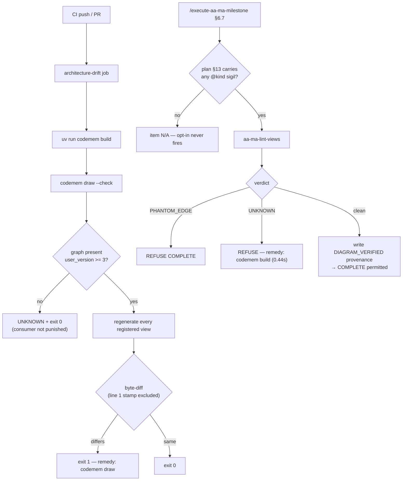

# diagram-generation Plan

**Objective:** Derive architecture diagrams from code for two consumers — the forge's own CI-checked `docs/architecture/` living doc, and any plugin-built project via one core in codemem exposed through three doors.
**Owner:** Stephen J Newhouse + AI
**Created:** 2026-09-22
**Last Updated:** 2026-09-22
**Source map:** `diagram-generation-map.md` (19/19 tickets RESOLVED, fog empty, guard clear)
**Diagram-Waiver:** none

---

## 0. Repository and Setup

**Repository:** `aa-ma-forge` — a Claude Code plugin framework.
**Root:** `/home/sjnewhouse/projects/github_private/aa-ma-forge` (all paths in this
plan are relative to it). Branch `main`; plan authored at `d4d657f`.
**Layout:** a `uv` workspace. `src/aa_ma/` is the `aa-ma` package;
`packages/codemem-mcp/` is a workspace MEMBER (`pyproject.toml:56`) whose code lives
at `packages/codemem-mcp/src/codemem/` but whose **tests live at `tests/codemem/`**,
not beside it.

```bash
uv sync                 # install, incl. the codemem-mcp workspace member
uv run pytest           # default suite (perf + slow markers excluded)
uv run ruff check src/
uv run lint-imports      # import-linter; NOT currently wired into CI (M2 adds it)
sudo apt-get install -y bats     # required by M11
# M12 additionally needs node (present locally; absent from CI until M12 adds it)
```

Prerequisites by milestone: M11 needs `bats` + `shellcheck`; M12 needs `node`;
M9 and M13 need a clone of `medical-research-skills` to measure against.

---

## 1. Executive Summary

codemem gains file-level `import` edges (schema v3) and a `codemem draw` emitter producing layered mermaid views; `aa_ma.render` reads that graph through a stdlib-`sqlite3` seam to verify hand-authored §13 edges (`PHANTOM_EDGE`) without ever importing codemem. The output lands as a 100%-generated `docs/architecture/` living doc guarded by a CI drift job, an interactive explorer, and three consumer doors (MCP tool, CLI, `understand-codebase` Deep tier).

---

## 2. Engineering Standards Declaration (element #12)

All six themes from `claude-code/rules/engineering-standards.md` materially apply.

| Theme | Rationale |
|---|---|
| **1. Verification & Truth** | Every band, count and cost in this plan was measured on running code during charting (0.44s index, 1185 call edges, 163 surface edges, 312 `Dependencies:` values), never inferred. M6, M10, M11 and M12 carry `Critical-Path: hook-modification`; **§2a is the single source for every `Critical-Path` / `Prototype-Required` /
`Audit-Profile` / `TDD-Waiver` assignment** — this declaration deliberately does NOT
restate the list. An earlier revision did, and it desynchronised within one editing
session when M2 and M7 gained `hook-modification`: exactly the decay Theme 1 exists
to prevent, and a Theme 4 doc-drift violation at the same time. |
| **2. Development Principles** | TDD on every parser, emitter, resolver and lint check. KISS drives the `--check` view registry over a hardcoded path list. DRY forbids duplicating `MERMAID_VERSION` into codemem — the explorer reuses `html.py`'s constant. SOC keeps the emitter in codemem and the verifier in `aa_ma`. |
| **3. Reasoning & Planning** | 15 grill rounds and 4 research dispatches are already recorded on the map; this plan re-derives none of them. `Skill(impact-analysis)` is mandatory before any step touching `mermaid_lint.py` or `grammar.py` (CLAUDE.md). |
| **4. Safety & Continuity** | Non-breaking constraint binds hardest on the **shared writer path**: M1's
`apply_schema()` downgrade guard changes a function EVERY writer calls
(`indexer.py:387`, `incremental.py:204`, `journal/wal.py:281`), which is where
`Skill(impact-analysis)` must be pointed — not merely at the v2-reader case. Second
is `mermaid_lint.py`, which gains its first edge parser without changing existing
exit codes. L-020 (audience-first) shaped the layered zoom design; L-019
(`shellcheck -S info`) and L-018 (no `--amend` after writing a hash) bind at every commit. |
| **5. Execution Checklist** | 14 milestones across many sessions makes per-sub-step `Result Log` evidence load-bearing (L-080–L-082). Two HARD release gates. |
| **6. Sync & Commit Discipline** | Every sub-step writes `Status: COMPLETE` + `Result Log:` immediately; never batched to milestone end. All commits carry the `[AA-MA Plan] diagram-generation` footer. |

---

## 2a. Gate Field Transcription — MANDATORY

**The gate reads `tasks.md`, never `plan.md`.** `aa-ma-gate` takes one positional
argument, `tasks_md` (`src/aa_ma/gate.py:462`), and `enforce.read_enforced_field`
pulls `Audit-Profile:`, `Critical-Path:` and `Prototype-Required:` from `tasks.md`
milestone and sub-step blocks (`gate.py:230,235,286,291`). Milestone-level fields
ARE honoured independently of sub-steps: `_own_text()` (`gate.py:205-209`) scopes to
the text before the first `###`, and `gate.py:428` ORs milestone-level with the
sub-step roll-up.

This plan declares those fields inside `plan.md` `#### Contract` blocks, which the
gate cannot see. **Every field below MUST also be written onto the matching
milestone in `diagram-generation-tasks.md`** or the HARD check it controls silently
never fires — the failure mode is a green gate, not an error.

| Milestone | `Audit-Profile` | `Critical-Path` | `Prototype-Required` | `TDD-Waiver` |
|---|---|---|---|---|
| M1  | code-only | data-xform       | — | — |
| M2  | code-only | hook-modification| — | — |
| M3  | code-only | —                | — | — |
| M4  | code-only | —                | — | — |
| M5  | code-only | —                | — | — |
| M6  | full      | hook-modification| — | — |
| M7  | code-only | hook-modification| — | — |
| M8  | code-only | —                | — | — |
| M9  | code-only | —                | YES | — |
| M10 | full      | hook-modification| — | — |
| M11 | full      | hook-modification| — | — |
| M12 | full      | hook-modification| YES | — |
| M13 | code-only | hook-modification| YES | — |
| M14 | docs-only | —                | — | docs-only |

Never write a field with an empty value — the gate refuses it (exit 2).

---

## 3. Dependencies and Assumptions (element #8)

**Dependencies**
- `codemem` schema at `MIGRATIONS` v2 today; this plan introduces v3. `.codemem/index.db` is gitignored; CI's `codemem-smoke` job already runs `uv run codemem build` (0.44s at HEAD).
- `aa_ma` must gain **no new runtime dependency** (ADR-0010 driver). Graph access is stdlib `sqlite3` only.
- mermaid pinned at **11.17.2** (`html.py`); `maxEdges` default 500, `maxTextSize` 50000.
- `ast-grep` 0.42.1 for the M9 sink catalogue; 9 languages parsed, v1 scope is Python + TS/TSX/JS + Go.
- Node is **not** present in `.github/workflows/security.yml` today (5 jobs: shellcheck, bandit, ruff, bats, codemem-smoke). M12 adds it.
- `medical-research-skills` (2452 Py/TS/JS/Go files, 16× this repo) is the measurement target for M9 and M13.

**Assumptions**
- A1 — codemem's `file_edges` table can be added without disturbing the 5 symbol-count tests or PageRank, because existing tools filter `kind='call'`. *(Validated in Ticket 1 research; re-verify at M1.)*
- A2 — `.importlinter` accepts `aa-ma-never-imports-codemem` as a `forbidden` contract. *(Verified empirically during charting: 4 kept, 0 broken.)*
- A3 — `securityLevel: 'strict'` remains correct for the explorer. *(Verified: `demo.html:164` sets it.)* **The delegated DOM listener against mermaid's SVG node-id scheme is NOT validated.** Charting recorded it as prototype-proven; re-checked 2026-09-22 and that is false — `demo.html` contains zero `addEventListener`, zero `.closest(`, and no SVG node handling. Its only three handlers are `b.onclick` on control-panel buttons (`:158-160`). The prototype settled scoping arms and readability bands, never drill-down. **M12 therefore carries `Prototype-Required: YES`.**
- A4 — Regex extraction of the plugin surface holds at 163 edges / 52 of 59 nodes with zero false positives after the on-disk filter. *(Measured in Ticket 4; re-verify at M4 — invalidated by any skill/command/agent rename.)*
- A5 — Almost every `Dependencies:` reference resolves in-file; exactly two do not. *(Re-measured 2026-09-22: **312** values across `.claude/dev/**/*tasks.md` + `examples/`, of which **53** are `None` and 259 carry references. A value may hold several references — "Steps 5.1, 5.2, 5.4" is three — which is how Ticket 16 counted 278 references. Its "59 `None`" no longer matches; use 53. Ticket 7's "383 values" is a **different corpus**, not a contradiction: it counted beyond `tasks.md`, and the whole-repo figure today is ~395.)*

---

## 4. Stepwise Implementation Plan (elements #2 and #4)

Every milestone is `Gate: HARD` (each either changes a shipped surface, a schema, or
a release). `Mode:` per sub-step: **AFK** = auto-dispatchable from the spec here;
**HITL** = needs a human decision, a prototype verdict, or a release approval.
TDD ordering is explicit: a `[test]` step always precedes its `[impl]` step.

**M1 — file_edges** · Gate: HARD
- 1.1 [test] AFK — v3 migration + downgrade-guard tests, RED (`tests/codemem/test_schema_v2.py` v3 sibling; new `test_file_edges.py`)
- 1.2 [impl] AFK — `_MIGRATION_V3_FILE_EDGES` + `CURRENT_SCHEMA_VERSION` 3 (`db.py:41,104`)
- 1.3 [impl] AFK — `apply_schema()` version guard so it honours its own docstring (`db.py:156-162`)
- 1.4 [test] AFK — dotted-callee + asname fixtures, RED (2 assertions flip in `test_resolver.py`)
- 1.5 [impl] AFK — `ast.unparse` callee + `import_aliases` map (`python_ast.py:113-120,370-377`)
- 1.6 [impl] AFK — persist import edges in `resolver.py:131-134`; invalidate in `incremental.py`
- 1.7 [verify] HITL — `CRITICAL_PATH_REVIEW` (data-xform) + full codemem suite green

**M2 — sqlite seam** · Gate: HARD
- 2.1 [test] AFK — `test_graph.py` with stdlib-sqlite3-built v2/v3/missing/stale fixtures, RED
- 2.2 [impl] AFK — `render/graph.py`: `open_graph`, `import_edges`, `call_edges`
- 2.3 [impl] AFK — `.importlinter` contract + `uv run lint-imports` CI step
- 2.4 [docs] HITL — ADR-0014

**M3 — emitter L0-L3** · Gate: HARD
- 3.1 [test] AFK — `draw-node-ids.json` fixture + `test_draw_cut.py`, RED
- 3.2 [impl] AFK — `draw/cut.py`: `node_id`, collapse, `cut()`
- 3.3 [test] AFK — `test_draw_mermaid.py` incl. label escaping for `( ) -`, RED
- 3.4 [impl] AFK — `draw/mermaid.py` + `codemem draw` subcommand (`cli.py:269-309`)

**M4 — plugin surface** · Gate: HARD
- 4.1 [measure] AFK — re-measure the surface; identify the 42nd `Skill()` target
- 4.2 [test] AFK — generate `tests/golden/plugin-surface.json`; rename-behaviour test, RED
- 4.3 [impl] AFK — `draw/plugin_surface.py` + `draw/surface_allowlist.py`

**M5 — captions** · Gate: HARD
- 5.1 [test] AFK — `test_captions.py` incl. ORPHAN vs UNKNOWN, RED
- 5.2 [impl] AFK — `draw/captions.py` + authored `docs/architecture.captions.json`

**M6 — living doc + CI + release v0.15.0** · Gate: HARD
- 6.1 [test] AFK — `test_draw_check.py`: line-slice compare, stamp regex, caption-only diff, RED
- 6.2 [impl] AFK — `draw/views.py` registry + `codemem draw --check`
- 6.3 [impl] AFK — generate `docs/architecture/{README,component,plugin-surface}.md`
- 6.4 [impl] HITL — `architecture-drift` job in `security.yml` (Critical-Path)
- 6.5 [verify] HITL — CI green at this commit; `CRITICAL_PATH_REVIEW`
- 6.6 [docs] HITL — ADR-0016
- 6.7 [release] HITL — `scripts/release.sh minor --dry-run`, then cut v0.15.0

**M7 — Dependencies grammar** · Gate: HARD
- 7.1 [test] AFK — `deps-hazards.md` (`M1.0`, `M2a.1`, `2a`, cross-plan) + naive mutant, RED
- 7.2 [impl] AFK — `deps.py` parser/resolver + `CANONICAL_DEPENDENCY_RE` in `grammar.py`
- 7.3 [impl] AFK — `.importlinter` gains `aa_ma.deps`; `test_leaf_contract.py` green
- 7.4 [impl] AFK — Milestone graph into §13; scribe + template spelling
- 7.5 [verify] AFK — `aa-ma-gate` output byte-identical to the pre-M7 golden

**M8 — PHANTOM_EDGE** · Gate: HARD
- 8.1 [analysis] AFK — `Skill(impact-analysis)` on `mermaid_lint.py`; golden current `lint_text` output
- 8.2 [test] AFK — `sigil-edges.md` fixture: clean/phantom/LABEL_UNKNOWN/unlabelled/UNKNOWN, RED
- 8.3 [impl] AFK — edge parser + `PHANTOM_EDGE` tier
- 8.4 [verify] AFK — glob every completed `*-plan.md`: zero findings on sigil-free files

**M9 — I/O view** · Gate: HARD · Prototype-Required: YES
- 9.1 [prototype] HITL — `Skill(prototype)` on this repo + `medical-research-skills`; `PROTOTYPE` provenance
- 9.2 [test] AFK — per-language sink fixtures (Py/TS/TSX/JS/Go), RED
- 9.3 [impl] AFK — `ast_grep.py` wrapper + 4 rule YAMLs + `draw/sinks.yaml`
- 9.4 [impl] AFK — `draw/io_sinks.py`, register `io` view, `IO_DENSE_BAND` line

**M10 — §13 seeding + Angle 6** · Gate: HARD
- 10.1 [test] AFK — `seeded-plan.md` fixture + `test_angle6_coverage.py`, RED
- 10.2 [impl] HITL — Phase 4 seeding in `aa-ma-plan.md` (Critical-Path)
- 10.3 [impl] HITL — Angle 6 **check 8**, appended, never renumbered
- 10.4 [verify] HITL — `test_plan_verification_angle6.py` + `test_planning_standard_count.py` green

**M11 — §6.7 HARD item** · Gate: HARD
- 11.1 [test] AFK — `test_diagram_verified.bats` against `aa-ma-lint-views`, RED
- 11.2 [verify] AFK — capture pre-edit §6.7 awk extraction output
- 11.3 [impl] HITL — checklist row + fence **after** the existing gate fence (Critical-Path)
- 11.4 [verify] HITL — 58 bats tests green; extraction output unchanged; `CRITICAL_PATH_REVIEW`
- 11.5 [docs] HITL — ADR-0015

**M12 — Explorer + Node CI** · Gate: HARD · Prototype-Required: YES
- 12.1 [prototype] HITL — delegated listener against real mermaid SVG; `PROTOTYPE` provenance
- 12.2 [test] AFK — `explorer_contract.test.mjs` + `test_explorer_fixture.py` on the shared fixture, RED
- 12.3 [impl] AFK — `render/explorer.py` + `explorer.js` + `--explorer` flag
- 12.4 [impl] HITL — node job in `security.yml` (Critical-Path)
- 12.5 [verify] HITL — manual browser drill observation; `CRITICAL_PATH_REVIEW`

**M13 — MCP tool + rewire** · Gate: HARD · Prototype-Required: YES
- 13.1 [prototype] HITL — measure L0-L3 on `medical-research-skills`; `PROTOTYPE` provenance
- 13.2 [test] AFK — `test_mcp_diagram.py` + update tool-count pins 12 -> 13, RED
- 13.3 [impl] AFK — `diagram()` + registration in `claude-code/codemem/mcp/server.py`
- 13.4 [impl] AFK — Deep tier rewire; `.gitignore` append; PROJECT_INDEX repoint
- 13.5 [verify] AFK — frontmatter inventory + xref tests green (no files added/removed)

**M14 — docs + release v0.16.0** · Gate: HARD · TDD-Waiver: docs-only
- 14.1 [docs] HITL — CONTEXT.md: 7 glossary terms
- 14.2 [docs] AFK — spec §XI body (no renumbering), quick-ref, foundations
- 14.3 [docs] AFK — hardcoded counts in the 5 files CLAUDE.md names; `Skill(doc-drift-detection)` clean
- 14.4 [release] HITL — dry-run, then cut v0.16.0

---

## 13. Architecture View

### Component view

Edges carrying an `@kind` sigil are checkable claims (M8 makes them so); `(new)` endpoints read `UNKNOWN: endpoint planned` until the file lands.

```mermaid
graph TD
    subgraph codemem["codemem — the graph and the emitter"]
        PY["packages/codemem-mcp/src/codemem/parser/python_ast.py"]
        RES["packages/codemem-mcp/src/codemem/resolver.py"]
        SQL["packages/codemem-mcp/src/codemem/storage/schema.sql"]
        DB["packages/codemem-mcp/src/codemem/storage/db.py"]
        CCLI["packages/codemem-mcp/src/codemem/cli.py"]
        MCP["packages/codemem-mcp/src/codemem/mcp_tools/__init__.py"]
        CUT["packages/codemem-mcp/src/codemem/draw/cut.py (new)"]
        MM["packages/codemem-mcp/src/codemem/draw/mermaid.py (new)"]
        REG["packages/codemem-mcp/src/codemem/draw/views.py (new)"]
        PS["packages/codemem-mcp/src/codemem/draw/plugin_surface.py (new)"]
        IOS["packages/codemem-mcp/src/codemem/draw/io_sinks.py (new)"]
        CAP["packages/codemem-mcp/src/codemem/draw/captions.py (new)"]
        SINKS["packages/codemem-mcp/src/codemem/draw/sinks.yaml (new)"]
        DINIT["packages/codemem-mcp/src/codemem/draw/__init__.py (new)"]
        SALLOW["packages/codemem-mcp/src/codemem/draw/surface_allowlist.py (new)"]
        INCR["packages/codemem-mcp/src/codemem/incremental.py"]
        ASTG["packages/codemem-mcp/src/codemem/parser/ast_grep.py"]
        PRULES["packages/codemem-mcp/src/codemem/parser/rules/"]
    end

    subgraph aa_ma["aa_ma — the verifier, never imports codemem"]
        GR["src/aa_ma/grammar.py"]
        DEPS["src/aa_ma/deps.py (new)"]
        ML["src/aa_ma/render/mermaid_lint.py"]
        HTML["src/aa_ma/render/html.py"]
        RCLI["src/aa_ma/render/cli.py"]
        GRAPH["src/aa_ma/render/graph.py (new)"]
        EXP["src/aa_ma/render/explorer.py (new)"]
        EXPJS["src/aa_ma/render/explorer.js (new)"]
        COV["src/aa_ma/render/coverage.py"]
    end

    subgraph surface["shipped surface + CI"]
        PLAN["claude-code/commands/aa-ma-plan.md"]
        EXEC["claude-code/commands/execute-aa-ma-milestone.md"]
        PV["claude-code/skills/plan-verification/SKILL.md"]
        UC["claude-code/skills/understand-codebase/"]
        AGENTS["claude-code/agents/"]
        ESTD["claude-code/rules/engineering-standards.md"]
        AARULE["claude-code/rules/aa-ma.md"]
        IA["claude-code/skills/impact-analysis/SKILL.md"]
        SM["claude-code/skills/system-mapping/SKILL.md"]
        SRV["claude-code/codemem/mcp/server.py"]
        ILINT[".importlinter"]
        YML[".github/workflows/security.yml"]
        MIOB["scripts/measure_io_band.sh"]
        REGEN["scripts/regen-generated.sh"]
    end

    DOCS["docs/architecture/component.md (new)"]
    CAPJSON["docs/architecture.captions.json (new)"]

    PY -->|feeds| RES
    DB -->|"@import"| SQL
    CUT -->|"@import"| DB
    MM -->|"@import"| CUT
    REG -->|"@import"| MM
    PS -->|"@import"| MM
    IOS -->|"@import"| SINKS
    CAP -->|"@import"| REG
    CCLI -->|"@import"| REG
    MCP -->|"@import"| CUT
    REG -->|generates| DOCS
    CAP -->|reads| CAPJSON

    GRAPH -->|sqlite3 seam, never an import| DB
    ML -->|"@import"| GRAPH
    EXP -->|"@import"| GRAPH
    EXP -->|"@import"| HTML
    RCLI -->|"@import"| EXP
    DEPS -->|"@import"| GR
    ML -->|"@import"| DEPS

    PLAN -->|seeds section 13 via| CCLI
    PV -->|Angle 6 coverage rule| PLAN
    PV -->|check 8 runs --coverage| RCLI
    AARULE -->|grandfathers checks 6-8| PV
    RCLI -->|"@import"| COV
    COV -->|"@import"| ML
    MIOB -->|git archive, then build + band| CCLI
    REGEN -->|build, draw --write, draw --check| CCLI
    EXEC -->|section 6.7 HARD item| RCLI
    UC -->|Deep tier runs| CCLI
    YML -->|architecture-drift job| CCLI
    YML -->|node contract test| EXP
    YML -->|lint-imports step| ILINT
    ILINT -->|forbids aa_ma to codemem| GRAPH
    DINIT -->|"@import"| CUT
    PS -->|"@import"| SALLOW
    INCR -->|"@import"| DB
    ASTG -->|"@import"| PRULES
    IOS -->|"@import"| ASTG
    SRV -->|"@import"| MCP
    EXP -->|emits| EXPJS
    EXEC -->|section 6.7 row| ESTD
    UC -->|reuses| IA
    UC -->|reuses| SM
    UC -->|dispatches| AGENTS
    AGENTS -->|scribe writes Dependencies| DEPS
```



### Flow view

`Critical-Path: hook-modification` — two enforcement paths change the shipped surface.

Two enforcement paths change the shipped surface. Both must fail closed.



---

## 5. Milestones

Complexity ≥ 80% flagged for deep reasoning: **M9**, **M12**.

### Milestone 1 — codemem `file_edges` (schema v3) + qualified callees

**Goal:** `file_edges` holds file→file `import` rows for Python, and `dst_unresolved` keeps the dotted callee (`sqlite3.connect`, `self.conn.execute`).

#### Contract
```
Audit-Profile: code-only
Critical-Path: data-xform        # schema migration on a SHARED writer path
Complexity: 70%
Effort: 2 days
Files:
  Modify  packages/codemem-mcp/src/codemem/storage/db.py          # + _MIGRATION_V3_FILE_EDGES
                                                                  # + CURRENT_SCHEMA_VERSION 2 -> 3
                                                                  # + apply_schema() version guard
                                                                  # + correct migrate() docstring
                                                                  #   (:179-181 claims DDL rollback
                                                                  #    that does not happen)
  Test    tests/codemem/test_schema.py             # + v3 case
  Test    tests/codemem/test_schema_v2.py          # + v3 sibling for test_migrate_bumps_to_v2
  Modify  packages/codemem-mcp/src/codemem/parser/python_ast.py   # keep dotted callee; asname map
  Modify  packages/codemem-mcp/src/codemem/resolver.py            # persist imports (was transient)
  Modify  packages/codemem-mcp/src/codemem/incremental.py         # explicit DELETE before re-insert
                                                                  # CASCADE does NOT cover edit-in-place
  Test    tests/codemem/test_file_edges.py (new)
  Test    tests/codemem/test_resolver.py             # 2 assertions flip

Schema — DO NOT EDIT schema.sql. Line 17 is `PRAGMA user_version = 1;` and stays
that way; it is pinned at v1 forever; every later version
arrives ONLY through `db.MIGRATIONS`. Three tests enforce this, and putting either
statement below into schema.sql fails all three:
  tests/codemem/test_schema_v2.py:57  "apply_schema alone must leave user_version=1"
  tests/codemem/test_schema_v2.py:62  migrate() must advance user_version to 2
  tests/codemem/test_schema_v2.py     post-v1 tables absent before migrate()
Add instead, in db.py:  _MIGRATION_V3_FILE_EDGES = """..."""
                        MIGRATIONS = [(2, _MIGRATION_V2_GIT_MINING),
                                      (3, _MIGRATION_V3_FILE_EDGES)]   # db.py:104
                        CURRENT_SCHEMA_VERSION = 3                      # db.py:41
`migrate()` issues the `PRAGMA user_version` bump itself (db.py:186) — the migration
SQL must NOT contain one.

  CREATE TABLE IF NOT EXISTS file_edges (
      src_file_id    INTEGER NOT NULL REFERENCES files(id) ON DELETE CASCADE,
      dst_file_id    INTEGER          REFERENCES files(id) ON DELETE CASCADE,
      dst_unresolved TEXT,
      kind           TEXT    NOT NULL,   -- no single-value CHECK: SQLite cannot ALTER
                                          -- a CHECK, so `IN ('import')` would be a
                                          -- one-way door (M9 may add sink edges) and
                                          -- widening it needs a table rebuild
      line           INTEGER,
      CHECK (dst_file_id IS NOT NULL OR dst_unresolved IS NOT NULL)
  );
  -- NO composite PRIMARY KEY. See the de-duplication note below.
  CREATE UNIQUE INDEX IF NOT EXISTS file_edges_resolved
      ON file_edges(src_file_id, kind, dst_file_id)    WHERE dst_file_id    IS NOT NULL;
  CREATE UNIQUE INDEX IF NOT EXISTS file_edges_unresolved
      ON file_edges(src_file_id, kind, dst_unresolved) WHERE dst_unresolved IS NOT NULL;
  CREATE INDEX IF NOT EXISTS file_edges_dst
      ON file_edges(dst_file_id, kind, src_file_id);   -- reverse traversal
  CREATE INDEX IF NOT EXISTS file_edges_src
      ON file_edges(src_file_id, kind, dst_file_id);   -- forward traversal
  -- Column order mirrors the v1 precedent (schema.sql:74-75 idx_edges_dst /
  -- idx_edges_src), which exists because who_calls/blast_radius traverse dst->src.
  -- M3's cut(direction="up"|"both") and --scope do the same over file_edges.

DE-DUPLICATION — do NOT copy the v1 `edges` shape. MEASURED on the live index
2026-09-22, this bug is in production right now:
      total edges 6516 / distinct 3258   (exactly 2x)
      rows with BOTH dst columns non-null: 0
`edges` (schema.sql:62-69) declares `PRIMARY KEY(src_symbol_id, kind,
dst_symbol_id, dst_unresolved)`, but SQLite treats NULLs as DISTINCT in the
implicit unique index and does not enforce NOT NULL on PK columns of a rowid
table. The two `dst` columns are mutually exclusive by design, so EVERY row
carries a NULL in the key and the index never matches — `INSERT OR IGNORE`
(`resolver.py:159`, `indexer.py:310`, `journal/wal.py:447`) de-duplicates
nothing. Two partial unique indexes fix it, because each indexes only the rows
where its column is non-NULL.

`IF NOT EXISTS` is mandatory, not stylistic: `db.py:45-46` requires migration
scripts to be idempotent-safe, and `migrate()`'s `with conn:` does NOT roll back
DDL — `executescript` commits first, so a crash mid-migration leaves the table
behind and the retry must tolerate it. (The `migrate()` docstring at db.py:179-181
claims full rollback; that is false for DDL. Pre-existing — do not lean on it.)

Invariants:
  - A v2 database opened by v3 code migrates forward.
  - **A v3 database opened by v2-era code TODAY SILENTLY DOWNGRADES to v2.**
    REPRODUCED 2026-09-22, not theorised:
        simulated post-M1 user_version: 3
        CURRENT_SCHEMA_VERSION in this build: 2
        ensure_schema() returned: 2
        user_version AFTER v2 code opened v3 DB: 2
        file_edges survives: True
    Mechanism: `ensure_schema()` (db.py:208-209) — which EVERY writer calls
    (`indexer.py:387`, `incremental.py:204`, `journal/wal.py:281`) — runs
    `apply_schema()` FIRST, and that `executescript`s schema.sql including its
    line 17 `PRAGMA user_version = 1;`. `migrate()` then walks back to 2.
    `migrate()` alone on a v3 DB does correctly return 3 — it simply is not the
    production path. Consequence: M2's `open_graph()` asserts `user_version >= 3`,
    so after any older tool touches the DB the seam reports SCHEMA_TOO_OLD while
    `file_edges` sits there fully populated — a confusing false degradation.
  - THEREFORE M1 must also make `apply_schema()` honour its OWN docstring
    (db.py:156-162 already promises "Does NOT overwrite a DB with a higher
    user_version"; the body does not implement it). Capture the pre-existing
    `user_version` and restore it when it exceeds what the script set. ~4 lines.
    This touches a shared writer path — hence `Critical-Path: data-xform`.
  - Test BOTH directions explicitly; do not infer either from the other.
  - `edges` rows remain kind='call' only; symbol counts and PageRank unchanged.
```

**Acceptance criteria**
1. `PRAGMA user_version` reads 3 after `codemem build` on a fresh index, AND
   `apply_schema()` alone still leaves a fresh DB at **1** (the existing invariant
   must survive — `tests/codemem/test_schema_v2.py:57`).
2. `SELECT count(*) FROM file_edges WHERE kind='import'` > 0 on this repo.
3. In the **`edges`** table (NOT `file_edges` — an import is not a call), at least one row has a dotted `dst_unresolved`.
   Pin the exact expected values on a fixture, not "e.g.":
     `import sqlite3; sqlite3.connect(x)`        -> `sqlite3.connect`
     `import numpy as np; np.array(x)`           -> `numpy.array`    (asname resolved)
     `self.conn.execute(q)`                      -> `self.conn.execute`
   **Chain depth: keep the full dotted chain, including a `self.` receiver.** Today
   `python_ast.py:370-377` emits the bare `func.attr` and drops `self.conn.execute`
   entirely. Use `ast.unparse(node.func)`.
   **asname map shape:** `dict[str, str]` mapping local binding -> canonical module,
   built from `alias.asname or alias.name`; `python_ast.py:117` currently appends
   `alias.name` and discards `asname`. Add it to `ParseResult` as
   `import_aliases: dict[str, str]`.
4. Existing symbol-count tests and PageRank tests pass unchanged.
5. Idempotency asserted on the **incremental** path, via `refresh_index` — NOT via
   `codemem build`. Compare row SETs, not counts (`sorted(before) == sorted(after)`).
   **Why this distinction decides the test's value:** `build` already `DELETE`s the
   `files` rows first (`indexer.py:402`), so it passes trivially and never exercises
   the failing path. Edit-in-place is the dominant real path and the `files` row
   SURVIVES it (`incremental.py:206-215` UPDATEs `path` on a move; `_apply_file_delta`
   at `:388-430` UPDATEs/DELETEs individual symbols), so `ON DELETE CASCADE` never
   fires and `file_edges` accumulates stale rows. The fix is an explicit
   `DELETE FROM file_edges WHERE src_file_id = ?` before re-insert.
5b. Editing one file twice leaves exactly the edges of its current content — assert
   the set shrinks when an import is removed, not merely that it changed.
6. **Downgrade guard:** build a v3 DB, then call `ensure_schema()` from code whose
   `CURRENT_SCHEMA_VERSION` is 2; `PRAGMA user_version` still reads 3 afterwards and
   `file_edges` is intact. Without the `apply_schema()` guard this test fails —
   reproduced on HEAD, it currently yields 2.
7. `PRAGMA foreign_keys` is ON (`db.py:122`), so `ON DELETE CASCADE` is effective:
   deleting a `files` row removes its `file_edges` rows. Assert it rather than assume it.
8. A `CRITICAL_PATH_REVIEW` entry for `data-xform` is in `provenance.log` before COMPLETE.

**Tests:** `uv run pytest tests/codemem/test_file_edges.py -v`; full suite `uv run pytest` exit 0.

**Risks**
| Risk | Mitigation |
|---|---|
| Migration corrupts an existing dev index | v3 is an additive `CREATE TABLE IF NOT EXISTS`; the index is gitignored and rebuildable in 0.44s. Test migrate-from-v2 explicitly. |
| The `apply_schema()` guard changes a path every writer calls | Smallest possible change: restore a higher pre-existing `user_version`, touch nothing else. Full codemem suite before/after; `indexer`, `incremental` and `journal/wal` each exercised. |
| `CURRENT_SCHEMA_VERSION` 2->3 invalidates a pending WAL journal | Replay refuses when `prev_user_version != current` (`docs/codemem/ARCHITECTURE.md:137,184`). Tests track the constant so nothing reds, but a dev with a pending journal silently loses replay — call it out in the milestone's Result Log. |
| Dotted callee change flips resolver behaviour beyond the 2 known assertions | Run the full codemem suite before and after; diff the failure set. |
| Stale `file_edges` after a file is EDITED (not deleted) | The dominant path. CASCADE does not help — the `files` row survives an edit. Explicit `DELETE ... WHERE src_file_id = ?` before re-insert, asserted through `refresh_index`. |
| Duplicate rows, silently, exactly as `edges` does today | Partial unique indexes instead of a NULL-bearing composite PK. Regression test inserts the same edge 3x and asserts 1 row. |

**Rollback:** revert the commit; `.codemem/` is gitignored, so `codemem build` restores a v2-shaped index from unchanged source.

---

### Milestone 2 — `aa_ma.render.graph` sqlite seam + import contract + ADR-0014

**Goal:** `aa_ma` reads the graph without importing codemem, and the coupling is pinned so it cannot later be "simplified" into an import.

#### Contract
```
Audit-Profile: code-only
Critical-Path: hook-modification   # edits .github/workflows/security.yml (the charting
                                   # map's standing constraint treats CI edits as this)
Complexity: 55%
Effort: 1 day
Files:
  Create  src/aa_ma/render/graph.py
  Modify  .importlinter                       # + aa-ma-never-imports-codemem
  Modify  .github/workflows/security.yml      # + `uv run lint-imports` step
  Create  docs/adr/0014-derived-architecture-views.md
  Modify  docs/adr/INDEX.md
  Test    tests/render/test_graph.py (new)

API:
  class GraphStatus(StrEnum): OK, MISSING, SCHEMA_TOO_OLD, STALE
  @dataclass(frozen=True)
  class GraphHandle:
      status: GraphStatus
      reason: str | None          # human-readable, names the remedy
      conn: sqlite3.Connection | None
  def open_graph(repo_root: Path) -> GraphHandle
  def import_edges(h: GraphHandle) -> set[tuple[str, str]]     # (src_path, dst_path)
  def call_edges(h: GraphHandle) -> set[tuple[str, str]]       # projected symbol->file

  BOTH readers MUST use `SELECT DISTINCT`. The v1 `edges` table carries exact
  duplicates in production — measured 2026-09-22: 6516 rows, 3258 distinct, every
  row NULL in one PK column so `INSERT OR IGNORE` never fires (see M1). Returning
  `set[...]` collapses them anyway, but the DISTINCT is explicit so a later change
  to `list[...]` cannot silently double every `@call` edge M8 verifies.
  This plan does NOT repair `edges` itself: a data migration over a rebuildable,
  gitignored index is not worth the risk, and reading DISTINCT is correct and free.
  Record the underlying defect for a separate effort.

Contract (.importlinter):
  [importlinter:contract:aa-ma-never-imports-codemem]
  name = "aa_ma never imports codemem"
  type = forbidden
  source_modules = aa_ma
  forbidden_modules = codemem

Invariants:
  - Opens read-only (`file:...?mode=ro`), asserts PRAGMA user_version >= 3.
  - Staleness = any files.mtime older than the on-disk mtime of that path.
  - NEVER raises to the caller; every failure becomes a GraphStatus + reason.
```

**Acceptance criteria**
1. `open_graph()` on a repo with no `.codemem/` returns `MISSING` with a reason naming `codemem build`.
2. On a `user_version = 2` database returns `SCHEMA_TOO_OLD`.
3. After touching a source file without reindexing, returns `STALE`.
4. `uv run lint-imports` exits 0 and its output contains the line `aa_ma never imports codemem` followed by `KEPT`, and `0 broken`. (Assert the **named** contract, never the total: HEAD has 3 contracts — `codemem-layers`, `parser-is-pure`, `render-is-leaf` — so this milestone makes it 4, and any unrelated future contract would break a total-based assertion.)
5. `grep -rn "import codemem\|from codemem" src/aa_ma/` returns nothing.
   (Weak on its own — it also matches a docstring; criterion 4 is the real enforcement.)
6. `lint-imports` runs **in CI**. Measured 2026-09-22: it appears **zero** times in
   `.github/workflows/*.yml`, so without this step the new contract is local-only and
   a violation merges green. Add it to a job that already runs `uv sync`.
7. Verified empirically 2026-09-22 that `type = forbidden` DOES accept
   `source_modules = aa_ma` here: appending the exact stanza gave
   `Contracts: 4 kept, 0 broken`. `.importlinter:50-52`'s "shared descendants"
   caveat applies only when source and forbidden share a root package
   (`aa_ma.*` -> `aa_ma.render`); `aa_ma` and `codemem` do not.

**Tests:** `uv run pytest tests/render/test_graph.py -v` with fixture DBs at v2 and v3;
`uv run lint-imports`. **Fixture DBs MUST be built with stdlib `sqlite3` only** — a
fixture that imports codemem to build its own test data would make the test suite
violate the very contract this milestone adds. `tests/render/conftest.py` has no DB
fixtures today, so this is new and easy to get wrong.

**Risks**
| Risk | Mitigation |
|---|---|
| Read-only URI opening differs across SQLite builds | Test on the CI Python and locally; fall back to `MISSING` with a reason rather than raising. |
| Staleness check is O(files) on every lint invocation | Cache the `files` table read once per `GraphHandle`; measure on the 2452-file repo at M13. |
| ADR-0014 duplicates ADR-0010 | ADR-0014 supersedes nothing; it extends ADR-0010's "markdown source" model with a graph source. State the relationship explicitly. |

**Rollback:** delete `graph.py` and the contract stanza; nothing consumes it until M3.

---

### Milestone 3 — `codemem draw` emitter, layered cuts L0–L3

**Goal:** One command emits readable mermaid at four zoom levels from the codemem graph.

#### Contract
```
Audit-Profile: code-only
Complexity: 70%
Effort: 2 days
Files:
  Create  packages/codemem-mcp/src/codemem/draw/__init__.py
  Create  packages/codemem-mcp/src/codemem/draw/cut.py
  Create  packages/codemem-mcp/src/codemem/draw/mermaid.py
  Modify  packages/codemem-mcp/src/codemem/cli.py          # + add_parser("draw")
  Test    tests/codemem/test_draw_cut.py (new)
  Test    tests/codemem/test_draw_mermaid.py (new)
  Test    tests/fixtures/draw-node-ids.json (new)          # shared with M12's JS test

API:
  class Level(IntEnum): L0 = 0; L1 = 1; L2 = 2; L3 = 3
  @dataclass(frozen=True)
  class Cut:
      nodes: dict[str, str]              # node_id -> label
      edges: set[tuple[str, str, str]]   # (src_id, dst_id, kind)
      dropped: int
  def cut(conn, level: Level, *, scope: str | None = None, hops: int = 1,
          include_tests: bool = False, direction: str = "both",
          kind: str = "both") -> Cut          # kind added at M3 (Ste, 2026-09-24):
                                              # import|call|both; L3 + import -> ValueError

  `cut()` reads `.codemem/index.db` DIRECTLY — it does NOT go through
  `aa_ma.render.graph`, so it does not inherit that module's DISTINCT. It must
  issue `SELECT DISTINCT` itself. MEASURED 2026-09-22: the `edges` multiplicity
  histogram is `[(2, 3258)]` — EVERY edge stored exactly twice, zero singletons,
  because `build_index` writes the set twice (`_bulk_insert_edges` indexer.py:409,
  then `resolve_cross_file_edges` :410-412) and the NULL-PK defect means
  `INSERT OR IGNORE` never suppresses the second pass. Without DISTINCT here,
  `codemem draw` and M13's MCP `diagram()` both render doubled edges and every
  node/edge count in this plan is 2x wrong.
  def to_mermaid(c: Cut, *, captions: dict[str, str] | None = None) -> str
  def node_id(path: str, level: Level) -> str     # pinned by draw-node-ids.json

CLI:
  codemem draw [--level L0|L1|L2|L3] [--scope PATH] [--hops N]
               [--include-tests] [--direction up|down|both]
  exit 0 ok / 1 no graph / 2 usage

Measured bands (Ticket 3, 175-file repo): L0 4/3, L1 10/9, L2 5/4, L3 18/27.
The "1185 resolved call edges" figure is the DISTINCT count (raw is 2370) — verified
2026-09-22, so it stands. Re-derive any other figure taken from `edges` with
`SELECT DISTINCT` before making it an acceptance criterion.
Readability: <=40 readable, <=120 dense, mermaid maxEdges 500 hard stop.
Invariants:
  - tests/ excluded by default at every level.
  - node_id is a pure function of (path, level) — the ONLY contract M12's JS
    generator must reproduce byte-for-byte.
  - Output is mermaid TEXT only (ADR-0010). Optional SVG/PNG export goes
    through the EXISTING `MMDC_BIN` seam in mermaid_lint.py — no new code,
    no new dependency, no hosted renderer (source leak, Ticket 13).
```

**Acceptance criteria**
1. `codemem draw --level L0` on this repo emits <= 10 edges, and
   `mermaid_lint.render_check([out])` is `PASS` when `MMDC_BIN` resolves to a working
   renderer. **Environment note:** `mmdc` is installed locally but Puppeteer cannot
   launch Chromium here, so `render_check` returns `UNKNOWN` — and per L-012 UNKNOWN
   is never PASS. A test that SKIPS on UNKNOWN is not evidence: either provision a
   browser in the job that asserts this, or assert the structural lint only and record
   the render verdict as a separate observation. Do not conflate the two.
2. `codemem draw --level L2 --scope src/aa_ma/render/ --hops 1` emits 5 nodes / 4 edges (the measured cut).
3. `--include-tests` raises this repo's raw file-level edge count from 27 to 96 (the measured delta).
4. A cut exceeding 500 edges reports `dropped > 0` rather than emitting an unparseable fence.
5. `draw-node-ids.json` round-trips through `node_id()` for every entry.

**Tests:** `uv run pytest tests/codemem/test_draw_*.py -v`; mermaid parse-check via the existing `MMDC_BIN` seam when available, structural lint otherwise.

**Risks**
| Risk | Mitigation |
|---|---|
| Node ids collide after directory collapse | `draw-node-ids.json` fixture asserts uniqueness across all four levels on this repo and on a fixture tree. |
| Emitter re-implements scoping the prototype already solved differently | Port from `prototype/diagram-generation-3` deliberately; record any divergence in `context-log.md`. |
| mermaid label escaping breaks on paths with `(` `)` or `-` | Quote every label; add a fixture path containing each character. |

**Rollback:** the `draw` subcommand is additive; revert `cli.py` and delete `draw/`.

---

### Milestone 4 — Plugin-surface extractor

**Goal:** `claude-code/**/*.md` yields a commands→skills→agents→hooks graph with three-valued reference classification.

#### Contract
```
Audit-Profile: code-only
Complexity: 50%
Effort: 1 day
Files:
  Create  packages/codemem-mcp/src/codemem/draw/plugin_surface.py
  Create  packages/codemem-mcp/src/codemem/draw/surface_allowlist.py
  Test    tests/codemem/test_plugin_surface.py (new)

Consumes: `Cut` and `to_mermaid` from M3 (`draw/cut.py`, `draw/mermaid.py`).
  M4 needs no codemem INDEX — it parses markdown — but it does depend on M3's types.

API:
  class RefClass(StrEnum): ON_DISK, DECLARED_EXTERNAL, DANGLING
  @dataclass(frozen=True)
  class SurfaceEdge:
      src: str; dst: str; kind: str      # skill|command|agent|hook
      ref_class: RefClass
  def extract(repo_root: Path) -> tuple[Cut, list[SurfaceEdge]]

Four syntaxes (Ticket 4, measured):
  Skill(x)  |  /x filtered against commands/*.md  |  subagent_type: x  |  <hook>.sh literal
Node identity: dir/file STEM, never frontmatter `name:` (6/21 SKILL.md open with
  an HTML comment; 1 name: != dirname; 2/13 commands lack name:).
Three allowlists: install.sh hook-event table, external-skill list, self-edge/glob
  suppression. `docs/` is OUT of the graph. `Bash(...)` and `uv run aa-ma-*` dropped.
```

**Acceptance criteria**
1. `extract(root)` equals `tests/golden/plugin-surface.json` — ONE regenerable
   snapshot, no integers inlined in the test. (Charting measured 163 edges / 42 files
   / 52 of 59 nodes as 13 cmd + 21 skill + 12 agent + 11 hook + 2 rule; treat those as
   the expected order of magnitude when first generating the golden, never as
   assertions. Every milestone in this plan changes them.)
2. Zero false positives after the on-disk filter: every edge in the golden resolves to
   an existing node or is explicitly classed `DECLARED_EXTERNAL`.
3. Every distinct `Skill()` target classifies into exactly one of the three classes,
   and the `DANGLING` set is named explicitly in the assertion. **Do not hardcode 41**:
   re-measured 2026-09-22 the count is **42**, while `claude-code/rules/engineering-standards.md:44`
   still pins 41 (17 + 20 + 4) — A4's own decay warning has already fired. Sub-step 1
   re-measures and identifies the 42nd target; M14 reconciles the rule's prose.
4. `set(result.orphans)` equals exactly the named set
   `{aa-ma-search, sole-dev-merge, aa-ma-execution, complexity-router,
     debugging-strategies, write-a-skill, aa-ma-session-end-dirty.sh}`
   and `result.errors == []`. (Enumerated because "the 7 known orphans" is not
   assertable.)
5. Behavioural, not stylistic: in a temp fixture tree, renaming skill `alpha` to
   `beta` changes the edge count by exactly the number of references to `alpha`, and
   `beta` yields zero `DANGLING`. (The earlier wording — "the test asserts the counts
   are derived" — was a claim about test style, which nothing can falsify.)

**Tests:** `uv run pytest tests/codemem/test_plugin_surface.py -v`.

**Risks**
| Risk | Mitigation |
|---|---|
| A4 has decayed since measurement (any rename invalidates it) | Re-measure as sub-step 1 before writing assertions; update the plan's numbers in `context-log.md` if they moved. |
| Counts hardcoded in the test go stale (Tier 6 drift) | Assert *properties* (zero FPs, all four `DANGLING` named) plus one snapshot the test can regenerate. |
| The external-skill allowlist rots as `~/.claude/skills` changes | The allowlist is repo-local and explicit; an unlisted external ref reports `DANGLING` loudly, which is the intended failure. |

**Rollback:** delete both files; nothing consumes them until M6.

---

### Milestone 5 — Captions sidecar

**Goal:** Authored prose reaches both the markdown emitter and the explorer from one file.

#### Contract
```
Audit-Profile: code-only
Complexity: 35%
Effort: 0.5 day
Files:
  Create  packages/codemem-mcp/src/codemem/draw/captions.py
  Create  docs/architecture.captions.json         # authored; OUTSIDE the generated dir
  Test    tests/codemem/test_captions.py (new)

Format (flat, path-keyed):
  { "@start": "src/aa_ma/render/cli.py",
    "src/aa_ma/render/": "Markdown -> HTML and view linting.",
    "packages/codemem-mcp/src/codemem/draw/": "The emitter. Start here." }

API:
  def load(repo_root: Path) -> dict[str, str]
  @dataclass(frozen=True)
  class CaptionFinding:
      path: str
      code: str          # ORPHAN_CAPTION | UNKNOWN
      reason: str
  def orphans(captions: dict[str,str], known_paths: set[str],
              planned_paths: set[str]) -> list[CaptionFinding]
  # `planned_paths` carries the `(new)` set parsed from the plan's section 13.
  # captions.py cannot infer it: `(new)` is section 13 notation, not a filesystem fact.

Invariants:
  - stdlib `json` only (yaml is not an aa-ma dependency).
  - Zoom levels are free: directory keys serve collapsed levels, file keys serve
    file levels. No per-view scoping, no colour or ordering hints.
  - A caption is NEVER auto-deleted by any tool.
  - A caption-only diff is NOT diagram drift (`--check` compares diagram content).
```

**Acceptance criteria**
1. `@start` renders as a `classDef`-highlighted node in the emitted mermaid.
2. A caption keyed to a directory appears at L0/L1; one keyed to a file appears at L2/L3.
3. `orphans()` reports a caption naming a deleted path and reports nothing for a path that exists.
4. A caption naming a path in `planned_paths` yields `CaptionFinding(code="UNKNOWN")`;
   one naming a path in neither set yields `code="ORPHAN_CAPTION"`.
   (The earlier `-> list[str]` signature had no channel to express this at all.)

**Tests:** `uv run pytest tests/codemem/test_captions.py -v`.

**Risks**
| Risk | Mitigation |
|---|---|
| The sidecar path differs per consumer repo | Single convention `docs/architecture.captions.json`; absent file means no captions, never an error. |
| Someone puts it inside `docs/architecture/` where it will be treated as generated | The emitter refuses to write to that path and the test asserts the refusal. |
| Prose loss during a rename in progress | `ORPHAN_CAPTION` is a finding only; the human rewords or drops it. |

**Rollback:** delete `captions.py`; the emitter's `captions` argument defaults to `None`.

---

### Milestone 6 — Living doc + `--check` + CI drift job + ADR-0016 → release `v0.15.0`

**Goal:** `docs/architecture/` exists, is 100% generated, and CI fails when it drifts.

#### Contract
```
Audit-Profile: full
Critical-Path: hook-modification
Complexity: 60%
Effort: 1.5 days
Files:
  Create  packages/codemem-mcp/src/codemem/draw/views.py      # the registry
  Modify  packages/codemem-mcp/src/codemem/cli.py             # draw --check
  Create  docs/architecture/README.md                          # generated
  Create  docs/architecture/component.md                       # generated
  Create  docs/architecture/plugin-surface.md                   # generated
  Modify  .github/workflows/security.yml                       # + architecture-drift job
  Create  docs/adr/0016-living-architecture-doc.md
  Modify  docs/adr/INDEX.md, README.md, CHANGELOG.md, SECURITY.md
  Test    tests/codemem/test_draw_check.py (new)

Registry (refines Ticket 8's hardcoded 4-path list — approved 2026-09-22):
  VIEWS: dict[str, ViewSpec]   # name -> (output_path, generator, level, scope)
  def registered_paths(repo_root: Path) -> list[Path]
  `io` registers at M9; adding it is NOT a contract change.

CLI:
  codemem draw --check
    regenerate every registered view, compare, EXCLUDING line 1
    exit 1 on any diff, remedy "codemem draw"
    no graph / user_version < 3  =>  UNKNOWN + exit 0
Line 1 of every generated file:
  <!-- generated by codemem draw @ <sha> on <date> -->
```

**Acceptance criteria**
1. For every path in `registered_paths()`, re-running `codemem draw` leaves
   `after.splitlines()[1:] == before.splitlines()[1:]`, and line 0 still matches
   `^<!-- generated by codemem draw @ [0-9a-f]{7,40} on \d{4}-\d{2}-\d{2} -->$`.
   **`git diff` has no line-exclusion mode** and the stamp carries a volatile sha and
   date, so a raw diff is never empty — compare the line slice, not the diff.
   (Git-based equivalent, if preferred: `git diff --numstat -- <p>` is `1\t1\t<p>`.)
2. `codemem draw --check` exits 1 after a hand-edit to a generated file, and the message names `codemem draw`.
3. With `.codemem/` removed, `--check` prints `UNKNOWN` and exits **0**.
4. A caption-only edit leaves `--check` at exit 0.
5. `"architecture-drift" in yaml.safe_load(open(".github/workflows/security.yml"))["jobs"]`
   — assertable in-suite. That the job is **green on the release commit** is a separate
   manual observation recorded in `provenance.log`; it cannot be asserted by a test that
   runs before the commit exists.
6. `shellcheck -S info` clean on every `.sh` touched (the CI severity — match it, do not
   approximate it, L-019). CI verdict read commit-specifically, not by recency:
   `gh run list --workflow security.yml --commit "$(git rev-parse HEAD)" --json conclusion -q '.[0].conclusion'`
   returns `success`. (`gh run list --limit 1` is racy — the newest run may belong to
   another workflow or still be in progress.)
7. `scripts/release.sh minor --headline "…" --dry-run` passes before the real cut.

**Tests:** `uv run pytest tests/codemem/test_draw_check.py -v`; full suite; CI run observed green.

**Risks**
| Risk | Mitigation |
|---|---|
| The stamp-exclusion rule makes `--check` silently weaker than intended | Test asserts that a diff on line 2 IS caught while a diff on line 1 is not. |
| CI job ordering means `--check` runs before the index exists | The job runs `uv run codemem build` as its own step first, mirroring `codemem-smoke`. |
| Editing `security.yml` breaks an unrelated job | `Critical-Path: hook-modification` → `CRITICAL_PATH_REVIEW` provenance entry required; diff the job list before/after. |

**Rollback:** revert the `security.yml` job and `git rm -r docs/architecture/`; `--check` is the only consumer.

---

### Milestone 7 — `Dependencies:` grammar + Milestone graph + advisory

**Goal:** Close CONTEXT.md's documented-undelivered Milestone graph promise, with an `M`-prefix-aware resolver.

#### Contract
```
Audit-Profile: code-only
Critical-Path: hook-modification   # edits src/aa_ma/grammar.py — named explicitly in
                                   # engineering-standards section 1 as "the Python the
                                   # gate reads": {gate,enforce,grammar,plan_parsers}.py
Complexity: 60%
Effort: 1.5 days
Files:
  Create  src/aa_ma/deps.py
  Modify  .importlinter                            # + aa_ma.deps to render-is-leaf source_modules
  Modify  src/aa_ma/grammar.py                     # + CANONICAL_DEPENDENCY_RE
  Modify  claude-code/agents/aa-ma-scribe.md       # template spelling only
  Modify  docs/templates/tasks-template.md         # line 37
  Modify  claude-code/commands/execute-aa-ma-milestone.md   # advisory warning
  Test    tests/test_deps.py (new)
  Test    tests/fixtures/deps-hazards.md (new)

API:
  @dataclass(frozen=True)
  class DepRef:
      raw: str; kind: str          # milestone|step|none|cross-plan
      number: str | None           # "2", "2a", "1.1"
      task_slug: str | None        # set iff kind == "cross-plan"
  def parse_dependencies(value: str) -> list[DepRef]
  def resolve(refs: list[DepRef], tasks_md: str) -> list[DepRef]   # returns UNRESOLVED only

Canonical write form: "None" | "Milestone 2" | "Milestone 2, Milestone 3" | "Sub-step 1.1"
Lenient read: Milestone|Step|Sub-step|Task, singular+plural, bold+plain, bare M<N>.
Cross-plan exemption: a hyphenated [a-z0-9-]{3,} token (optionally backticked)
  immediately preceding the reference => kind="cross-plan", never flagged.

MANDATORY hazard fixtures (Ticket 16 — two naive resolvers failed on these):
  "### Step M1.0:"   "### Step M2a.1:"   "## Milestone 2a:"
  "Milestone 1; `milestone-grammar-ssot` M5 merged (...)"
```

**Acceptance criteria**
1. `parse_dependencies(f) == EXPECTED[f]` for all four hazard fixtures, AND a
   deliberately naive `_naive_strip_m()` mutant — shipped in the test file — differs
   from `EXPECTED` on at least one. ("Resolve correctly" is unfalsifiable; the mutant
   is what proves the hazard is actually covered, and two resolvers written during
   charting failed exactly here.)
2. Across `.claude/dev/**/*tasks.md` + `examples/` (312 values, 53 of them `None`),
   exactly **two** produce `UNRESOLVED_DEPENDENCY`, and the test **names both**:
   (a) the prose-in-field case in `codemem-token-benchmarks`
       ("table: tiktoken `latest from …`"), and
   (b) nothing else — the cross-plan case
       ``Milestone 1; `milestone-grammar-ssot` M5`` must be EXEMPT, not flagged.
   Assert the identity of the findings, not the ratio: the corpus grows with every
   plan, so `2/312` is stale the moment this plan's own tasks.md lands.
3. The cross-plan case (`milestone-grammar-ssot M5`) is exempt, not flagged.
4. A generated Milestone graph appears in plan §13 for a fixture `tasks.md`.
5. `aa-ma-gate` output is byte-identical before and after (the gate is untouched).
7. A `CRITICAL_PATH_REVIEW` entry for `hook-modification` is in `provenance.log`
   before COMPLETE (grammar.py is gate-read Python).
8. `uv run pytest tests/render/test_leaf_contract.py` passes. **This is not optional
   bookkeeping:** that test computes its expected set live via
   `pkgutil.iter_modules(aa_ma.__path__) - {aa_ma.render}` and asserts it equals
   `render-is-leaf`'s `source_modules`. Creating `src/aa_ma/deps.py` without adding
   `aa_ma.deps` to `.importlinter` fails it immediately. (Its docstring records the
   same trap firing before: "§6.8 M2 found 4 of 10 missing".)
6. `deps.advisory(tasks_text)` returns the exact string
   `"Milestone 3 is ACTIVE but Milestone 2 (Dependencies) is PENDING"` for the fixture.
   **`/execute-aa-ma-milestone` is a markdown command — it has no process, stdout or
   exit code**, so its behaviour is a manual observation in `provenance.log`, not a
   test assertion. What IS asserted mechanically: `aa-ma-gate --format kv` output is
   byte-identical before and after (criterion 5).

**Tests:** `uv run pytest tests/test_deps.py -v`; corpus run asserting the 2/312 figure.

**Risks**
| Risk | Mitigation |
|---|---|
| A naive resolver reports 30–36 false failures (happened twice during charting) | Hazard fixtures are written FIRST, as failing tests, before any resolver code. |
| `grammar.py` change ripples into gate enforcement | `Skill(impact-analysis)` before the edit (CLAUDE.md); assert `aa-ma-gate` output unchanged. |
| The advisory becomes noisy and gets ignored | It fires only when an ACTIVE milestone has a PENDING dependency — measured at 2/312 on today's corpus. |

**Rollback:** revert `deps.py` and the `grammar.py` stanza; the scribe template edit is cosmetic and harmless alone.

---

### Milestone 8 — `PHANTOM_EDGE` sigil grammar

**Goal:** The lint gains its first mermaid edge parser and verifies opt-in sigil edges against the derived graph.

#### Contract
```
Audit-Profile: code-only
Complexity: 75%
Effort: 2 days
Files:
  Modify  src/aa_ma/render/mermaid_lint.py       # + edge parser, + PHANTOM_EDGE tier
  Test    tests/render/test_phantom_edge.py (new)
  Test    tests/fixtures/sigil-edges.md (new)

Reserved sigils: @import @call @skill @command @agent @hook
  @import -> file_edges (M1)      @call -> edges kind='call', projected symbol->file
  @skill @command @agent @hook -> plugin-surface edge set (M4), filtered on dst kind

Findings (all at STALE_PATH tier):
  PHANTOM_EDGE    sigil edge evaluable and absent from the graph        -> exit 1
  LABEL_UNKNOWN   an @-prefixed label that is not reserved              -> exit 1
  UNKNOWN         (new) endpoint | unparsed lang | docs/ | stale graph  -> reason required

Invariants:
  - Unlabelled and prose-labelled edges are NEVER checked and NEVER reported.
    (Measured: a blanket import-union-call check fires on ~14 of 21 correct
    edges in a real committed view.)
  - UNKNOWN never becomes PASS (L-012).
  - Existing exit codes 0/1/2 unchanged; existing checks keep owning them.
```

**Acceptance criteria**
1. A fence with `A -->|"@import"| B` where the import exists yields no finding.
2. The same edge with the import deleted yields exactly one `PHANTOM_EDGE`, exit 1.
3. `A -->|"@improt"| B` yields `LABEL_UNKNOWN`, exit 1.
4. `A -->|fork| B` and `A --> B` yield nothing, on any graph state.
5. Running the lint over **every** `*-plan.md` under `.claude/dev/completed/` yields zero
   `PHANTOM_EDGE` and zero `LABEL_UNKNOWN` findings for files containing no `@` sigil —
   asserted over a glob, not the two files that exist today. (`/archive-aa-ma
   diagram-generation` makes it three, and THIS plan's section 13 does carry sigils, so a
   test naming "the two committed views" fails as soon as its own plan is archived.)
6. With `.codemem/` removed, sigil edges report `UNKNOWN` with the `codemem build` remedy and the lint's exit code is decided by the other tiers alone.

**Tests:** `uv run pytest tests/render/test_phantom_edge.py -v`; regression run over all committed plan files asserting zero new findings.

**Risks**
| Risk | Mitigation |
|---|---|
| The new edge parser changes behaviour of existing path-token checks | `Skill(impact-analysis)` first; a golden test pins current `lint_text` output on every committed plan before the change. |
| Sigil check fires on this plan's own §13 (which carries sigils) | Intentional — this plan is the first test subject. `(new)` endpoints read `UNKNOWN` until their milestone lands. |
| Symbol→file projection for `@call` is lossy | `@call` is documented as approximate (all prior-art call-graph tools carry the same disclaimer); Component views use `@import`. |

**Rollback:** the tier is additive; revert `mermaid_lint.py` to restore prior behaviour exactly.

---

### Milestone 9 — I/O-boundary view — `Prototype-Required: YES`

**Goal:** A merged `io.md` with language subgraphs showing where the code touches DB, HTTP, filesystem, subprocess, env and queues.

#### Contract
```
Audit-Profile: code-only
Prototype-Required: YES
Complexity: 85%      # >= 80% — deep reasoning / human review required
Effort: 3 days
Files:
  Create  packages/codemem-mcp/src/codemem/draw/io_sinks.py
  Create  packages/codemem-mcp/src/codemem/draw/sinks.yaml
  Modify  packages/codemem-mcp/src/codemem/parser/ast_grep.py       # ~50 LOC wrapper
  Modify  packages/codemem-mcp/src/codemem/parser/rules/{typescript,tsx,javascript,go}.yml
  Modify  packages/codemem-mcp/src/codemem/parser/python_ast.py   # Python has NO ast-grep rule
  Modify  packages/codemem-mcp/src/codemem/draw/views.py            # register `io`
  Create  docs/architecture/io.md                                    # generated
  Test    tests/codemem/test_io_sinks.py (new)
  # Amended at M9 §6.8 (2026-09-25) — also touched, each a direct dependency or obligation:
  Modify  packages/codemem-mcp/src/codemem/draw/{mermaid,cut}.py     # io_to_mermaid + CATEGORY_LABEL; public collapse()
  Modify  packages/codemem-mcp/pyproject.toml, uv.lock               # pyyaml>=6,<7 (Ste)
  Create  scripts/measure_io_band.sh                                 # AC6
  Modify  scripts/regen-generated.sh                                 # refuses untracked sources (L-026)
  Modify  src/aa_ma/render/html.py                                   # MERMAID_VERSION note: io view needs edge ids
  Modify  tests/codemem/test_draw_check.py, CHANGELOG.md, docs/architecture/*.md (regenerated)

sinks.yaml row shape (~55 rows, 9 langs x 7 categories; v1 ships Py/TS/JS/Go):
  # Shipped at M9 (2026-09-25): no `match` field (call is the only v1 node class);
  # lang/symbol may be lists; 41 rows, 5 langs, 6 categories — see reference.md M9 facts.
  - lang: python
    category: db
    match: "sqlite3.connect"
    symbol: "sqlite3.connect"
    tier: qualified            # qualified (high precision) | bare (low confidence)
    source: "https://docs.python.org/3/library/sqlite3.html"

ast-grep change: add `has: {field: function, pattern: $CALLEE}` to each *-call rule
  (verified live with ast-grep 0.42.1 during charting).
NOTE — rules/ holds EIGHT files (bash, go, java, javascript, ruby, rust, tsx,
  typescript) and there is NO python.yml: Python is parsed natively by
  parser/python_ast.py. Python sinks therefore come from M1's dotted-callee
  work plus an import-alias map (~10 LOC), NOT from an ast-grep rule.
View shape: ONE merged io.md, languages as mermaid subgraphs.
  Revision trigger: a measured polyglot repo breaching the 120-edge dense band.
  REVISED by the M9 prototype (2026-09-25, Ste): arrows are drawn per file when
  that fits <=120 edges, else per L1 folder (deterministic, so --check is
  unchanged). medical-research-skills breached at file level while 99% Python,
  so a per-language split could not have fixed it.
```

**Prototype gate:** before implementation, `Skill(prototype)` produces a LOGIC-branch HTML demo of the I/O view shape on `prototype/diagram-generation-io`, measured on both this repo **and** `medical-research-skills` (2452 files). A `[ts] PROTOTYPE — Milestone 9 — <verdict>` provenance entry is required before COMPLETE (§6.7 condition 5).

**Acceptance criteria**
1. Two greps, both mechanical: `provenance.log` matches
   `^\[.*\] PROTOTYPE — Milestone 9 — (ACCEPT|REVISE|REJECT)$`, AND
   `draw/mermaid.py` emits exactly two classDefs named `qualified` and `bare`.
   ("Names the chosen styling" has no grammar and no target file — unassertable.)
2. Python, TS/TSX, JS and Go each contribute at least one qualified-tier edge on a fixture tree.
3. `io.md` registers in the M6 view registry and `codemem draw --check` covers it with no change to `--check` itself.
4. Every I/O edge has an id (`src eN@-->|"n"| sink`) that appears in exactly one of
   the `class … qualified` / `class … bare` lines, and the two `classDef` lines differ
   in `stroke-dasharray`. (Amended at the M9 prototype, Ste 2026-09-25: mermaid has no
   `:::class` on edges; edge ids + `class` verified on mmdc 11.17. No test can assert
   "visually distinguished".)
5. `assert "open" in _CALL_EXCLUDE` (`parser/python_ast.py:30`), AND filesystem-category
   edges on the fixture tree number <= N, with N pinned by the prototype verdict.
   Pinned: N = 5 — one filesystem edge per v1 fixture language (py, ts, tsx, js, go);
   an extra Python fixture file whose only filesystem call is `open()` makes it 6 if
   `open` leaks.
6. `reference.md` carries a line in the fixed form
   `IO_DENSE_BAND repo=<name> sha=<40hex> edges=<int> threshold=120 verdict=<UNDER|OVER>`,
   and `scripts/measure_io_band.sh` (committed) regenerates it byte-identically at that
   sha. **Recording is not correctness** — `medical-research-skills` is an external repo
   that CI cannot re-derive, so the script plus the pinned sha is the evidence.
   `edges` is the FILE-level count (qualified + bare, `open` excluded, tests excluded) —
   the trigger condition, not the drawn count (Ste, M9 prototype: 285 at efafac2, OVER;
   shipped pipeline: 289, see reference.md M9 facts — the band line is authoritative).

**Tests:** `uv run pytest tests/codemem/test_io_sinks.py -v`; a fixture repo per v1 language.

**Risks**
| Risk | Mitigation |
|---|---|
| The view is unreadable on a polyglot repo before anyone notices | The prototype measures `medical-research-skills` *first*; the 120-edge trigger is evaluated at gate time, not deferred. |
| Receiver typing is unsolved, so `conn.execute` is ambiguous | Two explicit tiers; bare-tier edges are labelled low-confidence in the render rather than dropped or trusted. |
| Semgrep rule licence contamination | Semgrep Rules License v1.0 forbids redistribution — borrow vocabulary only. CodeQL MaD is MIT and may seed Java/JS. Record provenance per row in `sinks.yaml`. |

**Rollback:** unregister `io` from the view registry and `git rm docs/architecture/io.md`; the ast-grep wrapper change is additive and can stay.

---

### Milestone 10 — `/aa-ma-plan` §13 seeding + Angle 6 coverage rule

**Goal:** Every new plan ships real, checkable §13 edges, and a plan that creates files it does not draw is caught.

#### Contract
```
Audit-Profile: full
Critical-Path: hook-modification        # scan logic inside commands/ and skills/
Complexity: 55%
Effort: 1 day
Files:
  Modify  claude-code/commands/aa-ma-plan.md                  # Phase 4 seeding step
  Modify  claude-code/skills/plan-verification/SKILL.md       # APPEND as check 8
  Verify  tests/commands/test_plan_verification_angle6.py     # 6 tests pin the literals
  Verify  tests/commands/test_planning_standard_count.py      # cross-checks 8 files
  Modify  docs/spec/aa-ma-specification.md                    # section XI item 13
  Test    tests/skills/test_angle6_coverage.py (new)
  # Amended at M10 start (Ste 2026-09-25): the rule is executable, not prose-only.
  Create  src/aa_ma/render/coverage.py               # contract_paths / drawn_paths / coverage_findings
  Modify  src/aa_ma/render/{cli,mermaid_lint}.py     # `aa-ma-lint-views --coverage`; shared §13 locator
  Modify  packages/codemem-mcp/src/codemem/{cli,draw/cut}.py   # repeatable --scope
  Create  tests/fixtures/seeded-plan.md
  # and this plan's own §13 gains coverage.py + both scripts/ nodes, so it passes its rule
  Modify  claude-code/rules/aa-ma.md                  # §6.8: grandfathering line names check 8

Decisions (Ste 2026-09-25, measured first):
  - Home: Python in aa_ma.render, opt-in `aa-ma-lint-views --coverage`; SKILL.md check 8 runs
    it. The gate path never passes --coverage, so the rule cannot reach the gate (ADR-0009).
  - Rows read: `Create`/`Modify` rows AND template-style `# file: <path>` lines (the template
    and both other post-cutover plans use only the latter). Brace lists expand.
  - Exemption (d): dependency manifests and lockfiles — pyproject.toml, package.json, *.lock.
  - Seeding: `codemem draw --scope` becomes repeatable (any prefix matches) — one cut, no
    text merging of several draws.

Seeding: Phase 4 runs
  codemem draw --level L2 --scope <files-to-modify> --hops 1 --direction both
and pastes the cut into section 13 with @kind sigils already attached.
The author then adds (new) nodes and intended edges on top. Seed is caption-free.

NUMBERING CONSTRAINT (hard): append the coverage rule as **check 8**. Do NOT renumber.
  tests/commands/test_plan_verification_angle6.py:29-31 asserts the literal strings
  "6. **Architecture View present or validly waived", "7. **Contract block per code
  milestone" and "2026-09-11" are present in SKILL.md. Renumbering breaks 6 tests.
  Likewise, reword section XI item 13's BODY without renumbering the list:
  tests/commands/test_planning_standard_count.py derives the element count from
  `^\d+\. \*\*` and cross-checks it across 8 files.

Angle 6 coverage rule (planning-time ONLY, never reaches the gate — ADR-0009):
  every `Create`/`Modify` path in a milestone's #### Contract block MUST be
  COVERED by a section 13 node, else a finding.

  COVERAGE semantics (three exemptions, each earned by dogfooding this plan):
   (a) A DIRECTORY node covers every file beneath it. Reuses M3's directory-
       collapse rule — no second mechanism. Without this, M13's eight edits under
       claude-code/skills/understand-codebase/ would demand eight nodes.
   (b) `Test` and `Verify` rows are EXEMPT. A plan that drew every test file
       would produce a diagram of tests, not of architecture.
   (c) Paths under `tests/` and `docs/` are EXEMPT for the same reason, as are
       the root doc files (README, CHANGELOG, SECURITY, CONTEXT).

  Measured against THIS plan when the rule was drafted: 92 raw Contract paths, of
  which 66 were undrawn — an unusable rule. Narrowed to Create/Modify outside
  tests//docs/ it was 48 paths, 24 undrawn. With directory collapse the plan
  satisfies its own rule. A rule its own author's plan cannot pass is a rule that
  gets disabled in week two.
```

**Acceptance criteria**
1. A fixture plan whose Contract names three files but draws none produces three coverage findings.
2. A plan drawing all its Contract paths produces none.
3. The rule fires only for plans `Created:` on-or-after 2026-09-11 (existing grandfathering honoured).
4. Proxy assertion, labelled as such: `grep -rn "aa-ma-gate\|aa_ma.gate"
   claude-code/skills/plan-verification/SKILL.md` returns nothing.
   AMENDED (Ste 2026-09-25): scoped to check 8's own text — check 2 has legitimately
   called the gate launcher since 38dfc82 (ADR-0009), so the file-wide grep was false
   before M10 began; plus `src/aa_ma/render/coverage.py` imports no gate module. (A markdown skill
   invokes nothing observable from pytest, so "gate.py is never called" cannot be
   asserted directly; this plus M7's byte-identical gate golden is the available cover.)
5. `tests/fixtures/seeded-plan.md` — a committed fixture, not "a real plan" — parses to
   >= 1 `@import` edge and yields zero `PHANTOM_EDGE` findings.

**Tests:** `uv run pytest tests/skills/test_angle6_coverage.py -v`; a manual `/aa-ma-plan` dry run on a small feature.

**Risks**
| Risk | Mitigation |
|---|---|
| Seeding anchors the author to the present and suppresses `(new)` nodes | That is exactly what the Angle 6 coverage rule counters — mechanically, not by exhortation. |
| Coverage rule leaks into the milestone gate | (Superseded by the AC4 amendment: check 8's text names no gate; `coverage.py` imports no gate module; opt-in `--coverage`.) Test asserts `gate.py` is never called; ADR-0009's separation is restated in the ADR index. |
| A plan with no codemem index gets an empty seed and the author assumes there is nothing to draw | Seeding prints the `GraphStatus` reason inline when it cannot run. |

**Rollback:** revert both markdown files; seeding is a command-level step with no code dependency.

---

### Milestone 11 — §6.7 HARD item + `DIAGRAM_VERIFIED` + ADR-0015

**Goal:** A §13 sigil edge still `UNKNOWN` at milestone COMPLETE blocks COMPLETE — without touching `gate.py`.

#### Contract
```
Audit-Profile: full
Critical-Path: hook-modification
Complexity: 70%
Effort: 1 day
Files:
  Modify  claude-code/commands/execute-aa-ma-milestone.md    # section 6.7 table + fence
  Modify  claude-code/rules/engineering-standards.md         # section 5 checklist row
                                                             # + section 1 table: add CI
                                                             #   workflows to hook-modification
  Create  docs/adr/0015-diagram-as-acceptance-criterion.md
  Modify  docs/adr/INDEX.md
  Test    tests/hooks/test_diagram_verified.bats (new)
  Verify  tests/hooks/aa-ma-gate-python.bats            # 32 tests — MUST stay green
  Verify  tests/hooks/aa-ma-gate-scans.bats             # 10 tests
  Verify  tests/hooks/execute_aa_ma_milestone_phase_6_8.bats   # 16 tests

FENCE-ORDER CONSTRAINT (hard):
  tests/hooks/aa-ma-gate-python.bats:46 extracts the gate with
    awk '/^### 6\.7 /{f=1} f && /^```bash$/{g=1; next} g && /^```$/{exit} g'
  i.e. the FIRST ```bash fence after the "### 6.7 " heading. Any new fence this
  milestone adds MUST come AFTER the existing gate fence, or all 58 tests across
  those three suites silently extract and execute the wrong block. The file's own
  header comment records three prior section 6.8 passes over this same awk.

New HARD row in the section 6.7 Execution Checklist:
  | `@kind` sigil edges verified (when section 13 carries any) | HARD |
    `DIAGRAM_VERIFIED` entry in provenance.log |

Provenance line:
  [ts] DIAGRAM_VERIFIED — <milestone heading> — edges=<N> phantom=0

Invariants:
  - OPT-IN: a plan with no sigil in section 13 never triggers the item.
  - UNKNOWN REFUSES (L-012). The refusal names `codemem build` (0.44s).
  - gate.py, its JSON envelope and every calling fence are UNCHANGED.
```

**Acceptance criteria**
1. `aa-ma-lint-views` on a sigil-free plan reports no `PHANTOM_EDGE` and exits 0 —
   so the §6.7 item is a no-op for opted-out plans.
2. `aa-ma-lint-views` on a fixture plan with a broken sigil edge exits 1 with a
   `PHANTOM_EDGE` line.
3. With `.codemem/` removed, its output contains `codemem build` and the sigil tier
   reads `UNKNOWN`.
   **Scope note:** this milestone edits only markdown (2 command/rule files, an ADR,
   an index) — it ships NO executable. "Refuses COMPLETE" is therefore a manual
   observation recorded in `provenance.log`, and `test_diagram_verified.bats` asserts
   the `aa-ma-lint-views` behaviour above, which is what the fence actually calls.
4. `aa-ma-gate --format kv` output is byte-identical to before this milestone.
5. The full bats suite green — specifically all 58
   tests across `aa-ma-gate-python.bats`, `aa-ma-gate-scans.bats` and
   `execute_aa_ma_milestone_phase_6_8.bats`, run BEFORE and AFTER the edit with
   identical results.
6. The §1 `hook-modification` row names `.github/workflows/**` alongside
   `claude-code/hooks/**`. **Why this edit belongs here:** M2, M6 and M12 carry
   `Critical-Path: hook-modification` solely for editing `security.yml`, which the
   table as written does NOT cover — it lists hooks, gate/scan logic in
   commands/skills, and `src/aa_ma/{gate,enforce,grammar,plan_parsers}.py`. The gate
   itself does not reject them (`plan_parsers` validates the VALUE against
   `CANONICAL_CRITICAL_PATHS`, not its scope), so this is a doctrine-consistency gap,
   not a gate failure. The charting map's standing constraints already treat CI edits
   this way; this aligns the shipped rule with established practice rather than
   dropping the field from three milestones.
7. The first ```bash fence after `### 6.7 ` is still the gate fence (assert by
   running the extractor awk and diffing its output against the pre-edit capture).

**Tests:** `uv run pytest`; `bats tests/hooks/test_diagram_verified.bats`; a live refusal observed and pasted into `provenance.log`.

**Risks**
| Risk | Mitigation |
|---|---|
| The HARD item blocks legitimate work when the index is stale | The remedy is a 0.44s command and the refusal prints it. Measured, not assumed. |
| Editing `execute-aa-ma-milestone.md` breaks an existing fence | `Critical-Path: hook-modification` → `CRITICAL_PATH_REVIEW` entry; diff every fence before/after. |
| ADR-0015 and ADR-0009 appear to contradict | ADR-0015 opens by stating the distinction it rests on: HARD ≠ `gate.py`. |

**Rollback:** remove the checklist row and the fence; no code changes to revert.

---

### Milestone 12 — Explorer + Node CI job

**Goal:** `aa-ma-render --explorer` produces a self-contained, clickable, level-deriving HTML file in `build/`.

#### Contract
```
Audit-Profile: full
Critical-Path: hook-modification        # adds a CI job
Prototype-Required: YES                 # the drill mechanism is UNVALIDATED (see A3)
Complexity: 80%      # >= 80% — deep reasoning / human review required
Effort: 2.5 days
Files:
  Create  src/aa_ma/render/explorer.py
  Modify  src/aa_ma/render/cli.py                # + --explorer
  Modify  src/aa_ma/render/html.py               # reuse _CSP, SRI, MERMAID_VERSION
  Create  src/aa_ma/render/explorer.js           # embedded drill script
  Create  tests/render/test_explorer_fixture.py
  Create  tests/render/explorer_contract.test.mjs
  Modify  .github/workflows/security.yml         # + node job
  Test    tests/fixtures/draw-node-ids.json      # SHARED with M3 — single source

Mechanism (Ticket 11). WARNING: only the items marked [proven] were actually
exercised by prototype/diagram-generation-3/demo.html. The drill listener was NOT.
A Skill(prototype) run on branch prototype/diagram-generation-explorer must prove
the delegated listener against mermaid's real SVG output BEFORE implementation, and
leave a `[ts] PROTOTYPE — Milestone 12 — <verdict>` provenance entry:
  - [proven] securityLevel: 'strict' UNCHANGED (demo.html:164). No mermaid
    `click` lines are emitted.
  - [UNPROVEN] One delegated DOM listener on the rendered SVG, mapping node
    element -> path via an emitted lookup table. THIS IS THE PROTOTYPE QUESTION.
  - [proven] Whole graph embedded as JSON in <script id="graph">; levels derived
    client-side (172 KB for 175 files / 1185 edges).
  - The drill script is one more inline <script> carrying its own sha256,
    exactly as _INIT_SHA already does.
  - build/ ONLY. Never committed (.gitignore:34).

Contract test: draw-node-ids.json is read by BOTH the pytest case and the
  .mjs test. It pins exactly two surfaces: node-id derivation and the
  directory-collapse rule. NOT a golden render.
```

**Acceptance criteria**
1. `uv run aa-ma-render --explorer` writes `build/explorer.html` and exits 0.
2. Three separable claims, three verdicts — do not merge them:
   (a) MECHANICAL: `build/explorer.html` is written and exits 0.
   (b) MECHANICAL: the embedded graph JSON parses and `compute()` returns a different
       node set for two different levels (assert in the `node --test` suite, no browser).
   (c) MANUAL: a node click changes level in a real browser — recorded in
       `provenance.log`, not asserted.
   **"Offline" is withdrawn as a criterion**: reusing `html.py` loads mermaid from
   `cdn.jsdelivr.net` (`html.py:81`), so the page is not offline-capable by design.
3. `securityLevel: 'strict'` and `_CSP` are unchanged from `html.py`, asserted by
   string comparison against the module constants. CSP-violation freedom is checked
   by the `node --test` suite parsing the emitted `<script>` hashes against the
   `script-src` list — not by a human reading a console.
4. `MERMAID_VERSION` is **defined** exactly once — `grep -rn '^MERMAID_VERSION =' src/`
   returns one line — and `explorer.py` imports it rather than restating the literal.
   AND `grep -c 'MERMAID_VERSION\|11\.17\.2' src/aa_ma/render/explorer.js` is 0.
   (The earlier "appears exactly once" was already false on HEAD before M12 starts:
   3x in `html.py` at :12,:14,:81 and 6x across `src/` + `tests/`.)
8. `explorer.py` COMPOSES its CSP from `html.py` primitives and never mutates `_CSP`.
   `html.py:21` pins `script-src` to `'sha256-{_INIT_SHA}'`, so a second inline script
   needs a second hash; mutating `_CSP` in place breaks `tests/render/test_html.py`
   `test_golden` against `tests/golden/render_plan_ok.html`. If the golden must change,
   add it to this Contract.
5. `node --test tests/render/explorer_contract.test.mjs` and the pytest case both read `draw-node-ids.json` and both pass.
6. Changing `node_id()` in Python without updating the JS makes the contract test fail.
7. `build/` remains untracked after a full run.

**Tests:** `uv run pytest tests/render/test_explorer_fixture.py -v`; `node --test`; manual browser check with console open.

**Risks**
| Risk | Mitigation |
|---|---|
| mermaid's SVG node-id scheme changes on a version bump | Known coupling, stated. The pin is 11.17.2; a bump is its own decision (already deferred in Ticket 13). |
| Two generators drift despite the fixture | The fixture pins the two surfaces that actually mislead a reader; acceptance criterion 6 proves the test catches drift. |
| Adding Node to CI slows or destabilises the workflow | Its own job, not a step in an existing one. Failure is named for what broke (the M6 precedent). |

**Rollback:** delete `explorer.py`/`explorer.js`, the `--explorer` flag and the Node job. `html.py` is untouched apart from re-exported constants.

---

### Milestone 13 — MCP `diagram` tool + consumer rewire — `Prototype-Required: YES`

**Goal:** The third door works, and every skill that names a graph backend names the right one.

#### Contract
```
Audit-Profile: code-only
Prototype-Required: YES
Critical-Path: hook-modification   # edits claude-code/skills/impact-analysis/SKILL.md —
                                   # the mechanism the section 5 Execution Checklist
                                   # names for the HARD "non-breaking constraint
                                   # verified" row, so editing it changes how a HARD
                                   # condition is discharged in EVERY future milestone
Complexity: 65%
Effort: 2 days
Files:
  Modify  packages/codemem-mcp/src/codemem/mcp_tools/__init__.py   # + diagram tool
  Modify  claude-code/codemem/mcp/server.py                        # REGISTRATION lives here
                                                                   # (CANONICAL_TOOL_NAMES,
                                                                   #  ALIASES, build_server)
  Modify  tests/codemem/test_mcp_server.py                         # len(...) == 12 -> 13
  Modify  tests/codemem/test_mcp_server_integration.py             # smoke case per tool
  Modify  claude-code/skills/understand-codebase/SKILL.md
  Modify  claude-code/skills/understand-codebase/references/{DIMENSIONS,DEEPDIVE-TEMPLATES,REUSE-MAP}.md
  Modify  claude-code/skills/understand-codebase/references/{PLAYBOOK-CONTRIBUTE,PROS-CONS-RUBRIC,ONBOARDING-TEMPLATE,AGENTS-MD-TEMPLATE}.md
  Modify  claude-code/skills/{impact-analysis,system-mapping}/SKILL.md
  Verify  tests/skills/test_understand_codebase_frontmatter.py   # references/ inventory PINNED
  Verify  tests/assets/test_understand_codebase_xrefs.py         # every reference link must resolve
  CONSTRAINT: content edits inside references/ are free; ADDING or REMOVING a file
  there breaks `test_companion_inventory_is_pinned`. Do neither in this milestone.
  Modify  claude-code/agents/codebase-onboarding-{health,synthesizer}.md
  Test    tests/codemem/test_mcp_diagram.py (new)

MCP tool:
  def diagram(db_path, *, level="L1", scope=None, hops=1,
              budget: int = _DEFAULT_BUDGET) -> dict
  Budget: REUSES codemem's _DEFAULT_BUDGET / _budget_chars / _exceeds_budget.
  Overflow: AUTO-COLLAPSE to the next coarser level, repeat, then truncate
            with a note only if L0 still overflows.
  ALWAYS returns: {"mermaid": str, "level": str, "nodes": int,
                   "edges": int, "dropped": int, "collapsed_from": str|None}

Deep tier rewire:
  - ALWAYS runs `codemem draw` in the target repo (ensure_built provisions
    the index; no UNKNOWN/degrade/refuse path — that trilemma is moot).
  - docs/architecture/ is canonical; .claude/onboarding/02-architecture.md
    carries LINKS, not copies. The 14 .mmd / diagrams/ references are retired.
  - Appends `.codemem/` to the target repo's .gitignore IF ABSENT (idempotent),
    and the skill declares its full write footprint up front.
  - Only the ~4 ASSERTIVE /codebase-deep-dive references are fixed, not all 45.
  - PROJECT_INDEX.json: conditional references rewritten so codemem is the
    stated default and PROJECT_INDEX is an equivalent fallback when present;
    the ~3 provisioning instructions repoint at `codemem build`, not `/index`.
  - NO new claude-code/rules/ entry (ensure_built makes an awareness rule moot).
```

**Prototype gate:** measure `diagram()` on `medical-research-skills` (2452 files) across L0–L3 before fixing the budget policy. `[ts] PROTOTYPE — Milestone 13 — <verdict>` in `provenance.log` before COMPLETE.

**Acceptance criteria**
1. `reference.md` carries one line per level in the fixed form
   `MRS_BUDGET L<n> nodes=<int> edges=<int> chars=<int>`, and committed
   `scripts/measure_mrs.sh` regenerates them byte-identically against a recorded
   40-hex sha. (Recording is not correctness; the target repo is external to CI.)
2. An over-budget L2 request auto-collapses to L1 and reports `collapsed_from: "L2"`.
3. Every response carries `nodes`, `edges` and `dropped`, over and under budget alike.
4. The `.gitignore` append is idempotent — running the tier twice adds one line.
5. The four references that ASSERT the command is available are gone, named
   explicitly in the test (starting with `REUSE-MAP.md:67`); the conditional
   "reuse its output if it ran" references remain untouched. Assert the named set,
   not a judgement about what "conditional-reuse" means.
6. No file in `claude-code/rules/` is added; the rule set stays at two.
7. `grep -rn "PROJECT_INDEX" claude-code/` shows codemem named as default in every rewritten reference.
8. `uv run pytest tests/codemem/test_mcp_server.py tests/codemem/test_mcp_server_integration.py`
   passes. **Adding `diagram()` to `mcp_tools/__init__.py` alone registers nothing** —
   `packages/codemem-mcp/pyproject.toml:34` states the live server is
   `claude-code/codemem/mcp/server.py`. Two tests pin the surface:
   `test_mcp_server.py:47` asserts the exact canonical name set and `:50` asserts
   `len(CANONICAL_TOOL_NAMES) == 12`; both must move to 13 in the same commit.
9. `diagram` is reachable end-to-end over MCP, not merely importable — evidenced by the
   integration smoke case, since `test_every_canonical_tool_has_a_case` requires one.

**Tests:** `uv run pytest tests/codemem/test_mcp_diagram.py -v`; a live Deep-tier run against a scratch clone, with its `git status` inspected.

**Risks**
| Risk | Mitigation |
|---|---|
| An implementer picks a budget policy mid-build without the measurement (the map's stated risk) | `Prototype-Required: YES` makes the measurement a gate condition with provenance evidence, not an optional step. |
| Writing `.gitignore` in a repo the user does not own | Idempotent single-line append, declared up front in the skill's write footprint. Approved 2026-09-22. |
| Editing 12+ markdown files causes a broken cross-reference | M4's plugin-surface extractor already classifies references three-valued; run it before and after and diff the `DANGLING` set. |

**Rollback:** revert the MCP tool (additive) and the markdown edits; no schema or CI change involved.

---

### Milestone 14 — Glossary, spec, counts → release `v0.16.0`

**Goal:** The vocabulary and the counts match what shipped.

#### Contract
```
Audit-Profile: docs-only
TDD-Waiver: docs-only
Complexity: 30%
Effort: 0.5 day
Files:
  Modify  CONTEXT.md                          # 7 glossary terms
  Modify  docs/spec/aa-ma-specification.md
  Modify  docs/spec/aa-ma-quick-reference.md
  Modify  docs/spec/claude-code-foundations.md
  Modify  README.md, SECURITY.md, CHANGELOG.md
  Modify  docs/adr/INDEX.md

Glossary terms (approved 2026-09-22):
  Explorer                          - graph-sourced interactive HTML; NOT a Render
                                      (CONTEXT.md defines Render as markdown-sourced)
  Derived View / Authored View      - one paired entry
  Phantom edge                      - a sigil-labelled authored edge the graph cannot back
  Plugin surface                    - the commands->skills->agents->hooks graph
  I/O-boundary view                 - new canonical View kind
  Living architecture doc           - the 100%-generated docs/architecture/ file set
CONTEXT.md stays a GLOSSARY ONLY — no implementation detail.
```

**Acceptance criteria**
1. All 7 terms appear in CONTEXT.md with an `_Avoid_:` line each.
2. The **View** entry's canonical-kind list gains I/O-boundary view.
3. Hardcoded counts updated in README.md, CHANGELOG.md, SECURITY.md, `claude-code-foundations.md`, `aa-ma-quick-reference.md` (the five files CLAUDE.md names).
4. `Skill(doc-drift-detection)` reports zero Tier 6 findings.
5. `scripts/release.sh minor --headline "…" --dry-run` passes, then the real cut; GitHub Release created.

**Tests:** `Skill(doc-drift-detection)`; `uv run pytest`; release dry-run.

**Risks**
| Risk | Mitigation |
|---|---|
| A count is updated in four files and missed in the fifth | Run the Tier 6 detector as the acceptance gate, not a manual grep. |
| CONTEXT.md accretes implementation detail | Each entry is term + definition + `_Avoid_:` only; reviewed against the existing entries' shape. |
| Release cut on a red main (L-019) | `gh run list` green is a precondition of the dry-run step. |

**Rollback:** documentation only; `git revert` is sufficient. A cut tag is not revertible — the dry-run is the gate.

---

## 6. Effort & Complexity Summary (element #9)

| Milestone | Effort | Complexity | Audit-Profile | Flags |
|---|---|---|---|---|
| M1 file_edges | 2d | 70% | code-only | `Critical-Path: data-xform` |
| M2 sqlite seam + ADR-0014 | 1d | 55% | code-only | `Critical-Path: hook-modification` |
| M3 emitter L0–L3 | 2d | 70% | code-only | |
| M4 plugin surface | 1d | 50% | code-only | |
| M5 captions | 0.5d | 35% | code-only | |
| M6 living doc + CI → v0.15.0 | 1.5d | 60% | full | `Critical-Path: hook-modification` |
| M7 Dependencies grammar | 1.5d | 60% | code-only | `Critical-Path: hook-modification` |
| M8 PHANTOM_EDGE | 2d | 75% | code-only | |
| M9 I/O view | 3d | **85%** | code-only | `Prototype-Required: YES` |
| M10 §13 seeding + Angle 6 | 1d | 55% | full | `Critical-Path: hook-modification` |
| M11 §6.7 HARD + ADR-0015 | 1d | 70% | full | `Critical-Path: hook-modification` |
| M12 Explorer + Node CI | 2.5d | **80%** | full | `Critical-Path: hook-modification` |
| M13 MCP tool + rewire | 2d | 65% | code-only | `Critical-Path: hook-modification`, `Prototype-Required: YES` |
| M14 docs → v0.16.0 | 0.5d | 30% | docs-only | `TDD-Waiver: docs-only` |
| **Total** | **21.5 days** | — | — | |

---

## 7. Global Rollback Strategy (element #7)

| Scope | Strategy |
|---|---|
| Any single milestone | Every milestone is additive. `git revert` the milestone commit; the preceding milestone's acceptance criteria still hold. |
| codemem schema (M1) | v3 is an additive table. `.codemem/` is gitignored; `codemem build` (0.44s) rebuilds from source. No data loss is possible. |
| CI (M6, M12) | Both add their **own** job rather than editing an existing one, so removal is a single-block deletion. |
| Enforcement surface (M10, M11) | Markdown-only. `AA_MA_HOOKS_DISABLE=1` is the emergency kill switch while the revert lands. |
| Releases (M6, M14) | A cut tag cannot be un-cut. `scripts/release.sh --dry-run` is the gate; `docs/runbooks/release.md` holds the documented rollback. |

---

## 8. Next Action (element #11)

**Start Milestone 1, sub-step 1.1:** re-verify Ticket 1's findings against HEAD — confirm `edges` still holds only `kind='call'` and that `ParseResult.imports` is still consumed transiently in `resolver.py:131-134` — then write the failing `test_file_edges.py` before touching `schema.sql`.

**AA-MA file to update first:** `diagram-generation-tasks.md` (mark Sub-step 1.1
`IN_PROGRESS`), then `diagram-generation-provenance.log`.

**Before any milestone is executed:** verify the §2a transcription landed, by asking
the gate rather than by reading the file —
`uv run aa-ma-gate .claude/dev/active/diagram-generation/diagram-generation-tasks.md --format kv`
must report the expected `audit_profile`, `critical_path` and `prototype_required`
for the ACTIVE milestone. A missing field reads as absent, not as an error, so a
visual check is not evidence.
