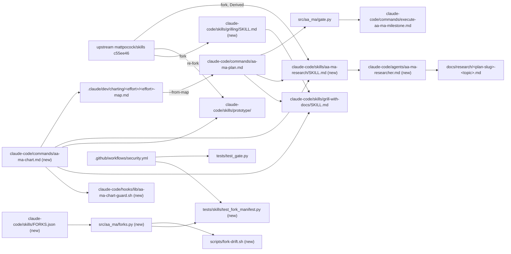
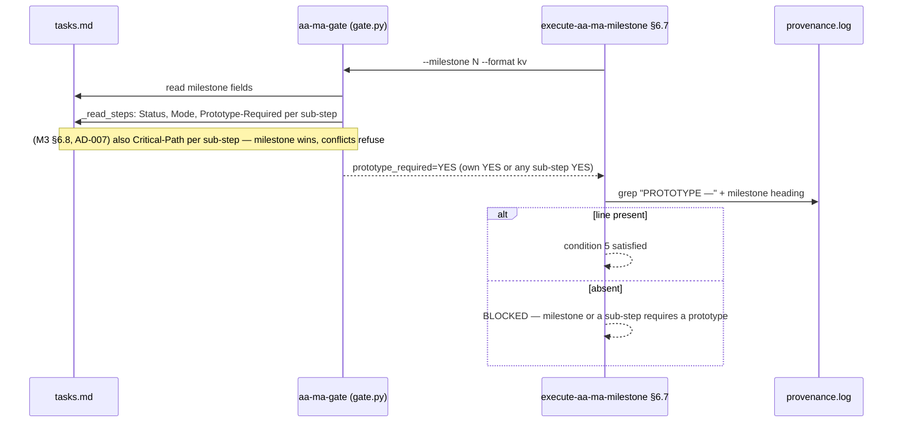

<!-- ARCHIVED: 2026-09-22 09:53 -->
<!-- Plan: mattpocock-trio-adoption - COMPLETE -->
<!-- Total Milestones: 5 | Duration: 2026-09-20 to 2026-09-21 -->

# mattpocock-trio-adoption Plan

**Objective:** Every mattpocock fork in a known, detectable lifecycle state; `grilling` forked behind the `grill-with-docs` name; `prototype` re-forked with an explicit planning gate; `research` adopted (as `aa-ma-research`) with a non-nesting agent; `wayfinder` adapted as pre-plan **charting**; `write-a-skill` reclassified Derived — shipped as v0.13.0 (M1–M4) and v0.14.0 (M5).
**Owner:** Stephen Newhouse + Claude
**Created:** 2026-09-20
**Last Updated:** 2026-09-20
**Diagram-Waiver:** none
**Spec:** `docs/superpowers/specs/2026-09-20-mattpocock-trio-adoption-design.md` (D1–D9) · Research: `docs/research/mattpocock-trio-2026-09.md` · ADRs 0011/0012/0013 (Proposed → Implemented by M3/M4/M5)

## Executive Summary

Five milestones, two releases (v0.13.0 after M4, v0.14.0 after M5; eng-review OV4). M1 lays a fork manifest + Drift/Orphan detector and fixes CI coverage; M2–M4 bring the three skills current from upstream HEAD `c55ee46` (not the v1.2.3 plugin cache, which is 54 commits behind); M5 adds `/aa-ma-chart`. Success = `uv run pytest` green in a CI job that now runs `tests/skills tests/agents tests/plan_markers tests/test_gate.py`, all five count sites consistent, and one real charting run + one real research run recorded in provenance.

## Global Constraints

- Upstream = `mattpocock/skills` at commit **`c55ee46073ed923f86ce59a5eb3b6d895095d1b7`** (main, 2026-09-18). Fetch with `gh api repos/mattpocock/skills/contents/<path>?ref=c55ee46 --jq .content | base64 -d`. Never fork from the plugin cache (it equals tag v1.2.3, 6acc160).
- Provenance line 1 forms: `<!-- Forked from https://github.com/mattpocock/skills/skills/<path> @ c55ee46 on <fork-date> — aa-ma-forge v0.13.0 -->` · Derived: `<!-- Derived from https://github.com/mattpocock/skills/skills/<path> (forked <date>; <reason>) — aa-ma-forge v0.13.0 -->` (M5 files: v0.14.0). `tests/skills/_helpers.py` (`assert_skill_frontmatter`) requires `mattpocock/skills` + the upstream path substring in that line; for `state: derived` entries the frontmatter `name` may differ from the upstream dir name.
- **Line numbers in this plan are as of commit `c87135b`.** Steps locate edits by the quoted anchor text (function name, heading, marker string), never by line alone; `reference.md` records anchors (eng-review OV8).
- **Pre-M1 housekeeping commit (`[ad-hoc]`, before M1 starts):** fix pre-existing drift so every taxonomy site reads **5 standard + 3 optional** and lists `impl-review` — `docs/spec/claude-code-foundations.md` `### Commands (11)` → 12 with an `/aa-ma-share` row and `(5 standard + 2 optional)` → `+ 3`; `docs/templates/README.md` rows for `impl-review-template.md` + `engineering-standards-template.md` and "3 optional"; `claude-code/rules/aa-ma.md` `(5 standard + 2 optional)` → `+ 3` with an impl-review row; `docs/spec/aa-ma-quick-reference.md` Optional Files table + impl-review row; `docs/spec/aa-ma-specification.md` §II table + impl-review row; ADR-0002 Implementation Notes rows claiming `rules/aa-ma.md`/`CLAUDE.md` mentions (they never did). Verify: `grep -rl '+ 2 optional' docs claude-code README.md` is empty. Keeps M1's rollback honest (OV7) and makes M5 a clean +1.
- Vocabulary per `CONTEXT.md`: Fork / Re-fork / Drift / Orphan / Adaptation / Adoption. "sync", "vendor" banned.
- ≤5 concurrent agents. Conventional Commits + footer `[AA-MA Plan] mattpocock-trio-adoption .claude/dev/active/mattpocock-trio-adoption`.
- `CHANGELOG.md`: edit `## Unreleased` only (L-003). Counts updated **per milestone** (L-002). Marker helper is `~/.claude/hooks/lib/aa-ma-plan-marker.sh` at install; source is `claude-code/hooks/aa-ma-plan-marker.sh`.
- Never emit a `PHASE_2.5` marker (Step 2.5 is a step inside Phase 2).
- **Session restart rule:** the Skill tool only resolves names present in the session-start listing. After `scripts/install.sh` adds a skill dir (M2 `grilling`, M4 `aa-ma-research`), start a new session before any live criterion that calls `Skill(<new name>)`; record the resolved skill path (`~/.claude/skills/<name>` vs `mattpocock-skills:<name>`) in the Result Log.
- **`CLAUDE.md` (project) is gitignored** (`.gitignore`): it is a local convenience, never a count site in acceptance criteria or CI tests. The existing count test skips it when absent; keep that branch.
- **"clean" in this plan means:** the named command exits 0 and prints no findings (`<cmd>; test $? -eq 0`).
- **bats convention:** tests target the repo file (`HELPER="${REPO_ROOT}/claude-code/hooks/lib/<name>.sh"`) with a fake `CLAUDE_HOME` symlink, as `tests/hooks/aa-ma-gate-python.bats` does — never `~/.claude/...`, which CI does not have.
- **`hooks/lib` helpers are NOT auto-discovered by `install.sh`** — each is linked by an explicit `if [ -f … ]; then create_symlink` block (`scripts/install.sh`, the `aa-ma-parse.sh` / `aa-ma-plan-marker.sh` blocks; `lib/aa-ma-footer.sh` is in the repo and *not* installed, which proves it). Any new helper needs its own block + an `install_dry_run.bats` case (L-005).
- **Commits made *by* charting or research runs during this plan** (`.claude/dev/charting/**`, `docs/research/*` from prototype runs) carry `[ad-hoc]`; the `/aa-ma-chart` command says so.
- **Dev dependencies** go in `[dependency-groups] dev` (`pyproject.toml`), not the deprecated `[tool.uv] dev-dependencies` table.
- **Provenance line grammars used by this plan** (also added to the spec in M3): `[ts] PROTOTYPE — <milestone heading> — <verdict>[; branch=prototype/<name>]` · `[ts] CRITICAL_PATH_REVIEW — <milestone heading> — <Critical-Path value> — <evidence>` (4 fields, matching `execute-aa-ma-milestone.md` §6.7) · `[ts] LIVE_CHECK — <milestone heading> — <key>=<value>…` (new, for HITL live criteria) · `[ts] MAP_IMPORTED effort=<effort> tickets=<N>`. `<milestone heading>` is the `## Milestone N: …` line from tasks.md byte-for-byte (the §6.7 grep depends on it).
- **Research-file header** (used by M4/M5 and `aa-ma-research`): `**Created:** · **Author:** · **Reviewed-Through-Date:** · **Valid-Through:** · **Sources:**` — the four fields of `docs/research/skill-ecosystem-audit.md` plus a `Sources` list; `docs/research/mattpocock-trio-2026-09.md` is the first file in this shape.

## Target Audience

Executing agent with the AA-MA reference + tasks files loaded; skilled, no memory of this repo. Every step names exact paths and the command that proves it.

## Implementation Steps

### Milestone 1: Fork manifest, Drift/Orphan detector, Derived reclassifications, CI coverage

- **Goal:** `FORKS.json` is the SSoT for every fork; a test detects local tampering (fail); a pure classifier + `scripts/fork-drift.sh` detect upstream Drift/Orphan against the fork's recorded `upstream_md5` (warn); `write-a-skill` is Derived; CI runs the suites it has been skipping.
- **Effort:** 6h · **Complexity:** 45% · **Mode:** AFK · **Gate:** SOFT
- **Audit-Profile:** code-only · **Critical-Path:** doc-count-drift
- **Baseline:** N/A — pure local code, no API exercised

**Acceptance Criteria:**
- [ ] `uv run pytest tests/skills/test_fork_manifest.py -q` passes; deleting the whole `prototype` row from `FORKS.json` makes `test_every_fork_dir_is_in_manifest` fail with `MISSING_IN_MANIFEST: prototype`; changing one `files` md5 makes `test_local_md5_matches_manifest` fail with `MD5_MISMATCH: prototype/SKILL.md`.
- [ ] `classify_fork(entry, fetched)` (pure, no I/O) returns `SAME` when every fetched md5 equals the entry's `upstream_md5`, `DRIFT` when any differs, `ORPHAN` when a fetch is `None`; `tests/skills/test_fork_manifest.py` proves all three with hand-built dicts — no plugin cache, no network (3A + OV2).
- [ ] `scripts/fork-drift.sh [--sha <ref>]` fetches each manifest file at `<ref>` (default `main`) via `gh api`, feeds `classify_fork`, prints `skill | file | upstream_md5 | fetched md5 | SAME|DRIFT|ORPHAN`; exit 0; exit 1 with a message when `gh` is absent. Expected verdicts at `--sha c55ee46` after Step 1.2 (record in reference.md): `grill-with-docs` → **ORPHAN** (its `CONTEXT-FORMAT.md`/`ADR-FORMAT.md` 404 upstream — moved to `domain-modeling/`; ORPHAN takes precedence over DRIFT per the classifier), `prototype` → DRIFT (all three files), `write-a-skill` → ORPHAN.
- [ ] `.github/workflows/security.yml` pytest step includes `tests/skills tests/agents tests/plan_markers tests/test_gate.py tests/test_enforce.py tests/test_gate_parity.py`; `grep -q '"pyyaml' pyproject.toml` inside `[dependency-groups] dev`; `uv lock --check` exits 0.
- [ ] `sed -n 1p claude-code/skills/write-a-skill/SKILL.md | grep -qF 'Derived from https://github.com/mattpocock/skills/skills/productivity/write-a-skill'`; ADR-0004 line 3 is exactly `**Status:** Implemented — Derived (2026-05-10; amended <fork-date>)`; `grep -q 'Authoring recipe: gather' README.md`.
- [ ] `tests/commands/test_aa_ma_share_command.py::test_foundations_count_headings_match_disk` asserts `docs/spec/claude-code-foundations.md` `### Commands (N)`/`### Skills (N)`/`### Agents (N)` against disk (SECURITY.md already covered by `test_security_md_asset_lists_match_disk`; CLAUDE.md excluded — gitignored).

**Required Artefacts:** `claude-code/skills/FORKS.json`, `tests/skills/test_fork_manifest.py`, `src/aa_ma/forks.py` (`classify_fork` + manifest loader — tiny, importable by the script via `uv run python -m aa_ma.forks`), `scripts/fork-drift.sh`, edits to `tests/skills/_helpers.py`, `.github/workflows/security.yml`, `pyproject.toml`, `claude-code/skills/write-a-skill/SKILL.md`, `docs/adr/0004-*.md`, `README.md`. (Pre-existing drift fixes land in the pre-M1 `[ad-hoc]` commit, not here.)

**Tests:** manifest test (red → green); `uv run pytest tests/skills tests/agents tests/plan_markers tests/test_gate.py tests/commands -q` all pass; `shellcheck scripts/fork-drift.sh` clean.

**Rollback Strategy:** `git revert` the milestone commits (pre-existing drift fixes are in the separate pre-M1 commit and survive); no runtime behaviour changes (tests + docs + one script + one pure module).

**Risks:**
1. Widening CI exposes a latent failure in a previously-unrun suite → run the exact CI command locally first (166 tests pass today per impact analysis).
2. `pyyaml` transitive today (L-055 precedent) → declare explicitly in the same commit as the workflow change.
3. Manifest MD5 recipe ambiguity → contract pins exactly two fields: `files.<f>` = `tail -n +2 <local> | md5sum`; `upstream_md5.<f>` = whole upstream file at `upstream_sha`. One recipe each, no line ranges (1C).

#### Contract
```text
# file: claude-code/skills/FORKS.json
{ "<skill-dir>": { "upstream": "skills/<category>/<name>",         # path under mattpocock/skills
                   "upstream_sha": "c55ee46…" | null,                # null for Orphan / Derived-from-deleted
                   "forked_at": "YYYY-MM-DD", "adr": "docs/adr/NNNN-…md",
                   "state": "current" | "derived",
                   "files":        { "<file>": "<md5 of `tail -n +2 <local file>`>" },
                   "upstream_md5": { "<file>": "<md5 of whole upstream file at upstream_sha>" | null },   # ALWAYS per-file; null per file when unknown (Orphan/Derived)
                   "upstream_md5_source": "adr-0003" | "derived-from-local-fork" | "gh-api@<sha>" | null } }   # optional, informational
# file: src/aa_ma/forks.py   (stdlib dataclasses, not Pydantic — no runtime deps; extra keys ignored on load)
Verdict = Literal["SAME", "DRIFT", "ORPHAN"]
@dataclass(frozen=True)
class ForkEntry: name: str; upstream: str; upstream_sha: str | None; forked_at: str; adr: str; state: Literal["current","derived"]; files: dict[str, str]; upstream_md5: dict[str, str | None]
def load_manifest(path: Path) -> dict[str, ForkEntry]           # unknown keys ignored; missing required key → ValueError naming it
def classify_file(expected: str | None, fetched: str | None) -> Verdict   # fetched None → ORPHAN; expected None → SAME (nothing to compare); else DRIFT/SAME
def classify_fork(entry: ForkEntry, fetched: Mapping[str, str | None]) -> Verdict
#   per-skill roll-up over entry.files keys: any ORPHAN → ORPHAN; else any DRIFT → DRIFT; else SAME. A key missing from `fetched` counts as None.
# CLI: uv run --quiet --project "$REPO_ROOT" python -m aa_ma.forks classify <skill> '<json: {file: md5|null}>'
#   stdout: one line per file `<skill> | <file> | <upstream_md5|-> | <fetched|-> | <file verdict>` then one line `<skill> | * | | | <skill verdict>`; exit 0
# file: tests/skills/test_fork_manifest.py
def test_every_fork_dir_is_in_manifest() -> None            # dirs whose SKILL.md line 1 is an HTML comment starting "Forked from" or "Derived from"
def test_manifest_entries_exist_on_disk() -> None
def test_local_md5_matches_manifest() -> None               # hard fail: local edit without manifest update
def test_classify_fork_same_drift_orphan() -> None          # three hand-built fetched dicts; pure, runs in CI
# file: tests/skills/_helpers.py — the existing `fm["name"] == skill_dir_name` assertion is KEPT unchanged (name == directory name always);
#   the only change: when expected_upstream_path is None, derive it as "mattpocock/skills/" + FORKS.json[skill].upstream
def assert_skill_frontmatter(skill_dir_name: str, expected_upstream_path: str | None = None) -> None
# CLI: scripts/fork-drift.sh [--sha <ref>] [--manifest <path>]   exit 0 ok / 1 gh or network failure / 2 usage
#   GH="${GH:-gh}" env seam (release.sh precedent) so bats can stub it; REPO_ROOT derived from $0 (readlink -f) so it runs from any cwd
#   per file: if body=$($GH api "repos/mattpocock/skills/contents/${upstream}/${file}?ref=${SHA:-main}" --jq .content 2>"$err"); then
#                 [ -n "$body" ] || exit 1 (empty content = file >1 MB, refuse); md5=$(printf '%s' "$body" | base64 -d | md5sum | cut -d' ' -f1)
#             elif grep -q 'HTTP 404' "$err"; then md5=null            # ONLY 404 → ORPHAN
#             else cat "$err" >&2; exit 1; fi                          # 403/auth/network → exit 1, never ORPHAN
#   then feeds {file: md5|null} to `python -m aa_ma.forks classify` and prints its rows (per-file verdict + skill roll-up row)
```

#### Step 1.1: Write the failing manifest test
- **Effort:** 45m · **Complexity:** 35%
- **Acceptance:** `uv run pytest tests/skills/test_fork_manifest.py -q` fails at collection with `ImportError`/`ModuleNotFoundError: aa_ma.forks` (the `FileNotFoundError` leg surfaces once the module exists).
- **Artefacts:** `tests/skills/test_fork_manifest.py` (four tests per Contract; the classifier test builds `fetched` dicts by hand — no cache, no network).

#### Step 1.2: Write `FORKS.json` and make the test pass
- **Effort:** 30m · **Complexity:** 30%
- **Acceptance:** the four Contract tests pass (Step 1.3 adds a fifth); `uv run ruff check src/; test $? -eq 0`; `uv run python -m aa_ma.forks classify prototype '{"SKILL.md": null}'` prints an ORPHAN roll-up row.
- **Artefacts:** `src/aa_ma/forks.py`; `claude-code/skills/FORKS.json` with rows `grill-with-docs` (current; `upstream_sha: null`, `forked_at: 2026-05-10`; **ADR-0002 recorded no md5 values** (only a prose "matches upstream byte-for-byte" line) — the fork is byte-faithful, so `upstream_md5.<f>` = local `tail -n +2 <f> | md5sum`, and the row carries `"upstream_md5_source": "derived-from-local-fork"`), `prototype` (current; `forked_at: 2026-05-10`; `upstream_md5` from ADR-0003 under the anchor `MD5 verification (canonical` — three values, which equal the local `tail -n +2` md5s; `adr: docs/adr/0003-prototype-adoption.md`), `write-a-skill` (derived; `upstream_sha: null`, `upstream_md5: {"SKILL.md": null}`; `adr: docs/adr/0004-write-a-skill-adoption.md`; grill-with-docs `adr: docs/adr/0002-grill-with-docs-adoption.md`); `understand-codebase` excluded (line 1 is the `Maintained in aa-ma-forge …` comment, not a Fork). `upstream_sha` is the full 40-char sha when non-null.

#### Step 1.3: Point `_helpers.assert_skill_frontmatter` at the manifest
- **Effort:** 20m · **Complexity:** 25%
- **Acceptance:** the `name == dir` assertion is untouched; the three existing `test_*_frontmatter.py` pass unchanged (explicit path); `tests/skills/test_fork_manifest.py::test_helper_resolves_upstream_from_manifest` (fifth test in that file) calls the helper with `expected_upstream_path=None` for `prototype` and passes.
- **Artefacts:** `tests/skills/_helpers.py`.

#### Step 1.4: `scripts/fork-drift.sh`
- **Effort:** 30m · **Complexity:** 35%
- **Acceptance:** `scripts/fork-drift.sh --sha c55ee46` prints per-file rows plus one roll-up row per skill with the expected verdicts above; `shellcheck scripts/fork-drift.sh; test $? -eq 0`; `bats tests/hooks/fork-drift.bats` (uses `--manifest tests/hooks/fixtures/forks/FORKS.json`, a 2-row fixture): (a) `GH=/nonexistent/gh` → exit 1 + message; (b) `GH=<tmp>/stub-gh` returning fixed base64 for one file and writing `gh: Not Found (HTTP 404)` to stderr + exit 1 for the other → rows `SAME` and `ORPHAN`; (c) stub writing `HTTP 403` → exit 1, no ORPHAN.
- **Artefacts:** `scripts/fork-drift.sh` per the Contract (`GH` seam, 404-only → null, `cut -d' ' -f1`, `uv run --quiet --project`), `tests/hooks/fork-drift.bats`, `tests/hooks/fixtures/forks/FORKS.json`.

#### Step 1.5: `write-a-skill` → Derived; ADR-0004 + ADR-0002 amendments
- **Effort:** 30m · **Complexity:** 20%
- **Acceptance:** `write-a-skill/SKILL.md` line 1 = `<!-- Derived from https://github.com/mattpocock/skills/skills/productivity/write-a-skill (forked 2026-05-10; upstream removed in 1.0.0, 2026-06-17) — aa-ma-forge v0.13.0 -->`; `test_write_a_skill_frontmatter.py` passes (path substring still present); ADR-0004 Status + a `## Amendment <fork-date>` section; the `README.md` `write-a-skill` row rewritten to "Authoring recipe: gather → draft SKILL.md (+REFERENCE/EXAMPLES/scripts) → review; description rules, 100-line split, 6-item checklist".
- **Artefacts:** as listed.

#### Step 1.6: CI widening + `pyyaml` + count-site test extension
- **Effort:** 40m · **Complexity:** 40%
- **Acceptance:** `uv run pytest tests/commands tests/render tests/skills tests/agents tests/plan_markers tests/test_gate.py tests/test_enforce.py tests/test_gate_parity.py -q --tb=short` passes locally; the `command + render tests` step in `security.yml` runs that exact list; `[dependency-groups] dev` includes `pyyaml`; `uv lock` then `uv lock --check; test $? -eq 0`; `test_aa_ma_share_command.py` gains `test_foundations_count_headings_match_disk` covering only the three foundations headings (`test_security_md_asset_lists_match_disk` already covers SECURITY.md — do not duplicate).
- **Artefacts:** `.github/workflows/security.yml`, `pyproject.toml`, `uv.lock`, `tests/commands/test_aa_ma_share_command.py`.

#### Step 1.7: CHANGELOG + sync
- **Effort:** 25m · **Complexity:** 20%
- **Acceptance:** `CHANGELOG.md ## Unreleased` has M1 entries; new count test green against the pre-M1 baseline; commit + push with plan footer.
- **Artefacts:** as listed.

---

### Milestone 2: Fork `grilling`; `grill-with-docs` becomes Derived

- **Goal:** Round-based frontier grilling available as `Skill(grilling)`; `grill-with-docs` keeps its name and dispatch contract but delegates the interview to `grilling`.
- **Effort:** 4h · **Complexity:** 40% · **Mode:** HITL (one live session) · **Gate:** SOFT
- **Audit-Profile:** code-only · **Critical-Path:** doc-count-drift
- **Baseline:** N/A — pure local code, no API exercised

**Acceptance Criteria:**
- [ ] `claude-code/skills/grilling/SKILL.md` = upstream HEAD content (md5 of `tail -n +2` = `284efe9cf334900d08230e572fc6db90`), YAML frontmatter parses, `disable-model-invocation` absent.
- [ ] `grill-with-docs/SKILL.md` line 1 is Derived; its `<what-to-do>` block is ≤6 lines and names `grilling`; the `<supporting-info>` domain block is unchanged except the glossary sentence; `CONTEXT-FORMAT.md` + `ADR-FORMAT.md` still in the dir. `test_grill_with_docs_frontmatter.py` gains two asserts: line 1 is an HTML comment starting `Derived from` and the `<what-to-do>` block contains `"grilling"` (3B).
- [ ] **Live criterion (OV3):** in a fresh session after `install.sh`, run `/aa-ma-plan --grill-mode=with-docs` on the fixed idea "add `--json` output to `scripts/fork-drift.sh`" and stop after Phase 1.3. Proof: Result Log contains a fenced excerpt showing (a) the `Skill` tool call with `skill: grilling` and its resolved path, and (b) at least one `❓ Q1` block followed by a `➡️` line; provenance gains `[ts] LIVE_CHECK — Milestone 2: … — grilling_rounds=<N> resolved=~/.claude/skills/grilling`.
- [ ] `tests/plan_markers/test_fingerprint.py::test_satisfied_by_grill_with_docs` still passes (no fingerprint change).
- [ ] `jq -e '.grilling.state=="current" and .grilling.upstream_sha=="c55ee46073ed923f86ce59a5eb3b6d895095d1b7" and .grilling.upstream_md5["SKILL.md"]=="284efe9cf334900d08230e572fc6db90" and .["grill-with-docs"].state=="derived"' claude-code/skills/FORKS.json`; manifest test green.
- [ ] Counts: skills 19→20 in `SECURITY.md` list, `README.md` skills table (+1 row), `docs/spec/claude-code-foundations.md` `### Skills (20)` (+1 row); CLAUDE.md updated locally, not asserted; `test_aa_ma_share_command.py` green.

**Required Artefacts:** `claude-code/skills/grilling/SKILL.md`, `tests/skills/test_grilling_frontmatter.py`, edits to `claude-code/skills/grill-with-docs/{SKILL,CONTEXT-FORMAT}.md`, `claude-code/skills/FORKS.json`, `claude-code/commands/aa-ma-plan.md:196-200`, ADR-0002 amendment, count sites, `docs/ATTRIBUTION.md`, `CHANGELOG.md`.

**Tests:** `uv run pytest tests/skills tests/plan_markers tests/commands -q`; `bats tests/hooks/install_dry_run.bats`.

**Rollback Strategy:** revert milestone commits; `grill-with-docs` returns to the faithful 2026-05-10 fork; remove `grilling` dir and manifest row.

**Risks:**
1. Upstream em-dash sweep left unquoted colons in some descriptions (YAML break) → frontmatter test parses YAML; fix by quoting if it fails.
2. `grilling` says "dispatch sub-agents for facts, never ask the user for lookups" — inside `/aa-ma-plan` Phase 1.3 that must respect the ≤5-agent cap → add one sentence to `aa-ma-plan.md:196-200`.
3. Losing the one-question-at-a-time discipline some users prefer → `grill-me` (separate, unchanged) still offers it.
4. `mattpocock-skills:grilling` (plugin) coexists with `~/.claude/skills/grilling` (ours); the unprefixed `Skill(grilling)` must resolve to ours → the live criterion records the resolved path; if it resolves to the plugin, rename ours `aa-ma-grilling` (Derived) in the same milestone.

#### Contract
```text
# file: claude-code/skills/grilling/SKILL.md   (frontmatter: name: grilling; model-invocable)
# file: claude-code/skills/grill-with-docs/SKILL.md
<!-- Derived from https://github.com/mattpocock/skills/skills/engineering/grill-with-docs (forked 2026-05-10; upstream split into grilling + domain-modeling 2026-07; name and domain block retained) — aa-ma-forge v0.13.0 -->
<what-to-do>
Call the Skill tool with "grilling" and run its round-based interview about this plan. During the session apply the domain awareness below: challenge terms against CONTEXT.md, sharpen language, update CONTEXT.md and ADRs inline.
</what-to-do>
# tests/skills/test_grilling_frontmatter.py: assert_skill_frontmatter("grilling", "mattpocock/skills/skills/productivity/grilling")
```

#### Step 2.1: Fork `grilling` from HEAD + frontmatter test
- **Effort:** 30m · **Complexity:** 25%
- **Acceptance:** `md5sum <(tail -n +2 claude-code/skills/grilling/SKILL.md)` = `284efe9c…`; `uv run pytest tests/skills/test_grilling_frontmatter.py -q` passes.
- **Artefacts:** `claude-code/skills/grilling/SKILL.md` (line 1 provenance + upstream body), `tests/skills/test_grilling_frontmatter.py`.

#### Step 2.2: Rewrite `grill-with-docs` as Derived delegator
- **Effort:** 30m · **Complexity:** 35%
- **Acceptance:** file matches the Contract; under the `### Update CONTEXT.md inline` heading, the sentence beginning "Don't couple `CONTEXT.md` to implementation details" is replaced by upstream's ("`CONTEXT.md` should be totally devoid of implementation details… a glossary and nothing else"); `CONTEXT-FORMAT.md` line 2 = `<!-- Derived: retains Relationships / Example dialogue / Flagged ambiguities (upstream removed 2026-07); still glossary-level, never implementation. -->`; existing test green.
- **Artefacts:** the two files.

#### Step 2.3: Manifest rows, ADR-0002 amendment, `aa-ma-plan.md` note, counts, CHANGELOG, sync
- **Effort:** 45m · **Complexity:** 30%
- **Acceptance:** all M2 criteria; commit + push.
- **Artefacts:** `FORKS.json`, `docs/adr/0002-*.md` (`## Amendment <fork-date> — Derived; grilling forked`), `aa-ma-plan.md:196-200` (+ agent-cap sentence), `SECURITY.md`, `CLAUDE.md`, `README.md`, `docs/spec/claude-code-foundations.md`, `docs/ATTRIBUTION.md`, `CHANGELOG.md`.

---

### Milestone 3: `prototype` Re-fork + planning gate + gate roll-up

- **Goal:** Fork current with HEAD (HTML logic demo, capture-on-branch); `/aa-ma-plan` asks the prototype question; the gate honours sub-step `Prototype-Required`.
- **Effort:** 8h · **Complexity:** 70% · **Mode:** HITL (gate semantics) · **Gate:** HARD
- **Audit-Profile:** full · **Critical-Path:** hook-modification
- **Baseline:** N/A — pure local code, no API exercised

**Acceptance Criteria:**
- [ ] `claude-code/skills/prototype/{SKILL,LOGIC,UI}.md` bodies = HEAD (`tail -n +2` md5s `5c68a2867eb3b9b4cb3e9ad4ba2b5299`, `0c6daa140ef3e83ba9e6b5bfa5161408`, `e3c841746676a0e604c72b5cd459e7ba`); `test_prototype_frontmatter.py` green; `FORKS.json` row updated (`upstream_sha: c55ee46`, `upstream_md5` = those three).
- [ ] `uv run aa-ma-gate tests/hooks/fixtures/gate-scans/prototype-rollup-tasks.md --milestone 1 --format kv | grep -q '^prototype_required=YES$'` where Milestone 1 has **no** milestone-level field and Sub-step 1.2 has `Prototype-Required: YES`; `--milestone 2` (no flags anywhere) prints `NO`; a sub-step `Prototype-Required: maybe` → exit 2; **REGRESSION (eng-review §3):** a sub-step with the literal empty slot `- **Prototype-Required:**` (what `tasks-template.md` emits today) → exit 2 with `empty value` — this is the behaviour change the template fix exists for.
- [ ] `tests/hooks/aa-ma-gate-python.bats` has a PROTOTYPE fence case: milestone requiring a prototype with no `PROTOTYPE —` line → §6.7 BLOCKED text; with the line → passes.
- [ ] `claude-code/commands/aa-ma-plan.md` has `**Step 2.5: Prototype Decision**` between Step 2.4 and the Phase 2 summary; `test_planning_standard_count.py` and `test_active_plans_canonical.py` green.
- [ ] `grep -c 'terminal TUI' claude-code/rules/engineering-standards.md tests/smoke/aa-ma-engineering-standards-smoke.md README.md docs/spec/claude-code-foundations.md` = 0 for every file; `grep -q '?variant=' claude-code/rules/engineering-standards.md`; `grep -q 'prototype/<name>' claude-code/rules/engineering-standards.md`; the Critical-Path table in Theme 1 is byte-identical before/after (`tests/codemem/test_critical_path_parser.py` scrapes it).
- [ ] `grep -F 'PROTOTYPE — <milestone heading> — <verdict>[; branch=prototype/<name>]' docs/spec/aa-ma-specification.md` and `grep -F 'CRITICAL_PATH_REVIEW — <milestone heading> — <Critical-Path value> — <evidence>' docs/spec/aa-ma-specification.md` and `grep -F 'LIVE_CHECK — <milestone heading>' docs/spec/aa-ma-specification.md` all match in the provenance-grammar section (4-field CRITICAL_PATH_REVIEW form = `execute-aa-ma-milestone.md` §6.7).
- [ ] `grep -cE '^- \*\*(Prototype-Required|Critical-Path):\*\*\s*$' docs/templates/tasks-template.md` = 0 — all four blank slots (milestone-level and sub-step, both fields) are removed; each comment says "add `- <Field>: <value>` only when it applies; an empty value is a gate error (exit 2)".
- [ ] ADR-0011 Status → Implemented.

**Required Artefacts:** the three skill files; `src/aa_ma/gate.py`; `tests/test_gate.py`; `tests/hooks/fixtures/gate-scans/prototype-rollup-tasks.md`; `tests/hooks/aa-ma-gate-python.bats`; `claude-code/commands/{aa-ma-plan,execute-aa-ma-milestone,execute-aa-ma-step}.md`; `claude-code/rules/engineering-standards.md`; `tests/smoke/aa-ma-engineering-standards-smoke.md`; `README.md` + `docs/spec/claude-code-foundations.md` prototype rows ("terminal TUI" wording); `docs/spec/aa-ma-specification.md`; `docs/templates/tasks-template.md`; `docs/adr/0011-*.md`; `CHANGELOG.md`.

**Tests:** `uv run pytest tests/test_gate.py tests/test_gate_parity.py tests/test_enforce.py tests/commands -q`; `bats tests/hooks/aa-ma-gate-python.bats`; `uv run ruff check src/`.

**Rollback Strategy:** revert `gate.py` + fixture commit first (restores milestone-only semantics), then docs; the skill re-fork is independent and can stay.

**Risks:**
1. Sub-step read scope: reading in `_read_milestone` makes any bad sub-step token file-wide exit 2 → implement beside `_count_pending` (selected milestone only) and override at `gate.py:382`; record in context-log.
2. Archived plans in `.claude/dev/completed/**` contain blank sub-step slots → they are never gated again; note grandfathering in ADR-0011; `test_active_plans_canonical.py` scans only `active/`.
3. `execute-aa-ma-milestone.md:616` BLOCKED text says "Milestone has Prototype-Required: YES" → reword to "milestone or one of its sub-steps".

#### Contract
```text
# file: src/aa_ma/gate.py
@dataclass(frozen=True)
class StepsRead:
    pending: int
    prototype_required: bool
def _read_steps(block: Block, heading: str, errors: list[str]) -> StepsRead   # Block from aa_ma.grammar
#   replaces _count_pending (2A: named fields, not a tuple); uses
#   read_enforced_field(step.text, "Prototype-Required", PROTOTYPE_REQUIRED) per step;
#   invalid/empty token → errors.append(...) → exit 2 (same as milestone-level)
# at the selected-milestone override (gate.py:~382):
#   MilestoneRead(**{**asdict(read), "pending_steps": steps.pending,
#                   "prototype_required": read.prototype_required or steps.prototype_required})
# JSON schema (gate.py:99-121) and to_kv unchanged.
# fixture: tests/hooks/fixtures/gate-scans/prototype-rollup-tasks.md
## Milestone 1: Roll-up
- Status: PENDING
- Gate: SOFT
### Sub-step 1.1: plain
- Status: PENDING
### Sub-step 1.2: needs prototype
- Status: PENDING
- Prototype-Required: YES
## Milestone 2: No flags
- Status: PENDING
### Sub-step 2.1: plain
- Status: PENDING
# aa-ma-plan.md Step 2.5 (inside Phase 2, no marker):
**Step 2.5: Prototype Decision** — for each milestone whose design is uncertain, AskUserQuestion
"Prototype-Required for <milestone>? YES/NO"; write `- Prototype-Required: YES` into that milestone
(or the specific sub-step) in tasks.md at Step 5.5; append `prototype=<M-list>` to ENG_STANDARDS_DECLARED.
# provenance grammar additions (spec :302-326):
[ts] PROTOTYPE — <milestone heading> — <verdict>[; branch=prototype/<name>]
[ts] CRITICAL_PATH_REVIEW — <milestone heading> — <Critical-Path value> — <evidence>
[ts] LIVE_CHECK — <milestone heading> — <key>=<value>…
```

#### Step 3.1: Fixture + failing gate tests
- **Effort:** 40m · **Complexity:** 45%
- **Acceptance:** `uv run pytest tests/test_gate.py -q -k rollup` fails (M1 reads `NO`); fixture file exists as in Contract plus Milestone 3 (`- Prototype-Required: maybe` on a sub-step) and Milestone 4 (empty `- **Prototype-Required:**` on a sub-step), both asserted to exit 2.
- **Artefacts:** `tests/hooks/fixtures/gate-scans/prototype-rollup-tasks.md`, `tests/test_gate.py` (4 new tests: rollup YES, no-flags NO, invalid sub-step exit 2, `test_empty_substep_prototype_slot_exits_2`).

#### Step 3.2: Implement `_read_steps` + override
- **Effort:** 45m · **Complexity:** 60%
- **Acceptance:** M3 gate tests pass; full `tests/test_gate.py tests/test_gate_parity.py tests/test_enforce.py` green; `uv run ruff check src/; test $? -eq 0`; `grep -q 'sub-step' <(sed -n 1,30p src/aa_ma/gate.py)` (module docstring names the roll-up).
- **Artefacts:** `src/aa_ma/gate.py`.

#### Step 3.3: Bats PROTOTYPE fence case + milestone/step command text
- **Effort:** 40m · **Complexity:** 45%
- **Acceptance:** `bats tests/hooks/aa-ma-gate-python.bats` passes with the new case (mirror of the Critical-Path case); `grep -q 'milestone or one of its sub-steps' claude-code/commands/execute-aa-ma-milestone.md`; `grep -q 'rolls up to the milestone gate' claude-code/commands/execute-aa-ma-step.md`.
- **Artefacts:** the bats file, both commands.

#### Step 3.4: Re-fork `prototype` from HEAD
- **Effort:** 25m · **Complexity:** 20%
- **Acceptance:** three md5s match the Contract values; `test_prototype_frontmatter.py` green; `FORKS.json` `prototype` row `upstream_sha: c55ee46`, `forked_at` today, new local md5s and `upstream_md5`; manifest test green; `scripts/fork-drift.sh --sha c55ee46` reports `SAME` for prototype.
- **Artefacts:** `claude-code/skills/prototype/{SKILL,LOGIC,UI}.md`, `FORKS.json`.

#### Step 3.5: Step 2.5 in `/aa-ma-plan`, Theme 1 wording, spec grammar, template, ADR-0011
- **Theme 1 replacement sentence (verbatim):** "which routes between **LOGIC** (a single self-contained HTML demo — state panel, free-play buttons, tabbed guided walkthroughs — for state/business-logic questions) and **UI** (structurally different variants on an existing route, switchable via `?variant=`) branches based on the question, and captures the result on a `prototype/<name>` branch — main keeps only the decision." The Critical-Path table below it is untouched.
- **Effort:** 60m · **Complexity:** 40%
- **Acceptance:** all remaining M3 criteria; `uv run pytest tests/commands tests/codemem/test_critical_path_parser.py -q` green.
- **Artefacts:** `aa-ma-plan.md`, `engineering-standards.md`, `docs/spec/aa-ma-specification.md`, `docs/templates/tasks-template.md`, `tests/smoke/aa-ma-engineering-standards-smoke.md`, `docs/adr/0011-*.md`, `CHANGELOG.md`.

#### Step 3.6: CRITICAL_PATH_REVIEW + impact analysis + HARD gate approval + sync
- **Effort:** 30m · **Complexity:** 30%
- **Acceptance:** provenance has `CRITICAL_PATH_REVIEW — Milestone 3: … — <evidence: test names + bats case>`; consolidated impact analysis in context-log; `## [date] GATE APPROVAL: Milestone 3 …` in context-log; commit + push.
- **Artefacts:** context-log, provenance.

---

### Milestone 4: Adopt `research` as `aa-ma-research` + `aa-ma-researcher` agent; Phase 3 writes files; release v0.13.0

- **Goal:** `Skill(aa-ma-research)` dispatches a non-nesting agent that writes one cited Markdown file in `docs/research/`; `/aa-ma-plan` Phase 3 uses it and records `research_files=<N>`; v0.13.0 is cut (OV4).
- **Effort:** 6h · **Complexity:** 50% · **Mode:** HITL (one live run + release) · **Gate:** SOFT
- **Audit-Profile:** code-only · **Prototype-Required:** YES · **Critical-Path:** doc-count-drift
- **Baseline:** N/A — pure local code, no API exercised

**Acceptance Criteria:**
- [ ] `claude-code/skills/aa-ma-research/SKILL.md` = Derived provenance line + frontmatter `name: aa-ma-research` + upstream HEAD body verbatim + a `## In this repo` section with the three AA-MA lines. Recipe: `sed '1d;/^## In this repo/,$d' SKILL.md | sed 's/^name: aa-ma-research$/name: research/' | md5sum` = `e1dd6af372a9e1d134eff7d8362fe3f7`; `test_aa_ma_research_frontmatter.py` green; `FORKS.json` row `state: derived`, `upstream_sha` full sha, `upstream_md5.SKILL.md: e1dd6af372a9e1d134eff7d8362fe3f7`. `stat -c '%Y' ~/.claude/skills/research` unchanged before/after `install.sh`.
- [ ] `claude-code/agents/aa-ma-researcher.md` frontmatter `tools: Read, Glob, Grep, Bash, WebSearch, WebFetch, Write`; `tests/agents/test_aa_ma_researcher_agent.py` asserts set equality, asserts `"Agent" not in tools`, and that the prompt contains "exactly one file", "cite", "Not pursued" and "never run `claude`".
- [ ] **Prototype verdict in provenance:** in a fresh session after `install.sh`, one live `Skill(aa-ma-research)` run on "Does `scripts/install.sh` back up a real directory before symlinking, and where?" produces `docs/research/mattpocock-trio-adoption-install-backup.md` where `grep -Ec '^\*\*(Created|Author|Reviewed-Through-Date|Valid-Through|Sources):\*\*' <file>` = 5 and `grep -Eq '[A-Za-z0-9_./-]+\.(sh|md|py):[0-9]+' <file>`; the Result Log pastes the agent-completion notice showing its tool tally with no `Agent` calls and `grep -c 'claude -p' ~/.claude/projects/<project-dir>/<session>/subagents/<agent>.jsonl` = 0 (path as shown in the spawn result); provenance line `[ts] PROTOTYPE — <Milestone 4 heading> — PASS: files=1 nested_agents=0; branch=n/a`.
- [ ] `grep -q 'Skill(aa-ma-research)' claude-code/commands/aa-ma-plan.md`; `grep -c 'research_files=' claude-code/commands/aa-ma-plan.md` ≥ 2 and `docs/spec/plan-marker-grammar.md` ≥ 2; `grep -q 'docs/research/' <(sed -n '/Step 5.3/,/Step 5.5/p' claude-code/commands/aa-ma-plan.md)`; `grep -q 'aa-ma-research' claude-code/skills/aa-ma-plan-workflow/references/PHASE_3_RESEARCH.md`; the `research-consolidation` row there contains "optional"; `grep -q '_phase_3' TODOS.md` (deferred, D1).
- [ ] `~/.claude/skills/aa-ma-research` after `scripts/install.sh` is a symlink to the repo dir (no backup needed — new name).
- [ ] Counts: skills 20→21, agents 11→12 in `SECURITY.md` (lists), `README.md` skills table, foundations `### Skills (21)`/`### Agents (12)` (CLAUDE.md locally); ADR-0012 → Implemented.
- [ ] **Release:** `scripts/release.sh minor --headline "fork manifest, grilling, prototype gate, research agent" --dry-run` clean, then real run → tag `v0.13.0` pushed; GitHub Release exists (OV4).

**Required Artefacts:** `claude-code/skills/aa-ma-research/SKILL.md`, `claude-code/agents/aa-ma-researcher.md`, `tests/skills/test_aa_ma_research_frontmatter.py`, `tests/agents/test_aa_ma_researcher_agent.py`, `docs/research/mattpocock-trio-adoption-install-backup.md`, edits to `aa-ma-plan.md`, `docs/spec/plan-marker-grammar.md`, `claude-code/skills/aa-ma-plan-workflow/references/PHASE_3_RESEARCH.md`, count sites, `docs/ATTRIBUTION.md`, ADR-0012, `CHANGELOG.md`, `TODOS.md` (fingerprint + research README entries), release tag.

**Tests:** `uv run pytest tests/skills tests/agents tests/plan_markers tests/commands -q`; `bats tests/hooks/aa-ma-plan-skip-warn.bats` (additive key must not break fixtures at `:32,87,108,131`).

**Rollback Strategy:** revert milestone commits; `scripts/uninstall.sh` removes the `~/.claude/skills/aa-ma-research` symlink. Release rollback per `docs/runbooks/release.md`.

**Risks:**
1. Agent still nests via `Bash` (`claude -p …`) → prompt forbids spawning `claude`; prototype run checks the agent transcript for zero child agents.
2. Research files accumulate per plan → header `Valid-Through` carries the rule; a `docs/research/README.md` is a TODO (D1).
3. Nested `Skill(aa-ma-research)` from charting (M5) resolves to the unprefixed global symlink, not `mattpocock-skills:research` → the M4.3 live run is invoked exactly as charting will invoke it.
4. `scripts/release.sh` refuses without exactly one `## Unreleased` heading with ≥1 bullet and a clean tree; it does **not** re-create `## Unreleased` afterwards → Step 4.6 runs the dry-run first; Step 5.1 re-adds `## Unreleased` before any M5 CHANGELOG edit.

#### Contract
```text
# file: claude-code/skills/aa-ma-research/SKILL.md
<!-- Derived from https://github.com/mattpocock/skills/skills/engineering/research @ c55ee46 (forked <fork-date>; renamed aa-ma-research, AA-MA dispatch rules appended) — aa-ma-forge v0.13.0 -->
---  name: aa-ma-research ; description: <upstream description verbatim>  ---
<upstream body verbatim>
## In this repo
- Dispatch the background agent as `aa-ma-researcher` (Agent tool, subagent_type: aa-ma-researcher). It has no Agent tool, so it cannot re-delegate.
- Answer the stated question only. List threads you saw but did not follow under `## Not pursued`.
- "Where the repo already keeps such notes" is `docs/research/<plan-slug>-<topic>.md`, with the header used by `docs/research/skill-ecosystem-audit.md` (Created / Author / Reviewed-Through-Date / Valid-Through / Sources).
# file: claude-code/agents/aa-ma-researcher.md
---
name: aa-ma-researcher
description: Investigates one question against primary sources and writes exactly one cited Markdown file under docs/research/. Spawned by Skill(aa-ma-research). Has no Agent tool; never runs `claude`.
tools: Read, Glob, Grep, Bash, WebSearch, WebFetch, Write
---
# returns ≤10 lines: path written, 3-line summary, "Not pursued" count
# marker: PHASE_3 DONE context7_calls=<N> web_fetches=<N> research_files=<N>
```

#### Step 4.1: Fork `research` from HEAD as `aa-ma-research` (Derived) + frontmatter test (test committed first)
- **Effort:** 30m · **Complexity:** 25%
- **Acceptance:** file per Contract; `uv run pytest tests/skills/test_aa_ma_research_frontmatter.py -q` green; `FORKS.json` row (`state: derived`, `upstream_md5.SKILL.md` = HEAD whole-file md5).
- **Artefacts:** `claude-code/skills/aa-ma-research/SKILL.md`, `tests/skills/test_aa_ma_research_frontmatter.py`, `FORKS.json`.

#### Step 4.2: `aa-ma-researcher` agent + test (test committed first, red against the missing file)
- **Effort:** 40m · **Complexity:** 35%
- **Acceptance:** `uv run pytest tests/agents/test_aa_ma_researcher_agent.py -q` green (YAML parse; `tools` set equality; `"Agent" not in tools`; prompt contains "exactly one file", "cite", "Not pursued", "never run `claude`").
- **Artefacts:** `claude-code/agents/aa-ma-researcher.md`, `tests/agents/test_aa_ma_researcher_agent.py`.

#### Step 4.3: Install + prototype run (HITL)
- **Effort:** 30m · **Complexity:** 40%
- **Acceptance:** `readlink ~/.claude/skills/aa-ma-research` = repo dir; `~/.claude/skills/research` unchanged; live `Skill(aa-ma-research)` run yields the file + provenance PROTOTYPE line per criteria.
- **Artefacts:** `docs/research/mattpocock-trio-adoption-install-backup.md`, provenance.

#### Step 4.4: `/aa-ma-plan` Phase 3 wiring, marker grammar, PHASE_3_RESEARCH.md
- **Effort:** 45m · **Complexity:** 40%
- **Acceptance:** criterion 4; `uv run pytest tests/plan_markers tests/commands -q` green; `bats tests/hooks/aa-ma-plan-skip-warn.bats` green.
- **Artefacts:** as listed.

#### Step 4.5: Counts, ATTRIBUTION, ADR-0012, CHANGELOG, TODOS.md, sync
- **Effort:** 30m · **Complexity:** 20%
- **Acceptance:** count test green; ADR-0012 Implemented; `TODOS.md` carries the fingerprint `_phase_3` and `docs/research/README.md` entries; commit + push.

#### Step 4.6: Release v0.13.0
- **Effort:** 20m · **Complexity:** 30%
- **Acceptance:** `scripts/release.sh minor --headline "…" --dry-run` clean; real run pushes tag `v0.13.0` and creates the GitHub Release; `uv.lock` in the tagged tree carries 0.13.0 (L-015 / release runbook).

---

### Milestone 5: Charting — `/aa-ma-chart` (Adaptation of wayfinder) + `--from-map`; release v0.14.0

- **Goal:** A pre-plan decision map with typed tickets, resolved one per session, that hands off to `/aa-ma-plan --from-map`; proven on one real effort before the template is frozen.
- **Effort:** 10h · **Complexity:** 65% · **Mode:** HITL · **Gate:** HARD
- **Audit-Profile:** code-only · **Prototype-Required:** YES · **Critical-Path:** hook-modification (guard ships under `claude-code/hooks/lib/`, 1A)
- **Baseline:** N/A — pure local code, no API exercised

**Acceptance Criteria:**
- [ ] **Prototype verdict:** `/aa-ma-chart chart writing-for-agents-eval "Should aa-ma-forge adopt writing-for-agents?"` creates `.claude/dev/charting/writing-for-agents-eval/writing-for-agents-eval-map.md` with `grep -c '^- Type: research'` ≥ 1 and `'^- Type: grilling'` ≥ 1; one `work` session resolves the research ticket (AFK; `#### Answer` present; `ls docs/research/writing-for-agents-eval-*.md`) and one resolves a grilling ticket (HITL); a claim attempted while another non-research ticket is CLAIMED exits 1 and its stdout (the frontier list) is pasted in the Result Log; provenance `[ts] PROTOTYPE — <Milestone 5 heading> — PASS: tickets=<N> resolved=<N> refused_claims=1; branch=n/a`; the Result Log carries a `Template-amendments:` line — `none` or a list, each item naming a diff hunk.
- [ ] **Live handoff (OV3):** the same effort is carried to a clear map (`"$GUARD" from-map <map>; test $? -eq 0`, `GUARD` resolved via the `_cand` pattern) and `/aa-ma-plan --from-map writing-for-agents-eval --dry-run` prints a first line `--from-map dry-run: effort=writing-for-agents-eval tickets=<N> — no task directory created` followed by the seeded *Decisions so far* + *Answers*; `test ! -d .claude/dev/active/writing-for-agents-eval`; excerpt in the Result Log.
- [ ] `bats tests/hooks/aa-ma-chart-guard.bats` against `${REPO_ROOT}/claude-code/hooks/lib/aa-ma-chart-guard.sh` (fake `CLAUDE_HOME`): (a) chart with zero fog → prints `no map needed — run /aa-ma-plan` and creates nothing; (b) claim while another non-research ticket is CLAIMED → exit 1 + frontier list; (c) `from-map` on a map with OPEN/CLAIMED tickets or non-empty fog → exit 1 listing them; (d) `reclaim` on a CLAIMED ticket resets it to OPEN, appends `- Reclaimed: <ts>`, then claims it (1B); (e) `import` inside a `git init`-ed `<tmp>` repo: once with the fixture map `git add`-ed (git mv path) and once untracked (mv + add path) — both land at `<tmp>/.claude/dev/active/<task>/<task>-map.md` and append `MAP_IMPORTED effort=<effort> tickets=<N>` to the given provenance file; a non-repo cwd → exit 1. Fixture maps under `tests/hooks/fixtures/charting/`; bats setup symlinks `aa-ma-parse.sh` beside the guard in the fake home (as `aa-ma-gate-python.bats` does).
- [ ] `scripts/install.sh` has an explicit `create_symlink` block for `hooks/lib/aa-ma-chart-guard.sh` (same shape as the `aa-ma-parse.sh` block); `scripts/install.sh --dry-run | grep -q aa-ma-chart-guard`; `tests/hooks/install_dry_run.bats` has a case for it; after install, `readlink ~/.claude/hooks/lib/aa-ma-chart-guard.sh` points into the repo.
- [ ] `docs/templates/map-template.md` exists; `tests/test_active_plans_canonical.py` green (no `## Milestone`/`### Sub-step` headings inside its fences).
- [ ] `grep -q -- '--from-map <effort> \[--dry-run\]' claude-code/commands/aa-ma-plan.md docs/spec/aa-ma-quick-reference.md`; without `--dry-run`, Phase 5 calls `aa-ma-chart-guard.sh import` (bats case (e) is the proof of that leg); `aa-ma-chart.md` tells the user charting/research commits during an active plan carry `[ad-hoc]`.
- [ ] File taxonomy: `docs/spec/aa-ma-specification.md` §II table (map row + `MAP -. optional .-> PLAN` mermaid edge), `docs/templates/README.md`, `claude-code/rules/aa-ma.md`, `docs/spec/claude-code-foundations.md`, `docs/spec/aa-ma-quick-reference.md`, `README.md` all say **5 standard + 4 optional** (`grep -rl '+ 3 optional' docs claude-code README.md` empty; CLAUDE.md updated locally, not asserted). `map-template.md` is **not** added to `WRITER_TEMPLATES` in `tests/test_active_plans_canonical.py` (its non-vacuous check needs milestone headings a map never has).
- [ ] Counts: commands 12→13 in `SECURITY.md`, `README.md` "All commands" table (`/aa-ma-chart` row), foundations `### Commands (13)` (CLAUDE.md locally); `SECURITY.md` "8 hooks" line unchanged (guard is a `lib/` helper, not a registered hook — L-005 pattern like `aa-ma-parse.sh`); count test green.
- [ ] `docs/ATTRIBUTION.md` gains "charting — concept adapted from wayfinder (mattpocock/skills, c55ee46); no files forked; invariant reworded to '≤1 non-research ticket CLAIMED at a time' (OV5)"; ADR-0013 Implemented; `CHANGELOG.md` M5 entries; `TODOS.md` gains the `/aa-ma-share` map allowlist entry; `CRITICAL_PATH_REVIEW — Milestone 5 …` line in provenance; release v0.14.0 cut.

**Required Artefacts:** `claude-code/commands/aa-ma-chart.md`, `claude-code/hooks/lib/aa-ma-chart-guard.sh`, **`scripts/install.sh` (new symlink block) + `tests/hooks/install_dry_run.bats` case**, `docs/templates/map-template.md`, `tests/hooks/aa-ma-chart-guard.bats` + fixtures, `CHANGELOG.md` (re-add `## Unreleased` first), edits to `aa-ma-plan.md`, spec/rules/quick-ref/foundations/CLAUDE/README/SECURITY, ATTRIBUTION, ADR-0013, CHANGELOG, TODOS, `.claude/dev/charting/writing-for-agents-eval/…` (prototype effort, kept), `docs/research/writing-for-agents-eval-*.md`.

**Tests:** `bats tests/hooks/aa-ma-chart-guard.bats`; `shellcheck claude-code/hooks/lib/aa-ma-chart-guard.sh`; `uv run pytest tests/commands -q`; `uv run aa-ma-lint-views` on ADR-0013 and this plan.

**Rollback Strategy:** revert milestone commits (taxonomy docs return to the pre-M1 state: 5+3 with impl-review listed); delete `.claude/dev/charting/`; remove the guard symlink via `scripts/uninstall.sh` (it scans `hooks/lib` for repo-pointing links). Charting has no Python — no runtime coupling to undo.

**Risks:**
1. Charting drifts into building (upstream's "no hard stop") → command's hard rule + bats (b); tell the user to run `/aa-ma-plan` rather than continuing.
2. Map grows stale (27-ticket maps upstream) → command prose tells the user to split an effort whose *Not yet specified* keeps growing; no numeric cap (OV6).
3. `/aa-ma-share` refuses `*-map.md` (`scripts/aa-ma-share-allow.sh:8-9`) → out of scope; recorded as follow-up, not silently widened.

#### Contract
```text
# file: claude-code/commands/aa-ma-chart.md
# CLI: /aa-ma-chart chart <effort> "<idea>"   |   /aa-ma-chart work <effort> [<ticket-N>]
# map: .claude/dev/charting/<effort>/<effort>-map.md
# Charting: <effort>
## Destination        (1–2 lines)
## Notes              (domain, skills to consult, standing preferences)
## Decisions so far   (- [Ticket N: Title](#ticket-n-title): one-line gist)
## Tickets
### Ticket N: Title
- Type: research | prototype | grilling | task      (default grilling)
- Mode: HITL | AFK                                 (research → AFK; prototype/grilling → HITL; task → either)
- Status: OPEN | CLAIMED | RESOLVED | RULED_OUT
- Claimed-at: YYYY-MM-DDTHH:MM (present iff CLAIMED; 1B)
- Blocked-by: N, N | —
#### Question
#### Answer                                        (present only when RESOLVED)
## Not yet specified  (fog — bullets)
## Out of scope       (never graduates)
# invariants: claim before work; ≤1 non-research ticket CLAIMED at a time (OV5); chart never writes outside
#   .claude/dev/charting/, docs/research/, prototype/* branches; zero fog at chart → stop.
# guard: aa-ma-chart-guard.sh <check> <map> [<ticket>]   — resolved by the command and by aa-ma-plan.md with the shipped `_cand` pattern:
#   for _cand in "$(git rev-parse --show-toplevel 2>/dev/null)/claude-code/hooks/lib/aa-ma-chart-guard.sh" "${CLAUDE_HOME:-${HOME}/.claude}/hooks/lib/aa-ma-chart-guard.sh"; do [ -f "$_cand" ] && GUARD="$_cand" && break; done
#   (never a literal ~/.claude path — the fake-CLAUDE_HOME bats convention and non-installed checkouts depend on this)
#   sources sibling: . "$(dirname "$(readlink -f "$0")")/aa-ma-parse.sh"; honours AA_MA_HOOKS_DISABLE=1 (aa_ma_is_disabled && exit 0)
#   checks: fog|claim|reclaim|from-map|import <map> <task> <provenance>   exit 0 ok / 1 refused (reason on stdout) / 2 usage; every git failure → exit 1 with reason
#   import: cd "$(git rev-parse --show-toplevel)" || exit 1; mkdir -p .claude/dev/active/<task>; if git ls-files --error-unmatch <map> then git mv else mv && git add; append MAP_IMPORTED line to <provenance>
#   task tickets: `work` prints the ticket's Question as a checklist for the human and stops; resolution is the human writing `#### Answer` + `Status: RESOLVED` (the guard's `claim` still applies)
#   work <effort> <ticket> --reclaim: CLAIMED → OPEN (append `- Reclaimed: <ts>` under the ticket) → CLAIMED
# resolvers: research → Skill(aa-ma-research) (≤5 parallel, AFK); prototype → Skill(prototype) on
#   branch prototype/<effort>-<N>; grilling → Skill(grill-with-docs) + AskUserQuestion (never self-answer);
#   task → checklist for the human.
# /aa-ma-plan --from-map <effort> [--dry-run]: refuse unless every ticket is RESOLVED|RULED_OUT and fog is empty;
#   Phase 1 seeded from Decisions so far + Answers; --dry-run prints the seed and exits before Phase 1.3;
#   Step 5.x: guard `import` (see M5 Contract) moves the map to .claude/dev/active/<task>/<task>-map.md; provenance: [ts] MAP_IMPORTED effort=<effort> tickets=<N>
```

#### Step 5.1: Re-add `## Unreleased`; `map-template.md` + `aa-ma-chart.md` command (chart + work modes)
- **Effort:** 150m · **Complexity:** 55%
- **Acceptance:** `grep -c '^## Unreleased' CHANGELOG.md` = 1 (re-added after v0.13.0); `grep -q '^## Not yet specified' docs/templates/map-template.md && grep -q '^## Out of scope' docs/templates/map-template.md && grep -q 'Claimed-at' docs/templates/map-template.md`; `grep -q '\[ad-hoc\]' claude-code/commands/aa-ma-chart.md`; `tests/test_active_plans_canonical.py` green; `uv run aa-ma-render claude-code/commands/aa-ma-chart.md --out build/render; test $? -eq 0`.
- **Artefacts:** `CHANGELOG.md`, `docs/templates/map-template.md`, `claude-code/commands/aa-ma-chart.md`.

#### Step 5.2: Guard helper + bats for the four refusal/reclaim cases
- **Effort:** 60m · **Complexity:** 50%
- **Acceptance:** `bats tests/hooks/aa-ma-chart-guard.bats` — 5 cases green against the repo path; `scripts/install.sh` gains an explicit block (copy the `aa-ma-parse.sh` one) so `install.sh --dry-run | grep -q aa-ma-chart-guard`; `bats tests/hooks/install_dry_run.bats` green with the new case; `shellcheck claude-code/hooks/lib/aa-ma-chart-guard.sh; test $? -eq 0`; `grep -c 'git rev-parse --show-toplevel)/claude-code/hooks/lib/aa-ma-chart-guard.sh' claude-code/commands/aa-ma-chart.md claude-code/commands/aa-ma-plan.md` ≥ 1 each (the `_cand` resolution, no literal `~/.claude`). **TDD order inside this step (recorded in the Result Log):** commit 1 = bats file + fixtures, red against the absent helper; commit 2 = the helper, green.
- **Artefacts:** `claude-code/hooks/lib/aa-ma-chart-guard.sh`, `scripts/install.sh`, `tests/hooks/install_dry_run.bats`, `tests/hooks/aa-ma-chart-guard.bats`, `tests/hooks/fixtures/charting/{clear,open,claimed,fogless}-map.md`.

#### Step 5.3: Prototype run on a real effort, carried through to the handoff (HITL)
- **Effort:** 90m · **Complexity:** 55%
- **Acceptance:** criteria 1 and 2 (chart → work ×2 → clear map → `--from-map --dry-run`); Result Log `Template-amendments:` line (`none` or hunks); provenance PROTOTYPE line in the fixed grammar.
- **Artefacts:** `.claude/dev/charting/writing-for-agents-eval/`, `docs/research/writing-for-agents-eval-*.md`, amendments.

#### Step 5.4: `--from-map [--dry-run]` in `/aa-ma-plan` + taxonomy + counts + ATTRIBUTION + ADR-0013 + CHANGELOG + TODOS
- **Effort:** 75m · **Complexity:** 40%
- **Acceptance:** criteria 4–9; count test green; `uv run aa-ma-lint-views <plan> --repo-root .; test $? -eq 0`; `TODOS.md` also gains the `_phase_1_3` + `grilling` fingerprint entry (grilling done in a charting session leaves Phase 1.3 unevidenced under `--from-map`).
- **Note:** the `--from-map` flag must exist before 5.3's dry-run leg; execute 5.1 → 5.2 → 5.4 (flag only) → 5.3 → 5.4 (docs) and record the split in the Result Log.
- **Artefacts:** as listed.

#### Step 5.5: CRITICAL_PATH_REVIEW, HARD gate approval, impact analysis, sync, release v0.14.0
- **Effort:** 30m · **Complexity:** 30%
- **Acceptance:** all prototype-run artefacts (`.claude/dev/charting/**`, `docs/research/writing-for-agents-eval-*.md`) committed with `[ad-hoc]` **and pushed** (release.sh requires HEAD == origin/main and a clean tree); `gh auth status` ok; `CRITICAL_PATH_REVIEW — <Milestone 5 heading> — hook-modification — <evidence>` in provenance (guard bats + shellcheck); GATE APPROVAL entry in context-log; `scripts/release.sh minor --headline "charting: pre-plan decision maps (/aa-ma-chart, --from-map)" --dry-run` clean, then real run → tag `v0.14.0` pushed; GitHub Release exists.
- **Artefacts:** context-log, provenance, CHANGELOG (via release script), tag.

---

## Dependencies & Assumptions

### Dependencies
- `gh` CLI authenticated (M1 script, M2–M4 forks). `bats`, `shellcheck` local. No dependence on the plugin cache anywhere (OV2).
- Pre-M1 `[ad-hoc]` housekeeping commit → M1. M1 → all (manifest rows). M2 → M5 (grilling resolver), M3 → M5 (prototype resolver), M4 → M5 (research resolver). M4 ends with release v0.13.0; M5 with v0.14.0.

### Assumptions
- Upstream `c55ee46` content is what we want; the 12 pending upstream changesets are patch-level and were reviewed (only em-dash/phrasing touch our files).
- `Skill(grilling)` invoked from inside `grill-with-docs` works as a nested Skill call in Claude Code (upstream relies on the same mechanism) — **verified by M2's live criterion**, not assumed.
- The `aa-ma-researcher` agent, lacking the Agent tool, cannot spawn subagents — verified empirically in M4's prototype run; if the harness lets `Bash` spawn `claude`, the prompt prohibition is the fallback.

## 12. Engineering Standards Declaration

All six themes apply:
1. **Verification & Truth** — M3 carries `Critical-Path: hook-modification`; M4 and M5 carry `Prototype-Required: YES`; upstream verified at HEAD via `gh api` (L-001), not from the cache or memory.
2. **Development Principles** — TDD for the gate roll-up (fixture first) and the manifest test (red first); KISS chosen twice (fork `grilling` only; single-file map).
3. **Reasoning & Planning** — Socratic grill produced four glossary terms and two design refinements; skills assessed per phase (grill-with-docs, brainstorming, impact-analysis, complexity-router, writing-plans, plan-verification).
4. **Safety & Continuity** — name contract on `grill-with-docs` preserved; gate semantics widen, never narrow; lessons L-001/L-002/L-005/L-011/L-013 applied (counts per milestone; helpers linked by install.sh; field format load-bearing; "acknowledged" is not an outcome).
5. **Execution Checklist** — five milestones, M3 and M5 HARD-gated; each has tests, rollback, top-3 risks.
6. **Sync & Commit Discipline** — Result Log per sub-step; plan footer on every commit; `[no-sync-check]` never used.

## 13. Architecture View

### Component view


### Flow view


## Next Action

Phase 5 artifacts (scribe + validator — **scribe must NOT emit blank `- Prototype-Required:` / `- Critical-Path:` slots in tasks.md**; write the field only where this plan sets it: M1/M2/M4/M5 `Critical-Path`, M3/M5 `Critical-Path: hook-modification`, M4/M5 `Prototype-Required: YES`; a blank slot is exit 2 today at milestone level and after M3 at sub-step level); then the **pre-M1 `[ad-hoc]` housekeeping commit** (pre-existing count drift); then `/execute-aa-ma-milestone` for **Milestone 1** starting at Step 1.1 (write `tests/skills/test_fork_manifest.py` red). AA-MA file to update first: `mattpocock-trio-adoption-tasks.md` (Step 1.1 → IN_PROGRESS).

## AA-MA File Mapping

| Content | File |
|---|---|
| This plan (13 elements) | `mattpocock-trio-adoption-plan.md` |
| Upstream sha, md5s, paths, count-site **anchors** (not line numbers — OV8), contracts | `mattpocock-trio-adoption-reference.md` |
| D1–D9, grill outcomes, gate-scope decision, gate approvals | `mattpocock-trio-adoption-context-log.md` |
| Milestones/steps with Mode, Gate, Audit-Profile, Critical-Path, Prototype-Required | `mattpocock-trio-adoption-tasks.md` |
| ENG_STANDARDS_DECLARED, PROTOTYPE, CRITICAL_PATH_REVIEW, MAP_IMPORTED lines, commits | `mattpocock-trio-adoption-provenance.log` |
| Phase 4.5 findings | `mattpocock-trio-adoption-verification.md` |

## Plan Review History
- CEO Review: skipped — user chose Eng only (Phase 4.2)
- Eng Review: ran 2026-09-20 — 7 findings accepted (1A guard → hooks/lib, 1B Claimed-at/--reclaim, 1C research Derived, 2A StepsRead, 3A pure classifier, 3B delegator assert, regression test); scope D1 (defer fingerprint + research README)
- Outside Voice (Claude subagent, same model family): 10 challenges — 9 accepted (OV1 aa-ma-research name, OV2 drop cache comparison, OV3 live criteria, OV4 two releases, OV5 invariant wording, OV6 drop 12-cap, OV7 pre-M1 housekeeping, OV8 anchors, bullet 8), 1 rejected on evidence (skip-warn is marker-only, hook :19-21)
- Design Review: auto-skipped (no frontend)

## GSTACK REVIEW REPORT

| Review | Trigger | Why | Runs | Status | Findings |
|--------|---------|-----|------|--------|----------|
| CEO Review | `/plan-ceo-review` | Scope & strategy | 0 | — | — |
| Codex Review | `/codex review` | Independent 2nd opinion | 1 | issues_found (Claude subagent fallback) | 10 challenges, 9 accepted, 1 rejected on evidence |
| Eng Review | `/plan-eng-review` | Architecture & tests (required) | 1 | CLEAR | 16 issues (7 review + 9 outside voice), 1 critical gap (regression test, added) |
| Design Review | `/plan-design-review` | UI/UX gaps | 0 | auto-skipped (no frontend) | — |
| DX Review | `/plan-devex-review` | Developer experience gaps | 0 | — | — |

- **CROSS-MODEL:** Outside voice overlapped the review on drift-vs-cache (3A→OV2) and live acceptance (OV3); disagreed on the fingerprint deferral — resolved by reading `aa-ma-plan-skip-warn.sh:19-21` (marker-only correlator), review position kept.
- **VERDICT:** ENG CLEARED — ready for Phase 4.5 adversarial verification, then artifacts.

NO UNRESOLVED DECISIONS
