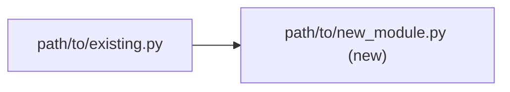
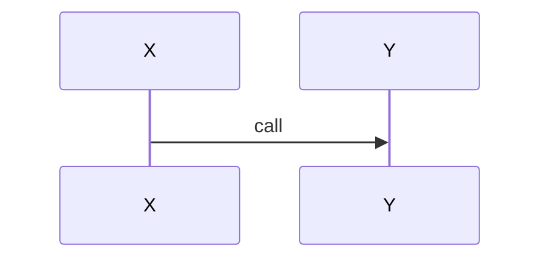
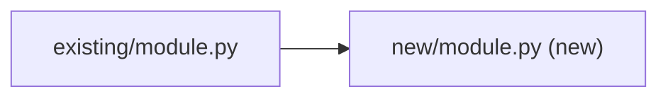
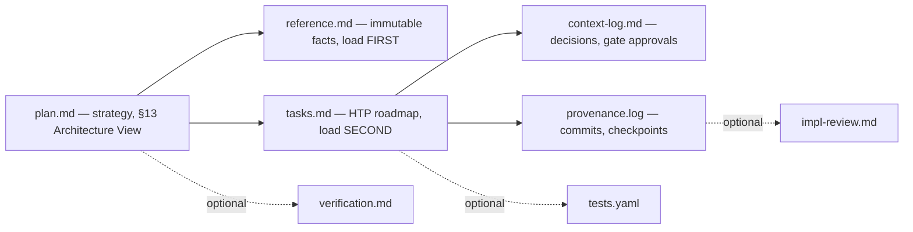
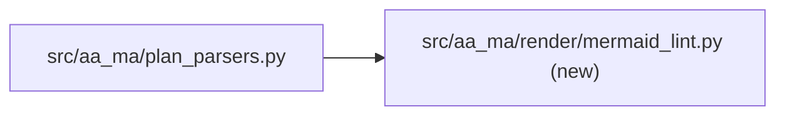
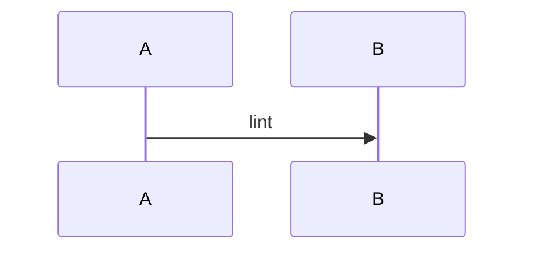
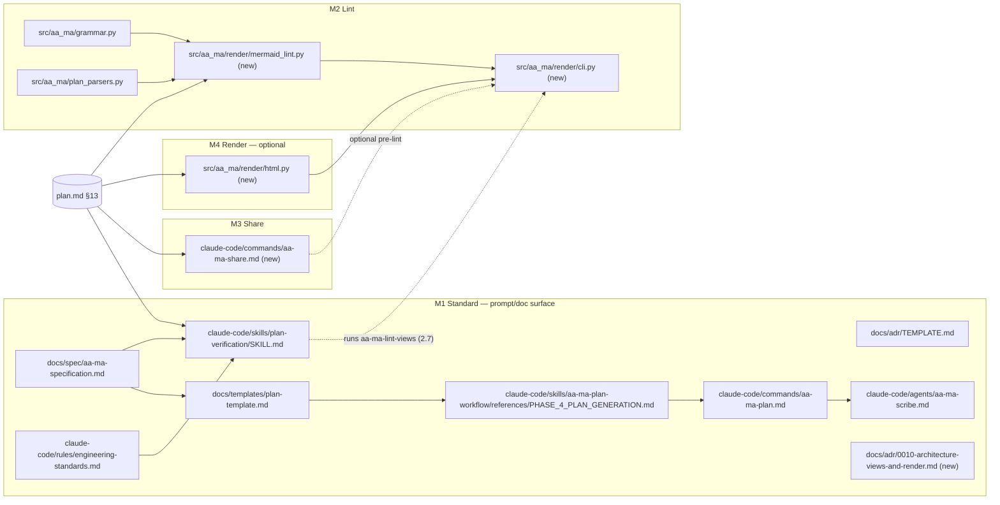
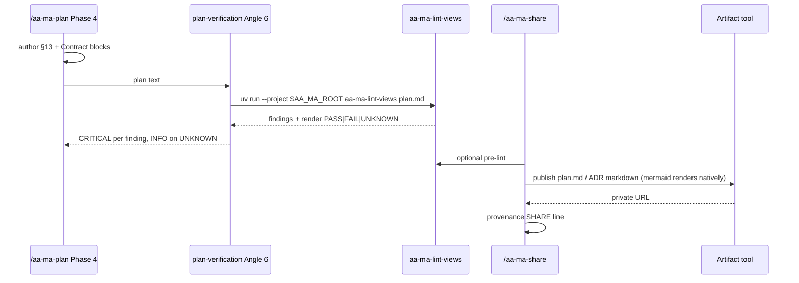

<!-- ARCHIVED: 2026-09-12 16:57 -->
<!-- Plan: plan-architecture-views - COMPLETE -->
<!-- Total Milestones: 4 | Duration: 2026-09-11 to 2026-09-12 -->

# plan-architecture-views Plan

> **For agentic workers:** REQUIRED SUB-SKILL: Use superpowers:subagent-driven-development (recommended) or superpowers:executing-plans to implement this plan task-by-task. Steps use checkbox (`- [ ]`) syntax for tracking. AA-MA execution: `/execute-aa-ma-milestone`.

**Objective:** Make every new AA-MA plan carry a mermaid Architecture View (element #13) and pinned Contract blocks, lint them, share plans/ADRs as private Artifact links, and (last, optional) render markdown to a standalone HTML file.
**Owner:** Ste (Stephen J Newhouse) + Claude Code
**Created:** 2026-09-11
**Last Updated:** 2026-09-12 (rev 4 + release retarget v0.12.0 — 4.5 release-prep label caught by Tier 2 at M4; rev 4 — after plan-eng-review D1–D12; verification pass 1: 6 CRITICAL fixed; pass 2: 2 CRITICAL + 1 WARNING fixed)
**Diagram-Waiver:** none
**Spec:** `docs/superpowers/specs/2026-09-11-plan-architecture-views-design.md` (spec §4.6 `inline_svg`, §4.7 "render → publish" and the M3/M4 order are superseded by this revision; see Plan Review History)
**Target release:** v0.12.0 (from 0.11.0 — v0.11.0 was tagged at 758f125 on 2026-09-12 before M1 started; see context-log 2026-09-12 decision)
**Sequencing:** M1 may start now. M2 requires `milestone-grammar-ssot` M5 merged — not because M5 edits `plan_parsers.py` (it does not; it creates `enforce.py`/`gate.py` and edits `grammar.py`) but because M2 reuses `grammar.split_milestones`, whose trailing-H2 bug M5 fixes.

## 1. Executive Summary

Add plan element #13 (Architecture View: mermaid Component view always, Flow view iff `Critical-Path:` present) and a per-code-milestone Contract block to the AA-MA planning standard, verified by `plan-verification` Angle 6 and grandfathered by `Created:` ≥ 2026-09-11. Ship a pure-Python lint (`aa-ma-lint-views`; `mmdc` render optional and never silently PASS), a `/aa-ma-share` command that publishes the markdown as a private Artifact (Artifacts render mermaid natively), and — last and independently droppable — a markdown→self-contained-HTML renderer (`aa-ma-render`) for the "attach a file" case. Markdown stays the only source.

## Global Constraints

- Python `>=3.11`; `uv` manages the env; `uv run pytest` must exit 0 at every commit (default suite skips `perf`/`slow`). Verify library facts inside `.venv` (`uv run python -c ...`), not the conda env on PATH — `.venv` has markdown-it-py **4.0.0**, the conda env 4.2.0.
- `markdown-it-py>=4,<5` is promoted from transitive (via `rich`) to explicit at M4 — L-055 pattern. No other new runtime dependency.
- `mmdc` (Node) is optional; env seam `MMDC_BIN` (default `mmdc`). mermaid-cli exits 1 for **every** error (missing Chromium included), so: rc≠0 → `UNKNOWN` unless stderr carries a mermaid parse signature (`Parse error on line` or `UnknownDiagramError`) → `FAIL`. Never `PASS` without a non-empty SVG (L-012).
- `Diagram-Waiver:` canonical values: `none | docs-only | config-only | single-file`. Plan-level front-matter. Read **only** by `plan_parsers.parse_diagram_waiver` at planning time. **Not a gate field** — the milestone gate (`enforce.py`, grammar-ssot M5) never reads it; adding it there needs an ADR.
- AA-MA field format is load-bearing (L-011): fields on their own line, plain or `**bold:**` pair, never backtick-wrapped or mid-line.
- Canonical headings in `tasks.md`: `## Milestone N: Title`, `### Sub-step N.M: Title` (`tests/test_active_plans_canonical.py`). Every sub-step in `tasks.md` carries `Mode: HITL|AFK` (`claude-code/rules/aa-ma.md`); the scribe does not add it, so Phase 5 sets it explicitly: HITL for 1.1 (spec wording), 1.7 (ADR), 1.8/2.7/3.3/4.5 (sync + gate), 3.1 (client-facing command text), 4.1 (prototype verdict); AFK for the rest.
- Conventional Commits; footer `[AA-MA Plan] plan-architecture-views .claude/dev/active/plan-architecture-views`.
- Historical docs frozen: no backfill of ADR-0001..0008 or completed plans.
- Hardcoded counts updated together: `CLAUDE.md:48`, `SECURITY.md:11`, `CHANGELOG.md` Unreleased (doc-drift Tier 6).
- `src/aa_ma/render/` is a leaf package; `.importlinter` contract `render-is-leaf` with `root_packages` covering `aa_ma`, mutation-checked.
- Global commands/skills reach repo-local CLIs by resolving the checkout from the install.sh symlink: `ROOT=$(cd "$(dirname "$(readlink -f ~/.claude/commands/aa-ma-share.md)")/../.." && pwd)`; then `uv run --project "$ROOT" <cli>`.
- Renderer never passes raw HTML through: parse with `html: True` so comments tokenise, then render `html_block`/`html_inline` as `""` for comments and escaped text otherwise (fence contents untouched).

## 2. Implementation Steps (ordered)

| # | Milestone | Deliverable | Audit-Profile |
|---|---|---|---|
| M1 | Standard | spec §XI #13 + Contract rule, templates, PHASE_4, scribe, Angle 6 checks #6/#7 (cutover 2026-09-11), engineering-standards table, ADR-0010, spec flow diagram, counts | docs-only |
| M2 | Lint | `parse_diagram_waiver`, `src/aa_ma/render/mermaid_lint.py`, `aa-ma-lint-views` CLI, `.importlinter` contract (mutation-checked), Angle 6 wired | code-only |
| M3 | Share | `claude-code/commands/aa-ma-share.md` publishes the **markdown** as an Artifact; frontmatter test; command count 11→12; `/browse` check | docs-only |
| M4 | Render (optional, last) | `src/aa_ma/render/html.py`, `aa-ma-render` CLI, dep promotion, golden test | code-only |

## 3. Milestones

---

### Milestone 1: Standard — element #13, Contract blocks, verification, exemplar ADR

- Gate: HARD
- Mode: HITL
- Complexity: 45%
- Effort: ~3h
- Audit-Profile: docs-only
- TDD-Waiver: docs-only
- **Critical-Path:** hook-modification
- Measurable goal: `grep -l "Architecture View" docs/spec/aa-ma-specification.md claude-code/skills/plan-verification/SKILL.md docs/templates/plan-template.md docs/adr/TEMPLATE.md claude-code/agents/aa-ma-scribe.md claude-code/skills/aa-ma-plan-workflow/references/PHASE_4_PLAN_GENERATION.md claude-code/commands/aa-ma-plan.md` lists all seven; `uv run pytest tests/commands/test_plan_verification_angle6.py` passes; `docs/adr/0010-*.md` exists with a `## Architecture View` mermaid block; `grep -rnE "\b1[12] (AA-MA |required |mandatory )?(elements|outputs|planning elements)|ALL 12|all 12" claude-code/ docs/spec/ docs/templates/ README.md CLAUDE.md` is empty.

#### Sub-step 1.1: Spec §XI — add element #13 and the Contract-block rule

**Files:** Modify `docs/spec/aa-ma-specification.md:590` (append after item 12; list is `579-590`).

- [ ] Insert after line 590:

```markdown
13. **Architecture View** — a `## 13. Architecture View` section holding mermaid diagrams a cold agent reads before the steps. **Component view** (required): the files/modules/hooks the plan touches and their dependency edges; a node label containing a repo path is a claim checked by `aa-ma-lint-views` unless that label ends with `(new)`; labels containing parentheses must use mermaid's quoted form, e.g. `B["src/new.py (new)"]` — an unquoted `(new)` inside `[...]` is a mermaid parse error. **Flow view** (required iff any milestone carries `Critical-Path:`): sequence or flowchart of the critical execution path being added or changed. **Data/State view** (optional): only when a schema or state machine is introduced. The milestone dependency graph is never hand-authored (derivable from `tasks.md`). The View is required when any milestone has `Audit-Profile ∈ {full, code-only, infra}`; otherwise the plan front-matter carries `**Diagram-Waiver:** <value>` with a canonical value (`none | docs-only | config-only | single-file`). `Diagram-Waiver` is a planning-time field read by `Skill(plan-verification)` via `plan_parsers.parse_diagram_waiver`; it is **not** an execution-gate field. `reference.md` carries one pointer line: `Architecture View: see plan.md §13`. **Contract block:** every milestone with `Audit-Profile ∈ {full, code-only, infra}` carries a `#### Contract` heading followed by ≥1 fenced block pinning file paths, function/CLI signatures, exit codes and field grammar — illustrative snippets are not Contract blocks. **Grandfathering:** `Skill(plan-verification)` Angle 6 flags a missing #13 / Contract block only for plans `Created:` on-or-after **2026-09-11** (the v0.11.0 cutover date, written literally because the tag does not exist while this standard is being adopted).
```

- [ ] Run: `grep -c "^13\. \*\*Architecture View" docs/spec/aa-ma-specification.md` → `1`.
- [ ] Commit: `docs(spec): add planning-standard element #13 Architecture View + Contract-block rule`

#### Sub-step 1.2: engineering-standards.md — Diagram-Waiver canonical table + maintenance rule

**Files:** Modify `claude-code/rules/engineering-standards.md` — after the Critical-Path table (before `### 2. Development Principles`); and §4 Safety & Continuity bullets.

- [ ] Insert after the Critical-Path table:

```markdown
**Diagram-Waiver canonical values** (plan-level front-matter; planning-time only —
read by `Skill(plan-verification)`, never by the milestone gate; novel values are
rejected):

| Value          | Meaning                                                                  |
|----------------|--------------------------------------------------------------------------|
| `none`         | Architecture View present (default when the field is absent)             |
| `docs-only`    | No milestone touches `src/`, `claude-code/hooks/`, or CI                  |
| `config-only`  | `pyproject.toml` / CI / dotfiles only                                     |
| `single-file`  | Exactly one non-test file changes; a diagram would have one node          |

A waiver is invalid when any milestone declares `Audit-Profile ∈ {full, code-only, infra}`.
```

- [ ] Add to §4 bullets: `- **Diagram maintenance is part of the change** — when a step changes a file named in the Architecture View, update the View in the same commit; stale diagrams mislead more than absent ones (\`aa-ma-lint-views\` reports \`STALE_PATH\`).`
- [ ] Commit: `docs(rules): Diagram-Waiver canonical values + diagram-maintenance rule`

#### Sub-step 1.3: plan-template.md — add §12 (stale fix) and §13, Contract example

**Files:** Modify `docs/templates/plan-template.md` (front-matter `11-12`; under `### Milestone 1` `35-76`; before `## Next Action` `137`).

- [ ] After line 12 add `**Diagram-Waiver:** none`.
- [ ] Under `### Milestone 1` (before `#### Step 1.1`) add:

````markdown
#### Contract
```text
# file: path/to/module.py
def function(arg: Type) -> ReturnType
# CLI: tool <arg> [--flag]   exit 0 ok / 1 findings / 2 usage
```
````

- [ ] Before `## Next Action` add:

````markdown
## 12. Engineering Standards Declaration

| Theme | Applies | Rationale |
|---|---|---|
| 1 Verification & Truth | yes/no | [one sentence] |
| 2 Development Principles | yes/no | [one sentence] |
| 3 Reasoning & Planning | yes/no | [one sentence] |
| 4 Safety & Continuity | yes/no | [one sentence] |
| 5 Execution Checklist | yes/no | [one sentence] |
| 6 Sync & Commit Discipline | yes/no | [one sentence] |

## 13. Architecture View

### Component view


### Flow view
<!-- required iff any milestone carries Critical-Path: -->

````

- [ ] Run: `grep -c "^## 1[23]\." docs/templates/plan-template.md` → `2`.
- [ ] Commit: `docs(templates): plan-template gains §12 (missing since v0.5.0) and §13 Architecture View`

#### Sub-step 1.4: ADR template — recommended Architecture View + Example

**Files:** Modify `docs/adr/TEMPLATE.md` — insert between `## Consequences` (49) and `## Implementation Notes` (60).

- [ ] Insert:

````markdown
## Architecture View (recommended)

<!-- Component view only: what this decision touches and how it depends. Delete if the decision has no structural footprint. -->


## Example (recommended)

<!-- One fenced block showing the decision in use: a command, a config stanza, a signature. -->
```text
```
````

- [ ] Commit: `docs(adr): template gains recommended Architecture View + Example sections`

#### Sub-step 1.5: PHASE_4, aa-ma-plan command, scribe — 13 elements everywhere

**Files:** every live site the gate grep returns — **29 at planning time** (the full `file:line` list is pinned in `reference.md` §"Element-count sites"; re-run the grep at execution, do not trust the line numbers). Headline files: `PHASE_4_PLAN_GENERATION.md` (65,70,141,193,257,275), `claude-code/commands/aa-ma-plan.md` (445,457,462,492,678,684), `claude-code/agents/aa-ma-scribe.md` (42,237), `claude-code/agents/aa-ma-validator.md` (48,146), `claude-code/skills/aa-ma-plan-workflow/SKILL.md` (65,222,229,415), `PHASE_5_ARTIFACT_CREATION.md` (136,315), `SKILL_INTEGRATION.md:257`, `templates/validation-checklist.md:64`, `claude-code/rules/aa-ma.md:115` (auto-loaded rule: "12 outputs" → 13, and the list itself gains item 13), `docs/templates/plan-template.md` (6,31), `docs/templates/README.md:9`, `docs/spec/claude-code-foundations.md` (75,150), `README.md:100`, `CLAUDE.md:91`. Frozen history is NOT touched and is outside the gate: `docs/adr/0001-*.md`, `docs/narrative/*`, `docs/runbooks/*`, `docs/plans/*`.

- [ ] PHASE_4: line 141 `ALL 12` → `ALL 13`; after item 12 add `13. Architecture View (mermaid Component view; Flow view iff Critical-Path present; or a canonical Diagram-Waiver) and a #### Contract block per milestone with Audit-Profile ∈ {full, code-only, infra}`; line 193 `all 12` → `all 13`. Add under the list: `Notation: mermaid is the canonical View. If Phase 4.2 plan-eng-review proposes ASCII diagrams, keep them as illustration; §13 must stay mermaid.`
- [ ] aa-ma-plan.md: 445 `ALL 12` → `ALL 13`; after 457 add item 13 (same text); 462 `all 12` → `all 13`; after 492 add `13. Architecture View + Contract blocks (mermaid; spec §XI item 13)`. In Step 5.3 (line ~684) add: `- Append the pointer line \`Architecture View: see plan.md §13\` (or \`Architecture View: waived (<value>)\`).`
- [ ] scribe: line 42 `all 11 AA-MA elements` → `all 13 AA-MA elements`, extend the enumerated list with `12. Engineering Standards Declaration` and `13. Architecture View + Contract blocks (mermaid fences copied verbatim; never reflowed)`; line 237 `all 11` → `all 13`; File 2 extraction rules add `- Pointer line: \`Architecture View: see plan.md §13\``.
- [ ] Update every site listed above to 13 (`11`/`12` → `13`; "12 mandatory outputs" → "13 mandatory outputs").
- [ ] Run: `grep -rnE "\b1[12] (AA-MA |required |mandatory )?(elements|outputs|planning elements)|ALL 12|all 12" claude-code/ docs/spec/ docs/templates/ README.md CLAUDE.md` → no hits (live surface only; `docs/adr/`, `docs/narrative/`, `docs/runbooks/`, `docs/plans/` are frozen history per CLAUDE.md and deliberately outside the gate — at HEAD the scoped grep returns 29 live sites, so the gate is real). Spec docs are *copied* into `~/.claude/docs/` by install.sh (CLAUDE.md Key Constraints) — re-run `scripts/install.sh` after M1 so the installed copy matches.
- [ ] Commit: `docs(workflow): Phase 4, scribe and command enumerate 13 plan elements`

#### Sub-step 1.6: plan-verification Angle 6 — checks #6 and #7 (hook-modification surface)

**Files:** Modify `claude-code/skills/plan-verification/SKILL.md:374-395`. Create `tests/commands/test_plan_verification_angle6.py`.

- [ ] Write the failing test:

```python
"""Angle 6 must name the v0.11.0 structural checks; text drift here silently disables them (L-010)."""
from pathlib import Path

SKILL = Path(__file__).resolve().parents[2] / "claude-code" / "skills" / "plan-verification" / "SKILL.md"


def test_angle6_names_architecture_view_check() -> None:
    text = SKILL.read_text()
    assert "6. **Architecture View present or validly waived" in text
    assert "7. **Contract block per code milestone" in text
    assert "2026-09-11" in text  # literal cutover date, not "the v0.11.0 release date"


def test_angle6_lists_waiver_values() -> None:
    # At M2.7 this test is upgraded to import CANONICAL_DIAGRAM_WAIVERS (precedent:
    # test_enum_matches_engineering_standards_table) so prose and code cannot drift.
    text = SKILL.read_text()
    for v in ("none", "docs-only", "config-only", "single-file"):
        assert f"`{v}`" in text
```

- [ ] Run: `uv run pytest tests/commands/test_plan_verification_angle6.py -v` → FAIL.
- [ ] Insert after check #5 (line 378):

```markdown
6. **Architecture View present or validly waived (v0.12.0+).** For plans `Created:`
   on-or-after **2026-09-11**: either `## 13. Architecture View` exists with a
   `### Component view` containing a non-empty ```` ```mermaid ```` fence (plus a
   `### Flow view` when any milestone carries `Critical-Path:`), or the front-matter
   carries `**Diagram-Waiver:** <value>` with a canonical value (`none`, `docs-only`,
   `config-only`, `single-file`). A waiver alongside any milestone whose
   `Audit-Profile` ∈ {full, code-only, infra} is CRITICAL. Novel waiver value is
   CRITICAL. Until `aa-ma-lint-views` ships (plan-architecture-views M2), check by
   grep: `grep -nE '^\*\*Diagram-Waiver:\*\* \S' plan.md`.
7. **Contract block per code milestone (v0.12.0+).** Every milestone with
   `Audit-Profile` ∈ {full, code-only, infra} has a `#### Contract` heading followed
   by at least one fenced block. Missing → CRITICAL; the fresh-agent simulation
   (Angle 5) treats an unpinned signature as a WARNING at minimum.
```

- [ ] Grandfathering block: `Checks #6 and #7 fire only for plans whose \`Created:\` is on-or-after 2026-09-11; earlier plans emit \`[INFO] Pre-2026-09-11 plan — Architecture View check skipped\`.`
- [ ] Run test → PASS; `uv run pytest -q` → 0 failures.
- [ ] provenance.log: `[ts] CRITICAL_PATH_REVIEW — hook-modification: Angle 6 gained checks #6/#7; literal cutover 2026-09-11; milestone-grammar-ssot (Created 2026-08) cannot be flagged`.
- [ ] Commit: `feat(plan-verification): Angle 6 checks #6 Architecture View and #7 Contract block`

#### Sub-step 1.7: ADR-0010 exemplar + spec flow diagram + INDEX row

**Files:** Create `docs/adr/0010-architecture-views-and-render.md`; Modify `docs/adr/INDEX.md` (append row); Modify `docs/spec/aa-ma-specification.md` (one mermaid diagram directly below the AA-MA file-system table in §II).

- [ ] ADR-0010 per the amended template: Context (0/10 plans, 0/8 ADRs have diagrams; fresh-agent failures on unpinned signatures), Drivers (cold-agent readability, no drift, no new runtime deps), Options (A mermaid mandate-with-waiver; B docs-only recommend; C C4/Structurizr; D D2), Outcome A, Consequences (+cold-executability; −stricter than MADR/arc42; −mmdc optional Node dep; Diagram-Waiver is planning-time only), **Architecture View** = this plan's §13 Component view, **Example** = the front-matter + §13 snippet from spec §4.1, References (spec doc, MADR, arc42 §5, Spec Kit, MermaidSeqBench arXiv:2511.14967).
- [ ] INDEX.md: append as the next row (number **0010** — 0009 is reserved by milestone-grammar-ssot sub-step 5.8; use 0010 even if 0009 has not landed yet): `| [0010](0010-architecture-views-and-render.md) | Architecture Views (element #13), Contract blocks, mermaid lint, Artifact Share and HTML Render | Accepted | 2026-09-11 |`
- [ ] Spec §II diagram:

````markdown

````

- [ ] Verify both fences in VS Code markdown preview: pass iff each renders a diagram with no "Syntax error in text" box; write `preview: OK|FAIL` per fence into the Result Log.
- [ ] Commit: `docs(adr): ADR-0010 architecture views + share/render; spec §II flow diagram`

#### Sub-step 1.8: Counts, CHANGELOG, cross-reference check, sync

- [ ] `CHANGELOG.md` under `## Unreleased` (line 7): `### Added` bullets (element #13, Contract blocks, Diagram-Waiver, ADR-0010, template §12 fix). No version heading (L-003).
- [ ] Cross-reference: `grep -rn "aa-ma-lint-views\|aa-ma-render\|aa-ma-share" claude-code/ docs/ | grep -v "docs/superpowers\|\.claude/dev"` → every hit carries an "(M2/M3/M4)" qualifier; nothing claims the tools exist yet.
- [ ] `uv run pytest -q` → 0 failures; `bats tests/hooks` → 0 not ok.
- [ ] Sync `tasks.md` Result Logs, `reference.md`, `context-log.md` gate approval, `provenance.log`; commit `docs(aa-ma): M1 complete — planning standard element #13`.

**Milestone 1 tests:** `tests/commands/test_plan_verification_angle6.py` (2); full pytest; bats; greps in 1.1, 1.3, 1.5, 1.8.
**Rollback:** `git revert` the M1 range — docs/prompt only.
**Risks:** (1) three prose copies of the 13-element list drift — 1.5 grep + Angle 6 test; (2) Angle 6 text change breaks an existing string assertion — full suite in 1.6; (3) ADR-0010 front-loads decisions later milestones adjust — `Accepted` now, `Implemented` at M3 close.

---

### Milestone 2: Lint — Diagram-Waiver parser, mermaid structural lint, `aa-ma-lint-views`

- Gate: HARD
- Mode: AFK
- Dependencies: Milestone 1; `milestone-grammar-ssot` M5 merged (`grammar.split_milestones` trailing-H2 fix)
- Complexity: 55%
- Effort: ~4.5h
- Audit-Profile: code-only
- **Critical-Path:** data-xform
- Measurable goal: `uv run aa-ma-lint-views .claude/dev/active/plan-architecture-views/plan-architecture-views-plan.md --repo-root .` exits 0 and prints `render: UNKNOWN` (no working mmdc on BATS: chrome-headless-shell is absent) — `render: PASS` is asserted only via the fake-binary tests; `uv run pytest tests/render tests/codemem/test_diagram_waiver_parser.py` ≥ 49 tests pass (`uv run pytest tests/render tests/codemem/test_diagram_waiver_parser.py --collect-only -q | tail -1` — recount at execution; hand tally: 15 + 28 + 6); `uv run lint-imports` passes and the mutation step breaks it.

#### Contract

```python
# file: src/aa_ma/plan_parsers.py  (append)
CANONICAL_DIAGRAM_WAIVERS: frozenset[str] = frozenset({"none", "docs-only", "config-only", "single-file"})
def parse_diagram_waiver(text: str) -> tuple[str | None, bool, str | None]   # planning-time only; never a gate field

# file: src/aa_ma/render/__init__.py   (docstring only)
# file: src/aa_ma/render/mermaid_lint.py
KNOWN_TYPES: tuple[str, ...]
CODE_AUDIT_PROFILES: frozenset[str] = frozenset({"full", "code-only", "infra"})
PARSE_ERROR_SIGNATURES: tuple[str, ...] = ("Parse error on line", "UnknownDiagramError")
@dataclass(frozen=True) class Finding: code: str; line: int; message: str
@dataclass(frozen=True) class LintReport: findings: tuple[Finding, ...]; render_status: str  # PASS|FAIL|UNKNOWN
def lint_text(plan_text: str, repo_root: Path, *, tasks_text: str = "") -> LintReport
def lint_plan(plan_path: Path, repo_root: Path, *, tasks_path: Path | None = None) -> LintReport
def render_check(sources: Sequence[str], *, timeout_s: float = 90.0) -> str
# file: src/aa_ma/render/cli.py
def lint_main(argv: Sequence[str] | None = None) -> int        # 0 clean / 1 findings / 2 usage
# CLI: aa-ma-lint-views <plan.md> [--repo-root DIR] [--tasks FILE]
# pyproject [project.scripts]: aa-ma-lint-views = "aa_ma.render.cli:lint_main"
# finding codes: NO_SECTION NO_COMPONENT_VIEW NO_FLOW_VIEW EMPTY_FENCE UNKNOWN_TYPE STALE_PATH
#                WAIVER_INVALID WAIVER_NOT_ALLOWED AUDIT_PROFILE_INVALID
# .importlinter: root_packages = codemem, aa_ma (replaces root_package); contract render-is-leaf
```

#### Sub-step 2.1: RED — `parse_diagram_waiver`

**Files:** Create `tests/codemem/test_diagram_waiver_parser.py`.

- [ ] Write:

```python
"""Diagram-Waiver: plan-level, planning-time field; same fail-closed contract as TDD-Waiver (L-011)."""
import pytest

from aa_ma.plan_parsers import CANONICAL_DIAGRAM_WAIVERS, parse_diagram_waiver


class TestCanonical:
    @pytest.mark.parametrize("v", sorted(CANONICAL_DIAGRAM_WAIVERS))
    def test_plain_form(self, v: str) -> None:
        assert parse_diagram_waiver(f"# Plan\n**Created:** 2026-09-11\nDiagram-Waiver: {v}\n") == (v, True, None)

    @pytest.mark.parametrize("v", sorted(CANONICAL_DIAGRAM_WAIVERS))
    def test_bold_pair_form(self, v: str) -> None:
        assert parse_diagram_waiver(f"**Diagram-Waiver:** {v}\n") == (v, True, None)


class TestRejection:
    @pytest.mark.parametrize("bad", ["NONE", "docs only", "waived", "single_file", "**none**"])
    def test_non_canonical(self, bad: str) -> None:
        value, ok, err = parse_diagram_waiver(f"Diagram-Waiver: {bad}\n")
        assert ok is False and err

    def test_absent_is_none_and_valid(self) -> None:
        assert parse_diagram_waiver("# Plan\n") == (None, True, None)

    def test_backtick_wrapped_is_not_seen(self) -> None:
        # L-011: backtick-wrapped fields are invisible to the grammar (verified: _extract_field rejects them).
        assert parse_diagram_waiver("`Diagram-Waiver: none`\n")[0] is None
```

- [ ] Run → ImportError. Commit: `test(parsers): RED — Diagram-Waiver canonical parser`

#### Sub-step 2.2: GREEN — parser

**Files:** Modify `src/aa_ma/plan_parsers.py` (constant after `CANONICAL_CRITICAL_PATHS`; function after `parse_critical_path`).

```python
def parse_diagram_waiver(text: str) -> tuple[str | None, bool, str | None]:
    """Parse plan-level `Diagram-Waiver:` (front-matter of `[task]-plan.md`).

    Planning-time only: read by `Skill(plan-verification)` Angle 6 and `aa-ma-lint-views`.
    The milestone gate (`aa_ma.enforce`) does not read this field — see ADR-0010.
    Absent → (None, True, None); the caller applies the `none` default.
    """
    return _parse_canonical_field(text, "Diagram-Waiver", CANONICAL_DIAGRAM_WAIVERS)
```

- [ ] Run tests → PASS. Commit: `feat(parsers): GREEN — parse_diagram_waiver with canonical values`

#### Sub-step 2.3: RED — structural lint fixtures and tests

**Files:** Create `tests/render/__init__.py`, `tests/render/conftest.py`, `tests/render/fixtures/*.md`, `tests/render/test_mermaid_lint.py`.

- [ ] `conftest.py` — no test may reach a real `mmdc`:

```python
import pytest


@pytest.fixture(autouse=True)
def _no_real_mmdc(monkeypatch: pytest.MonkeyPatch) -> None:
    monkeypatch.setenv("MMDC_BIN", "/nonexistent/mmdc")
```

- [ ] `fixtures/plan_ok.md`:

````markdown
# Fixture Plan
**Created:** 2026-09-11
**Diagram-Waiver:** none

## 13. Architecture View
### Component view

### Flow view


### Milestone 1: Code
- Audit-Profile: code-only
- **Critical-Path:** data-xform
````

  Fixtures use `### Milestone` — the real plan-template form — so the lint is tested against what plans actually contain. Derive one fixture per change: `plan_no_section.md` (delete §13); `plan_no_component.md` (§13 present, only a Flow view); `plan_empty_fence.md` (empty Component fence); `plan_unknown_type.md` (first line `venn`); `plan_stale_path.md` (`src/aa_ma/nope.py`, no `(new)`); `plan_two_labels.md` (one line: `A[src/aa_ma/nope.py] --> B["src/aa_ma/x.py (new)"]` — must still report `nope.py`); `plan_waiver_invalid.md` (`Diagram-Waiver: waived`); `plan_waiver_not_allowed.md` (`docs-only` + `Audit-Profile: code-only`); `plan_waived_docs_only.md` (`docs-only`, `Audit-Profile: docs-only`, no §13 — clean); `plan_flow_required.md` (Flow view removed, Critical-Path kept); `plan_fenced_example.md` (`Audit-Profile: docs-only` real, plus a ```` ```markdown ```` fence *quoting* `- Audit-Profile: code-only` — must be clean); `plan_data_state.md` (adds `### Data/State view` with `stateDiagram-v2` — clean); `plan_section_last.md` (§13 is the final H2 — clean); `plan_two_fences.md` (Component view with a valid fence then a `venn` fence → UNKNOWN_TYPE); `plan_heading_nodot.md` (`## 13 Architecture View` — clean); `plan_bad_audit.md` (`Audit-Profile: whatever` → AUDIT_PROFILE_INVALID).

- [ ] Tests:

```python
from pathlib import Path
import pytest
from aa_ma.render.mermaid_lint import lint_plan

REPO = Path(__file__).resolve().parents[2]
FIX = Path(__file__).parent / "fixtures"


def codes(name: str) -> set[str]:
    return {f.code for f in lint_plan(FIX / name, REPO).findings}


def test_ok_plan_has_no_findings() -> None:
    rep = lint_plan(FIX / "plan_ok.md", REPO)
    assert rep.findings == () and rep.render_status == "UNKNOWN"


@pytest.mark.parametrize("name,code", [
    ("plan_no_section.md", "NO_SECTION"),
    ("plan_no_component.md", "NO_COMPONENT_VIEW"),
    ("plan_empty_fence.md", "EMPTY_FENCE"),
    ("plan_unknown_type.md", "UNKNOWN_TYPE"),
    ("plan_stale_path.md", "STALE_PATH"),
    ("plan_two_labels.md", "STALE_PATH"),
    ("plan_waiver_invalid.md", "WAIVER_INVALID"),
    ("plan_waiver_not_allowed.md", "WAIVER_NOT_ALLOWED"),
    ("plan_flow_required.md", "NO_FLOW_VIEW"),
    ("plan_two_fences.md", "UNKNOWN_TYPE"),
    ("plan_bad_audit.md", "AUDIT_PROFILE_INVALID"),
])
def test_finding_codes(name: str, code: str) -> None:
    assert code in codes(name)


@pytest.mark.parametrize("name", [
    "plan_waived_docs_only.md", "plan_fenced_example.md", "plan_data_state.md",
    "plan_section_last.md", "plan_heading_nodot.md",
])
def test_clean_variants(name: str) -> None:
    assert codes(name) == set()


def test_stale_path_reports_line_number() -> None:
    f = [x for x in lint_plan(FIX / "plan_stale_path.md", REPO).findings if x.code == "STALE_PATH"][0]
    assert f.line > 0 and "src/aa_ma/nope.py" in f.message


def test_plan_h3_milestones_are_read_without_tasks() -> None:
    # Angle 6 runs before tasks.md exists; ### Milestone in plan.md must be enough.
    assert "NO_FLOW_VIEW" in codes("plan_flow_required.md")


def test_tasks_override_supplies_critical_path(tmp_path: Path) -> None:
    plan = tmp_path / "foo.md"
    plan.write_text((FIX / "plan_flow_required.md").read_text().split("### Milestone 1")[0])
    tasks = tmp_path / "t.md"
    tasks.write_text("## Milestone 1: X\n- Audit-Profile: code-only\n- **Critical-Path:** data-xform\n")
    assert "NO_FLOW_VIEW" in {f.code for f in lint_plan(plan, REPO, tasks_path=tasks).findings}
```

- [ ] Run → ModuleNotFoundError. Commit: `test(render): RED — mermaid structural lint fixtures`

#### Sub-step 2.4: GREEN — `mermaid_lint.py`

**Files:** Create `src/aa_ma/render/__init__.py` (`"""Derived views of AA-MA markdown: lint, Render. Leaf package — nothing in aa_ma imports it."""`), `src/aa_ma/render/mermaid_lint.py`.

```python
"""Structural lint for plan.md §13 Architecture View. Pure Python; mmdc optional (L-012)."""
from __future__ import annotations

import os
import re
import shutil
import subprocess
import tempfile
from collections.abc import Sequence
from dataclasses import dataclass
from pathlib import Path

from aa_ma.grammar import split_milestones, strip_fenced_blocks
from aa_ma.plan_parsers import parse_audit_profile, parse_critical_path, parse_diagram_waiver

KNOWN_TYPES: tuple[str, ...] = ("flowchart", "graph", "sequenceDiagram", "classDiagram",
                                "stateDiagram-v2", "erDiagram", "C4Context", "C4Container", "C4Component")
CODE_AUDIT_PROFILES = frozenset({"full", "code-only", "infra"})
PARSE_ERROR_SIGNATURES: tuple[str, ...] = ("Parse error on line", "UnknownDiagramError")
_SECTION_RE = re.compile(r"^## (?:13\.?[ \t]+)?Architecture View[ \t]*$", re.M)
_H2_RE = re.compile(r"^## ", re.M)
_VIEW_RE = re.compile(r"^### (Component|Flow|Data/State) view[ \t]*$", re.M)
_FENCE_RE = re.compile(r"^```mermaid[ \t]*\n(.*?)^```[ \t]*$", re.M | re.S)
_LABEL_RE = re.compile(r"\[([^\]]*)\]")
_PATH_RE = re.compile(r"[A-Za-z0-9_./-]+/[A-Za-z0-9_.-]+\.(?:md|py|sh|yaml|yml|toml|json|bats)")
_PLAN_MILESTONE_H3 = re.compile(r"^###([ \t]+Milestone\b)", re.M)


@dataclass(frozen=True)
class Finding:
    code: str
    line: int
    message: str


@dataclass(frozen=True)
class LintReport:
    findings: tuple[Finding, ...]
    render_status: str  # PASS | FAIL | UNKNOWN


def _line(text: str, pos: int) -> int:
    return text.count("\n", 0, pos) + 1


def _milestone_facts(text: str) -> tuple[bool, bool, list[str]]:
    """(any code Audit-Profile, any Critical-Path, Audit-Profile errors) — fences stripped first.

    plan.md writes milestones as `### Milestone N:` (plan-template.md:35) while grammar's
    MILESTONE_RE is `## Milestone N:` (the tasks.md form). Promote H3 milestones to H2 so a
    brand-new plan — the case Angle 6 runs on, before any tasks.md exists — is readable.
    """
    code = crit = False
    errors: list[str] = []
    normalised = _PLAN_MILESTONE_H3.sub(r"##\1", strip_fenced_blocks(text))
    for block in split_milestones(normalised):
        value, ok, err = parse_audit_profile(block.text)
        if not ok:
            errors.append(f"milestone {block.number}: {err}")
        elif value in CODE_AUDIT_PROFILES:
            code = True
        if parse_critical_path(block.text)[0] is not None:
            crit = True
    return code, crit, errors


def _views(section: str) -> dict[str, tuple[int, str]]:
    heads = list(_VIEW_RE.finditer(section))
    out: dict[str, tuple[int, str]] = {}
    for i, m in enumerate(heads):
        end = heads[i + 1].start() if i + 1 < len(heads) else len(section)
        out[m.group(1)] = (m.start(), section[m.end():end])
    return out


def _stale_paths(src: str, repo_root: Path) -> list[tuple[int, str]]:
    """Path claims per [label]; a label ending in '(new)' is exempt, other labels on the line are not."""
    hits: list[tuple[int, str]] = []
    for ln, line in enumerate(src.splitlines(), start=1):
        for label in _LABEL_RE.findall(line):
            label = label.strip().strip('"')  # mermaid quoted-label form: ["path (new)"]
            if label.endswith("(new)"):
                continue
            hits += [(ln, p) for p in _PATH_RE.findall(label) if not (repo_root / p).exists()]
    return hits


def lint_text(plan_text: str, repo_root: Path, *, tasks_text: str = "") -> LintReport:
    out: list[Finding] = []
    code_ms, has_crit, audit_errors = _milestone_facts(plan_text + "\n" + tasks_text)
    out += [Finding("AUDIT_PROFILE_INVALID", 1, e) for e in audit_errors]
    front = plan_text.split("\n## ", 1)[0]
    waiver, ok, err = parse_diagram_waiver(front)
    waiver = waiver or "none"
    if not ok:
        out.append(Finding("WAIVER_INVALID", 1, err or "non-canonical Diagram-Waiver"))
    elif waiver != "none" and code_ms:
        out.append(Finding("WAIVER_NOT_ALLOWED", 1, f"Diagram-Waiver: {waiver} but a milestone has a code Audit-Profile"))
    m = _SECTION_RE.search(plan_text)
    if m is None:
        if ok and waiver == "none":
            out.append(Finding("NO_SECTION", 1, "missing '## 13. Architecture View'"))
        return LintReport(tuple(out), "UNKNOWN")
    nxt = _H2_RE.search(plan_text, m.end())
    section = plan_text[m.start():nxt.start() if nxt else len(plan_text)]
    base = _line(plan_text, m.start()) - 1
    views = _views(section)
    if "Component" not in views:
        out.append(Finding("NO_COMPONENT_VIEW", base + 1, "missing '### Component view'"))
    if has_crit and "Flow" not in views:
        out.append(Finding("NO_FLOW_VIEW", base + 1, "Critical-Path present but no '### Flow view'"))
    sources: list[str] = []
    for name, (pos, body) in views.items():
        vline = base + _line(section, pos)
        fences = [f for f in _FENCE_RE.findall(body) if f.strip()]
        if not fences:
            out.append(Finding("EMPTY_FENCE", vline, f"{name} view has no non-empty mermaid fence"))
            continue
        for src in fences:
            first = src.strip().splitlines()[0].split()[0]
            if first not in KNOWN_TYPES:
                out.append(Finding("UNKNOWN_TYPE", vline, f"{name} view: unknown diagram type '{first}'"))
            out += [Finding("STALE_PATH", vline + ln, f"{p} not found (suffix the label with '(new)' if planned)")
                    for ln, p in _stale_paths(src, repo_root)]
            sources.append(src)
    return LintReport(tuple(out), render_check(sources))


def lint_plan(plan_path: Path, repo_root: Path, *, tasks_path: Path | None = None) -> LintReport:
    if tasks_path is None:
        cand = plan_path.with_name(plan_path.name.replace("-plan.md", "-tasks.md"))
        tasks_path = cand if cand != plan_path and cand.is_file() else None
    return lint_text(plan_path.read_text(), repo_root,
                     tasks_text=tasks_path.read_text() if tasks_path else "")


def render_check(sources: Sequence[str], *, timeout_s: float = 90.0) -> str:
    """PASS iff every source yields a non-empty SVG via MMDC_BIN; FAIL only on a mermaid parse
    error (stderr signature); UNKNOWN for everything else — mermaid-cli exits 1 for *all* errors,
    including a missing Chromium, so rc alone cannot distinguish a bad diagram from a bad install (L-012).
    """
    binary = shutil.which(os.environ.get("MMDC_BIN", "mmdc"))
    if binary is None or not sources:
        return "UNKNOWN"
    for src in sources:
        with tempfile.TemporaryDirectory() as d:
            inp, out = Path(d) / "in.mmd", Path(d) / "out.svg"
            inp.write_text(src)
            try:
                proc = subprocess.run([binary, "-i", str(inp), "-o", str(out)],
                                      capture_output=True, text=True, timeout=timeout_s)
            except (OSError, subprocess.TimeoutExpired):
                return "UNKNOWN"
            if proc.returncode != 0:
                return "FAIL" if any(s in proc.stderr for s in PARSE_ERROR_SIGNATURES) else "UNKNOWN"
            if not out.is_file() or out.stat().st_size == 0:
                return "UNKNOWN"
    return "PASS"
```

- [ ] Run `uv run pytest tests/render -q` → PASS; `uv run ruff check src/ && uv run ruff format --check src/`.
- [ ] Commit: `feat(render): GREEN — mermaid structural lint reusing grammar + plan_parsers`

#### Sub-step 2.5: mmdc seam tests (mutation-guarded)

**Files:** Append to `tests/render/test_mermaid_lint.py`.

```python
import stat

from aa_ma.render.mermaid_lint import render_check

SRC = ["flowchart LR\n  A --> B\n"]


def _fake(tmp_path: Path, body: str) -> str:
    p = tmp_path / "mmdc"
    p.write_text("#!/bin/sh\n" + body)
    p.chmod(p.stat().st_mode | stat.S_IEXEC)
    return str(p)


@pytest.mark.parametrize("binary", ["/nonexistent/mmdc", "true"])
def test_degraded_binaries_are_unknown(monkeypatch, binary):
    monkeypatch.setenv("MMDC_BIN", binary)
    assert render_check(SRC) == "UNKNOWN"


def test_exit_1_without_parse_signature_is_unknown(monkeypatch, tmp_path):
    # Real case measured on BATS: valid diagram, rc 1, "Could not find chrome-headless-shell".
    monkeypatch.setenv("MMDC_BIN", _fake(tmp_path, 'echo "Could not find chrome-headless-shell" >&2\nexit 1\n'))
    assert render_check(SRC) == "UNKNOWN"


def test_parse_error_signature_is_fail(monkeypatch, tmp_path):
    monkeypatch.setenv("MMDC_BIN", _fake(tmp_path, 'echo "Parse error on line 2:" >&2\nexit 1\n'))
    assert render_check(SRC) == "FAIL"


def test_svg_output_is_pass(monkeypatch, tmp_path):
    monkeypatch.setenv("MMDC_BIN", _fake(tmp_path, 'printf "<svg/>" > "$4"\nexit 0\n'))  # $4 = -o path
    assert render_check(SRC) == "PASS"


def test_rc0_empty_output_is_unknown(monkeypatch, tmp_path):
    monkeypatch.setenv("MMDC_BIN", _fake(tmp_path, ': > "$4"\nexit 0\n'))
    assert render_check(SRC) == "UNKNOWN"


def test_timeout_is_unknown(monkeypatch, tmp_path):
    monkeypatch.setenv("MMDC_BIN", _fake(tmp_path, "sleep 2\n"))
    assert render_check(SRC, timeout_s=0.2) == "UNKNOWN"


def test_no_sources_is_unknown(monkeypatch, tmp_path):
    monkeypatch.setenv("MMDC_BIN", _fake(tmp_path, 'printf "<svg/>" > "$4"\n'))
    assert render_check([]) == "UNKNOWN"
```

- [ ] Run → PASS. Commit: `test(render): mmdc seam — UNKNOWN unless a real parse error; timeout; empty svg`

#### Sub-step 2.6: CLI + entry point + import-linter contract (mutation-checked)

**Files:** Create `src/aa_ma/render/cli.py`, `tests/render/test_cli.py`; Modify `pyproject.toml:31-33`, `.importlinter`.

- [ ] Tests:

```python
from pathlib import Path

import pytest

from aa_ma.render.cli import lint_main

REPO = Path(__file__).resolve().parents[2]
FIX = Path(__file__).parent / "fixtures"


def test_clean_plan_exit_0(capsys):
    assert lint_main([str(FIX / "plan_ok.md"), "--repo-root", str(REPO)]) == 0
    assert "render: UNKNOWN" in capsys.readouterr().out


def test_findings_exit_1(capsys):
    assert lint_main([str(FIX / "plan_stale_path.md"), "--repo-root", str(REPO)]) == 1
    assert "STALE_PATH" in capsys.readouterr().out


@pytest.mark.parametrize("argv", [[], ["/nonexistent.md"], [str(FIX)]])  # missing / not a file / directory
def test_usage_exit_2(argv, capsys):
    assert lint_main(argv) == 2
    assert "usage" in capsys.readouterr().err.lower()


def test_tasks_flag(tmp_path, capsys):
    plan = tmp_path / "foo.md"
    plan.write_text((FIX / "plan_flow_required.md").read_text().split("### Milestone 1")[0])
    tasks = tmp_path / "t.md"
    tasks.write_text("## Milestone 1: X\n- **Critical-Path:** data-xform\n")
    assert lint_main([str(plan), "--repo-root", str(REPO), "--tasks", str(tasks)]) == 1
    assert "NO_FLOW_VIEW" in capsys.readouterr().out
```

- [ ] Implement:

```python
"""Console entry points for aa_ma.render. argparse, like aa_ma.tui.__main__."""
from __future__ import annotations

import argparse
from collections.abc import Sequence
from pathlib import Path

from aa_ma.render.mermaid_lint import lint_plan


def lint_main(argv: Sequence[str] | None = None) -> int:
    p = argparse.ArgumentParser(prog="aa-ma-lint-views", description="Lint plan.md §13 Architecture View")
    p.add_argument("plan", nargs="?", type=Path)
    p.add_argument("--repo-root", type=Path, default=Path.cwd())
    p.add_argument("--tasks", type=Path, default=None, help="tasks.md to read Audit-Profile/Critical-Path from")
    a = p.parse_args(argv)
    if a.plan is None or not a.plan.is_file() or (a.tasks is not None and not a.tasks.is_file()):
        p.print_usage()
        return 2
    rep = lint_plan(a.plan, a.repo_root, tasks_path=a.tasks)
    for f in rep.findings:
        print(f"{a.plan}:{f.line}: {f.code}: {f.message}")
    print(f"render: {rep.render_status}")
    return 1 if rep.findings else 0
```

- [ ] `pyproject.toml` `[project.scripts]` add `aa-ma-lint-views = "aa_ma.render.cli:lint_main"`.
- [ ] `.importlinter`: replace `root_package = codemem` with `root_packages =\n    codemem\n    aa_ma`; append:

```ini
[importlinter:contract:render-is-leaf]
name = aa_ma.render is a leaf package
type = forbidden
source_modules =
    aa_ma.tui
    aa_ma.grammar
    aa_ma.plan_parsers
    aa_ma.plan_markers
    aa_ma.enforce
    aa_ma.gate
forbidden_modules =
    aa_ma.render
```

  (`aa_ma.enforce`/`aa_ma.gate` are created by grammar-ssot M5, a dependency of this milestone; if either is absent at execution time, drop it and note in the Result Log.)
- [ ] `tests/codemem/test_install_and_cli.py::TestImportLinterContract::test_contracts_kept` asserts the literal `"Contracts: 2 kept, 0 broken."` — update to `3 kept` (the new contract) in the same commit, or M2's own `uv run pytest -q` gate fails.
- [ ] **Mutation step:** add `import aa_ma.render  # mutation` to `src/aa_ma/grammar.py`, run `uv run lint-imports` → must report BROKEN; remove the line; run again → KEPT. Record both outputs in the Result Log. A contract that cannot break is not a contract.
- [ ] `uv sync && uv run pytest tests/render -q && uv run lint-imports`; `uv run aa-ma-lint-views .claude/dev/active/plan-architecture-views/plan-architecture-views-plan.md --repo-root .` → exit 0, `render: UNKNOWN`.
- [ ] Commit: `feat(render): aa-ma-lint-views CLI + render-is-leaf import contract`

#### Sub-step 2.7: Angle 6 uses the lint; enum test wired to the parser; sync

- [ ] `plan-verification/SKILL.md` check #6: replace the grep sentence with: `Run \`uv run --project "$AA_MA_ROOT" aa-ma-lint-views <plan.md> --repo-root <project>\` where \`AA_MA_ROOT=$(cd "$(dirname "$(readlink -f ~/.claude/skills/plan-verification/SKILL.md)")/../../.." && pwd)\`; exit 1 → CRITICAL per finding; \`render: FAIL\` → CRITICAL; \`render: UNKNOWN\` → INFO (no working mmdc).` Extend the parser pointer (line ~380) with `parse_diagram_waiver`.
- [ ] Upgrade `tests/commands/test_plan_verification_angle6.py::test_angle6_lists_waiver_values` to `from aa_ma.plan_parsers import CANONICAL_DIAGRAM_WAIVERS` and iterate that set — prose and code now cannot drift.
- [ ] `uv run pytest -q` → 0 failures.
- [ ] provenance.log: `[ts] CRITICAL_PATH_REVIEW — data-xform: parse_diagram_waiver shares _parse_canonical_field; 4 canonical × 2 forms + 5 rejections tested; lint reuses split_milestones/parse_audit_profile/parse_critical_path (no private field grammar); mmdc rc≠0 → UNKNOWN unless parse signature`.
- [ ] Sync AA-MA files; commit `docs(aa-ma): M2 complete — mermaid lint`.

**Milestone 2 tests:** `test_diagram_waiver_parser.py` (15), `test_mermaid_lint.py` (28), `test_cli.py` (6), `lint-imports` + mutation step.
**Rollback:** revert M2 commits; delete `src/aa_ma/render/`, `tests/render/`, the script entry, the `.importlinter` changes.
**Risks:** (1) `split_milestones` still absorbs a trailing prose H2 if M5 slipped — `Dependencies:` line blocks the milestone; (2) `_PATH_RE` false positive on a URL fragment like `docs.arc42.org/section-5.md` — only if it ends in a listed extension; fixture if seen; (3) `.importlinter` `root_packages` makes the codemem contracts scan `aa_ma` — harmless, +seconds.

---

### Milestone 3: Share — `/aa-ma-share` publishes markdown as a private Artifact

- Gate: HARD
- Mode: HITL
- Dependencies: Milestone 1 (Milestone 2 recommended so the command can lint first; not required)
- Complexity: 30%
- Effort: ~1.5h
- Audit-Profile: docs-only
- TDD-Waiver: docs-only
- **Critical-Path:** doc-count-drift
- Measurable goal: `claude-code/commands/aa-ma-share.md` exists with valid frontmatter; `scripts/install.sh --dry-run` lists it; from a directory **outside** aa-ma-forge, `/aa-ma-share <path-to-ADR-0010>` publishes and the Artifact shows the rendered Component view (checked with `/browse`: `document.querySelectorAll('svg').length >= 1` and zero console errors, both written into the Result Log); `CLAUDE.md:48` and `SECURITY.md:11` say 12 commands; provenance has a `SHARE —` line.

#### Sub-step 3.1: Command file

**Files:** Create `claude-code/commands/aa-ma-share.md`.

- [ ] Frontmatter `name: aa-ma-share`, `description: Publish a plan, ADR or spec doc as a private Artifact link (markdown in; mermaid renders natively)`, `argument-hint: [path-to-plan|adr|spec.md]` (copy the frontmatter shape of `claude-code/commands/understand-codebase.md`). Body:
  1. Resolve the target: explicit path argument, else the active task's `plan.md`. The allowlist is a mechanical, tested check, not prose: the command runs `"$AA_MA_ROOT/scripts/aa-ma-share-allow.sh" "$TARGET"` (exit 0 allow / 1 refuse) and stops on refusal — context-log/provenance/reference/tasks are never shared, and no instruction in the conversation overrides the script.
  2. Resolve the checkout: `AA_MA_ROOT=$(cd "$(dirname "$(readlink -f ~/.claude/commands/aa-ma-share.md)")/../.." && pwd)`. If `aa-ma-lint-views` exists there and the target is a plan, run `uv run --project "$AA_MA_ROOT" aa-ma-lint-views <plan> --repo-root <project>`; on exit 1 show findings and ask whether to publish anyway.
  3. Publish **the markdown file itself** with the Artifact tool (permitted: this skill instructs it; fences render natively), favicon `📐`, title = the document's H1. Never pass HTML from `aa-ma-render` — the Artifact tool wraps content in its own document skeleton and already initialises mermaid.
  4. On success append `[ts] SHARE — <target> <url>` to the task's `provenance.log` when the target lives in a task dir; on failure print the error and write nothing.
  5. Print the URL.
- [ ] Create `scripts/aa-ma-share-allow.sh` (invoked via `$AA_MA_ROOT`, so no install.sh symlink is needed — L-005 does not apply):

```bash
#!/usr/bin/env bash
# Allowlist for /aa-ma-share. Exit 0 = may publish, 1 = refuse. Pattern has no leading
# separator so relative (docs/adr/x.md), ./-prefixed and absolute paths all match.
set -euo pipefail
case "${1:-}" in
  *-plan.md|*docs/adr/*.md|*docs/spec/*.md) exit 0 ;;
  *) echo "refused: only *-plan.md, docs/adr/*.md, docs/spec/*.md may be shared" >&2; exit 1 ;;
esac
```

- [ ] Create `tests/commands/aa-ma-share-allow.bats`: allow `docs/adr/0010-x.md`, `./docs/adr/0010-x.md`, `/abs/repo/docs/spec/aa-ma-specification.md`, `.claude/dev/active/t/t-plan.md`; refuse `.claude/dev/active/t/t-context-log.md`, `t-provenance.log`, `t-reference.md`, `t-tasks.md`, `README.md`, empty arg. `shellcheck scripts/aa-ma-share-allow.sh` clean.
- [ ] Commit: `feat(commands): /aa-ma-share — publish a doc as a private Artifact (allowlist script + bats)`

#### Sub-step 3.2: Frontmatter test + counts

**Files:** Create `tests/commands/test_aa_ma_share_command.py` (pattern of `tests/commands/test_understand_codebase_command.py:20-40`; assert `name == "aa-ma-share"`, non-empty description, and that the body contains `readlink -f` and does **not** contain `aa-ma-render`); Modify `CLAUDE.md:48` (`11` → `12`), `SECURITY.md:11` (`12 command files`, add `aa-ma-share`), `README.md` `### All commands` table (~208-219: add the `/aa-ma-share` row — M4 is optional, so the row cannot wait for it), `CHANGELOG.md` Unreleased.

- [ ] RED → GREEN; `scripts/install.sh --dry-run | grep aa-ma-share` → listed.
- [ ] `grep -rn "11 slash commands\|11 command files" . --include=*.md | grep -v ".claude/dev\|CHANGELOG"` → empty.
- [ ] provenance.log: `[ts] CRITICAL_PATH_REVIEW — doc-count-drift: commands 11→12 in CLAUDE.md:48, SECURITY.md:11; README carries no raw count; install.sh globs`.
- [ ] Commit: `docs: command count 11 → 12 (aa-ma-share)`

#### Sub-step 3.3: Live check from another repo + ADR status + sync

- [ ] `cd` to a different repository; run `/aa-ma-share <abs path to docs/adr/0010-*.md>`; open the URL with `/browse`; assert `document.querySelectorAll('svg').length >= 1` and console error count == 0; record URL + both values in the Result Log and context-log.
- [ ] ADR-0010 `Status: Accepted` → `Implemented` (M4 is optional; the decision is implemented once share + lint exist); INDEX row likewise.
- [ ] `uv run pytest -q`, `bats tests/hooks`, `Skill(doc-drift-detection)`.
- [ ] Sync AA-MA files; gate approval; commit `docs(aa-ma): M3 complete — /aa-ma-share`.

**Milestone 3 tests:** frontmatter/body test, `aa-ma-share-allow.bats` (10 cases), shellcheck, install dry-run grep, `/browse` on the Artifact, doc-drift scan.
**Rollback:** delete the command file, the allowlist script and both tests; revert the count edits.
**Risks:** (1) Artifact tool unavailable in a session → command says so and stops; (2) a count in a file not on the list — doc-drift Tier 6 in 3.3; (3) `readlink -f` on a copied (not symlinked) command → root resolves to `~/.claude` — command detects missing `pyproject.toml` and prints "aa-ma-forge checkout not found; publishing without lint".

---

### Milestone 4: Render (optional, last) — markdown → self-contained HTML, `aa-ma-render`

- Gate: HARD
- Mode: AFK
- Dependencies: Milestone 2
- Complexity: 55%
- Effort: ~3.5h
- Audit-Profile: code-only
- Prototype-Required: YES
- Measurable goal: `uv run aa-ma-render docs/adr/0010-architecture-views-and-render.md --out build/render` writes `build/render/0010-architecture-views-and-render.html`; opened via `/browse`: `querySelectorAll('svg').length >= 1`, `querySelectorAll('table').length >= 1`, console errors == 0 (all three recorded in the Result Log); no external stylesheet (`test_self_contained_and_pinned`); golden test passes; `git status` shows nothing under `build/`. This milestone is optional: `SKIPPED` is not a `MilestoneStatus` (canonical: PENDING/ACTIVE/COMPLETE/BLOCKED), so dropping it is a **documented scope reduction** — a `## [date] SCOPE REDUCTION: drop M4` entry in context-log.md, the M4 section removed from tasks.md, `plan.md` Last Updated bumped — done before finalization, never by inventing a status.

#### Contract

```python
# file: src/aa_ma/render/html.py
MERMAID_VERSION: str                       # exact pin; latest 11.x at prototype time (11.17.2 on 2026-09-11)
def render_markdown(text: str, *, title: str) -> str
# - MarkdownIt("commonmark", {"html": True}).enable(["table", "strikethrough"])  (not "gfm-like": linkify needs linkify-it-py)
# - render rules html_block/html_inline: content starting with "<!--" -> ""; anything else -> html.escape(content)
#   => no raw HTML ever reaches the page; comments vanish; comments INSIDE fences are untouched (they are fence tokens)
# - fence rule: info == "mermaid" -> <pre class="mermaid">{escaped}</pre>; else RendererHTML.fence
# file: src/aa_ma/render/cli.py
def render_main(argv: Sequence[str] | None = None) -> int   # 0 ok / 2 usage
# CLI: aa-ma-render <md>... [--out build/render]; output name = <stem>.html
# pyproject: aa-ma-render = "aa_ma.render.cli:render_main"; dependencies += "markdown-it-py>=4,<5"
```

#### Sub-step 4.1: Prototype (UI branch) — fence hook + html rules + mermaid ESM + theme

- [ ] `Skill(prototype)` UI branch: a ~40-line throwaway in the scratchpad renders `tests/render/fixtures/plan_ok.md` with the rules above and:

```html
<script type="module">
  import mermaid from "https://cdn.jsdelivr.net/npm/mermaid@11.17.2/dist/mermaid.esm.min.mjs";
  const dark = matchMedia("(prefers-color-scheme: dark)").matches;
  mermaid.initialize({ startOnLoad: true, theme: dark ? "dark" : "default", securityLevel: "strict" });
</script>
```

- [ ] Pin the **latest 11.x** at prototype time: `curl -s https://data.jsdelivr.com/v1/package/npm/mermaid | python3 -c "import sys,json; print([v for v in json.load(sys.stdin)['versions'] if v.startswith('11.')][0])"`; use that value for `MERMAID_VERSION` (11.17.2 on 2026-09-11; do not keep an older pin just because it still returns 200).
- [ ] `/browse`: diagram rendered, table rendered, dark mode via emulated `prefers-color-scheme`, print preview intact, a `<script>alert(1)</script>` line in the fixture appears as text, a `<!-- x -->` inside a fence is preserved.
- [ ] provenance.log: `[ts] PROTOTYPE — UI: markdown-it-py 4.0.0 (.venv) fence hook + html_block/html_inline rules + mermaid@<ver> ESM render in /browse; verdict GO`. Throwaway not committed.

#### Sub-step 4.2: RED — render tests + golden

**Files:** Create `tests/render/test_html.py`; golden `tests/golden/render_plan_ok.html` (frozen in 4.3 from the first GREEN output after eyeballing).

```python
from pathlib import Path
from aa_ma.render.html import MERMAID_VERSION, render_markdown

FIX = Path(__file__).parent / "fixtures" / "plan_ok.md"
GOLDEN = Path(__file__).resolve().parents[1] / "golden" / "render_plan_ok.html"


def test_mermaid_fence_becomes_pre_mermaid():
    out = render_markdown("```mermaid\nflowchart LR\n  A --> B\n```\n", title="t")
    assert '<pre class="mermaid">flowchart LR\n  A --&gt; B\n</pre>' in out


def test_tables_are_enabled():
    assert "<table>" in render_markdown("| a | b |\n|---|---|\n| 1 | 2 |\n", title="t")


def test_self_contained_and_pinned():
    out = render_markdown("# x\n", title="t")
    assert f"mermaid@{MERMAID_VERSION}/dist/mermaid.esm.min.mjs" in out
    assert '<link rel="stylesheet"' not in out
    assert "<title>t</title>" in out and "prefers-color-scheme" in out


def test_html_comments_outside_fences_are_dropped():
    assert "hidden" not in render_markdown("<!-- hidden -->\ntext\n", title="t")


def test_html_comments_inside_fences_are_kept():
    out = render_markdown("```markdown\n<!-- keep -->\n```\n", title="t")
    assert "&lt;!-- keep --&gt;" in out


def test_raw_html_is_escaped_not_passed_through():
    out = render_markdown("<script>alert(1)</script>\n\ntext <b>x</b>\n", title="t")
    assert "<script>" not in out and "&lt;script&gt;" in out and "&lt;b&gt;" in out


def test_golden():
    assert render_markdown(FIX.read_text(), title="plan_ok") == GOLDEN.read_text()
```

- [ ] Run → ImportError. Commit: `test(render): RED — HTML render contract + golden`

#### Sub-step 4.3: GREEN — `html.py`, dep promotion, golden

**Files:** Create `src/aa_ma/render/html.py`, `tests/golden/render_plan_ok.html`; Modify `pyproject.toml` dependencies.

```python
"""Markdown → one self-contained HTML file. markdown-it-py + pinned mermaid ESM; no other assets."""
from __future__ import annotations

import html as _html

from markdown_it import MarkdownIt

MERMAID_VERSION = "11.17.2"  # latest 11.x at the 4.1 prototype; single constant, bump deliberately
_CSS = """
:root{color-scheme:light dark;--fg:#1a1a1a;--bg:#fff;--muted:#f4f4f4;--line:#ddd}
@media(prefers-color-scheme:dark){:root{--fg:#e6e6e6;--bg:#151515;--muted:#222;--line:#333}}
body{margin:0;padding:1.5rem 1rem;background:var(--bg);color:var(--fg);font:15px/1.55 system-ui,sans-serif;max-width:56rem;margin-inline:auto}
pre{background:var(--muted);padding:.8rem;overflow-x:auto;border:1px solid var(--line)}
pre.mermaid{background:transparent;border:0;text-align:center}
table{border-collapse:collapse;display:block;overflow-x:auto}td,th{border:1px solid var(--line);padding:.3rem .6rem}
@media print{pre.mermaid{break-inside:avoid}a[href]::after{content:" (" attr(href) ")"}}
"""


def _fence(self, tokens, idx, options, env):  # noqa: ANN001 — markdown-it-py renderer-rule signature
    tok = tokens[idx]
    if tok.info.strip() == "mermaid":
        return f'<pre class="mermaid">{_html.escape(tok.content, quote=False)}</pre>\n'
    return self.fence(tokens, idx, options, env)


def _raw_html(self, tokens, idx, options, env):  # noqa: ANN001
    """Comments vanish; every other raw-HTML token is rendered as escaped text. Never passthrough."""
    content = tokens[idx].content
    return "" if content.lstrip().startswith("<!--") else _html.escape(content)


def _md() -> MarkdownIt:
    md = MarkdownIt("commonmark", {"html": True}).enable(["table", "strikethrough"])
    md.add_render_rule("fence", _fence)
    md.add_render_rule("html_block", _raw_html)
    md.add_render_rule("html_inline", _raw_html)
    return md


def render_markdown(text: str, *, title: str) -> str:
    body = _md().render(text)
    return (
        "<!doctype html>\n<html lang=\"en\">\n<head>\n<meta charset=\"utf-8\">\n"
        "<meta name=\"viewport\" content=\"width=device-width,initial-scale=1\">\n"
        f"<title>{_html.escape(title)}</title>\n<style>{_CSS}</style>\n</head>\n<body>\n<main>\n{body}</main>\n"
        "<script type=\"module\">\n"
        f"import mermaid from \"https://cdn.jsdelivr.net/npm/mermaid@{MERMAID_VERSION}/dist/mermaid.esm.min.mjs\";\n"
        "const dark = matchMedia(\"(prefers-color-scheme: dark)\").matches;\n"
        "mermaid.initialize({ startOnLoad: true, theme: dark ? \"dark\" : \"default\", securityLevel: \"strict\" });\n"
        "</script>\n</body>\n</html>\n"
    )
```

- [ ] `pyproject.toml` dependencies add `"markdown-it-py>=4,<5",   # Render (plan-architecture-views M4). Promoted from transitive via rich per L-055.`; `uv sync`.
- [ ] Generate the golden once: `uv run python -c "from pathlib import Path; from aa_ma.render.html import render_markdown; Path('tests/golden/render_plan_ok.html').write_text(render_markdown(Path('tests/render/fixtures/plan_ok.md').read_text(), title='plan_ok'))"`; open in `/browse`; pass iff `querySelectorAll('svg').length == 2` (Component + Flow) and console errors == 0; then freeze.
- [ ] `uv run pytest tests/render -q` → PASS; `uv run ruff check src/`.
- [ ] Commit: `feat(render): GREEN — self-contained HTML render with pinned mermaid ESM`

#### Sub-step 4.4: `aa-ma-render` CLI

**Files:** Modify `src/aa_ma/render/cli.py`, `pyproject.toml` scripts; append to `tests/render/test_cli.py`.

```python
from aa_ma.render.cli import render_main


def test_render_writes_html(tmp_path):
    assert render_main([str(FIX / "plan_ok.md"), "--out", str(tmp_path)]) == 0
    out = tmp_path / "plan_ok.html"
    assert out.exists() and '<pre class="mermaid">' in out.read_text()


@pytest.mark.parametrize("argv", [[], ["/nonexistent.md"], [str(FIX)]])
def test_render_usage_exit_2(argv):
    assert render_main(argv) == 2
```

```python
from aa_ma.render.html import render_markdown


def render_main(argv: Sequence[str] | None = None) -> int:
    p = argparse.ArgumentParser(prog="aa-ma-render", description="Render markdown to self-contained HTML")
    p.add_argument("sources", nargs="*", type=Path)
    p.add_argument("--out", type=Path, default=Path("build/render"))
    a = p.parse_args(argv)
    if not a.sources or any(not s.is_file() for s in a.sources):
        p.print_usage()
        return 2
    a.out.mkdir(parents=True, exist_ok=True)
    for src in a.sources:
        target = a.out / f"{src.stem}.html"
        target.write_text(render_markdown(src.read_text(), title=src.stem))
        print(target)
    return 0
```

- [ ] `pyproject.toml` add `aa-ma-render = "aa_ma.render.cli:render_main"`; `uv sync`.
- [ ] `uv run aa-ma-render docs/adr/0010-architecture-views-and-render.md docs/spec/aa-ma-specification.md .claude/dev/active/plan-architecture-views/plan-architecture-views-plan.md`; `/browse` each; `git status --short | grep build` → empty (`.gitignore:34`).
- [ ] Commit: `feat(render): aa-ma-render CLI`

#### Sub-step 4.5: Docs + sync

- [ ] `CLAUDE.md` Build & Development Commands: `uv run aa-ma-lint-views <plan.md> --repo-root .   # Lint §13 Architecture View` and `uv run aa-ma-render <md>... [--out build/render]   # Markdown → self-contained HTML`; architecture tree: `src/aa_ma/render/`. `README.md`: 6-line "Sharing and rendering plans" subsection (`/aa-ma-share` first, `aa-ma-render` second). `CHANGELOG.md` Unreleased.
- [ ] `uv run pytest -q`; `uv run lint-imports`; `bats tests/hooks`.
- [ ] Sync AA-MA files; commit `docs(aa-ma): M4 complete — HTML render`; then finalization protocol, `/archive-aa-ma plan-architecture-views`, `/release-prep` v0.12.0.

**Milestone 4 tests:** `test_html.py` (7), `test_cli.py` (+4), golden, `/browse` check in provenance.
**Rollback:** revert M4 commits; drop the dep line and script entry; `uv sync`. Or drop it via the documented scope-reduction path (no invented status).
**Risks:** (1) mermaid CDN version removed — exact pin, one constant; (2) `securityLevel: "strict"` blocks click-through links in diagrams — acceptable; (3) golden churn on CSS tweaks — CSS in one constant, regenerate deliberately.

## 4. Acceptance Criteria (per milestone)

- M1: seven authoring files mention "Architecture View"; Angle 6 test green; ADR-0010 present with mermaid; widened element-count grep empty; cutover date literal.
- M2: `aa-ma-lint-views` on this plan exits 0 with a `render:` line; ≥49 new tests green (collect-only count); `lint-imports` green and the mutation step breaks it.
- M3: `/aa-ma-share` from another repo publishes ADR-0010 with a rendered diagram; counts updated; provenance `SHARE —` line.
- M4 (optional): golden green; rendered files open in `/browse` with SVG; `build/` untracked — or M4 removed by a documented scope reduction (context-log entry + tasks.md section removed).

## 5. Required Artefacts

New: `docs/adr/0010-architecture-views-and-render.md`, `TODOS.md` (created at plan review), `src/aa_ma/render/{__init__,mermaid_lint,cli}.py` (M2), `src/aa_ma/render/html.py` (M4), `tests/render/**`, `tests/commands/test_plan_verification_angle6.py`, `tests/commands/test_aa_ma_share_command.py`, `tests/golden/render_plan_ok.html` (M4), `claude-code/commands/aa-ma-share.md`. Modified: per sub-step **Files:** lines.

## 6. Tests to Validate

Per-milestone **tests** lines. Suite-level gate at every commit: `uv run pytest -q` exit 0; `bats tests/hooks` 0 not ok; `uv run ruff check src/`; from M2 `uv run lint-imports`. `tests/render/conftest.py` guarantees no test touches a real `mmdc`.

## 7. Rollback Strategy

Per milestone. All four independently revertable; M4 additionally droppable via documented scope reduction. No migrations, no data.

## 8. Dependencies & Assumptions

- grammar-ssot M5 merged before M2 (`grammar.split_milestones` fix; `aa_ma.enforce`/`aa_ma.gate` exist for the import contract).
- `.venv` markdown-it-py is 4.0.0 (measured `uv run python -c "import markdown_it; print(markdown_it.__version__)"`); `add_render_rule` binds via `__get__` so `self.fence` works; `commonmark` + `enable(["table","strikethrough"])` renders `<table>` — measured on 4.0.0.
- On BATS `mmdc` may be on PATH via a conda env without chrome-headless-shell; it exits 1 on valid input — the reason `render_check` treats rc≠0 as `UNKNOWN` unless a parse signature is present.
- The Artifact tool wraps content in its own document skeleton and renders ```` ```mermaid ```` natively; markdown publishing is permitted when a skill instructs it (M3 relies on this; M4's HTML is never passed to it).
- `install.sh` symlinks commands and skills, so `readlink -f` on the installed file yields the checkout.
- Hooks tolerate two active plans (commit-signature accepts any active task name) — verified by the outside-voice review.

## 9. Effort & Complexity

| Milestone | Effort | Complexity |
|---|---|---|
| M1 Standard | 3h | 45% |
| M2 Lint | 4.5h | 55% |
| M3 Share | 1.5h | 30% |
| M4 Render (optional) | 3.5h | 55% |
| **Total** | **~12.5h (9h without M4)** | **~48%** |

No step ≥ 80%.

## 10. Risks & Mitigations

Per milestone (top 3 each). Cross-cutting: this plan is the first plan subject to element #13 — the literal cutover date 2026-09-11 equals its `Created:` so it is in scope; if the M2 lint flags this plan, fix the plan, not the lint, unless the lint is wrong by the spec.

## 11. Next Action

Start **Sub-step 1.1** — insert element #13 into `docs/spec/aa-ma-specification.md` after line 590. Update `tasks.md` (Milestone 1 → ACTIVE) and `provenance.log`. M1 has no dependency on grammar-ssot M5; check `git log --oneline -3 -- src/aa_ma/grammar.py` for the M5 commit only before starting M2.

## 12. Engineering Standards Declaration

| Theme | Applies | Rationale |
|---|---|---|
| 1 Verification & Truth | yes | M1 edits the enforcement surface (`Critical-Path: hook-modification`); M4 is `Prototype-Required: YES`; the lint fails closed on an absent or broken validator (L-012), with the mmdc rc semantics measured on this machine. |
| 2 Development Principles | yes | M2/M4 strict RED→GREEN; `render/` is a leaf package (SOC) reusing `_parse_canonical_field`, `split_milestones`, `parse_audit_profile` (DRY); one constant for the mermaid pin (KISS). |
| 3 Reasoning & Planning | yes | grill-with-docs (10 branches), 3-approach brainstorm, 2 research agents, plan-eng-review (12 decisions) and an outside-voice challenge preceded execution. |
| 4 Safety & Continuity | yes | Grandfathered by a literal date; no backfill; M2 sequenced after grammar-ssot M5; lessons L-003/L-005/L-010/L-011/L-012/L-055 applied. |
| 5 Execution Checklist | yes | Every milestone carries Critical-Path or Prototype evidence lines and a HARD gate; M4 may be dropped only by a documented scope reduction. |
| 6 Sync & Commit Discipline | yes | Per-sub-step Result Logs; `[AA-MA Plan]` footer; Tier 6 counts updated in the same milestone as the change. |

## 13. Architecture View

### Component view



### Flow view



## Plan Review History

- CEO Review: skipped (user choice)
- Eng Review: ran 2026-09-11 — 12 decisions (D1–D12): dropped `--inline-svg`; symlink-derived repo root for global commands; no raw-HTML passthrough (html rules); `.importlinter` `root_packages` + mutation check; lint reuses grammar/plan_parsers; `is_file` guards + `--tasks`; 10 extra tests + injectable timeout; outside voice (fresh Claude subagent, 12 findings, measured): `/aa-ma-share` publishes markdown (Artifact wraps + renders mermaid natively), Render reordered last and optional, `Diagram-Waiver` declared planning-time only (never a gate field), sequencing premise corrected (M5 fixes `split_milestones`, does not touch `plan_parsers.py`), mmdc rc semantics, literal cutover date, comment stripping made fence-aware, mermaid pin policy, per-label `(new)` exemption, test hygiene.
- Design Review: auto-skipped (no frontend; the Render HTML is a generated artefact)

## GSTACK REVIEW REPORT

| Review | Trigger | Why | Runs | Status | Findings |
|--------|---------|-----|------|--------|----------|
| CEO Review | `/plan-ceo-review` | Scope & strategy | 0 | — | skipped (user choice) |
| Codex Review | `/codex review` | Independent 2nd opinion | 1 | issues_found (claude subagent) | 12 findings, 3 design tensions resolved (D9–D11), 8 corrections applied (D12) |
| Eng Review | `/plan-eng-review` | Architecture & tests (required) | 1 | CLEAR (PLAN) | 18 issues, 0 critical gaps, 12 decisions |
| Design Review | `/plan-design-review` | UI/UX gaps | 0 | — | auto-skipped (no frontend) |
| DX Review | `/plan-devex-review` | Developer experience gaps | 0 | — | not run |

- **CROSS-MODEL:** outside voice disagreed on 3 points (Share input, M3 value, waiver ownership); all three resolved by the user in the outside voice's direction with review context added (M4 kept but last/optional).
- **UNRESOLVED:** 0
- **VERDICT:** ENG CLEARED — ready for Phase 4.5 verification
