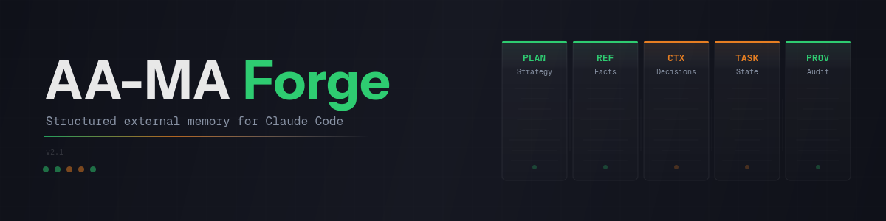
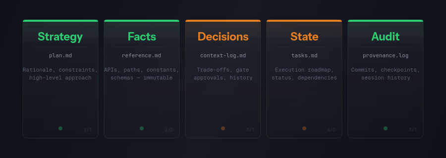
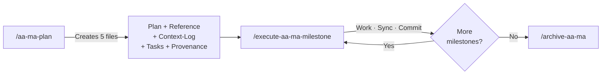

<p align="center">
  
</p>

<p align="center">
  Structured external memory for Claude Code, so your AI agent stops forgetting what it's done.
</p>

[](LICENSE)
[](https://github.com/snewhouse/aa-ma-forge/tags)
[](https://github.com/snewhouse/aa-ma-forge)
[](https://github.com/snewhouse/aa-ma-forge/commits/main)
[](https://github.com/snewhouse/aa-ma-forge/actions/workflows/security.yml)
[](https://conventionalcommits.org)
[](https://semver.org/)
[](https://github.com/astral-sh/uv)
[](https://github.com/astral-sh/ruff)

## The problem

LLM agents lose context across sessions. They drift from plans, forget decisions, repeat work you've already covered. Every new conversation starts from scratch, and you're back to re-explaining the same architecture, the same constraints, the same goals. It's maddening.

## What AA-MA is

AA-MA (Advanced Agentic Memory Architecture) gives Claude Code a structured external memory built from five specialised files. Each file segments a different kind of knowledge: strategy, facts, decisions, execution state, and audit history. It's designed for long-horizon, multi-session tasks where context loss kills productivity.

## What's in this repo

```
docs/spec/          The specification (v2.1), quick reference, team guide,
                    and Claude Code foundations reference
docs/narrative/     The origin story (how and why AA-MA exists)
docs/templates/     Ready-to-use templates (verification report)
claude-code/        Commands, skills, agents, rules, hooks
                    (the operational layer that plugs into Claude Code)
src/aa_ma/          Python package (planned — package skeleton only)
examples/           Real completed task artefacts (five files plus optional tests)
scripts/            install.sh / uninstall.sh
```

## Quick start

Requires [Claude Code](https://docs.anthropic.com/en/docs/claude-code) installed and configured.

```bash
git clone https://github.com/snewhouse/aa-ma-forge.git
cd aa-ma-forge
scripts/install.sh --dry-run  # preview what will be deployed
scripts/install.sh            # deploy to ~/.claude/
```

The installer creates symlinks from this repo into your `~/.claude/` directory. It backs up any existing files before touching them. Run `scripts/uninstall.sh` to reverse everything.

Once installed, open Claude Code in any project directory and type:

```
/aa-ma-plan "describe your task"
```

## The five files

<p align="center">
  
</p>

Every AA-MA task lives in `.claude/dev/active/[task-name]/` and consists of:

| File | What it holds |
|------|---------------|
| `plan.md` | Strategy, rationale, high-level constraints |
| `reference.md` | Immutable facts: APIs, paths, constants, schemas |
| `context-log.md` | Decision history, trade-offs, gate approvals |
| `tasks.md` | Execution roadmap with status tracking and dependencies |
| `provenance.log` | Commit history, session checkpoints, audit trail |

The separation matters. Reference holds things that don't change. Context-log holds why you chose what you chose. Tasks holds where you are right now. When an agent picks up a new session, it loads reference and tasks first, and only pulls in the rest when it needs to make a decision.

## Typical workflow

Here's what using AA-MA looks like day to day.



**Planning:**
```
/aa-ma-plan "build a REST API for user authentication"
```

Claude brainstorms with you, then creates the five AA-MA artefact files in `.claude/dev/active/auth-api/`.

> **Note:** Anthropic now ships a built-in "Ultraplan" in Claude Code. We had ours first (November 2025), but naming collisions being what they are, we renamed to `/aa-ma-plan`. The two are unrelated — [details](docs/ultraplan-rename-rationale.md).

**Execution:**
```
/execute-aa-ma-milestone
```

The agent reads your plan, picks up the current milestone, works through each task, syncs the files after every step, and commits. HITL (human-in-the-loop) tasks pause for your input. AFK (away-from-keyboard) tasks run on their own.

**Repeat** for each milestone until the work is done.

**Archive:**
```
/archive-aa-ma auth-api
```

Moves completed artefacts to `.claude/dev/completed/` for future reference.

### All commands

| Command | What it does |
|---------|-------------|
| `/aa-ma-plan` | Brainstorm and create a structured plan with all five artefact files |
| `/execute-aa-ma-milestone` | Execute the current milestone with strict validation and auto-commit *(recommended)* |
| `/execute-aa-ma-step` | Execute a single task with lightweight validation |
| `/execute-aa-ma-full` | Execute the entire plan from current position to completion |
| `/verify-plan` | Run adversarial verification against the plan before execution |
| `/grill-me` | Relentlessly interview you about a plan or design until every decision is resolved |
| `/ops-mode` | Activate disciplined execution mode (token efficiency, parallel eval, tool protocols) |
| `/archive-aa-ma` | Move completed artefacts to `.claude/dev/completed/` |

### Skills

Skills are reusable procedures that plug into the planning and execution workflow. They live in `claude-code/skills/` and are symlinked by the installer.

| Skill | What it does |
|-------|-------------|
| `aa-ma-plan-workflow` | The 5-phase planning engine behind `/aa-ma-plan` |
| `aa-ma-execution` | Task execution contract used by the `/execute-aa-ma-*` commands |
| `plan-verification` | Adversarial 6-angle verification for plans |
| `impact-analysis` | Pre-change dependency and blast-radius analysis |
| `system-mapping` | 5-point pre-flight checklist before code changes |
| `operational-constraints` | Disciplined execution mode (token efficiency, tool protocols) |
| `retro` | Weekly engineering retrospective generator |
| `complexity-router` | Weighted complexity scoring that routes high-risk tasks to deeper review |
| `agent-teams` | Multi-agent team orchestration with roles, debate, and shutdown protocols |
| `defense-in-depth` | Four-layer validation pattern for making bugs structurally impossible |
| `dispatching-parallel-agents` | Pattern for concurrent independent agent investigations |
| `debugging-strategies` | Systematic debugging process with multi-language tooling |
| `llm-evaluation` | Evaluation strategies for LLM applications (metrics, LLM-as-judge, A/B testing) |

Start with the [quick reference](docs/spec/aa-ma-quick-reference.md) for a five-minute overview. The [team guide](docs/spec/aa-ma-team-guide.md) covers the full workflow in detail (originally written for internal use — some model references may be dated). To see what the five files look like in practice, check [examples/aa-ma-team-guide/](examples/aa-ma-team-guide/).

## What else helped

AA-MA is the structure, but a couple of Claude Code plugins earned their place alongside it through trial and error.

[claude-mem](https://github.com/thedotmack/claude-mem) gives Claude persistent memory across sessions. AA-MA files hold the plan and the state, but they live inside one conversation. claude-mem indexes everything — decisions, tool results, observations — into a searchable vector store that survives session boundaries. When you pick up a multi-week project on a Monday morning, it's the difference between starting cold and starting informed.

[double-check](https://claudecodecommands.directory/commands/double-check) is almost embarrassingly simple: it forces the agent to stop and ask itself "am I actually done?" before moving on. Define the angles, define what complete means, then check. It catches the false positives that slip through when agents optimistically claim a task is finished. Cheap, fast, and surprisingly effective.

Neither is required for AA-MA to work. Both made it work better.

## Optional extras

Some AA-MA commands can use these third-party Claude Code plugins when available. Everything works without them — they just make it better.

| Plugin | What it enhances | Install |
|--------|-----------------|--------|
| [superpowers](https://github.com/superpowers-marketplace/superpowers) | Brainstorming, structured planning, TDD workflows in `/aa-ma-plan` and execute commands | Claude Code plugin marketplace |
| [gstack](https://github.com/anthropics/claude-code-marketplace) | Plan reviews (CEO, eng, design perspectives), QA testing, browser screenshots | Claude Code plugin marketplace |
| [Context7](https://github.com/upstash/context7) | Library documentation lookup during planning and execution | MCP server setup |

If a plugin isn't installed, the commands fall back to native tools or skip the optional step.

## Credits and inspirations

Original work by Stephen J. Newhouse, November 2025 onwards. Built out of genuine frustration with context loss in agentic coding workflows.

The spark came from [Diet-Coder's](https://dev.to/diet-code103/claude-code-is-a-beast-tips-from-6-months-of-hardcore-use-572n) brilliant "Dev Docs System" (also on [r/ClaudeCode](https://www.reddit.com/r/ClaudeCode/comments/1oivs81/claude_code_is_a_beast_tips_from_6_months_of/)): three files per task that give Claude structured memory. I took those three files and turned them into five. Massive thanks to Diet-Coder for planting the seed.

Matt Pocock's [skills repo](https://github.com/mattpocock/skills) inspired several refinements to the command and skill structure. AA-MA predates it, but the cross-pollination was valuable.

[Helix.ml](https://helix.ml) spec-driven workflow concepts informed the v2.1 specification, particularly around gate classification and session checkpoints.

The full story is in [how we got here](docs/narrative/how-we-got-here.md).

## Fair warning

This is a one-person project built around my own workflows. It's provided as-is — take what's useful, fork it, adapt it, make it your own. Maintenance and improvements will be sporadic. If I've gone quiet, I'm either deep in client work, arguing with an API, or the MS is having a louder day than usual. Pull requests welcome, but don't hold your breath on response times. You've been warned.

## Licence

[Apache-2.0](LICENSE)

### A little request...

I have multiple sclerosis. Some days are better than others, but the work continues regardless. If AA-MA saves you time or sanity, consider donating to an MS charity like the [MS Society](https://www.mssociety.org.uk/) or [MS Trust](https://mstrust.org.uk/).

Other causes close to my heart: [NSPCC](https://www.nspcc.org.uk/) and [NAPAC](https://napac.org.uk/) for child protection, [Refuge](https://refuge.org.uk/) and [ManKind Initiative](https://mankind.org.uk/) for domestic abuse survivors. Or just hug someone who needs it. Small acts, big ripples.
