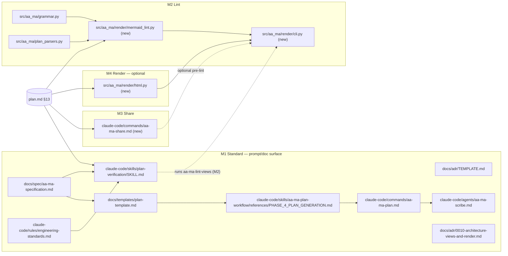
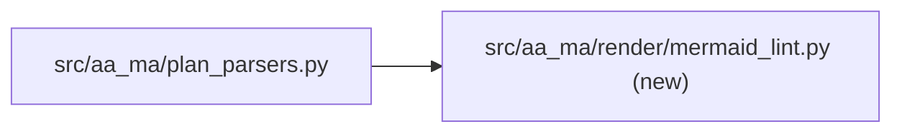
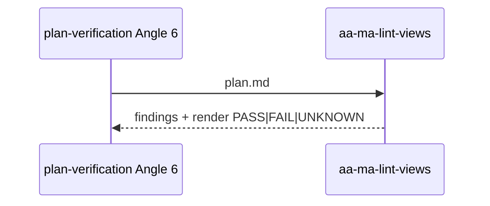

# 0010. Plans carry a mermaid Architecture View and pinned Contract blocks; markdown stays the only source

**Status:** Implemented
**Date:** 2026-09-11
**Deciders:** Stephen Newhouse (sole maintainer)
**Tags:** `aa-ma`, `planning-standard`, `diagrams`, `mermaid`, `adr`, `share`, `render`

## Context and Problem Statement

An AA-MA plan is executed by agents that did not write it, often in a fresh
session with nothing but the five artifact files loaded. At the time of this
decision the repo held 10 completed plans and 8 ADRs — **none** contained a
diagram, and the specification (§XI) listed diagrams only as an optional
"required artefact". Two failure classes recur in the post-implementation
reviews (`[task]-impl-review.md`) of those plans:

1. **Structure inferred, not stated.** A cold agent reconstructs which files
   depend on which by grepping, and gets it wrong at the edges (the
   `milestone-grammar-ssot` M4 window — three consecutive §6.8 reviews, 8/4/9
   CRITICALs — was largely this: each fix correct about its target, wrong
   about the input space it sat in).
2. **Signatures unpinned.** Plans describe *what* a function does and leave the
   agent to guess its name, arguments, exit codes or field grammar; the guess
   then has to be reconciled at review time (L-011: field format is
   load-bearing and fails silently).

Reviewers (Ste, and increasingly people outside the repo) also need to read a
plan or an ADR without cloning it, and there was no way to hand one over as a
link that renders its diagrams.

## Decision Drivers

- **Cold-executability** — a fresh agent must see the component structure and
  the critical flow *before* the steps, not derive them mid-execution.
- **No drift** — anything that can go stale must be checkable from the text
  itself; opaque binary diagrams cannot be.
- **No new runtime dependency** — the Python package must keep working with
  what `uv sync` already installs.
- **Renders where plans are read** — GitHub, VS Code preview, and the Claude
  Artifact viewer all render mermaid natively with no toolchain.
- **Do not punish small plans** — a docs-only or single-file plan gains
  nothing from a one-node diagram.

## Considered Options

- **A. Mermaid mandate with canonical waiver** — element #13 in the planning
  standard; Component view always, Flow view iff `Critical-Path:`; a
  `Diagram-Waiver:` front-matter field with a fixed value set; Contract blocks
  per code milestone; Angle 6 verifies; a pure-Python lint follows (M2).
- **B. Recommend only** — template sections and prose encouragement, no check.
- **C. C4 / Structurizr DSL** — a richer architecture model with generated
  views.
- **D. D2** — a modern text-to-diagram language with better layout control.

## Decision Outcome

**Chosen option: A**, because it is the only option that is both enforceable
from text and renders everywhere plans are actually read.

- **Notation:** mermaid, text-only, fenced ```` ```mermaid ````. ASCII art may
  illustrate but is never the View (two sources drift).
- **Views:** `### Component view` (required): files/modules/hooks the plan
  touches and their dependency edges. `### Flow view` (required iff any
  milestone carries `Critical-Path:`): sequence or flowchart of the critical
  path being changed. `### Data/State view` optional. The milestone dependency
  graph is derivable from `tasks.md` and is never hand-authored.
- **Path labels are claims.** A node label containing a repo path is checked
  for existence by `aa-ma-lint-views` (M2) unless the label ends with `(new)`.
  Labels containing parentheses use mermaid's quoted form
  (`B["src/new.py (new)"]`); unquoted `(new)` inside `[...]` is a parse error
  (measured, mermaid 11.17.2).
- **Waiver:** `**Diagram-Waiver:** none | docs-only | config-only | single-file`
  in the plan front-matter. A waiver is invalid when any milestone declares
  `Audit-Profile ∈ {full, code-only, infra}`. The field is **planning-time
  only** — read by `Skill(plan-verification)` via
  `plan_parsers.parse_diagram_waiver`; the milestone gate (`aa_ma.enforce`,
  ADR-0009) never reads it. Making it a gate field needs its own ADR.
- **Contract blocks:** every milestone with a code `Audit-Profile` carries a
  `#### Contract` heading and ≥1 fenced block pinning paths, signatures, CLI
  shapes, exit codes and field grammar. Illustrative snippets are not
  Contract blocks.
- **Grandfathering:** checks fire only for plans `Created:` on-or-after the
  literal date **2026-09-11**. Written as a date, not a tag, so the cutover
  cannot move when a release lands (v0.11.0 was tagged the morning M1
  started; the standard ships in v0.12.0).
- **ADRs:** the template gains *recommended* `## Architecture View` and
  `## Example` sections; not machine-verified. This ADR is the exemplar.
- **Sharing:** `/aa-ma-share` (M3) publishes the **markdown** of a plan, ADR or
  spec page as a private Artifact; the Artifact viewer renders mermaid
  natively. Rendering to HTML first would nest a document inside the viewer's
  own skeleton and initialise mermaid twice.
- **Rendering (optional, last):** `aa-ma-render` (M4) turns markdown into one
  self-contained HTML file for the "attach a file" case, using markdown-it-py
  (already transitive via `rich`). It is derived output — never edited, never
  committed (`build/` is ignored). Droppable via a documented scope reduction.
- **Validation:** a pure-Python structural lint always runs; `mmdc` (Node +
  Chromium) is optional dev tooling. When it is absent or fails for a reason
  that is not a mermaid parse error, the result is `UNKNOWN`, never `PASS`
  (L-012: a scanner that did not run must not report clean).

## Pros and Cons of the Options

### A. Mermaid mandate with waiver

- ✅ Renders in GitHub, VS Code, Artifacts with zero toolchain
- ✅ Text: diffable, lintable, path labels verifiable against the tree
- ✅ Waiver keeps small plans cheap; the value set is closed, so it cannot rot
- ❌ Stricter than MADR 4.x and arc42 §5 (both accept a table or prose view)
- ❌ LLM-authored mermaid has real syntax-error rates (MermaidSeqBench) and
  can be valid-but-wrong; the lint catches the first class only

### B. Recommend only

- ✅ Zero ceremony
- ❌ Ten plans and eight ADRs with zero diagrams is what "recommended" produced

### C. C4 / Structurizr

- ✅ Proper architecture model, multiple consistent views
- ❌ JVM toolchain, DSL nobody else in the workflow reads, no native render
  on GitHub or in the Artifact viewer

### D. D2

- ✅ Better layout engine than mermaid
- ❌ Go binary required; no GitHub / VS Code / Artifact render

## Consequences

**Positive:**
- A cold agent reads structure and critical flow before step 1.
- Signatures are pinned at planning time; review-time reconciliation drops.
- Plans and ADRs become shareable as links that render.

**Negative:**
- Every code plan costs one diagram and one Contract block per code milestone.
- A diagram that names a file the plan later renames is a lie until fixed —
  hence the engineering-standards §4 rule: update the View in the same commit
  (`STALE_PATH` from the lint).
- `mmdc` is an optional Node dependency; on machines without Chromium the
  render verdict is `UNKNOWN`, and people must not read that as PASS.

**Neutral:**
- 29 "12 elements" sites in the live prompt surface became 13; the element
  count is now checked by a scoped grep pinned in the plan's reference file.
- `Diagram-Waiver` joins `Audit-Profile`, `TDD-Waiver` and `Critical-Path` as
  a closed enum in `plan_parsers.py`; new values need a plan + ADR.

## Architecture View

<!-- Component view of this decision's footprint: M1 prompt/doc surface, M2 lint, M3 share, M4 render. -->
### Component view


## Example

The plan surface this decision mandates (front-matter field + §13):

````markdown
**Created:** 2026-09-11
**Diagram-Waiver:** none

## 13. Architecture View

### Component view


### Flow view

````

## Implementation Notes

- Planning standard: `docs/spec/aa-ma-specification.md` §XI item 13;
  `claude-code/rules/aa-ma.md` Planning Standard; templates in
  `docs/templates/plan-template.md` §12–§13 and `docs/adr/TEMPLATE.md`.
- Waiver table: `claude-code/rules/engineering-standards.md` §1.
- Verification: `claude-code/skills/plan-verification/SKILL.md` Angle 6 checks
  #6 and #7, pinned by `tests/commands/test_plan_verification_angle6.py`.
- Lint (M2): `src/aa_ma/render/mermaid_lint.py`, CLI `aa-ma-lint-views`,
  `.importlinter` contract `render-is-leaf`.
- Share (M3): `claude-code/commands/aa-ma-share.md`,
  `scripts/aa-ma-share-allow.sh`.
- Render (M4, optional): `src/aa_ma/render/html.py`, CLI `aa-ma-render`.
- Status **Implemented** at M3 close (2026-09-12): standard (M1), lint (M2) and share (M3) shipped; Render (M4) is optional and does not gate the decision.

## References

- Design spec: `docs/superpowers/specs/2026-09-11-plan-architecture-views-design.md`
- Plan: `.claude/dev/active/plan-architecture-views/` (archived to
  `.claude/dev/completed/` on close)
- MADR 4.x — <https://adr.github.io/madr/> (silent on diagrams)
- arc42 §5 Building Block View — <https://docs.arc42.org/section-5/> (mandates
  the view, accepts a table)
- GitHub Spec Kit — mandates mermaid in specs
- MermaidSeqBench (NeurIPS 2025) — arXiv:2511.14967, LLM mermaid syntax-error
  and semantic-error rates
- ADR-0005 (Audit-Profile enum), ADR-0009 (gate reads the Python SSoT; why
  `Diagram-Waiver` stays out of it)
- L-011, L-012 in `docs/lessons.md`
