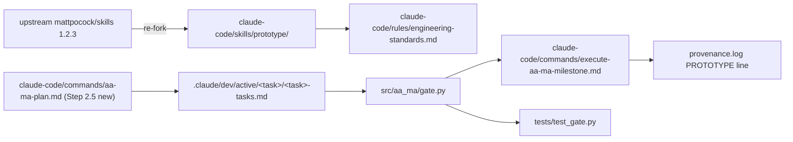

# 0011. Re-sync `prototype` to upstream 1.2.3 and make the prototype decision explicit in planning

**Status:** Implemented (2026-09-21 — `mattpocock-trio-adoption` Milestone 3)
**Date:** 2026-09-20
**Deciders:** Stephen Newhouse, Claude (research session 2026-09-20)
**Tags:** `workflow`, `aa-ma`, `skills`, `external-fork`, `engineering-standards-theme-1`, `hook-modification`

## Context and Problem Statement

[ADR-0003](0003-prototype-adoption.md) forked `prototype` on 2026-05-10. Upstream has since changed in ways that matter ([research](../research/mattpocock-trio-2026-09.md#22-prototype)):

- LOGIC branch rewritten (2026-07-17): a **single self-contained HTML file** with a state panel, free-play buttons and tabbed guided walkthroughs — no terminal TUI.
- Rule 6 is now **"capture when done"**: fold the validated decision into real code, commit the prototype to a throwaway `prototype/<name>` branch, leave a context pointer. Not "delete or absorb".
- Model-invoked (2026-06-29).

Locally, three process gaps compound the drift:

1. `claude-code/rules/engineering-standards.md:21-31` describes "LOGIC (terminal TUI…)" — stale.
2. `/aa-ma-plan` never asks whether a prototype is warranted (`claude-code/commands/aa-ma-plan.md` has zero occurrences of "Prototype"). The flag is only remembered if the plan author remembers it. Ste's working style is explicitly trial-and-error prototyping, so this is the wrong default.
3. The gate reads `Prototype-Required` **per milestone only** (`src/aa_ma/gate.py:202-206,231-235`) while `docs/templates/tasks-template.md:111-113` advertises a per-sub-step slot "with the same semantics". The template promises enforcement the code does not deliver.

How do we bring the fork current, make the prototype decision a first-class planning step, and make enforcement match the template?

## Decision Drivers

- Ste prefers building throwaway versions to decide; the workflow should ask, not assume.
- Upstream's "capture, don't dispose" gives trial-and-error a paper trail (branch + provenance) that AA-MA can cite.
- The template/gate mismatch is a latent correctness bug in the enforcement surface.
- Changes to `src/aa_ma/gate.py` and `execute-aa-ma-milestone.md` are `Critical-Path: hook-modification` (affect every session).

## Considered Options

1. **Re-sync fork + Theme 1 wording only** — smallest diff; leaves planning and gate as-is.
2. **Re-sync + Step 2.5 prototype question + gate aggregation** — fork current, planning asks, gate honours sub-step flags.
3. **Re-sync + drop the sub-step template slot** — make the template match the code instead of the code match the template.

## Decision Outcome

**Chosen:** Option 2.

**Rationale:** Option 1 fixes content but not process — the flag stays forgotten. Option 3 removes granularity Ste wants (one uncertain sub-step inside a routine milestone). Option 2's gate change is small (aggregate `milestone YES OR any sub-step YES`) and the evidence grep is already milestone-scoped, so the provenance contract does not change shape.

## Pros and Cons of the Options

### Option 1 — re-sync only
- ✅ Docs-only, no `hook-modification` path
- ❌ Planning still never asks; template/gate mismatch persists

### Option 2 — re-sync + planning question + gate aggregation
- ✅ Matches Ste's style; fixes the latent mismatch; keeps evidence contract stable
- ❌ Touches the enforcement surface (gate + milestone command + tests)

### Option 3 — re-sync + remove sub-step slot
- ✅ Also docs-only
- ❌ Loses per-sub-step granularity; contradicts ADR-0001's "per-task" wording

## Consequences

**Positive:** prototypes become visible, tracked decisions with a branch and a provenance line; the fork stops lying about what upstream does.

**Negative:** three more places to keep in sync with upstream (SKILL/LOGIC/UI); a Step 2.5 in `/aa-ma-plan` adds one AskUserQuestion per uncertain milestone; gate schema consumers (TUI JSON, kv) see no field change but semantics widen.

**Neutral:** `TDD-Waiver: prototype` (`src/aa_ma/plan_parsers.py:47-59`) unchanged. Provenance line becomes `[ts] PROTOTYPE — <milestone heading> — <verdict>` (milestone-scoped, matching `CRITICAL_PATH_REVIEW`; amended 2026-09-21 at implementation — sub-step `Critical-Path` rolls up by the same mechanism, milestone value first, per the M3 §6.8 security review) and gains an optional `; branch=prototype/<name>` suffix.

## Architecture View

### Component view


## Example

```text
### Sub-step 2.3: Ticket-frontier resolver
- Status: PENDING
- Mode: HITL
- Prototype-Required: YES

[2026-10-02T10:14:00+01:00] PROTOTYPE — Milestone 2: Charting command — LOGIC demo confirms
  frontier = open ∧ unblocked ∧ unclaimed; branch=prototype/charting-frontier
```

`uv run aa-ma-gate tasks.md --milestone 2 --format kv | grep prototype_required=` → `YES` (from the sub-step).

## Implementation Notes

To be executed as **M1** of `/aa-ma-plan mattpocock-trio-adoption` (`Audit-Profile: full`, `Critical-Path: hook-modification`, TDD: gate fixture first).

1. Re-fork `SKILL.md`, `LOGIC.md`, `UI.md` from upstream v1.2.3 (MD5s at fork time: SKILL `f59e7362aa284dc8c6cf9cf7637da74c`, LOGIC `5a29fb2cdc2dfe75c2400a20a5777a89`, UI `0531f4c5365f312b7faad44b88adcf38` — plugin cache 1.2.3; re-verify against HEAD when forking). Keep the line-1 provenance comment; update `tests/skills/test_prototype_frontmatter.py` expectations.
2. `engineering-standards.md` Theme 1: "LOGIC (single-file HTML demo with guided walkthroughs) and UI (`?variant=` route variants)"; add "capture on `prototype/<name>` branch; main keeps only the decision".
3. `aa-ma-plan.md` Phase 2: new **Step 2.5 Prototype decision** after Step 2.4 — for each milestone whose design is uncertain, AskUserQuestion `Prototype-Required: YES|NO`; write the answer into the tasks.md field and append `prototype=<list>` to the `ENG_STANDARDS_DECLARED` provenance line (:330-335). Marker table :82-92 unchanged (Phase 2 already has a marker).
4. `gate.py` `_read_milestone`: `prototype_required = own_yes or any(sub-step Prototype-Required == YES)`; sub-step read uses the same `read_enforced_field` tolerance. Schema (`gate.py:99-121`) unchanged. `tests/test_gate.py` + `tests/hooks/fixtures/gate-scans/styles-tasks.md`: new case "milestone NO / sub-step YES → YES".
5. `execute-aa-ma-milestone.md:594-620`: no logic change; note that sub-step flags roll up. `execute-aa-ma-step.md:242-246`: advisory now says the milestone gate will require evidence.
6. `docs/spec/aa-ma-specification.md:302-326`: add `PROTOTYPE — <milestone heading> — <verdict>[; branch=prototype/<name>]` and `CRITICAL_PATH_REVIEW — <evidence>` to the provenance grammar (pre-existing omission).
7. `docs/templates/tasks-template.md:111-113` comment: "rolls up to the milestone gate".
8. Counts/docs: `CHANGELOG.md ## Unreleased`, `docs/spec/claude-code-foundations.md` row for prototype (version note), `docs/ATTRIBUTION.md`.

## References

- [Research: mattpocock trio 2026-09](../research/mattpocock-trio-2026-09.md)
- [ADR-0001](0001-engineering-standards-architecture.md), [ADR-0003](0003-prototype-adoption.md), [ADR-0009](0009-gate-enforcement-python-ssot.md)
- Upstream: https://github.com/mattpocock/skills/tree/main/skills/engineering/prototype · commits 850873c, cdec9f6, fa460cb, 6bcbcb0
