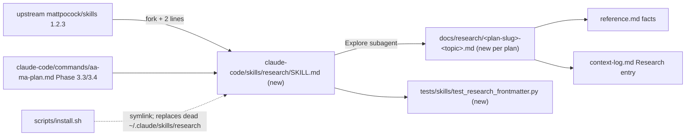

# 0012. Adopt `research` from mattpocock/skills and give `/aa-ma-plan` Phase 3 a file destination

**Status:** Implemented (2026-09-21 — `mattpocock-trio-adoption` Milestone 4)
**Date:** 2026-09-20
**Deciders:** Stephen Newhouse, Claude (research session 2026-09-20)
**Tags:** `workflow`, `aa-ma`, `skills`, `external-fork`, `engineering-standards-theme-1`

## Context and Problem Statement

`/aa-ma-plan` Phase 3 gathers research (Context7, web, parallel Explore agents) and then, at Step 3.4, says **"save to memory, show brief on screen"** (`claude-code/commands/aa-ma-plan.md:414-426`). The only durable landings are a summary line in context-log (:729-730) and fact extraction into reference.md (:686-712). Full findings — and their sources — evaporate with the session. `PHASE_3_RESEARCH.md` leans on a `research-consolidation` skill that is not shipped.

Upstream `research` ([SKILL.md](https://raw.githubusercontent.com/mattpocock/skills/main/skills/engineering/research/SKILL.md), 794 bytes) is three rules: background agent; **primary sources, every claim cited**; **one Markdown file saved where the repo already keeps such notes**. Rule 3 names precisely the contract Phase 3.4 lacks, and this repo already has the convention it asks for (`docs/research/` with the `Created / Reviewed-Through-Date / Valid-Through` header).

Complications: upstream documents a **self-nesting bug** (#530 — a `general-purpose` background agent holding the Agent tool re-spawns itself) and no stopping criterion. Locally, `~/.claude/skills/research/` is an unrelated PAI-style skill whose only instruction is to run a `/conduct-research` command that does not exist — a dead pointer with the same `name:`.

## Decision Drivers

- Research must outlive the session and be citable from plan/reference/context-log.
- Match the existing `docs/research/` convention rather than invent a per-task file type.
- Neutralise the two upstream failure modes at fork time, not after the first 450k-token incident.
- Keep the skill tiny; the value is the contract.

## Considered Options

1. **Fork + harden + wire Phase 3** — fork the 3 rules, add two AA-MA lines, make Phase 3.3/3.4 write `docs/research/<plan-slug>-<topic>.md`.
2. **Fix Phase 3.4 only** — no new skill; Phase 3.4 writes a cited Markdown file.
3. **Keep status quo; rely on context-log summary.**

## Decision Outcome

**Chosen:** Option 1.

**Rationale:** Option 2 fixes `/aa-ma-plan` but leaves ad-hoc research (and the future charting research tickets, ADR-0013) without a reusable discipline. Option 1 costs one 20-line skill and a frontmatter test, and replaces a broken local skill of the same name.

## Pros and Cons of the Options

### Option 1 — fork + harden + wire
- ✅ Reusable from `/aa-ma-plan`, charting tickets, and ad-hoc `Skill(research)`
- ✅ Kills self-nesting by construction (dispatch as `Explore`, which lacks the Agent tool)
- ❌ Skill count +1 (five count locations); name collision to resolve at install

### Option 2 — Phase 3.4 only
- ✅ Smallest diff
- ❌ Not reusable; charting would re-invent it

### Option 3 — status quo
- ✅ Nothing to maintain
- ❌ Research remains unciteable and lost

## Consequences

**Positive:** every plan leaves `docs/research/<slug>-*.md` with sources; reference.md/context-log link to it instead of pasting; charting research tickets have a resolver.

**Negative:** `docs/research/` grows per plan — add a one-line `Valid-Through` and let `doc-drift-detection` ignore it; `~/.claude/skills/research` must be replaced (install.sh symlink onto an existing real dir — verify backup behaviour first).

**Neutral:** the generic `~/.claude/skills/research` (perplexity/gemini agents) and `research-consolidation` are retired or re-homed in M2; `PHASE_3_RESEARCH.md:14,:201-207` references updated.

## Architecture View

### Component view


## Example

```text
Skill(research) — "Does scripts/install.sh back up an existing real directory before symlinking?"
→ Explore agent, primary source = scripts/install.sh + git history
→ docs/research/mattpocock-trio-adoption-install-backup.md
   Created: 2026-10-01 · Valid-Through: 2026-Q4 · Sources: scripts/install.sh:240-268 (commit …)
```

Phase 3 marker: `3 DONE context7_calls=2 web_fetches=1 research_files=1`.

## Implementation Notes

To be executed as **M2** of `/aa-ma-plan mattpocock-trio-adoption` (`Audit-Profile: code-only`; `Prototype-Required: YES` — the acceptance test is one real run of the forked skill).

1. Fork `skills/engineering/research/SKILL.md` (v1.2.3 MD5 `506b3477669c57820d944af5766105cc`; re-verify at fork) to `claude-code/skills/research/SKILL.md` with the line-1 provenance comment. Append two AA-MA rules under the original three:
   - "Dispatch the background agent as `Explore` (read-only, no Agent tool) so it cannot re-delegate."
   - "Answer the stated question only; list open threads under `## Not pursued` rather than chasing them."
   And one line for rule 3 in this repo: "Here that place is `docs/research/<plan-slug>-<topic>.md` with the header used by `skill-ecosystem-audit.md`."
2. `tests/skills/test_research_frontmatter.py` via `_helpers.assert_skill_frontmatter`.
3. `aa-ma-plan.md` Phase 3.3: "dispatch via `Skill(research)` per domain"; Step 3.4: write the file(s), link from Step 5.3 (reference.md `[valid: …]` facts cite the file) and Step 5.4 (`**Research Findings:** see docs/research/…`); marker table row :88 gains `research_files=<N>`; `docs/spec/plan-marker-grammar.md` updated to match; `aa-ma-plan-skip-warn.sh` tolerant of the extra key (verify).
4. `PHASE_3_RESEARCH.md`: tool hierarchy row for `research`; retire the `research-consolidation` references or mark as optional external.
5. Install: check `scripts/install.sh` handling when `~/.claude/skills/research` is a real directory (backup vs refuse). Remove the dead PAI skill (or rename to `pai-research`) before install.
6. Counts/docs: `SECURITY.md:12` (20 → 21 skills), `README.md`, `CHANGELOG.md ## Unreleased`, `docs/spec/claude-code-foundations.md`, `docs/spec/aa-ma-quick-reference.md`, `docs/ATTRIBUTION.md`.

## References

- [Research: mattpocock trio 2026-09](../research/mattpocock-trio-2026-09.md)
- [ADR-0003](0003-prototype-adoption.md) (adoption pattern), [ADR-0006](0006-understand-codebase-adoption.md) (soft-dep pattern), [ADR-0013](0013-charting-wayfinder-lite.md) (consumer)
- Upstream: https://github.com/mattpocock/skills/blob/main/docs/engineering/research.md · issue #530, #576
