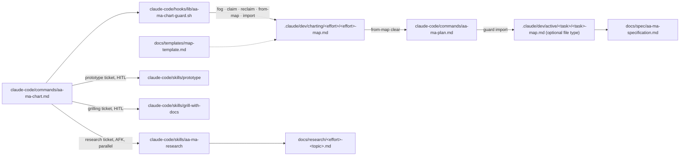
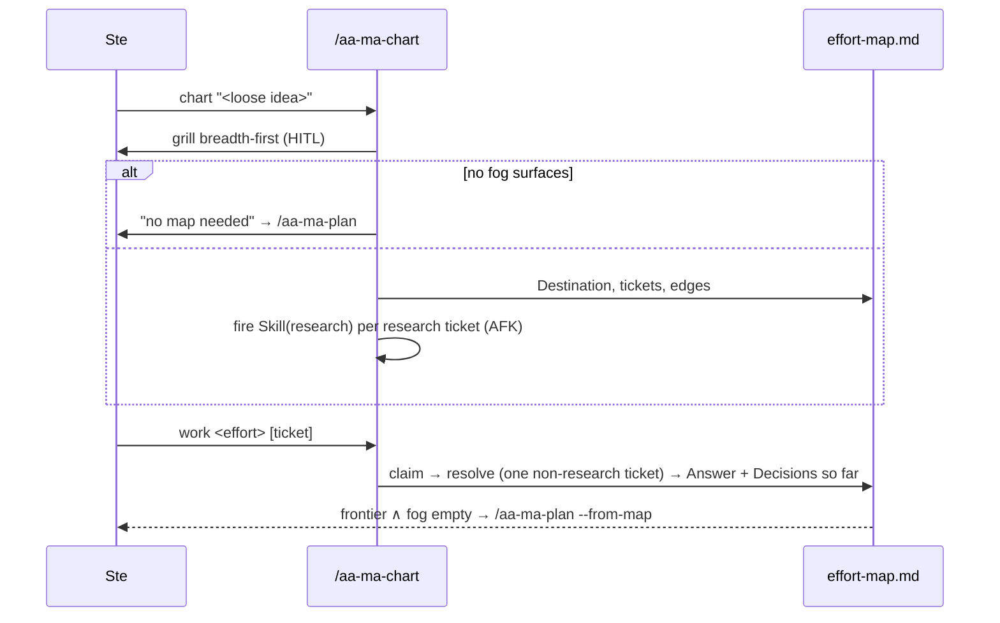

# 0013. Charting — a pre-plan decision map adapted from `wayfinder` (no issue tracker)

**Status:** Implemented (mattpocock-trio-adoption M5, v0.14.0, 2026-09-21)
**Date:** 2026-09-20
**Deciders:** Stephen Newhouse, Claude (research session 2026-09-20)
**Tags:** `workflow`, `aa-ma`, `pre-plan`, `external-adaptation`, `file-taxonomy`

## Context and Problem Statement

AA-MA remembers *execution*: once `/aa-ma-plan` Phase 5 creates `.claude/dev/active/<task>/`, every decision has a home (context-log `AD-NNN`), every fact a shelf (reference.md), every step a status. It has **no memory for decisions made before a plan exists.** Phase 1.3 grilling and Phase 2 brainstorming assume the idea already fits one planning session; when it does not, the exploratory work — "which of three approaches?", "does this state model hold?", "what does the API actually return?" — happens in untracked sessions and is re-derived next time.

Upstream `wayfinder` ([research §2.3](../research/mattpocock-trio-2026-09.md#23-wayfinder)) solves exactly this: a **map** (destination, decisions so far, fog, out of scope) plus **decision tickets** typed `research | prototype | grilling | task`, each HITL or AFK, resolved one per session until the way is clear, then handed to the planning flow. Its vocabulary is already AA-MA's (`Mode: HITL|AFK`, status enums, claim-before-work).

But adopting it verbatim would (a) stand up a second long-horizon memory in an issue tracker beside `.claude/dev/`, (b) pull in `setup-matt-pocock-skills`, `grilling`, `domain-modeling`, and (c) inherit the field-reported costs — "more babysitting, more tokens", stale 27-ticket maps — that led upstream to demote it to "a situational on-ramp". Upstream also warns against its local-markdown fallback because it persists in the repo; for AA-MA that is the intended behaviour.

How do we give AA-MA a discovery memory with wayfinder's shape and AA-MA's storage?

## Decision Drivers

- One memory system, one directory tree, one gate/TUI to teach.
- Ste's trial-and-error style: `prototype` tickets need to be a first-class way to resolve a question.
- HITL invariant: the agent never answers its own grilling question.
- KISS: v1 must be markdown + one command; no Python/gate/TUI changes.
- A clear exit into `/aa-ma-plan` so charting cannot silently become building (upstream's "no hard in-skill stop" failure).

## Considered Options

1. **Adapt-lite: `/aa-ma-chart` + single-file map under `.claude/dev/charting/`** — wayfinder's concepts, AA-MA's storage and enums.
2. **Adopt verbatim on GitHub Issues** — fork wayfinder + setup + grilling + domain-modeling; map lives in `gh` issues.
3. **Document only** — keep grill-with-docs + brainstorming as the pre-plan path.

## Decision Outcome

**Chosen:** Option 1.

**Rationale:** Option 2 duplicates memory and adds four dependencies for a flow upstream itself calls situational. Option 3 leaves the gap. Option 1 keeps the useful invariants (fog test, claim-before-work, one non-research ticket per session, out-of-scope never graduates, parallel AFK research) and drops the tracker.

## Pros and Cons of the Options

### Option 1 — adapt-lite
- ✅ Reuses `Mode:`/`Status:` enums, provenance style, `.claude/dev/` layout; TUI can learn it later
- ✅ Research tickets resolve via ADR-0012's `research`, prototype tickets via ADR-0011's `prototype`
- ❌ New optional file type (spec + templates + counts); a new command to maintain

### Option 2 — verbatim on GitHub Issues
- ✅ Zero adaptation; tracker-native blocking edges and concurrency
- ❌ Second memory; four extra forks; tracker required even for solo local work

### Option 3 — document only
- ✅ Nothing to build
- ❌ Discovery stays untracked

## Consequences

**Positive:** big ideas get a durable, citable pre-plan record; `/aa-ma-plan --from-map` seeds Phase 1 with decisions instead of re-grilling; prototypes and research from the discovery phase carry into reference.md.

**Negative:** file-taxonomy grows 8 → 9 (optional); five count locations; risk of maps that never exit — mitigated by the no-fog early exit and a hard "charting never builds" rule.

**Neutral:** `grill-with-docs` remains the grilling resolver until its own drift ADR lands; `wayfinder`'s tracker concurrency (multiple humans) is out of scope for a sole-dev tool.

## Architecture View

### Component view


### Flow view (Critical-Path absent — illustrative only)


## Example

```markdown
# Charting: codemem-v2

## Destination
Replace the PROJECT_INDEX.json pipeline with codemem as the single code-intelligence source.

## Notes
Skills: research, prototype, grill-with-docs. Prefer prototypes over speculation.

## Decisions so far
- [Ticket 2: index format](#ticket-2-index-format): SQLite, not JSON — prototype showed 40× faster who_calls.

## Tickets

### Ticket 1: Do MCP clients tolerate a 3s cold start?
- Type: research
- Mode: AFK
- Status: RESOLVED
- Blocked-by: —
#### Question
…
#### Answer
See docs/research/codemem-v2-cold-start.md — yes, spec allows 10s.

### Ticket 3: Which query API shape feels right?
- Type: prototype
- Mode: HITL
- Status: CLAIMED
- Blocked-by: 2
#### Question
…

## Not yet specified
- migration of existing indexes (depends on Ticket 3)

## Out of scope
- multi-repo federation
```

## Implementation Notes

Executed as **M5** of `/aa-ma-plan mattpocock-trio-adoption` (`Audit-Profile: code-only`; `Prototype-Required: YES` — proven on the real effort `writing-for-agents-eval`: 4 tickets, 4 resolved, 1 refused claim, handed to `/aa-ma-plan --from-map --dry-run`). As built: the enforcing checks live in `claude-code/hooks/lib/aa-ma-chart-guard.sh` (`fog | claim | reclaim | from-map | import`, bats-tested, symlinked by `install.sh`), not in the command prose; tickets carry `Claimed-at:` and `--reclaim` re-takes a dead session's claim; `import` moves the map through git and writes `MAP_IMPORTED`. Numbered notes below are the original proposal.

1. `claude-code/commands/aa-ma-chart.md` — modes `chart <effort> "<idea>"` and `work <effort> [ticket]`. Chart: destination via `grill-with-docs`/`grill-me` + AskUserQuestion; breadth-first frontier grill; **no-fog early exit**; write map; create tickets then wire `Blocked-by:` in a second pass; dispatch `Skill(research)` per research ticket in parallel (Explore agents). Work: load map; pick named or first frontier ticket; set `Status: CLAIMED`; resolve by type (research → `Skill(research)`; prototype → `Skill(prototype)`, artefact on `prototype/<effort>-<ticket>` branch; grilling → `grill-with-docs` + AskUserQuestion — **never self-answer**; task → present a human checklist); write `#### Answer`, `Status: RESOLVED`, append to *Decisions so far*; graduate fog / rule out. **Hard rule:** one non-research ticket per session; charting never edits files outside `.claude/dev/charting/`, `docs/research/`, and `prototype/*` branches.
2. `docs/templates/map-template.md` (+ `docs/templates/README.md` row). Ticket grammar: `### Ticket N: Title`, fields `Type: research|prototype|grilling|task`, `Mode: HITL|AFK` (same enum as `src/aa_ma/enforce.py:47`), `Status: OPEN|CLAIMED|RESOLVED|RULED_OUT`, `Blocked-by: N, N | —`, `#### Question`, `#### Answer`. Defaults: grilling/HITL. Keep headings distinct from `MILESTONE_RE`/`STEP_RE` (`src/aa_ma/grammar.py:74-82`) so the TUI parser ignores maps until taught.
3. `aa-ma-plan.md` — new `--from-map <effort>` flag: Phase 1 reads *Decisions so far* + resolved Answers as pre-answered grill input; Phase 5 moves the map to `.claude/dev/active/<task>/<task>-map.md`; Step 5.3 extracts Answers into reference.md with `[valid: date]`; provenance line `MAP_IMPORTED effort=<effort> tickets=<N>`.
4. `docs/spec/aa-ma-specification.md` file taxonomy (:16-41): optional `[task]-map.md`; `CLAUDE.md` table; `docs/spec/aa-ma-quick-reference.md`; `docs/spec/claude-code-foundations.md` command count (12 → 13); `README.md`, `SECURITY.md`, `CHANGELOG.md ## Unreleased`; `docs/ATTRIBUTION.md` — "concept adapted from wayfinder; no code forked".
5. Tests: `tests/commands/` bats for the no-fog exit and the one-ticket-per-session refusal (fixture map); `aa-ma-lint-views` on this ADR's diagram.
6. Follow-ups (not M5): TUI kanban for tickets (ADR-0007 extension); `aa-ma-gate` awareness of maps; retire or re-fork `grill-with-docs` per upstream's `grilling` + `domain-modeling` split.

## References

- [Research: mattpocock trio 2026-09](../research/mattpocock-trio-2026-09.md)
- [ADR-0002](0002-grill-with-docs-adoption.md), [ADR-0011](0011-prototype-resync-and-planning-gate.md), [ADR-0012](0012-research-skill-adoption.md)
- Upstream: https://github.com/mattpocock/skills/blob/main/skills/engineering/wayfinder/SKILL.md · https://github.com/mattpocock/skills/blob/main/docs/engineering/wayfinder.md · Discussion #484 · Latent Space 2026-08-20
