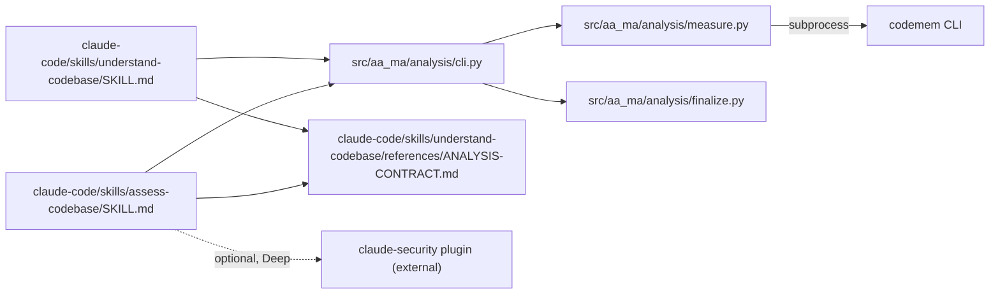

# 0017. `assess-codebase`: a clean-room Adaptation, two skills over one analysis contract

**Status:** Implemented (codebase-analysis-skills M1–M7; ships in v0.17.0)
**Date:** 2026-10-01
**Deciders:** Stephen Newhouse (sole maintainer)
**Tags:** `skills`, `assessment`, `onboarding`, `security`, `codemem`

## Context and Problem Statement

Whole-repo quality assessment lived in a local, unversioned `/codebase-deep-dive` command in
`~/.claude/`. `understand-codebase` (ADR-0006) leaned on it as a soft dependency in 29 places.
That copy had no tests, no stamp tying its report to a commit, no way to tell a measured fact
from a model opinion, and no refutation of serious claims. Anthropic's `claude-security` and
`code-modernization` plugins show a stronger design
(`docs/research/codebase-analysis-skills-prior-art.md`).

**How do we give the forge a whole-repo Assessment that is reproducible, secret-safe and
commit-stamped, and have Onboarding reuse it, without copying anyone's files?**

## Decision Drivers

- **Measured vs judged** — tools measure, the model judges with `file:line`, and a missing tool
  reads UNKNOWN, never zero (map Tickets 4, 7).
- **Secret safety** — no output may carry a secret. The check is code with tests, not prompt text.
- **Freshness by commit** — Onboarding absorbs an Assessment only when it is Fresh (stamped at
  HEAD, no tracked change).
- **No new fork surface** — prior art is borrowed as concept; no upstream file is copied.
- **Leaf boundaries** — `aa_ma` never imports `codemem` (`.importlinter` `aa-ma-never-imports-codemem`).

## Considered Options

1. **Two skills over one shared contract, code in `aa_ma.analysis` (this ADR)**
2. **Fork `claude-security` / `code-modernization` files** (an Adoption with `FORKS.json`)
3. **Vendor the local `/codebase-deep-dive` as-is** (the ADR-0006 pattern)
4. **One merged skill** doing both Assessment and Onboarding

## Decision Outcome

**Chosen:** Option 1.

- **Clean-room Adaptation** (`CONTEXT.md` *Adaptation*). Concept is adapted from Anthropic's
  `claude-security` and `code-modernization`: a measure/judge/refute split, a coverage ledger,
  and a SHA-stamped, masked report. Every file is our own. There is no `FORKS.json` entry, no
  provenance comment and no drift tracking. M3.6 found 0 shared 12-word shingles against the
  local `/codebase-deep-dive` command; no shingle check was run against the Anthropic plugins.
- **Two skills over one contract.** `assess-codebase` (skill + thin `/assess-codebase`
  command + read-only `codebase-assessor` agent) and `understand-codebase` stay independent.
  Both obey `claude-code/skills/understand-codebase/references/ANALYSIS-CONTRACT.md`:
  no secret files read, redaction before output, commit stamp, repo content treated as data.
  Onboarding absorbs a Fresh Assessment (`aa-ma-analysis fresh`) and never runs one silently.
- **Code home `src/aa_ma/analysis/`** with the `aa-ma-analysis` console script (`stamp`,
  `fresh`, `validate`, `scan-secrets`, `measure`, `run`, `finalize`, `ground`, `changed-since`).
  It is a leaf package (`analysis-is-leaf`, `analysis-is-self-contained`). Pydantic models emit
  the golden schemas in `tests/golden/analysis/`.
- **Subprocess-only codemem seam.** `measure` finds the `codemem` binary (`stamp.find_binary`)
  and runs `codemem build` / `refresh-commits` / `query …` into a fresh `<work>/codemem.db`.
  The target's `.codemem/` is never read or written. No Python import crosses the boundary.
- **`claude-security` is declared-external.** It is an optional Deep-tier pass. The skill
  offers it only when the plugin is both installed and enabled (`# assess:claude-security`
  guard). Absent, the Deep run proceeds and the skip is recorded. It is a plugin, not a
  `Skill()` edge, so it is not in the plugin-surface allowlist.
- **`/codebase-deep-dive` retired.** The 29 mentions were repointed (M4). One "legacy,
  unverified" rule for old `.claude/reports/codebase-deep-dive-*/` reports remains in
  `understand-codebase` Step 0 and `ANALYSIS-CONTRACT.md`. `/deep-analysis` was dropped. Ste
  deletes the local copies after the release (M8.4).

## Pros and Cons of the Options

### Option 1 — two skills, one contract, `aa_ma.analysis`

- ✅ Measured half is reproducible and tested (569 tests in `tests/analysis`, fixture-repo contract tests in CI).
- ✅ Secret gate fails closed in code, not prose.
- ✅ Each skill evolves alone; the contract is the one shared surface.
- ❌ A larger Python surface to own (12 modules) and a hardened subprocess runner.

### Option 2 — fork the Anthropic plugins

- ✅ Upstream improvements could be re-forked.
- ❌ Their shape is security-only or modernization-only, not our 4 dimensions. Fork drift
  tracking would cover files we would rewrite anyway.

### Option 3 — vendor `/codebase-deep-dive`

- ✅ Cheapest.
- ❌ It keeps every defect that motivated the work: no stamp, no measured/judged split, no
  refutation, no secret gate.

### Option 4 — one merged skill

- ✅ One entry point.
- ❌ Assessment and Onboarding have different audiences and cadences (map Ticket 5). Merging
  them forces Onboarding users to pay for a judged security pass.

## Consequences

**Positive:**
- Assessment output is commit-stamped (`.claude/reports/assess-codebase/<sha12>[-dirty]/`):
  summary.json, findings.jsonl, SARIF 2.1.0, report.md, run.log. A baseline (new / persisting /
  fixed) comes from the previous report.
- Onboarding gains grounding (`ground`), incremental regeneration (`changed-since`), a ledger
  and `onboarding.json`.
- The plugin-surface extractor learned slash commands (M6), so a dangling `/x` is caught.

**Negative:**
- Evaluation (M7): AC1 passed on two repos and failed on the private Python repo (density on
  both judges, accuracy on one). Ste accepted an overall Conditional PASS. Backlog is in
  `TODOS.md`.
- Measured findings bypass the refuter, so each measured rule's severity must be safe by
  construction (L-034). Secret hits are HIGH only for a provider rule outside test, fixture,
  docs or example paths.
- Optional tools (lizard, jscpd, gitleaks, semgrep, osv-scanner, pip-audit) vary by machine.
  Ratings cap when a core input is not `ran`.

**Neutral:**
- Network-reaching tools run only in Deep, and the tier ask discloses this.
- Counts moved to 14 commands / 22 skills / 13 agents.

## Architecture View (recommended)

### Component view


## Example (recommended)

```text
uv run --project "$AA_MA_ROOT" aa-ma-analysis measure --repo <target> --tier standard
uv run --project "$AA_MA_ROOT" aa-ma-analysis finalize --repo <target> --work <target>/.claude/reports/assess-codebase/.work-<sha12>
uv run --project "$AA_MA_ROOT" aa-ma-analysis fresh --repo <target> <target>/.claude/reports/assess-codebase/<sha12>
```

## Implementation Notes

- AA-MA plan: `codebase-analysis-skills` (M1 contract + core, M2 engine, M3 skill, M4 repoint,
  M5 understand v1, M6 extractor, M7 evaluation, M8 this ADR + release).
- Evaluation verdict: `docs/research/codebase-analysis-skills-evaluation.md`.
- Threat model: hostile content at rest. A concurrent hostile process and code run by approved
  commands are out of scope (`report_md.SCOPE`).

## References

- [ADR-0006](0006-understand-codebase-adoption.md) — amended 2026-10-01 to point here
- [ADR-0013](0013-charting-wayfinder-lite.md) — the charting map this effort came from
- `docs/research/codebase-analysis-skills-prior-art.md`, `-measurement-tools.md`, `-sarif.md`,
  `-offline-command-run.md`
