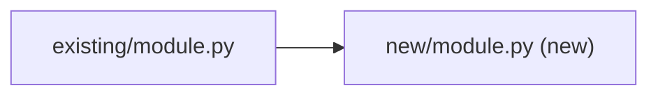

# NNNN. [Short title in title case]

**Status:** [Proposed | Accepted | Implemented | Deprecated | Superseded by NNNN]
**Date:** YYYY-MM-DD
**Deciders:** [names or roles]
**Tags:** [optional comma-separated tags, e.g. `workflow`, `security`, `release`]

## Context and Problem Statement

[Describe the context and the problem we're solving. State it as a question if helpful: "How do we…?"]

## Decision Drivers

- [Driver 1 — e.g. "must not break existing AA-MA plans"]
- [Driver 2 — e.g. "minimize maintenance drift across artifacts"]
- [Driver 3]

## Considered Options

1. **[Option A]** — [one-line summary]
2. **[Option B]** — [one-line summary]
3. **[Option C]** — [one-line summary]

## Decision Outcome

**Chosen:** [Option X]

**Rationale:** [Why this option won. Reference specific decision drivers.]

## Pros and Cons of the Options

### Option A

- ✅ [Pro 1]
- ✅ [Pro 2]
- ❌ [Con 1]
- ❌ [Con 2]

### Option B

- ✅ [Pro]
- ❌ [Con]

### Option C

- ✅ [Pro]
- ❌ [Con]

## Consequences

**Positive:**
- [What this enables]

**Negative:**
- [What this costs us — drift surface, ceremony, lock-in]

**Neutral:**
- [What changes but is neither clearly good nor bad]

## Architecture View (recommended)

<!-- Component view only: what this decision touches and how it depends. Delete if the decision has no structural footprint. -->
<!-- Labels containing parentheses use the quoted form B["path (new)"]. -->


## Example (recommended)

<!-- One fenced block showing the decision in use: a command, a config stanza, a signature. -->
```text
```

## Implementation Notes

[Optional. Concrete pointers: file paths affected, commands to run, follow-up ADRs needed.]

## References

- [Link to related ADR, plan file, issue, or external resource]
