<!-- generated by codemem draw @ 15b0e8c on 2026-09-26 -->
# Component view

Every source file and its import/call edges (L2; tests excluded).

```mermaid
flowchart LR
  n1g79hvc["claude-code/codemem/mcp/server.py"]
  nzrc6bq["packages/codemem-mcp/src/codemem/__init__.py"]
  n15x2rwo["packages/codemem-mcp/src/codemem/analysis/git_mining.py"]
  nana3is["packages/codemem-mcp/src/codemem/diff/symbol_diff.py"]
  n65kjls["packages/codemem-mcp/src/codemem/draw/captions.py"]
  nx760e7["packages/codemem-mcp/src/codemem/draw/cut.py"]
  n1c2obja["packages/codemem-mcp/src/codemem/draw/io_sinks.py"]
  nc8n6c8["packages/codemem-mcp/src/codemem/draw/mermaid.py"]
  n1a46oz0["packages/codemem-mcp/src/codemem/draw/plugin_surface.py"]
  np8rlzg["packages/codemem-mcp/src/codemem/draw/surface_allowlist.py"]
  nlswb4j["packages/codemem-mcp/src/codemem/draw/views.py"]
  n1qndr8e["packages/codemem-mcp/src/codemem/incremental.py"]
  nn471i1["packages/codemem-mcp/src/codemem/indexer.py"]
  n14v8w8e["packages/codemem-mcp/src/codemem/journal/__init__.py"]
  n44kqyb["packages/codemem-mcp/src/codemem/journal/lock.py"]
  n1eygstq["packages/codemem-mcp/src/codemem/journal/wal.py"]
  n12ip3u5["packages/codemem-mcp/src/codemem/mcp_tools/__init__.py"]
  nby6rkb["packages/codemem-mcp/src/codemem/mcp_tools/queries.py"]
  n10fbfir["packages/codemem-mcp/src/codemem/mcp_tools/sanitizers.py"]
  nxe473s["packages/codemem-mcp/src/codemem/parser/__init__.py"]
  n15008dx["packages/codemem-mcp/src/codemem/parser/ast_grep.py"]
  n9hzf61["packages/codemem-mcp/src/codemem/parser/python_ast.py"]
  n7xp1xs["packages/codemem-mcp/src/codemem/resolver.py"]
  n1wfftde["packages/codemem-mcp/src/codemem/storage/__init__.py"]
  ns1j8lg["packages/codemem-mcp/src/codemem/storage/db.py"]
  nqxncj["src/aa_ma/__init__.py"]
  n1qtlbi7["src/aa_ma/deps.py"]
  n1o3m0ll["src/aa_ma/enforce.py"]
  nxzfv6g["src/aa_ma/gate.py"]
  n16alvok["src/aa_ma/grammar.py"]
  n1g8rj1r["src/aa_ma/plan_markers/__init__.py"]
  ndlwqvf["src/aa_ma/plan_markers/fingerprint.py"]
  n1p4cio0["src/aa_ma/plan_markers/parser.py"]
  n51riw5["src/aa_ma/plan_parsers.py"]
  nptipq4["src/aa_ma/render/cli.py"]
  n1d70mh6["src/aa_ma/render/coverage.py"]
  napjvke["src/aa_ma/render/graph.py"]
  npbdajr["src/aa_ma/render/html.py"]
  nacfyc9["src/aa_ma/render/mermaid_lint.py"]
  n1kccq24["src/aa_ma/tui/__init__.py"]
  n1kgb4kj["src/aa_ma/tui/__main__.py"]
  n6tl7m9["src/aa_ma/tui/app.py"]
  n17gxjru["src/aa_ma/tui/json_output.py"]
  n1r93oy1["src/aa_ma/tui/model.py"]
  n19z0p6l["src/aa_ma/tui/parser.py"]
  n1dxcrxg["src/aa_ma/tui/screens/__init__.py"]
  nmc6u2u["src/aa_ma/tui/screens/dashboard.py"]
  n1qqb1tb["src/aa_ma/tui/screens/task_detail.py"]
  n1sg9xfc["src/aa_ma/tui/snapshot.py"]
  nixqzme["src/aa_ma/tui/watcher.py"]
  nby6yks["src/aa_ma/tui/widgets/__init__.py"]
  n1rlqg44["src/aa_ma/tui/widgets/kanban_column.py"]
  nil7v8o["src/aa_ma/tui/widgets/task_card.py"]
  n1g79hvc -->|"@import"| nzrc6bq
  n1g79hvc -->|"@call"| n12ip3u5
  n1g79hvc -->|"@import"| n12ip3u5
  n15x2rwo -->|"@call"| n10fbfir
  n15x2rwo -->|"@import"| n10fbfir
  nana3is -->|"@import"| n9hzf61
  n65kjls -->|"@import"| nx760e7
  n65kjls -->|"@import"| npbdajr
  n1c2obja -->|"@call"| nx760e7
  n1c2obja -->|"@import"| nx760e7
  nc8n6c8 -->|"@call"| n65kjls
  nc8n6c8 -->|"@import"| n65kjls
  nc8n6c8 -->|"@call"| nx760e7
  nc8n6c8 -->|"@import"| nx760e7
  n1a46oz0 -->|"@call"| nx760e7
  n1a46oz0 -->|"@import"| nx760e7
  n1a46oz0 -->|"@import"| np8rlzg
  nlswb4j -->|"@call"| n65kjls
  nlswb4j -->|"@import"| n65kjls
  nlswb4j -->|"@call"| nx760e7
  nlswb4j -->|"@import"| nx760e7
  nlswb4j -->|"@call"| n1c2obja
  nlswb4j -->|"@import"| n1c2obja
  nlswb4j -->|"@call"| nc8n6c8
  nlswb4j -->|"@import"| nc8n6c8
  nlswb4j -->|"@call"| n1a46oz0
  nlswb4j -->|"@import"| n1a46oz0
  nlswb4j -->|"@call"| nn471i1
  nlswb4j -->|"@import"| nn471i1
  n1qndr8e -->|"@call"| nana3is
  n1qndr8e -->|"@import"| nana3is
  n1qndr8e -->|"@call"| nn471i1
  n1qndr8e -->|"@import"| nn471i1
  n1qndr8e -->|"@call"| n44kqyb
  n1qndr8e -->|"@import"| n44kqyb
  n1qndr8e -->|"@call"| n9hzf61
  n1qndr8e -->|"@import"| n9hzf61
  n1qndr8e -->|"@call"| n7xp1xs
  n1qndr8e -->|"@import"| n7xp1xs
  n1qndr8e -->|"@import"| n1wfftde
  n1qndr8e -->|"@call"| ns1j8lg
  n1qndr8e -->|"@import"| ns1j8lg
  nn471i1 -->|"@import"| n14v8w8e
  nn471i1 -->|"@call"| n1eygstq
  nn471i1 -->|"@import"| n1eygstq
  nn471i1 -->|"@import"| nxe473s
  nn471i1 -->|"@call"| n15008dx
  nn471i1 -->|"@import"| n15008dx
  nn471i1 -->|"@call"| n9hzf61
  nn471i1 -->|"@import"| n9hzf61
  nn471i1 -->|"@call"| n7xp1xs
  nn471i1 -->|"@import"| n7xp1xs
  nn471i1 -->|"@import"| n1wfftde
  nn471i1 -->|"@call"| ns1j8lg
  nn471i1 -->|"@import"| ns1j8lg
  n1eygstq -->|"@import"| n1wfftde
  n1eygstq -->|"@call"| ns1j8lg
  n1eygstq -->|"@import"| ns1j8lg
  n12ip3u5 -->|"@import"| nby6rkb
  n12ip3u5 -->|"@call"| n10fbfir
  n12ip3u5 -->|"@import"| n10fbfir
  n12ip3u5 -->|"@import"| n1wfftde
  n12ip3u5 -->|"@call"| ns1j8lg
  n12ip3u5 -->|"@import"| ns1j8lg
  n15008dx -->|"@call"| n9hzf61
  n15008dx -->|"@import"| n9hzf61
  n1wfftde -->|"@import"| ns1j8lg
  n1qtlbi7 -->|"@call"| n16alvok
  n1qtlbi7 -->|"@import"| n16alvok
  n1o3m0ll -->|"@call"| n16alvok
  n1o3m0ll -->|"@import"| n16alvok
  nxzfv6g -->|"@call"| n1o3m0ll
  nxzfv6g -->|"@import"| n1o3m0ll
  nxzfv6g -->|"@call"| n16alvok
  nxzfv6g -->|"@import"| n16alvok
  nxzfv6g -->|"@import"| n51riw5
  n16alvok -->|"@call"| n51riw5
  n16alvok -->|"@import"| n51riw5
  n1g8rj1r -->|"@import"| n1p4cio0
  ndlwqvf -->|"@import"| n1p4cio0
  nptipq4 -->|"@call"| n1d70mh6
  nptipq4 -->|"@import"| n1d70mh6
  nptipq4 -->|"@call"| napjvke
  nptipq4 -->|"@import"| napjvke
  nptipq4 -->|"@call"| npbdajr
  nptipq4 -->|"@import"| npbdajr
  nptipq4 -->|"@call"| nacfyc9
  nptipq4 -->|"@import"| nacfyc9
  n1d70mh6 -->|"@call"| n16alvok
  n1d70mh6 -->|"@import"| n16alvok
  n1d70mh6 -->|"@call"| nacfyc9
  n1d70mh6 -->|"@import"| nacfyc9
  nacfyc9 -->|"@call"| n16alvok
  nacfyc9 -->|"@import"| n16alvok
  nacfyc9 -->|"@call"| n51riw5
  nacfyc9 -->|"@import"| n51riw5
  nacfyc9 -->|"@call"| napjvke
  nacfyc9 -->|"@import"| napjvke
  n1kccq24 -->|"@import"| nqxncj
  n1kgb4kj -->|"@import"| n1kccq24
  n1kgb4kj -->|"@call"| n17gxjru
  n1kgb4kj -->|"@import"| n17gxjru
  n1kgb4kj -->|"@call"| n19z0p6l
  n1kgb4kj -->|"@import"| n19z0p6l
  n1kgb4kj -->|"@call"| n1sg9xfc
  n1kgb4kj -->|"@import"| n1sg9xfc
  n6tl7m9 -->|"@call"| n1r93oy1
  n6tl7m9 -->|"@import"| n1r93oy1
  n6tl7m9 -->|"@call"| n19z0p6l
  n6tl7m9 -->|"@import"| n19z0p6l
  n6tl7m9 -->|"@call"| nmc6u2u
  n6tl7m9 -->|"@import"| nmc6u2u
  n6tl7m9 -->|"@call"| nixqzme
  n6tl7m9 -->|"@import"| nixqzme
  n17gxjru -->|"@import"| n1r93oy1
  n17gxjru -->|"@import"| n19z0p6l
  n19z0p6l -->|"@call"| n16alvok
  n19z0p6l -->|"@import"| n16alvok
  n19z0p6l -->|"@call"| n1r93oy1
  n19z0p6l -->|"@import"| n1r93oy1
  n1dxcrxg -->|"@import"| nmc6u2u
  n1dxcrxg -->|"@import"| n1qqb1tb
  nmc6u2u -->|"@import"| n1r93oy1
  nmc6u2u -->|"@import"| n1sg9xfc
  nmc6u2u -->|"@call"| n1rlqg44
  nmc6u2u -->|"@import"| n1rlqg44
  n1qqb1tb -->|"@import"| n1r93oy1
  n1sg9xfc -->|"@call"| n1r93oy1
  n1sg9xfc -->|"@import"| n1r93oy1
  n1sg9xfc -->|"@import"| n19z0p6l
  nixqzme -->|"@import"| n19z0p6l
  nby6yks -->|"@import"| n1rlqg44
  nby6yks -->|"@import"| nil7v8o
  n1rlqg44 -->|"@import"| n1r93oy1
  n1rlqg44 -->|"@call"| nil7v8o
  n1rlqg44 -->|"@import"| nil7v8o
  nil7v8o -->|"@import"| n1r93oy1
  classDef start stroke-width:4px
  class nptipq4 start
```

<!-- captions -->
- packages/codemem-mcp/src/codemem/draw/: The emitter. Start here.
- src/aa_ma/render/: Markdown -&gt; HTML and view linting.
<!-- /captions -->
