<!-- generated by codemem draw @ 598f749 on 2026-09-25 -->
# I/O boundary

Where the code touches databases, HTTP, files, subprocesses, env and queues (tests excluded).

One arrow per file, labelled with its call count. Solid: a catalogued call (`sqlite3.connect`). Dashed: a catalogued method on a receiver of unknown type (`conn.execute`) — low confidence. Catalogue: `codemem/draw/sinks.yaml`.

```mermaid
flowchart LR
  subgraph io_python["python"]
    io_python_db[("database")]
    io_python_env[("environment")]
    io_python_fs[("filesystem")]
    io_python_subprocess[("subprocess")]
  end
  n1g79hvc["claude-code/codemem/mcp/server.py"]
  n15x2rwo["packages/codemem-mcp/src/codemem/analysis/git_mining.py"]
  n1qqv388["packages/codemem-mcp/src/codemem/cli.py"]
  n65kjls["packages/codemem-mcp/src/codemem/draw/captions.py"]
  nx760e7["packages/codemem-mcp/src/codemem/draw/cut.py"]
  n1a46oz0["packages/codemem-mcp/src/codemem/draw/plugin_surface.py"]
  nlswb4j["packages/codemem-mcp/src/codemem/draw/views.py"]
  n1qndr8e["packages/codemem-mcp/src/codemem/incremental.py"]
  nn471i1["packages/codemem-mcp/src/codemem/indexer.py"]
  n44kqyb["packages/codemem-mcp/src/codemem/journal/lock.py"]
  n1eygstq["packages/codemem-mcp/src/codemem/journal/wal.py"]
  n12ip3u5["packages/codemem-mcp/src/codemem/mcp_tools/__init__.py"]
  ng0fem3["packages/codemem-mcp/src/codemem/pagerank.py"]
  n15008dx["packages/codemem-mcp/src/codemem/parser/ast_grep.py"]
  n7xp1xs["packages/codemem-mcp/src/codemem/resolver.py"]
  ns1j8lg["packages/codemem-mcp/src/codemem/storage/db.py"]
  n1vgapiq["scripts/bench_codemem.py"]
  nh6b312["scripts/bench_codemem_vs_aider.py"]
  nc2fglq["scripts/bench_sweep.py"]
  nvvfr9z["scripts/check_codemem_doc_drift.py"]
  n1qtlbi7["src/aa_ma/deps.py"]
  n1o3m0ll["src/aa_ma/enforce.py"]
  nptipq4["src/aa_ma/render/cli.py"]
  napjvke["src/aa_ma/render/graph.py"]
  nacfyc9["src/aa_ma/render/mermaid_lint.py"]
  n19z0p6l["src/aa_ma/tui/parser.py"]
  n1g79hvc e0@-->|"1"| io_python_env
  n15x2rwo e1@-->|"3"| io_python_db
  n15x2rwo e2@-->|"1"| io_python_subprocess
  n1qqv388 e3@-->|"1"| io_python_db
  n1qqv388 e4@-->|"1"| io_python_fs
  n65kjls e5@-->|"1"| io_python_fs
  nx760e7 e6@-->|"1"| io_python_db
  n1a46oz0 e7@-->|"2"| io_python_fs
  nlswb4j e8@-->|"4"| io_python_fs
  nlswb4j e9@-->|"1"| io_python_subprocess
  n1qndr8e e10@-->|"1"| io_python_db
  n1qndr8e e11@-->|"7"| io_python_fs
  n1qndr8e e12@-->|"1"| io_python_subprocess
  nn471i1 e13@-->|"2"| io_python_db
  nn471i1 e14@-->|"4"| io_python_fs
  nn471i1 e15@-->|"1"| io_python_subprocess
  n44kqyb e16@-->|"1"| io_python_fs
  n1eygstq e17@-->|"1"| io_python_db
  n1eygstq e18@-->|"2"| io_python_fs
  n12ip3u5 e19@-->|"1"| io_python_db
  n12ip3u5 e20@-->|"3"| io_python_fs
  ng0fem3 e21@-->|"1"| io_python_db
  ng0fem3 e22@-->|"2"| io_python_fs
  n15008dx e23@-->|"1"| io_python_subprocess
  n7xp1xs e24@-->|"2"| io_python_db
  ns1j8lg e25@-->|"3"| io_python_db
  ns1j8lg e26@-->|"1"| io_python_fs
  n1vgapiq e27@-->|"2"| io_python_fs
  n1vgapiq e28@-->|"1"| io_python_subprocess
  nh6b312 e29@-->|"5"| io_python_fs
  nh6b312 e30@-->|"1"| io_python_subprocess
  nc2fglq e31@-->|"5"| io_python_fs
  nc2fglq e32@-->|"1"| io_python_subprocess
  nvvfr9z e33@-->|"3"| io_python_fs
  nvvfr9z e34@-->|"1"| io_python_subprocess
  n1qtlbi7 e35@-->|"1"| io_python_fs
  n1o3m0ll e36@-->|"1"| io_python_fs
  nptipq4 e37@-->|"3"| io_python_fs
  napjvke e38@-->|"3"| io_python_db
  nacfyc9 e39@-->|"1"| io_python_env
  nacfyc9 e40@-->|"4"| io_python_fs
  nacfyc9 e41@-->|"1"| io_python_subprocess
  n19z0p6l e42@-->|"3"| io_python_fs
  classDef qualified stroke-width:2px,stroke-dasharray:0
  classDef bare stroke-dasharray:4 4
  class e0,e2,e9,e12,e15,e23,e27,e28,e29,e30,e31,e32,e34,e38,e39,e40,e41 qualified
  class e1,e3,e4,e5,e6,e7,e8,e10,e11,e13,e14,e16,e17,e18,e19,e20,e21,e22,e24,e25,e26,e33,e35,e36,e37,e42 bare
```

