<!-- generated by codemem draw @ 83b6dbf on 2026-09-25 -->
# Plugin surface

commands → skills → agents → hooks, from the claude-code/ markdown.

```mermaid
flowchart LR
  n1q77lyp["agent:Explore"]
  n1m05g3a["agent:aa-ma-researcher"]
  n241eew["agent:aa-ma-scribe"]
  n13on0x0["agent:aa-ma-validator"]
  n1bwwulf["agent:code-reviewer"]
  n16zkgt["agent:codebase-onboarding-conventions"]
  n1ws5q9t["agent:codebase-onboarding-health"]
  ndszi5r["agent:codebase-onboarding-runbook"]
  n17k5m0z["agent:codebase-onboarding-synthesizer"]
  nut6gy3["agent:context7-evidence-auditor"]
  n1rz4nfb["agent:future-proofing-auditor"]
  n2r16lz["agent:general-purpose"]
  njb24wp["agent:gsd-codebase-mapper"]
  n1xehzg3["agent:security-auditor"]
  n9qslpp["agent:tdd-sequence-auditor"]
  n1e8wu46["command:aa-ma-chart"]
  n12aduvl["command:aa-ma-plan"]
  n2ivac0["command:aa-ma-search"]
  n1ehpjlj["command:aa-ma-share"]
  ngv4716["command:archive-aa-ma"]
  nymci1b["command:execute-aa-ma-full"]
  nzci1f4["command:execute-aa-ma-milestone"]
  nymkryk["command:execute-aa-ma-step"]
  n1w8uzc3["command:grill-me"]
  n1o5l7q2["command:ops-mode"]
  n2cjk04["command:sole-dev-merge"]
  n1w7geup["command:understand-codebase"]
  n171tsld["command:verify-plan"]
  ncdm5yb["hook:aa-ma-chart-guard.sh"]
  n1tqu2uy["hook:aa-ma-commit-drift.sh"]
  n1bfyb9n["hook:aa-ma-commit-signature.sh"]
  nt7y2k2["hook:aa-ma-footer.sh"]
  n1sgs56u["hook:aa-ma-parse.sh"]
  nq7sncr["hook:aa-ma-plan-marker.sh"]
  nt43rst["hook:aa-ma-plan-skip-warn.sh"]
  nojww28["hook:aa-ma-session-end-dirty.sh"]
  n59yvf2["hook:aa-ma-session-start.sh"]
  n1ho763i["hook:aa-ma-share-allow.sh"]
  n1l22ytc["hook:pre-compact-aa-ma.sh"]
  n1lcsif["hook:security-static-check.sh"]
  n1pt77f4["rule:aa-ma"]
  n17zpssr["rule:engineering-standards"]
  nfzsho6["skill:aa-ma-execution"]
  npakcox["skill:aa-ma-plan-workflow"]
  ny8weil["skill:aa-ma-research"]
  n1wysk3c["skill:agent-teams"]
  nqoejc8["skill:api-spec-workflow"]
  ntqu37b["skill:ast-grep"]
  n1tb5ta8["skill:browse"]
  n6rky5l["skill:code-intelligence"]
  nmy7mcu["skill:code-intelligence-index"]
  n1p6eipu["skill:complexity-router"]
  n1et3y86["skill:debugging-strategies"]
  n1v0w48u["skill:defense-in-depth"]
  nfd4gxl["skill:dispatching-parallel-agents"]
  n1r1ebh2["skill:doc-drift-detection"]
  n1a5ll1o["skill:feature-dev:feature-dev"]
  n1i9ft3v["skill:first-principles-framework"]
  ngw6ece["skill:goal-condition-synthesis"]
  n3vwb5p["skill:grill-with-docs"]
  n15p6qwq["skill:grilling"]
  naq51cb["skill:gsd-intel"]
  n1dlsrei["skill:gsd-map-codebase"]
  n1h1u7xk["skill:gsd-scan"]
  n1c0624t["skill:impact-analysis"]
  njg4yev["skill:improve-codebase-architecture"]
  nl11q4l["skill:operational-constraints"]
  n1n1rcue["skill:plan-ceo-review"]
  nsllcwp["skill:plan-design-review"]
  n1e5jthx["skill:plan-eng-review"]
  n1s897yh["skill:plan-verification"]
  n1e3ph0s["skill:prototype"]
  n8978uz["skill:python-testing-patterns"]
  nxr9kpf["skill:qa-only"]
  ndsumzs["skill:retro"]
  n1dz4p6r["skill:secrets-management"]
  n1rfn41a["skill:spec-driven-development"]
  nmp6luu["skill:system-mapping"]
  nxmg647["skill:test-driven-development"]
  n1wsozj0["skill:token-compression"]
  ntisoh9["skill:ubiquitous-language"]
  n17xws1j["skill:understand-codebase"]
  nqn4jwe["skill:verify-impl"]
  n1wmu9fl["skill:write-a-skill"]
  n1m05g3a -->|"@skill"| ny8weil
  n241eew -->|"@command"| n12aduvl
  n241eew -->|"@hook"| nq7sncr
  n1bwwulf -->|"@command"| n12aduvl
  n1bwwulf -->|"@command"| nzci1f4
  n16zkgt -->|"@skill"| n17xws1j
  n1ws5q9t -->|"@skill"| n1r1ebh2
  n1ws5q9t -->|"@skill"| n17xws1j
  ndszi5r -->|"@skill"| n17xws1j
  n17k5m0z -->|"@skill"| n17xws1j
  n1xehzg3 -->|"@hook"| n1lcsif
  n9qslpp -->|"@skill"| n1s897yh
  n9qslpp -->|"@skill"| n1e3ph0s
  n1e8wu46 -->|"@command"| n12aduvl
  n1e8wu46 -->|"@command"| n1ehpjlj
  n1e8wu46 -->|"@hook"| ncdm5yb
  n1e8wu46 -->|"@skill"| ny8weil
  n1e8wu46 -->|"@skill"| n3vwb5p
  n1e8wu46 -->|"@skill"| n15p6qwq
  n1e8wu46 -->|"@skill"| n1e3ph0s
  n12aduvl -->|"@agent"| n1q77lyp
  n12aduvl -->|"@agent"| n1m05g3a
  n12aduvl -->|"@command"| n1e8wu46
  n12aduvl -->|"@command"| n1w8uzc3
  n12aduvl -->|"@command"| n171tsld
  n12aduvl -->|"@hook"| ncdm5yb
  n12aduvl -->|"@hook"| n1sgs56u
  n12aduvl -->|"@hook"| nq7sncr
  n12aduvl -->|"@hook"| nt43rst
  n12aduvl -->|"@skill"| ny8weil
  n12aduvl -->|"@skill"| n3vwb5p
  n12aduvl -->|"@skill"| n15p6qwq
  n12aduvl -->|"@skill"| n1n1rcue
  n12aduvl -->|"@skill"| nsllcwp
  n12aduvl -->|"@skill"| n1e5jthx
  n12aduvl -->|"@skill"| n1e3ph0s
  n1ehpjlj -->|"@hook"| n1ho763i
  ngv4716 -->|"@skill"| ndsumzs
  nymci1b -->|"@agent"| n13on0x0
  nymci1b -->|"@command"| n12aduvl
  nymci1b -->|"@command"| ngv4716
  nymci1b -->|"@command"| nzci1f4
  nymci1b -->|"@skill"| ngw6ece
  nymci1b -->|"@skill"| n1c0624t
  nymci1b -->|"@skill"| nmp6luu
  nzci1f4 -->|"@agent"| n13on0x0
  nzci1f4 -->|"@command"| n12aduvl
  nzci1f4 -->|"@command"| ngv4716
  nzci1f4 -->|"@command"| nymci1b
  nzci1f4 -->|"@hook"| n1sgs56u
  nzci1f4 -->|"@hook"| n1lcsif
  nzci1f4 -->|"@skill"| n1tb5ta8
  nzci1f4 -->|"@skill"| n1c0624t
  nzci1f4 -->|"@skill"| nxr9kpf
  nzci1f4 -->|"@skill"| nmp6luu
  nzci1f4 -->|"@skill"| nqn4jwe
  nymkryk -->|"@command"| n12aduvl
  nymkryk -->|"@command"| nymci1b
  nymkryk -->|"@command"| nzci1f4
  n1o5l7q2 -->|"@skill"| ntqu37b
  n1o5l7q2 -->|"@skill"| nfd4gxl
  n1o5l7q2 -->|"@skill"| n1c0624t
  n1o5l7q2 -->|"@skill"| nl11q4l
  n1o5l7q2 -->|"@skill"| nmp6luu
  n1o5l7q2 -->|"@skill"| nxmg647
  n2cjk04 -->|"@hook"| n1bfyb9n
  n2cjk04 -->|"@hook"| nt7y2k2
  n1w7geup -->|"@command"| n12aduvl
  n1w7geup -->|"@skill"| n1c0624t
  n1w7geup -->|"@skill"| nmp6luu
  n1w7geup -->|"@skill"| n17xws1j
  n171tsld -->|"@command"| n12aduvl
  n171tsld -->|"@command"| nzci1f4
  n171tsld -->|"@skill"| ngw6ece
  ncdm5yb -->|"@command"| n1e8wu46
  ncdm5yb -->|"@command"| n12aduvl
  ncdm5yb -->|"@hook"| n1sgs56u
  n1tqu2uy -->|"@hook"| n1sgs56u
  n1bfyb9n -->|"@hook"| n1sgs56u
  nt7y2k2 -->|"@hook"| n1bfyb9n
  n1sgs56u -->|"@hook"| n59yvf2
  n1sgs56u -->|"@hook"| n1l22ytc
  nq7sncr -->|"@command"| n12aduvl
  nt43rst -->|"@command"| n12aduvl
  nojww28 -->|"@hook"| n1sgs56u
  n59yvf2 -->|"@hook"| n1sgs56u
  n1l22ytc -->|"@hook"| n1sgs56u
  n1lcsif -->|"@hook"| n1bfyb9n
  n1lcsif -->|"@hook"| n1sgs56u
  n1pt77f4 -->|"@command"| n1e8wu46
  n1pt77f4 -->|"@command"| n12aduvl
  n1pt77f4 -->|"@command"| ngv4716
  n1pt77f4 -->|"@command"| nzci1f4
  n1pt77f4 -->|"@command"| n171tsld
  n1pt77f4 -->|"@skill"| n1s897yh
  n17zpssr -->|"@command"| n12aduvl
  n17zpssr -->|"@command"| nzci1f4
  n17zpssr -->|"@command"| nymkryk
  n17zpssr -->|"@hook"| n1tqu2uy
  n17zpssr -->|"@skill"| n1i9ft3v
  n17zpssr -->|"@skill"| n1c0624t
  n17zpssr -->|"@skill"| nl11q4l
  n17zpssr -->|"@skill"| n1s897yh
  n17zpssr -->|"@skill"| n1e3ph0s
  nfzsho6 -->|"@command"| n12aduvl
  nfzsho6 -->|"@command"| ngv4716
  nfzsho6 -->|"@command"| nymci1b
  nfzsho6 -->|"@command"| nzci1f4
  nfzsho6 -->|"@command"| nymkryk
  nfzsho6 -->|"@command"| n171tsld
  nfzsho6 -->|"@skill"| ngw6ece
  nfzsho6 -->|"@skill"| n1c0624t
  nfzsho6 -->|"@skill"| nmp6luu
  nfzsho6 -->|"@skill"| n1wsozj0
  npakcox -->|"@agent"| n241eew
  npakcox -->|"@agent"| n13on0x0
  npakcox -->|"@command"| n12aduvl
  npakcox -->|"@command"| nymci1b
  npakcox -->|"@command"| nzci1f4
  npakcox -->|"@command"| nymkryk
  npakcox -->|"@skill"| ny8weil
  npakcox -->|"@skill"| nqoejc8
  npakcox -->|"@skill"| ntqu37b
  npakcox -->|"@skill"| ngw6ece
  npakcox -->|"@skill"| nl11q4l
  npakcox -->|"@skill"| n1rfn41a
  npakcox -->|"@skill"| nmp6luu
  ny8weil -->|"@agent"| n1m05g3a
  ngw6ece -->|"@command"| n12aduvl
  ngw6ece -->|"@command"| ngv4716
  ngw6ece -->|"@command"| nymci1b
  ngw6ece -->|"@command"| n171tsld
  ngw6ece -->|"@skill"| n1s897yh
  nl11q4l -->|"@command"| n12aduvl
  nl11q4l -->|"@command"| n1o5l7q2
  nl11q4l -->|"@skill"| ntqu37b
  nl11q4l -->|"@skill"| nfd4gxl
  nl11q4l -->|"@skill"| n1c0624t
  nl11q4l -->|"@skill"| n1s897yh
  nl11q4l -->|"@skill"| nmp6luu
  nl11q4l -->|"@skill"| nxmg647
  nl11q4l -->|"@skill"| n1wsozj0
  n1s897yh -->|"@agent"| n1q77lyp
  n1s897yh -->|"@agent"| n2r16lz
  n1s897yh -->|"@command"| n12aduvl
  n1s897yh -->|"@command"| nzci1f4
  n1s897yh -->|"@command"| n171tsld
  n1s897yh -->|"@hook"| n1sgs56u
  nmp6luu -->|"@skill"| npakcox
  nmp6luu -->|"@skill"| ntqu37b
  nmp6luu -->|"@skill"| n1c0624t
  nmp6luu -->|"@skill"| nl11q4l
  n17xws1j -->|"@agent"| n1q77lyp
  n17xws1j -->|"@agent"| n1bwwulf
  n17xws1j -->|"@agent"| n16zkgt
  n17xws1j -->|"@agent"| n1ws5q9t
  n17xws1j -->|"@agent"| ndszi5r
  n17xws1j -->|"@agent"| n17k5m0z
  n17xws1j -->|"@agent"| n2r16lz
  n17xws1j -->|"@agent"| njb24wp
  n17xws1j -->|"@command"| n12aduvl
  n17xws1j -->|"@command"| n1w7geup
  n17xws1j -->|"@skill"| n1wysk3c
  n17xws1j -->|"@skill"| n6rky5l
  n17xws1j -->|"@skill"| nmy7mcu
  n17xws1j -->|"@skill"| n1v0w48u
  n17xws1j -->|"@skill"| n1r1ebh2
  n17xws1j -->|"@skill"| n1a5ll1o
  n17xws1j -->|"@skill"| naq51cb
  n17xws1j -->|"@skill"| n1dlsrei
  n17xws1j -->|"@skill"| n1h1u7xk
  n17xws1j -->|"@skill"| n1c0624t
  n17xws1j -->|"@skill"| njg4yev
  n17xws1j -->|"@skill"| n8978uz
  n17xws1j -->|"@skill"| ndsumzs
  n17xws1j -->|"@skill"| n1dz4p6r
  n17xws1j -->|"@skill"| nmp6luu
  n17xws1j -->|"@skill"| ntisoh9
  nqn4jwe -->|"@agent"| n1bwwulf
  nqn4jwe -->|"@agent"| nut6gy3
  nqn4jwe -->|"@agent"| n1rz4nfb
  nqn4jwe -->|"@agent"| n1xehzg3
  nqn4jwe -->|"@agent"| n9qslpp
  nqn4jwe -->|"@command"| nymci1b
  nqn4jwe -->|"@command"| nzci1f4
  nqn4jwe -->|"@command"| n171tsld
  nqn4jwe -->|"@hook"| n1sgs56u
  nqn4jwe -->|"@hook"| n1lcsif
```

<!-- captions -->
<!-- /captions -->

## Dangling references

- skill:aa-ma-execution → skill:haiku-eval
- skill:understand-codebase → skill:aa-ma-plan
- skill:understand-codebase → skill:codebase-deep-dive
- skill:understand-codebase → skill:index

## Orphans (no inbound reference)

- command:aa-ma-search
- command:sole-dev-merge
- hook:aa-ma-session-end-dirty.sh
- skill:aa-ma-execution
- skill:complexity-router
- skill:debugging-strategies
- skill:write-a-skill
