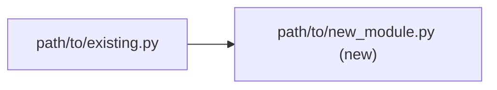
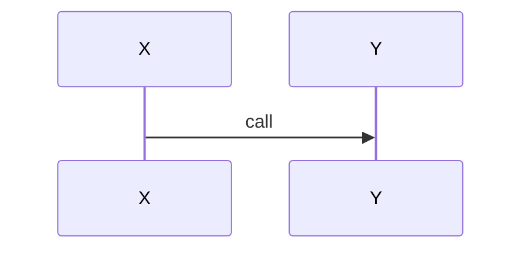

# [task-name] Plan

<!-- Copy this template to .claude/dev/active/[task-name]/[task-name]-plan.md -->
<!-- Replace all [bracketed-values] with actual content -->
<!-- The plan file is the strategic backbone of your AA-MA task. It captures -->
<!-- the approved implementation strategy and all 12 mandatory planning elements. -->
<!-- This file is written once during planning (Phase 4) and rarely modified after approval. -->

**Objective:** [1-line goal statement — what does "done" look like?]
**Owner:** [person or "AI + User"]
**Created:** [YYYY-MM-DD]
**Last Updated:** [YYYY-MM-DD]
**Diagram-Waiver:** none
<!-- Element 13: `none` when §13 Architecture View is present; a canonical waiver (docs-only | config-only | single-file) is valid only when no milestone has Audit-Profile in {full, code-only, infra}. -->

## Executive Summary

<!-- 1-3 lines maximum. State the objective, the approach, and the success criteria. -->
<!-- This should be concise enough to read in 10 seconds and understand the full scope. -->

[Concise overview of what will be built/changed, why, and how success is measured]

## Target Audience

<!-- Optional but recommended. Who benefits from this work? -->
<!-- Helps agents and reviewers understand context for design decisions. -->

- [Audience 1]: [What they need from this work]
- [Audience 2]: [What they need from this work]

## Implementation Steps

<!-- This is the core of the plan. It must contain ALL 11 AA-MA planning elements. -->
<!-- Each milestone below should map directly to a ## Milestone in tasks.md. -->
<!-- Each step should map directly to a ### Step in tasks.md. -->

### Milestone 1: [Title — a named checkpoint with a measurable goal]

<!-- Element 3: Milestones with measurable goals -->
<!-- Element 9: Effort estimate & Complexity (0-100%) per milestone -->

- **Goal:** [What is achieved when this milestone completes]
- **Effort:** [Estimated hours/days]
- **Complexity:** [0-100%]
- **Mode:** [AFK (auto-dispatchable to agents) | HITL (requires human-in-the-loop checkpoints)]
- **Gate:** [SOFT (default) | HARD — use HARD for irreversible actions, architectural decisions, production deployments]
- **Baseline:** [REQUIRED for milestones that touch an external API or backend service. Provide an empirical curl A/B command and the expected falsifier — e.g. for the list-param fix in fix-list-param-serialization M4.1: `curl -sS 'https://api.example.com/relationships/9091.../documents?source=publications&limit=25' -H 'X-API-Key: $KEY' | jq '.data[].document_type'` expected to be `JournalArticle` for every item; if any item shows `Patent` the filter was silently dropped. For pure local-code milestones with no API exercised, use literally: `N/A — pure local code, no API exercised`. Hand-wavy "we'll know it works" entries do NOT satisfy this field.]

<!-- Element 4: Acceptance criteria — one clear, testable criterion per step/milestone -->

**Acceptance Criteria:**
- [ ] [Criterion 1 — must be falsifiable: "Given X, system produces Y"]
- [ ] [Criterion 2 — avoid vague phrases like "works correctly" or "handles edge cases"]

<!-- Element 5: Required artefacts per step -->

**Required Artefacts:**
- [File, schema, API, diagram, or credential needed]

<!-- Element 6: Tests to validate this milestone -->

**Tests:**
- [Test description with pass/fail threshold]
- [e.g., "pytest tests/test_feature.py — all pass, coverage >= 80%"]

<!-- Element 7: Rollback strategy for risky changes -->

**Rollback Strategy:**
- [How to undo this milestone if something goes wrong]
- [e.g., "Revert commit ABC, restore backup of config.yaml"]

<!-- Element 10: Risks & mitigations — top 3 per milestone -->

**Risks:**
1. [Risk]: [Mitigation]
2. [Risk]: [Mitigation]
3. [Risk]: [Mitigation]

<!-- Element 13: Contract block — REQUIRED for every milestone with Audit-Profile in {full, code-only, infra}. -->
<!-- Pins file paths, signatures, CLI shapes, exit codes and field grammar a fresh agent must not guess. Illustrative snippets are not Contract blocks. -->

#### Contract
```text
# file: path/to/module.py
def function(arg: Type) -> ReturnType
# CLI: tool <arg> [--flag]   exit 0 ok / 1 findings / 2 usage
```

#### Step 1.1: [Action verb + specific deliverable]

<!-- Element 2: Ordered stepwise implementation plan -->
<!-- Element 9: Per-step effort and complexity -->

- **Effort:** [hours]
- **Complexity:** [0-100%] <!-- Flag steps >= 80% with: "HIGH COMPLEXITY — requires human review or deep reasoning" -->
- **Acceptance:** [Single testable criterion for this step]
- **Artefacts:** [Files created or modified]

#### Step 1.2: [Next action]

- **Effort:** [hours]
- **Complexity:** [0-100%]
- **Acceptance:** [Single testable criterion]
- **Artefacts:** [Files created or modified]

<!-- Repeat steps as needed -->

---

### Milestone 2: [Title — typically a refactor or local-code milestone]

<!-- Repeat the full milestone structure above for each milestone. -->
<!-- Include: Goal, Effort, Complexity, Mode, Gate, Baseline, Acceptance Criteria, -->
<!-- Required Artefacts, Tests, Rollback Strategy, Risks, and Steps. -->
<!--                                                                              -->
<!-- THIS PLACEHOLDER ALSO SERVES AS THE LOCAL-CODE BASELINE EXAMPLE.             -->
<!-- When a milestone does NOT touch an external API (e.g. a refactor, template   -->
<!-- edit, doc rewrite, or local script change), the `Baseline:` field still      -->
<!-- MUST be populated — but with the literal string below, NOT an empty value:   -->
<!--                                                                              -->
<!--     Baseline: N/A — pure local code, no API exercised                        -->
<!--                                                                              -->
<!-- Empty / "TBD" / hand-wavy entries do NOT satisfy Gate 3.5 in                 -->
<!-- validation-checklist.md and will be flagged by /verify-plan.                 -->

---

<!-- Add more milestones as needed. -->

## Dependencies & Assumptions

<!-- Element 8: External services, people, libraries, and assumptions. -->
<!-- Classify each dependency: Required | Optional | Dev-only -->

### Dependencies

| Dependency | Class | Notes |
|-----------|-------|-------|
| [library>=version] | [Required/Optional/Dev-only] | [Why needed] |
| [external service] | [Required/Optional/Dev-only] | [Access requirements] |

### Assumptions

<!-- List every assumption explicitly. If an assumption is wrong, what breaks? -->

1. [Assumption]: [Impact if wrong]
2. [Assumption]: [Impact if wrong]

## 12. Engineering Standards Declaration

<!-- Element 12: which themes from claude-code/rules/engineering-standards.md materially apply, one sentence each. -->

| Theme | Applies | Rationale |
|---|---|---|
| 1 Verification & Truth | yes/no | [one sentence] |
| 2 Development Principles | yes/no | [one sentence] |
| 3 Reasoning & Planning | yes/no | [one sentence] |
| 4 Safety & Continuity | yes/no | [one sentence] |
| 5 Execution Checklist | yes/no | [one sentence] |
| 6 Sync & Commit Discipline | yes/no | [one sentence] |

## 13. Architecture View

<!-- Element 13: mermaid only. A node label containing a repo path is a claim checked by aa-ma-lint-views unless the label ends with "(new)". -->
<!-- Labels containing parentheses MUST use the quoted form B["path (new)"] — an unquoted (new) inside [...] is a mermaid parse error. -->

### Component view


### Flow view
<!-- required iff any milestone carries Critical-Path: -->


## Next Action

<!-- Element 11: The single concrete action to perform NOW. -->
<!-- Must specify which AA-MA file(s) to update (REFERENCE / TASKS). -->

**Do this first:** [Specific, actionable first step — not vague like "get started"]
**Update:** [REFERENCE and TASKS — extract facts to reference.md, create HTP nodes in tasks.md]

## AA-MA File Mapping

<!-- Instructions for converting this plan into the other AA-MA files. -->
<!-- The scribe agent or human operator uses this section. -->

- **tasks.md:** Convert each Milestone to `## Milestone N` and each Step to `### Sub-step N.M` with Status: PENDING
- **reference.md:** Extract all file paths, API endpoints, config values, dependency versions, and constants
- **context-log.md:** Log the plan approval as the first entry
- **provenance.log:** Record task initialization timestamp
