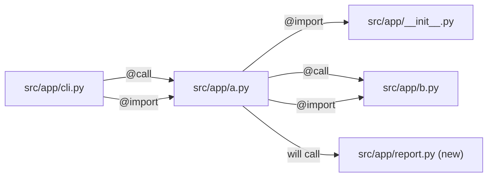

# seeded-plan Plan

**Created:** 2026-09-25

Fixture for diagram-generation M10: a §13 Component view seeded by `/aa-ma-plan` Phase 4
(`codemem draw --level L2 --scope src/app/a.py --hops 1 --direction both`) against the
throwaway repo `tests/skills/test_angle6_coverage.py` builds, then extended by the author
with one planned `(new)` node. The seed block is byte-identical to the command's output.

## Milestones

### Milestone 1: Add a report command

- Audit-Profile: code-only

#### Contract
```
Files:
  Modify  src/app/a.py
  Create  src/app/report.py
  Test    tests/test_report.py
```

## 13. Architecture View

### Component view


