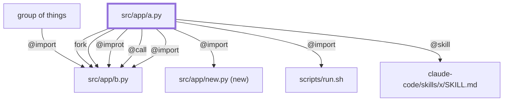
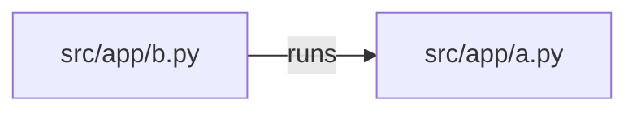

# sigil-edges Plan

Fixture for the `PHANTOM_EDGE` tier (diagram-generation M8, map Ticket 5). Linted against a
throwaway repo built by `tests/render/test_phantom_edge.py`, where `src/app/a.py` imports
and calls `src/app/b.py`, and `scripts/run.sh` exists but is not in the graph.

## 13. Architecture View

### Component view

### Flow view

Node ids are per fence: `A` here is a different file.

