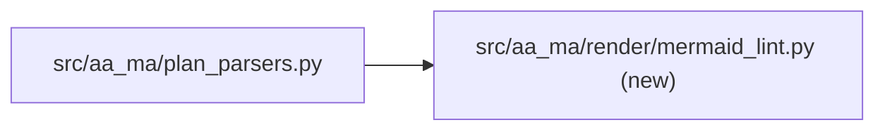
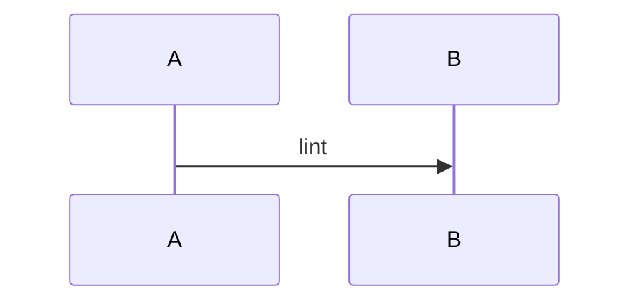

# Fixture Plan
**Created:** 2026-09-11
**Diagram-Waiver:** none

## 13. Architecture View
### Component view

### Flow view


### Milestone 1: Docs
- Audit-Profile: docs-only

Example of the field:

```markdown
- Audit-Profile: code-only
- **Critical-Path:** data-xform
```
