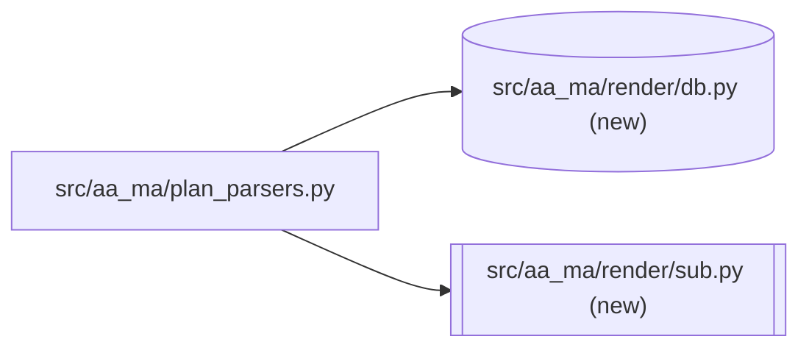
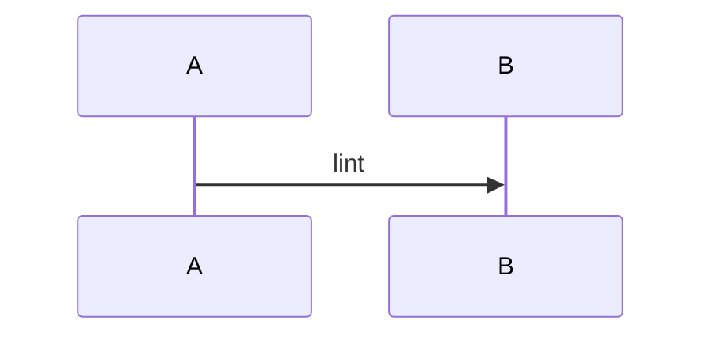

# Fixture Plan
**Created:** 2026-09-11
**Diagram-Waiver:** none

## 13. Architecture View
### Component view

### Flow view

### Milestone 1: Code
- Audit-Profile: code-only
- **Critical-Path:** data-xform
